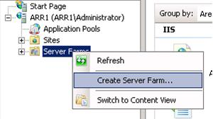
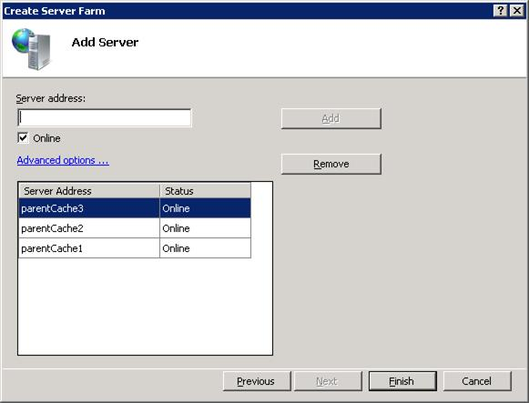

# Cache Hierarchy Management Using Application Request Routing

by IIS Team

This section of the documentation applies to **Microsoft Application Request Routing Version 2 for IIS 7 and Above**.

## Goal

To successfully explain and configure Application Request Routing (ARR) as an edge cache node using the Cache Array Routing Protocol (CARP).

ARR Version 2 extends the concept of [server group](define-and-configure-an-application-request-routing-server-farm.md) that was introduced in ARR Version 1 to define the relationship between the cache nodes. A server group is a logical grouping of one or more member servers. In ARR Version 1, the member servers in the server farm are treated as application servers where ARR can forward the incoming requests. In ARR Version 2, the same concept is used to group the next "tier" of cache nodes where the requests should be routed to when there is a cache miss.

The illustration below shows how the server group (farm) is used to specify the parent cache nodes from the child (edge) cache node perspective:

The management of the cache nodes can be further simplified by using a [shared configuration](../../manage/managing-your-configuration-settings/shared-configuration_264.md). In the above illustration, the child (edge) cache nodes share one configuration while the parent cache nodes share another. As a result, there will be two shared configurations that must be managed.

This walkthrough focuses on explaining the concept of server farms in managing cache hierarchy. For more in-depth information about configuring end-to-end child and parent cache nodes in content delivery networks and edge caching networks (CDN/ECN), see [this](../installing-application-request-routing-arr/deploying-application-request-routing-in-cdn.md) walkthrough.

## Prerequisites

This walkthrough assumes that you are familiar with the core ARR Version 1 features and scenarios:

- [Define and Configure an Application Request Routing Server Group](define-and-configure-an-application-request-routing-server-farm.md)
- [HTTP Load Balancing using Application Request Routing](http-load-balancing-using-application-request-routing.md)
- [Configure 3-tier deployment architecture using Application Request Routing](configure-3-tier-deployment-architecture-using-application-request-routing.md)
- [Pilot Program Management using Application Request Routing](pilot-program-management-using-application-request-routing.md)
- [Shared Hosting using Application Request Routing](shared-hosting-using-application-request-routing-arr.md)

You should also be familiar with the disk cache feature, which is new in ARR Version 2. The following article provides an overview:

- [Configure and enable disk cache in Application Request Routing](configure-and-enable-disk-cache-in-application-request-routing.md)

If Application Request Routing Version 2 has not been installed, you can download it at:

- Microsoft Application Request Routing Version 2 for IIS 7 (x86) [here](https://download.microsoft.com/download/4/D/F/4DFDA851-515F-474E-BA7A-5802B3C95101/ARRv2_setup_x86.EXE).
- Microsoft Application Request Routing Version 2 for IIS 7 (x64) [here](https://download.microsoft.com/download/3/4/1/3415F3F9-5698-44FE-A072-D4AF09728390/ARRv2_setup_x64.EXE).

Follow the steps outlined in [this](../installing-application-request-routing-arr/install-application-request-routing-version-2.md) document to install ARR Version 2.

## Step 1 - Configure disk cache.

If you have not done so already, configure disk cache by following [this](configure-and-enable-disk-cache-in-application-request-routing.md) article.

## Step 2 - Define cache hierarchy.

**To create and define a server farm using the UI:** 

1. Launch IIS Manager.
2. Select and expand the root of the server. This is your child (edge) cache node.  
    
3. To create a server farm, right-click **Server Farms**, and then click **Create Server Farm...**.

    
4. Enter a name for the server farm. In the example below, **myParentCacheNodes** is the name of the server farm. Click **Next**.

    
5. The next step is to add the parent cache nodes to the server farm. On the **Add Server** page of the wizard, add as many parent cache nodes as appropriate. When there is a cache miss at the child node, the requests will be forwarded to one of the parent cache nodes using CARP. Click **Finish**.

    
6. As is the case in ARR Version 1, ARR Version 2 relies on the URL Rewrite module to inspect incoming HTTP requests and server variables to make the request routing decisions. In the confirmation dialog box, click **Yes** to create the default URL rewrite rules for this server group.

    
7. You have successfully created a server group with the parent cache nodes as its members.

## Step 3 - Enable the Cache Array Routing Protocol (CARP).

ARR Version 2 includes support for CARP. CARP is used to determine which parent cache node to forward a request to when there is a cache miss at the child cache node.

**To enable CARP using the UI:** 

1. Launch IIS Manager.
2. Select the server farm **myParentCacheNodes**, which you created in Step 2 above.
3. The following icons are shown:

    
4. Double-click **Load Balance**.
5. Select **Request hash** from the drop-down list. The request hash in ARR Version 2 uses CARP.
6. Click **Apply** to save the changes.

## Summary

You have now successfully defined the cache hierarchy using ARR. For other ARR Version 2 walkthroughs, see the documents in [this](../planning-for-arr/application-request-routing-version-2-overview.md) article. Note that in a CDN environment, the URL rewrite rules are much more complex than what this walkthrough has demonstrated. For information about how to configure ARR in a typical 2-tier (child and parent) cache nodes in CDN/ECN environment, see the [following](../installing-application-request-routing-arr/deploying-application-request-routing-in-cdn.md) walkthrough.
