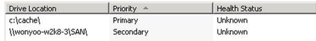
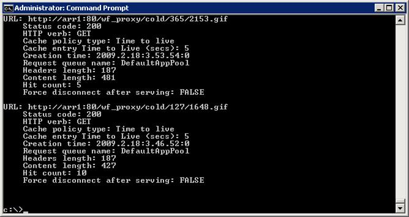

Configure and Enable Disk Cache in Application Request Routing
====================
by IIS Team

This section of the documentation applies to **Microsoft Application Request Routing Version 2 for IIS 7 and Above**.

## Goal

To successfully configure and enable disk cache to be used in core Application Request Routing (ARR) Version 1 [scenarios](../planning-for-arr/using-the-application-request-routing-module.md).

## Prerequisites

The core ARR Version 1 scenarios must be configured successfully:

- [Define and Configure an Application Request Routing Server Group](define-and-configure-an-application-request-routing-server-farm.md)
- [HTTP Load Balancing using Application Request Routing](http-load-balancing-using-application-request-routing.md)
- [Configure 3-tier deployment architecture using Application Request Routing](configure-3-tier-deployment-architecture-using-application-request-routing.md)
- [Pilot Program Management using Application Request Routing](pilot-program-management-using-application-request-routing.md)
- [Shared Hosting using Application Request Routing](shared-hosting-using-application-request-routing-arr.md)

This walkthrough focuses on configuring and enabling the disk-based cache for the scenarios above.

If Application Request Routing Version 2 has not been installed, you can download it at:

- Microsoft Application Request Routing Version 2 for IIS 7 (x86) [here](https://download.microsoft.com/download/4/D/F/4DFDA851-515F-474E-BA7A-5802B3C95101/ARRv2_setup_x86.EXE).
- Microsoft Application Request Routing Version 2 for IIS 7 (x64) [here](https://download.microsoft.com/download/3/4/1/3415F3F9-5698-44FE-A072-D4AF09728390/ARRv2_setup_x64.EXE).

Follow the steps outlined in [this](../installing-application-request-routing-arr/install-application-request-routing-version-2.md) document to install ARR Version 2.

## Step 1 - Configure primary disk cache location(s).

At least one primary disk cache location must be specified.

**To configure a primary disk cache location using the UI:** 

1. Launch IIS Manager.
2. The disk cache configuration for ARR is done at the server level. Select the server in the navigation tree view.

    
3. Double-click **Application Request Routing Cache**.

    
4. In the **Actions** pane, click **Add...**.

    
5. In the **Add Drive** dialog box, define the **Drive location** and set a maximum size. If no size is provided, then it will consume all available disk space.  
    

    > [!NOTE]
    > If the drive location was created manually, ensure that the identity of the worker process has the following user rights. In most cases, the local Users group has the sufficient user rights on the folder when it was created.

    1. Read
    2. List folder contents
    3. Write
6. Enter the appropriate values, and then click **OK** to save the changes. For the purposes of this walkthrough, `c:\cache\` is used as the drive location and a maximum size of **10GB** has been set. You can enter any value up to your maximum drive size or use the entire drive. 

    

    > [!NOTE]
    > ARR has the concept of a primary drive and a secondary drive. A typical configuration involves one or more primary drives that are local drives, such as e:\cache or f:\cache. However, there can only be one secondary drive and, typically, it is a SAN drive that can be shared between multiple ARRs. The idea is that you have a large SAN drive where more content can be cached than on the local drive of an ARR, and it can also be shared across multiple ARR instances.

## Step 2 - Configure secondary disk cache location.

The secondary disk cache location is an optional configuration. As noted above, unlike the primary drive, only one secondary drive can be configured. In a way, the secondary disk cache location is used as a "parent cache tier." ARR looks for cached content in the secondary drive when it is unable to find it in the primary cache drive location(s). Similarly, when caching content, ARR will cache it on both the primary cache drive location(s) as well as the secondary cache drive location.

**To configure a secondary disk cache location using the UI:** 

1. In the **Actions** pane, click **Add Secondary...**.

    
2. In the **Add Secondary Drive** dialog box, define the **Drive location**.

    
3. Enter the appropriate value, and then click **OK** to save the changes. For the purposes of this walkthrough, **\\wonyoo-w2k8-3\SAN\\** is used as the secondary cache drive location.

    

## Step 3 - Enable disk cache.

Once the drive location is specified, ARR proxy can choose to use the configured disk cache. There are two levels of proxies in ARR. One is at the server level and the other is at the server farm level. In both cases, the disk cache is enabled by default. Once the primary cache drive location is configured, ARR will start caching contents on disk by default.

The rest of the walkthrough assumes that the server farm has already been created. If not, follow the [Define and Configure an Application Request Routing Server Farm](define-and-configure-an-application-request-routing-server-farm.md) walkthrough.

1. Select **Server Farms**.
2. Select the server farm that you created.
3. The following icons are shown:

    
4. Double-click **Caching**. Verify that the **Enable disk cache** checkbox is selected.

    ****

    > [!NOTE]
    > Authorization cannot be delegated to ARR. Therefore, if the contents are highly sensitive in nature and require authorization, it is recommended that you do not enable cache.

## Step 4 - Verify functionality.

By default, the kernel cache by http.sys on Windows limits the size of individual objects to 256KB. To change this setting globally, see [https://support.microsoft.com/kb/820129/en-us](https://support.microsoft.com/kb/820129/en-us).

Make a few requests that will get cached in ARR.

**To verify that memory caching is working:** 

1. Open a command prompt with elevated user rights.
2. Enter **netsh http show cache**.

    
3. By default, memory cache duration is 5 seconds.

## Step 5 - Verify the cache functionality using IIS Manager.

1. Navigate to Application Request Routing UI at the server level in IIS Manager. - Click on Browse cache content in the actions pane on the right. - Verify that responses are cached on the primary cache drive.
2. Verify that the contents also exist on the secondary cache drive location.

In addition to verifying the disk cache functionality on the file system, ARR provides a graphical dashboard view of the cache performance.

1. Select **Server Farms**.
2. Select the server farm that you created.
3. The following icons are shown:

    
4. Double-click **Monitoring and Management**. This view provides the server farm-level runtime statistics, including the cache hit/miss ratio as well as how much bandwidth has been saved due to ARR disk cache.

    

## Summary

You have now successfully configured and enabled a disk cache for ARR. For other ARR Version 2 walkthroughs, see the documents in [this](../planning-for-arr/application-request-routing-version-2-overview.md) article.