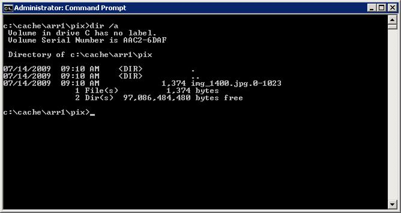

# Configure Byte-range Request Segment Size in Application Request Routing

by Won Yoo

This section of the document applies to **Microsoft Application Request Routing Version 2 for IIS 7 and Above.**

## Goal

To understand and configure how Application Request Routing (ARR) handles byte-range requests.

## Prerequisites

This is an advanced feature in ARR. This article assumes that you are familiar with the overall functionality of ARR and know how to deploy and configure ARR with disk cache. If you have not done so already, it is strongly recommended that you review the following walkthroughs before proceeding:

- [Configure and enable disk cache in Application Request Routing](configure-and-enable-disk-cache-in-application-request-routing.md)
- [Cache hierarchy management using Application Request Routing](cache-hierarchy-management-using-application-request-routing.md)
- [Deploying Application Request Routing in CDN](../installing-application-request-routing-arr/deploying-application-request-routing-in-cdn.md)
- [Browse cached contents on disk on Application Request Routing](browse-cached-contents-on-disk-on-application-request-routing.md)
- [Delete cached objects](delete-cached-objects.md)
- [Manually override cache-control directives using Application Request Routing](manually-override-cache-control-directives-using-application-request-routing.md)
- [Warm-up cache nodes on Application Request Routing](warm-up-cache-nodes-on-application-request-routing.md)

If Application Request Routing Version 2 has not been installed, you can download it at:

- Microsoft Application Request Routing Version 2 for IIS 7 (x86) here (`https://download.microsoft.com/download/4/D/F/4DFDA851-515F-474E-BA7A-5802B3C95101/ARRv2_setup_x86.EXE`).
- Microsoft Application Request Routing Version 2 for IIS 7 (x64) here (`https://download.microsoft.com/download/3/4/1/3415F3F9-5698-44FE-A072-D4AF09728390/ARRv2_setup_x64.EXE`).

Follow the steps outlined in [this](../installing-application-request-routing-arr/install-application-request-routing-version-2.md) document to install ARR Version 2.

## Step 1 - Overview of byte-range request feature in ARR.

Different cache proxies handle byte-range requests differently. For ARR, the byte-range requests are segmented into smaller pieces called "chunks." The size of the "chunk" is configurable by the administrator, and it is recommended that the size is set based on the typical size of the byte-range requests in your environment for further optimization.

At the heart of this feature is for ARR to "remap" the byte-range requests into segments. As shown in the diagram below, when ARR receives a byte-range request, it tries to put the request into "chunks" and determines the corresponding range that needs to be sent to the origin server (or if the cache nodes are tiered, it will be sent to the next tier server.) When it receives the response, ARR stores the content in pieces (ie. "chunks") and rewrites the response to match the original request to ARR.

Through the normal operation, ARR would eventually "collect" all the "chunk" pieces and cache the entire content.

## Step 2 - Configure byte-range segment size.

By default, the byte-range segment size is 256KB. The administrator may want to change this value based on the normal traffic pattern in the environment.

1. Launch IIS Manager.
2. The byte-range segment size setting is a global setting that is managed at the server level. Select and expand the root of the server.

    
3. Double-click **Application Request Routing Cache**.
4. In the **Actions** pane, click **Cache Configuration...**.

    
5. On the **Cache Configuration** page, locate the **Byte range segment size (KB)**: input field.

    
6. Change the value, and then click **Apply**. For this walkthrough, you will set the value to 1KB. 

    > [!NOTE]
    > This setting is for walkthrough purposes only. 1KB is too small of a segment size and can lead to fragmentation.

## Step 2 - Verify functionality.

You will need a client tool that you can use to create the byte-range request. You will also want to trace and capture the HTTP requests to ensure that your client is receiving the expected responses based on the requests that it sends.

1. Send a byte-range request with a range of 0-500. In this example, a byte-range request has been sent to /pix/IMG\_1400.jpg.
2. If you have a way to monitor the network, for example using [Microsoft Network Monitor](https://www.microsoft.com/downloads/details.aspx?FamilyID=983b941d-06cb-4658-b7f6-3088333d062f&amp;displaylang=en), verify that the client has received the range for 0-500.
3. Locate the folder where IMG\_1400.jpg should be located on the cache drive location and list the contents by typing **dir /a**.

    
4. Verify that a file with the name 0-1023 exists. This file represents the range 0-1023 (ie. one chunk). This is the expected behavior since the range 0-500 "fits" in 0-1023.
5. Send another byte-range request with a range of 1500-3000 for the same file.

    
List the same directory.6. Since the range of 1500 and 3000 "spans" across two "chunks," 1024-2047 and 2048-3071, two additional files have been cached as a result.
7. Finally, send another byte-range request with a range of 2500-4000 for the same file. List the same directory.

    
8. In this case, the first "chunk" (2048-3071) results in a cache-hit. ARR determined that it needed to get the second "chunk" (3072-4095) and sent a byte-range request to the origin server only for the second piece. Again, using the network monitor, verify that the appropriate range requests and responses are being sent between the client and ARR and between ARR and the origin server.

## Summary

You have successfully stepped through how ARR supports byte-range requests and configured the segmentation size to optimize the setting in your environment.

For other ARR Version 2 walkthroughs, see the documents in [this](../planning-for-arr/application-request-routing-version-2-overview.md) article.
