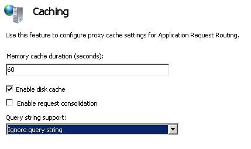

# Configure Caching with Query String Support in Application Request Routing

by CJ Pattekar

This section of the document applies to **Microsoft Application Request Routing Version 2 for IIS 7 and Above.**

## Goal

To understand and configure caching with query string support in Application Request Routing (ARR).

## Prerequisites

This article assumes that you are familiar with the overall functionality of ARR and know how to deploy and configure ARR with disk cache. If you have not done so already, it is strongly recommended that you review the following walkthroughs before proceeding:

- [Configure and enable disk cache in Application Request Routing](configure-and-enable-disk-cache-in-application-request-routing.md)
- [Cache hierarchy management using Application Request Routing](cache-hierarchy-management-using-application-request-routing.md)
- [Deploying Application Request Routing in CDN](../installing-application-request-routing-arr/deploying-application-request-routing-in-cdn.md)
- [Browse cached contents on disk on Application Request Routing](browse-cached-contents-on-disk-on-application-request-routing.md)

If Application Request Routing Version 2 has not been installed, you can download it at:

- Microsoft Application Request Routing Version 2 for IIS 7 (x86) here (`https://download.microsoft.com/download/4/D/F/4DFDA851-515F-474E-BA7A-5802B3C95101/ARRv2_setup_x86.EXE`).
- Microsoft Application Request Routing Version 2 for IIS 7 (x64) here (`https://download.microsoft.com/download/3/4/1/3415F3F9-5698-44FE-A072-D4AF09728390/ARRv2_setup_x64.EXE`).

Follow the steps outlined in [this](../installing-application-request-routing-arr/install-application-request-routing-version-2.md) document to install ARR Version 2.

## Configure query string support in ARR.

This walkthrough assumes that the server farm has already been created. If not, follow the [Define and Configure an Application Request Routing Server Farm](define-and-configure-an-application-request-routing-server-farm.md) walkthrough.This walkthrough also assumes that at least one primary cache drive has been added to ARR for caching. If not, please follow the [Configure and Enable Disk Cache in Application Request Routing](configure-and-enable-disk-cache-in-application-request-routing.md) walkthrough.

### Following are the options available for Query String Support:

- Ignore query string: The query string part in the URL is ignored. Only one cached object is created for the URL even if the query string part is different.
- Do not cache: If the URL contains a query string, it will not be cached.
- Include query string: Same URL with different query strings will be cached as separate objects. Only exact match of the URL plus query string will result in a cache hit.

**To configure a query string support to "Ignore query string" using the UI:**

1. Launch IIS Manager.
2. The query string support configuration for ARR is done at the server farm level. Select the server farm in the navigation tree view.
3. Select **Server Farms**.
4. Select the server farm that you created.
5. The following icons are shown:

     
6. Double-click **Caching**.

     

4. Verify that **Query String Support** drop down is set to **Ignore query string**. This is the default setting.

**Verify Functionality:**

1. Make a request to /arr/arr.htm?query=5 and /arr/arr.htm?query=10
2. Navigate to Application Request Routing UI at the server level in IIS Manager.
3. Click on Browse cache content in the actions pane on the right.
4. Verify that only one file is cached for arr.htm.full
5. Navigate to Monitoring and Management screen in UI.
6. Verify that first request is cache miss and the other request is a cache hit.

As a cleanup, Delete all cached objects using steps mentioned in [Delete Cached Objects](delete-cached-objects.md) walkthrough and reset runtime statistics for the server farm by navigating to "Monitoring and Management" screen and clicking "Reset runtime statistics" in the actions pane.

**To configure a query string support to "Do not cache" using the UI:**

1. Navigate to the **Caching** feature of the server farm again.
2. Set **Query String Support** drop down to **Do not cache**.

**Verify Functionality:**

1. Make a request to /arr/arr.htm?query=5 and /arr/arr.htm?query=10
2. Navigate to Application Request Routing UI at the server level in IIS Manager.
3. Click on Browse cache content in the actions pane on the right.
4. Verify that no file is cached.
5. Navigate to Monitoring and Management screen in UI.
6. Verify that both requests are cache miss.

As a cleanup, reset runtime statistics for the server farm by navigating to "Monitoring and Management" screen and clicking "Reset runtime statistics" in the actions pane.

**To configure a query string support to "Include Query String" using the UI:**

1. Navigate to the **Caching** feature of the server farm again.
2. Set **Query String Support** drop down to **Include Query String**.

**Verify Functionality:**

1. Make the following requests

   - /arr/arr.htm?query=5
   - /arr/arr.htm?query=10
   - /arr/arr.htm
2. Navigate to Application Request Routing UI at the server level in IIS Manager.
3. Click on Browse cache content in the actions pane on the right.
4. Verify that 3 different files are cached.
5. Navigate to Monitoring and Management screen in UI.
6. Verify that all 3 requests are cache miss.

## Summary

You have now successfully configured caching with query string support in ARR. For other ARR Version 2 walkthroughs, see the documents in [this](../planning-for-arr/application-request-routing-version-2-overview.md) article.
