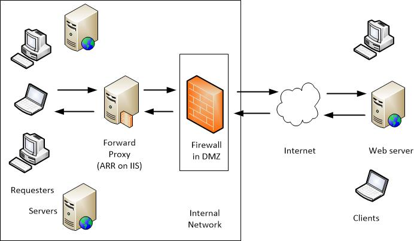
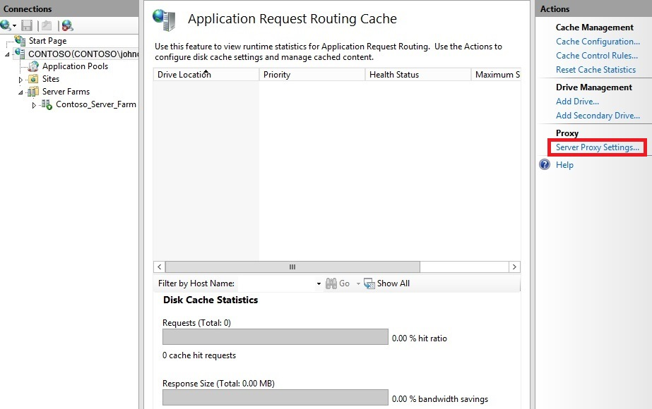
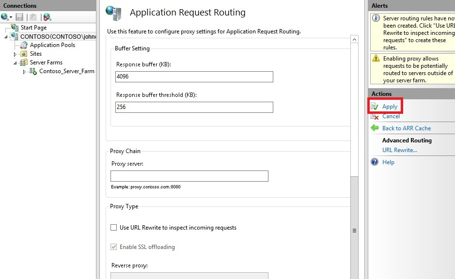
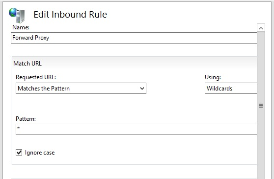
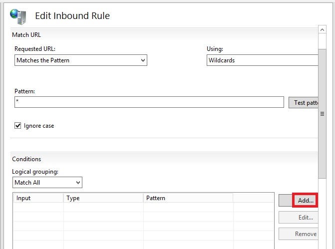
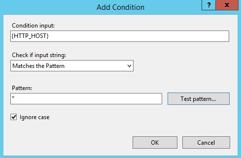

Creating a Forward Proxy Using Application Request Routing
====================
by [Jim van de Erve](https://twitter.com/jimvde)

This article will show you how to use the Application Request Routing (ARR) and URL Rewrite features of Internet Information Services (IIS) to implement a forward proxy server.

## Overview

Application Request Routing is a feature of IIS that enables you to control Internet traffic using a proxy server. A proxy server acts as a single point of contact serving clients on the request side or Web server workers on the response side. On the request side, the proxy accepts a request from one of multiple clients, and forwards it to the Internet. To the Internet the request appears to be coming from the proxy, rather than from the client. On the response side, the proxy accepts a request from the Internet, and distributes it to one of multiple workers. To the Internet the request appears to be processed and a response appears to be generated by the proxy server itself, rather than from one of the backend workers.

The first type of proxy server, the one that handles an outbound request from a client, forwards it to the Internet, and returns the generated response to the client, is called a **forward proxy**. The second type of proxy server, the one that handles an incoming request from the Internet, forwards it to a backend worker, and returns the response to the Internet, is called a **reverse proxy**.

Forward proxies and reverse proxies have significantly different functions, but they both do the same fundamental action of serving as the proxy for a requester or responder. In both cases, the proxy server isolates the private network from the Internet, enabling you to take measures to improve security. In both cases, the proxy processes requests and responses, enabling it to perform operations on the traffic that can improve performance by using caching or compression, guard against attacks, and filter information.

### ARR as a Forward Proxy

When ARR serves as a forward proxy, it is part of an internal network (or intranet) of client computers. The proxy uses a URL Rewrite rule to pass requests from clients through to the Internet. ARR as a forward proxy can be used to improve bandwidth usage and performance by caching; however, it is not suitable as a full-fledged, commercial-grade forward proxy.

Note that ARR processes only HTTP traffic, not other protocols. ARR does not support the HTTP CONNECT verb, and as a result, does not support forwarding HTTPS traffic.

When it receives a request from one of the clients naming the target Web server, the forward proxy server processes the request as follows and forwards it through the firewall to the Internet:

1. The forward proxy server receives the request from a client, and checks its validity.
2. If the request is valid, ARR checks its cache to see if the response already resides there. If it finds the response, ARR returns it to the client without sending the request to the Internet.
3. If ARR does not find the response in the cache, the proxy server sends the request through the firewall to an Internet connection, and to the content server that has the information.
4. When the request is fulfilled by the content server, the response is returned over the Internet to the forward proxy server. ARR can be configured to cache the response.

The forward proxy provides the following advantages:

- Improves performance and lessens network traffic by caching information that is requested regularly (if enabled). It caches the response for the first requester, and when subsequent clients request the same content, they are given the content from the cache. The response is not requested again from the content server.
- Helps improve network security by ensuring that requests are valid.
- Improves performance by using IIS compression (if enabled).
- Supports filtering to ensure that policies are met, using URL Rewrite.

## Installing and Configuring ARR as a Forward Proxy

### Prerequisites

To set up a forward proxy server using ARR, you must have the following:

- IIS 7.0 or above on Windows 2008 (any SKU) or newer with Tracing role service installed for IIS.
- Microsoft Application Request Routing Version 3 and dependent modules
- Minimum of one worker server with working sites and applications.

### Install ARR

If Application Request Routing Version 3 has not been installed, it is available for download [here](https://www.microsoft.com/en-us/download/details.aspx?id=39715). The download site displayed by this link includes installation instructions.

### Install URL Rewrite

Install the URL Rewrite module for IIS through the Server Manager. For more information, see [Installing IIS 8.5 on Windows Server 2012 R2](../../install/installing-iis-85/installing-iis-85-on-windows-server-2012-r2.md). 

### Configure ARR as a Forward Proxy

To enable ARR as a proxy, and to create a URL Rewrite rule to enable ARR as a forward proxy, proceed as follows:

1. Open Internet Information Services (IIS) Manager.
2. In the **Connections** pane, select the server.
3. In the server pane, double-click **Application Request Routing Cache**.
    
4. In the **Actions** pane, click **Server Proxy Settings**.
    
5. On the **Application Request Routing** page, select **Enable proxy**.
    
6. In the **Actions** pane, click **Apply**. This enables ARR as a proxy at the server level.
    
7. To start the process of turning ARR into a forward proxy, click on the server node in the **Connections** pane.
8. In the server pane, double-click **URL Rewrite**.
    
9. In the **Actions** pane, click **Add Rule(s)**.
    
10. In the **Add Rule** dialog box, double-click **Blank Rule**.
    
11. In the **Edit Inbound Rule** dialog box, enter "Forward Proxy" for **Name**. In the **Match URL** area, enter the following: 

    - Using: Wildcards
    - Pattern: \*

    
12. Scroll down to the **Conditions** area of the **Edit Inbound Rule** dialog box, and then click **Add…**.
    
13. In the **Add Condition** dialog box, select or enter the following: 

    - Condition Input: {HTTP\_HOST}
    - Type: Matches the Pattern
    - Pattern: \*

    
14. Scroll down to the **Action** area of the **Edit Inbound Rule** dialog box, and then enter the following: 

    - Action Type: Rewrite
    - Rewrite URL: http://{C:1}/{R:0}

    
15. In the **Actions** pane, click **Apply**. 

    > [!NOTE]
    > This rule enables HTTP messages to pass through the forward proxy. HTTPS (443) messages are not supported on this forward proxy because ARR does not support HTTP CONNECT.
16. Configure the proxy settings as appropriate in your applications, browsers, etc.