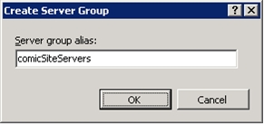
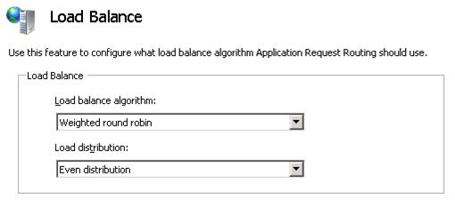

Define and Configure an Application Request Routing Server Farm
====================
by IIS Team

## Overview

This topic leads the reader through the steps to define and configure a server group for Application Request Routing (ARR) Version 1 on IIS 7.0 and above. The server farm is a logical group of application servers where HTTP requests are routed based on HTTP inspection rules and load balance algorithm.

## Goal

To define and configure a server farm in Application Request Routing Version 1 on IIS as shown below:

## Prerequisites

This walkthrough requires the following prerequisites:

- IIS 7.0 or above on Windows 2008 (any SKU) or newer.
- Microsoft Application Request Routing Version 1 and dependent modules.
- Minimum of two application servers with working sites and applications.

If Application Request Routing RC has not been installed, it is available for download at:

- Download Microsoft Application Request Routing Version 1 for IIS 7 (x86) [here](https://iis.net/downloads/default.aspx?tabid=34&amp;g=6&amp;i=1709).
- Download Microsoft Application Request Routing Version 1 for IIS 7 (x64) [here](https://iis.net/downloads/default.aspx?tabid=34&amp;g=6&amp;i=1712).

Follow the steps outlined in [this](../installing-application-request-routing-arr/install-application-request-routing.md) document to install Application Request Routing.

## Step 1 – Create a server farm in Application Request Routing

**To create and define a server farm using the UI:** 

1. Launch IIS Manager.
2. Application Request Routing is a server level feature. Select and expand the root of the server.

    
3. To create a server farm, right-click **Server Farms**, and then select **Create Server Farm...**.

    
4. Enter a name for the server farm. In the example below, **myServerFarm** is the name of the server farm. Click **Next**.

    
5. The next step is to add servers to the server farm. On the Add Server page of the wizard, add as many application servers as needed. Click **Finish** to create the server farm with the entered application servers as the server farm members. (> [!NOTE]
> *Advanced options...* allow you to configure the HTTP and HTTPS ports to non-standard (80 for HTTP and 443 for HTTPS) ports:

    
6. You have successfully created a server group with application servers as its members.

**To create and define a server farm using the command-line:** 

1. Open a command prompt with **administrator** privileges.
2. Navigate to **%windir%\system32\inetsrv**.
3. To create the server farm named myServerFarm, enter: 

    [!code-console[Main](define-and-configure-an-application-request-routing-server-farm/samples/sample1.cmd)]
4. To add an application server named wonyoo-w2k8 to the server farm named myServerFarm, enter:

    [!code-console[Main](define-and-configure-an-application-request-routing-server-farm/samples/sample2.cmd)]

    Repeat this command as many times as needed to add more servers to the server farm
5. This step is only required when creating the server farm using appcmd. When creating the server farm using the UI, the URL rewrite rules are created automatically. With appcmd, the URL rewrite rules must be created manually. To route all incoming HTTP requests to the server farm named myServerFarm, enter:

    [!code-console[Main](define-and-configure-an-application-request-routing-server-farm/samples/sample3.cmd)]

    [!code-console[Main](define-and-configure-an-application-request-routing-server-farm/samples/sample4.cmd)]

    [!code-console[Main](define-and-configure-an-application-request-routing-server-farm/samples/sample5.cmd)]

## Step 2 – Configure server farm properties for Application Request Routing

After the server farm has been created and defined, additional properties can be set to manage the behavior of Application Request Routing. Only the subset of the settings is covered in this walkthrough.

**To configure server farm properties using the UI:** 

1. Select the server farm, **myServerFarm**. The following icons are shown:

    
2. For this walkthrough, you will change the load balance algorithm that will be used for the server group, **myServerFarm**. Double-click **Load Balance**. Select **Weighted round robin** from the **Load balance algorithm** drop-down list, and then click **Apply**.

    
3. ARR can be configured to send a GET request to a URL to determine the health of the servers. To configure this feature, double-click **Health Test**, and then type the **URL** that should be tested by ARR. Click **Apply** to save changes.

    
4. Explore other icons to familiarize yourself with ARR settings.

## Summary

You have now successfully created and defined a server farm, **mySeverFarm**. At this point, myServerFarm is configured to distribute the incoming requests evenly between the application servers that have been added as members of the server farm. For more advanced load balancing settings, refer to [HTTP Load Balancing using Application Request Routing](http-load-balancing-using-application-request-routing.md).

[Discuss in IIS Forums](https://forums.iis.net/1154.aspx)