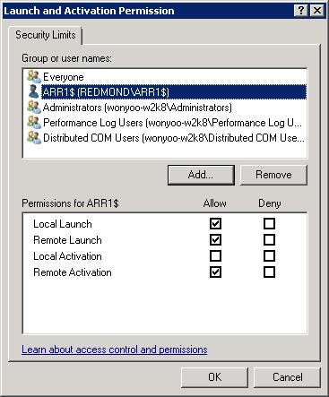
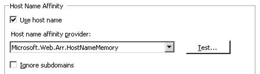

How to configure WMI service on application servers for HostNameMemory affinity provider
====================
by Won Yoo

## Overview

In ARR Version 1, there are two host name affinity providers:

1. Microsoft.Web.Arr.HostNameRoundRobin
2. Microsoft.Web.Arr.HostNameMemory

Microsoft.Web.Arr.HostNameRoundRobin provider does not have any dependency on the application servers. When this provider is used, ARR simply allocates and affinitizes host names in a round robin fashion.

However, Microsoft.Web.Arr.HostNameMemory provider requires certain permissions to be granted on the application servers so that ARR server is able to query the necessary memory relation performance counters to compute where to affinitize the host names.

This walk through is designed to guide the reader the changes that are needed on the application servers when Microsoft.Web.Arr.HostNameMemory provider is used.

> [!NOTE]
> The host name affinity providers are applicable only when ARR is configured to be used for [shared hosting scenarios](shared-hosting-using-application-request-routing-arr.md).

## Goal

Successfully configure ARR and the application servers in the server farm to use Microsoft.Web.Arr.HostNameMemory provider.

## Prerequisites

This walkthrough requires the following prerequisites:

- IIS 7.0 or above on Windows 2008 (any SKU) or newer.
- Microsoft Application Request Routing Version 1 and dependent modules.
- ARR is configured for [shared hosting scenarios](shared-hosting-using-application-request-routing-arr.md).

If the Application Request Routing Version 1 has not been installed, download it at:

- Download Microsoft Application Request Routing Version 1 for IIS 7 (x86) [here](https://iis.net/downloads/default.aspx?tabid=34&amp;g=6&amp;i=1709).
- Download Microsoft Application Request Routing Version 1 for IIS 7 (x64) [here](https://iis.net/downloads/default.aspx?tabid=34&amp;g=6&amp;i=1712).

Follow the steps outlined in [this](../installing-application-request-routing-arr/install-application-request-routing.md) document to install Application Request Routing.

## Note

The following steps are to be performed on ***all the application servers in the server farm.*** More explicitly, these changes are not needed on the ARR server(s).

## Step 1 - Enable COM Security

1. Open a command prompt as an administrator.
2. Type **dcomcnfg**.
3. Navigate to **Component Services -&gt; Computers -&gt; My Computer**.
4. Right click on **My Computer** and select **Properties**:

    
5. Select **COM Security** tab:

    
6. Under **Launch and Activate Permissions**, select **Edit Limits.** Add the account of the worker process where ARR uses and allow:

    - - Local Launch
        - Remote Launch
        - Remote Activation

    
7. Click on **OK** to save the changes.

## Step 2 - Add user to Performance Monitor Users group

1. Open a command prompt as an administrator.
2. Type **compmgmt**.
3. Navigate to **Computer Management** -&gt; **System Tools** -&gt; **Local Users and Groups** -&gt; **Groups**:

    
4. Select **Performance Monitor Users** group and add account of the worker process that ARR uses:

    
5. Click on **OK** to save the changes.

## Step 3 - WMI Control

1. On the same **Computer Management** console, navigate to **Services and Applications** and select **WMI Control**:

    
2. Right click on **WMI Control** and select **Properties**. Select **Security** tab:

    
3. Navigate to **Root** -&gt; **CIMV2** and select **CIMV2**:

    
4. Click on **Security** and add account of the worker process that ARR uses. Allow the following permissions:

    - Execute Methods
    - Enable Account
    - Remote Enable

    
5. Click on **OK** to save the changes.

## Step 4 - Test configuration on ARR

1. After making the configuration changes on all application servers in the server farm (steps 1 through 3), test the configuration on ARR server.
2. Open **IIS Manager**.
3. Select the server farm that is configured for host name affinity.
4. Select **Server Affinity** icon.
5. Select **Microsoft.Web.Arr.HostNameMemory** provider under **Host name affinity provider** and select **Apply**:

    
6. Note that the **Test...** button appears only after the change is applied. This is because the test must impersonate the identity of the worker process. Ensure that the test passes:

    
  
  
[Discuss in IIS Forums](https://forums.iis.net/1154.aspx)