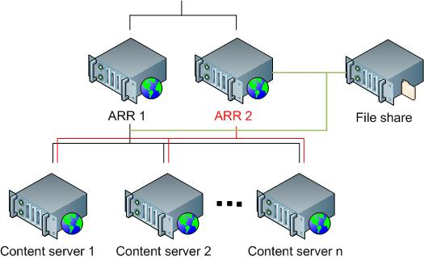

Using Multiple Instances of Application Request Routing (ARR) Servers
====================
by Won Yoo

## Overview

This topic leads you through the steps to configure Microsoft External Cache for IIS 7.0 and above, which can be used to manage the host name affinity data between multiple instances of Application Request Routing (ARR) servers.

Note that the External Cache for IIS is only required if:

1. The host name affinity feature is used.
2. There is more than one ARR server being used in the environment.

External Cache is a disk-based cache module for IIS.

## Goal

To configure and use Microsoft External Cache for IIS with Application Request Routing:

## Prerequisites

This walkthrough requires the following prerequisites:

- Minimum of two IIS 7.0 or above on Windows 2008 (any SKU) or newer installations.
- Microsoft Application Request Routing Version 1 and dependent modules (which includes Microsoft External Cache Version 1).
- Minimum of two application servers with working sites and applications.
- One file share where ARR can read and write files.

If the Application Request Routing Version 1 has not been installed, download it at:

- Download Microsoft Application Request Routing Version 1 for IIS 7 (x86) [here](https://iis.net/downloads/default.aspx?tabid=34&amp;g=6&amp;i=1709).
- Download Microsoft Application Request Routing Version 1 for IIS 7 (x64) [here](https://iis.net/downloads/default.aspx?tabid=34&amp;g=6&amp;i=1712).

Follow the steps outlined in [this](../installing-application-request-routing-arr/install-application-request-routing.md) document to install Application Request Routing.

You must have at least two ARR servers and two application servers. You can use a shared configuration to keep the ARR servers configured the same way, and use another shared configuration to keep the application servers in sync. For more information about shared configuration, refer to [this](../../manage/managing-your-configuration-settings/shared-configuration_264.md) article.

As another prerequisite, you must have defined and configured a server farm using the steps outlined in [**Define and Configure an Application Request Routing (ARR) Server Group**](define-and-configure-an-application-request-routing-server-farm.md).

## Step 1 - Enable External Cache.

**To enable External Cache using the UI:** 

1. Launch IIS Manager.
2. Select the server farm that has been created for this walkthrough.
3. The following icons are shown:  
    
4. Double-click **Server Affinity**.
5. As mentioned above, External Cache is needed only if host name affinity is used and there are multiple instances of ARR. Therefore, ensure that the **Use host name** checkbox is selected.  
    
6. Select the **Use external cache** checkbox to enable External Cache. The **File share path** text box is a required field, and specifies where the ARR servers will access to maintain the host name affinity state between the ARR servers.  
    
7. Repeat the steps above on all ARR servers.
8. To verify that the feature works, send a request with a specific host name to one of the ARR servers. Make a note of which application server this host name is affinitized to. Send the same request to the remaining ARR servers. Regardless of which ARR server is handling the requests with this host name, they all should be routed to the same application server.
9. You may also want to verify the file share where the data is being written.

**To enable External Cache using the command-line:** 

1. Open a command prompt with administrator privileges.
2. Navigate to `%windir%\system32\inetsrv`.
3. To enable host name affinity, enter (the example below uses **myServerFarm** as the name of the server farm):  

    [!code-console[Main](using-multiple-instances-of-application-request-routing-arr-servers/samples/sample1.cmd)]
4. To enable and configure External Cache, enter the following script (the example below uses the same values as the ones used in the UI steps above). Enter your password in place of \*\*\*\*\*\*\*\*:  

    [!code-console[Main](using-multiple-instances-of-application-request-routing-arr-servers/samples/sample2.cmd)]

## Summary

You have now successfully enabled and configured Microsoft External Cache for IIS to be used with the host name affinity feature in Application Request Routing. For more information about achieving high availability at the ARR tier, refer to:

- [Achieving high availability and scalability: ARR and hardware load balancer.](achieving-high-availability-and-scalability-arr-and-hardware-load-balancer.md)
- [Achieving high availability and scalability: ARR and NLB.](achieving-high-availability-and-scalability-arr-and-nlb.md)
