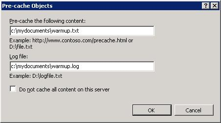
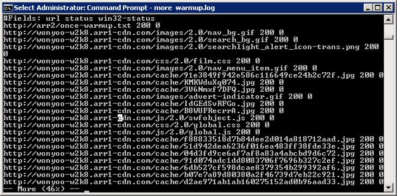
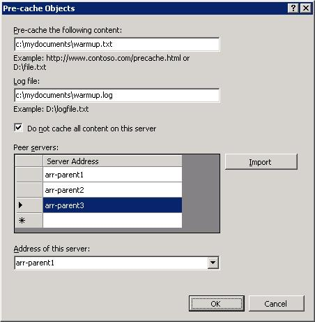

Warm Up Cache Nodes on Application Request Routing
====================
by Won Yoo

This section of the document applies to **Microsoft Application Request Routing Version 2 for IIS 7 and Above.**

## Goal

To successfully cache the Application Request Routing (ARR) cache node (ie. "warm up" the cache node) proactively in anticipation for expected demand.

ARR provides a way to warm up the cache. At a high level, ARR consumes a file that has a delimited list of URLs (**one URL per line**). ARR applies the correct URL rewrite rules and CARP on the list of URLs to ensure that they are cached correctly. ARR can consume the file in two ways:

1. The file is located on a file system.
2. The file is hosted on a Web server and is accessible through HTTP (or HTTPS).

> [!NOTE]
> If any of the URLs in the file refer to content that is on a secure (HTTPS) site, then the ARR cache node itself must be configured for HTTPS. ARR sends GET requests to localhost to process the URL rewrite rules as well as CARP to ensure that the pre-cached objects are cached appropriately.

This feature is useful when:

1. You want to proactively cache the contents in anticipation for expected demand.
2. You want to ensure that content is always cached regardless of its popularity.

This feature can be used to pre-cache all of the cache nodes, both on the child cache tier as well as the parent cache tier, or only at the parent cache tier.

Since ARR consumes a file that contains the list of URLs for the bulk operation, this file is needed before proceeding with this walkthrough.

## Prerequisites

This article assumes that you are familiar with the overall functionality of ARR and know how to deploy and configure ARR with disk cache. If you have not done so already, it is strongly recommended that you review the following walkthroughs before proceeding:

- [Configure and enable disk cache in Application Request Routing](configure-and-enable-disk-cache-in-application-request-routing.md)
- [Cache hierarchy management using Application Request Routing](cache-hierarchy-management-using-application-request-routing.md)
- [Deploying Application Request Routing in CDN](../installing-application-request-routing-arr/deploying-application-request-routing-in-cdn.md)
- [Browse cached contents on disk on Application Request Routing](browse-cached-contents-on-disk-on-application-request-routing.md)
- [Delete cached objects](delete-cached-objects.md)
- [Manually override cache-control directives using Application Request Routing](manually-override-cache-control-directives-using-application-request-routing.md)

If Application Request Routing Version 2 has not been installed, you can download it at:

- Microsoft Application Request Routing Version 2 for IIS 7 (x86) [here](https://download.microsoft.com/download/4/D/F/4DFDA851-515F-474E-BA7A-5802B3C95101/ARRv2_setup_x86.EXE).
- Microsoft Application Request Routing Version 2 for IIS 7 (x64) [here](https://download.microsoft.com/download/3/4/1/3415F3F9-5698-44FE-A072-D4AF09728390/ARRv2_setup_x64.EXE).

Follow the steps outlined in [this](../installing-application-request-routing-arr/install-application-request-routing-version-2.md) document to install ARR Version 2.

## Step 1 - Warm up*all*ARR cache nodes (*both*child and parent cache tiers).

To pre-cache contents on both child and parent cache nodes, the pre-cache action is taken on a child cache node.

**Warm up the ARR cache node using the UI:** 

1. Launch IIS Manager.
2. The cache warm-up feature is available at the server level. Select and expand the root of the server.

    
3. Double-click **Application Request Routing Cache**.
4. In the **Actions** pane, click **Pre-cache Objects...**.

    
5. In the **Pre-cache Objects** dialog box, enter the location of the file that contains the URLs and the location to a log file. Both values are required. In the example below, the following values are used:  
  
 c:\mydocuments\warmup.txt  
 c:\mydocuments\warmup.log

    

    Instead of a location to a file on the file system, you can specify a URL. For example, you can use http://mytestserver/warmup.txt.

    > [!NOTE]
    > The warmup.txt file must have one URL per line. Also, if you are rewriting the host name as described in the article [Deploying Application Request Routing in CDN](../installing-application-request-routing-arr/deploying-application-request-routing-in-cdn.md), then the domain names for the URLs in this file must match what the cache node expects to receive. The URLs must be pre-rewritten domain names because ARR will be processing the URLs to rewrite the host name and apply CARP to cache the content correctly.

    This feature is scriptable and, therefore, can also be scheduled using Task Scheduler.

## Step 2 - Verify functionality.

To see if the warm-up feature worked correctly, review the log file that was specified in Step 1.

1. Locate the log file.
2. Open the log file using Notepad. The example below shows what the log file looks like.

    
3. Alternatively, you can use the browse functionality of ARR to look at the cached contents using IIS Manager. See the [Browse cached contents on disk on Application Request Routing](browse-cached-contents-on-disk-on-application-request-routing.md) article for more information about the browse functionality.

## Step 3 - Warm up ARR cache nodes*only*at the parent cache tier.

In some instances, it can be beneficial to only pre-cache at the parent cache tier. For example, parent cache nodes may be geographically dispersed to support regional child cache nodes. In such an environment, pre-caching only at the parent cache node may be sufficient and can also prevent child cache nodes from pre-caching contents prematurely.

The steps for pre-caching only at the parent cache tier are similar to the steps outlined in Step 1 above. The core differences are:

- The pre-cache action is taken on the parent cache node (as opposed to a child cache node, as is the case in Step 1).
- Additional information is provided to correctly determine CARP on the parent cache node.

**Warm up the ARR cache node using the UI:** 

1. Launch IIS Manager.
2. The cache warm-up feature is available at the server level. Select and expand the root of the server.

    
3. Double-click **Application Request Routing Cache**.
4. In the **Actions** pane, click **Pre-cache Objects...**.

    
5. In the **Pre-cache Objects** dialog box, in addition to providing the required information as in Step 1 above, select the **Do not cache all content on this server** checkbox to further expand the dialog box.  
  
    

    Enter the names of the ARR servers, including the server where you are running the pre-cache action, in the Peer servers table. This action will automatically populate the **Address of this server** drop-down list. Select the name of the server where you are taking this action.

    **Important**: The names of the peer servers and the selection of the server in the drop-down list are required to process CARP correctly. Note that the names of the servers **must match exactly how they are referenced by the child cache nodes in the server farm**. CARP uses a hashing algorithm that takes the names of the servers into consideration. Therefore, to compute the same resulting hashed values, **the names of the servers must match exactly**.

## Summary

You have now successfully warmed up the ARR cache node using a file that contains the list of URLs.

For other ARR Version 2 walkthroughs, see the documents in [this](../planning-for-arr/application-request-routing-version-2-overview.md) article.
  
  
[Discuss in IIS Forums](https://forums.iis.net/1154.aspx)