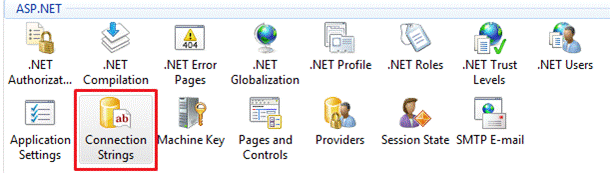
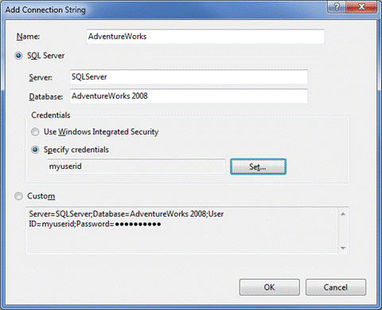
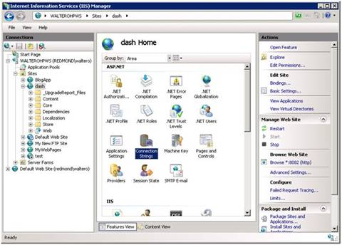
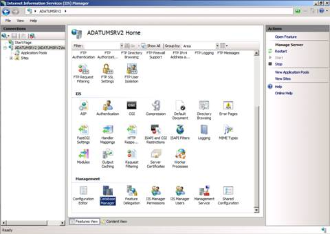
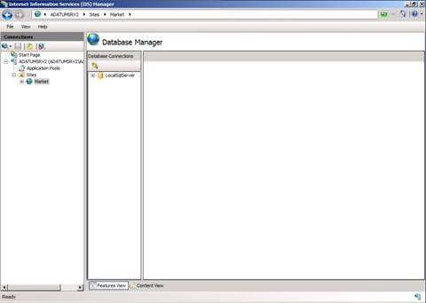

Use the Database Manager
====================
by [Saad Ladki](https://twitter.com/saadladki)

## Introduction

Database Manager is a new Internet Information Systems 7 (IIS 7) module specifically designed for the management of databases located in hosting environments. IIS 7 is designed for environments, such as the one provided by Web hosters, in which the database servers are intended to be accessible from the Web application server but not directly from the Internet.

Database Manager allows you to easily manage your local and remote databases from within IIS Manager. Database Manager automatically discovers databases based on the Web server or application configuration and also provides the ability to connect to any database on the network. Once connected, Database Manager provides a full array of administrative functionalities, including managing tables, views, stored procedures, and data and running ad hoc queries.

Database Manager provides support for Microsoft® SQL Server® and MySQL. In addition, because IIS Database Manager is an extension of IIS Manager, administrators can securely delegate the management of databases to authorized local or remote users, without having to open additional management ports on the server.

With the Database Manager, you can:

- Manage Microsoft SQL Server or MySQL databases. 

    - Add, rename, drop, and edit tables.
    - View and manage primary keys, indexes, and foreign keys.
    - Edit data.
    - Establish connections to multiple databases.
    - Create and execute queries.
    - Create, alter, and delete stored procedures and views.
    - Manage both local and remote databases from your machine.
- Back up and restore Microsoft SQL Server databases.
- Use remote management capabilities with a clean, firewall-friendly option for managing a remote SQL Server.
- Take advantage of the public extensibility platform that makes it possible to develop providers to support other databases.

To install the current version (CTP2) of Database Manager, see:

- [(x86)](https://www.iis.net/downloads?tabid=34&i=1684&g=6)
- [(x64)](https://www.iis.net/downloads?tabid=34&i=1685&g=6)

Ensure that the image you plan to use for your Web server installation contains the IIS 7 Database Manager.

## Add a Connection String to a Web Application

To add a new connection using a connection string:

1. Open the **Internet Information Services (IIS) Manager**.
2. In the **Connections** view, select the site, application, or virtual directory to which you would like to add a connection string.

    

    *Figure 1: Features View*
3. In the **Features View**, double-click on the **Connection Strings** icon.
4. In the **Actions** pane, click on **Add**.
5. In the **Name** text box, type a *name* for your connection string.
6. Select the **SQL Server** option button.

    

    *Figure 2: Add Connection String*
7. In the **Server** text box, type the name of the server that hosts your database.
8. In the **Database** text box, type the name of the database to which you would like to connect.
9. If your database uses Windows® Authentication, click on the **Use Windows Integrated Security** option button. Otherwise, click on the **Specify Credentials** option button, and then enter the *credentials* to use to connect to the database.

    Note: If you would like to specify advanced settings for your connection string, you can alternatively click on the **Custom** option button, and then type in the *connection string*.

## Add Connection Button

You can add new connections without using connection strings. This allows you to connect to databases other than the ones used by your application or to the same database but with a different user identity.

To add a new connection using the Database Manager:

1. Click the **Add Connection** button on the **Database Manager** toolbar. 

    

    *Figure 3: Database Manager*
2. In the **Connection name** text box, type a *connection* *name*.
3. In the **Database provider** list, select the *provider* that you would like to use to connect to the database. (For example, to connect to a SQL Server database, select the **System.Data.SqlClient** that ships with the Database Manager.)
4. You will now be presented with a set of new fields that you must fill out. In the case of the SQL Server Provider, you must provide: 

    - The server on which your database resides.
    - The name of your database.
    - The user ID to connect to the database.
    - The password associated with the user ID.

        

        *Figure 4: Add Connection*
5. When you are done entering the required information, click **OK**, and the connection is created.

    Note: The connection information is stored on the machine from where IIS Manager is being used. Hence, this information is not accessible from instances of IIS Manager on a different computer.

## Launch Database Manager

The Database Manager is hosted within the IIS Manager.

1. In **IIS Manager**, select the site, application, or virtual directory where your connection string is stored (for more information about creating a connection string, see [Add a Connection String to Your Web Application](#ConnString)). You can alternatively create a new connection in the **Database Manager** using the **Add Connection** button on the **Database Manager** toolbar (for more information, see [Add Connection Button](#AddConnButton)).
2. In the **Features View**, double-click on the IIS **Database Manager** icon. 

    

    *Figure 5: Database Manager*
3. If you have existing connection strings in your site, application, or virtual directory, you can see a node in the Database Manager representing each of these connection strings. 

    

    *Figure 6: Database Connections*
4. In the **Database Manager** view, expand a connection node, and you are presented with more information: 

    - Tables ([Working with Tables](https://go.microsoft.com/fwlink/?LinkId=145669))
    - Views ([Working with Views](https://go.microsoft.com/fwlink/?LinkId=145670))
    - Stored Procedures ([Working with Stored Procedures](https://go.microsoft.com/fwlink/?LinkId=145672))
5. If you further expand any of the nodes, you are presented with a list of all tables, views, and stored procedures that your database contains.

## Use the Database Manager

To use Database Manager, users must have a database connection string created within a site. For example, suppose a hoster receives an order from a customer for the provisioning of one or more databases for an application. The hoster creates the database and provides the connection string to the customer. This is often an automated step.

The connection string includes the database server, database name, and user credentials (user name and password). IIS Manager has a Connection String module that the hoster can use to provide the connection string to the customer. Or the customer can enter the connection string information that is provided by the hoster.

1. Select the **Connection Strings** icon.

    

    *Figure 7: Connection Strings module icon*
2. In the **Management** section for the Web site, double-click the **Database Manager** icon.

    

    *###### Figure 8: Database Manager icon*
3. Manage the database(s) by selecting the appropriate connection. 

    

    *Figure 9: Database Manager*

## Links for Further Information

[Videocast: IIS Manager and Database Manager](https://blogs.msdn.com/carlosag/archive/2008/07/07/IIS70RemoteAdministrationAndDatabaseManagerVideo.aspx).

[Database Manager for Hosters](../../web-hosting/web-server-for-shared-hosting/database-manager-for-hosters.md).

[Videocast: Database Manager](https://www.iis.net/downloads/microsoft/database-manager).

[Working with the Database Manager](index.md).

[Discuss in IIS Forums](https://forums.iis.net/1161.aspx)