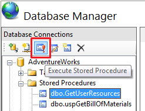

# Working with Stored Procedures

by IIS Team

## Prerequisites

This walkthrough assumes the following environment:

1. The IIS Database Manager is installed on your Web Server.
2. A database server (that could reside on the same physical machine as your web server)

## Setting the Stage Up

The instructions found in this walkthrough are generic enough to be applied to any database deployment. We will use the tables that we created in another walkthrough '[Working with Tables](https://go.microsoft.com/fwlink/?LinkId=145669)' to show you how to create new stored procedures, and manage and delete existing ones.

## Create a New Stored Procedure

Based on our earlier example, we will create a stored procedure that displays data from the "FabrikamUsers" and "AccessControls" tables. The stored procedure will retrieve all resources that are associated with a username. To create a new stored procedure:

1. Open Internet Information Services (IIS) Manager.
2. Go to Database Manager and expand your database connection node (For more information on creating connections to a database, see [Basics of the IIS Database Manager](https://go.microsoft.com/fwlink/?LinkId=145667)).
3. On the 'Stored Procedures' node, right-click and select 'New Stored Procedure'. A new query editor opens up and is pre-filled with a 'CREATE PROCEDURE' template to help you get started.   
    
4. Replace the 'Procedure\_Name' with 'GetUserResources'.
5. Replace the parameters template text with the text of the only parameter we need:  

    [!code-console[Main](working-with-stored-procedures/samples/sample1.cmd)]
6. In the body of the stored procedure, between the BEGIN and END, type the following query:   

    [!code-sql[Main](working-with-stored-procedures/samples/sample2.sql)]
   
    
7. Click 'Execute' on the query editor's toolbar. The stored procedure will now be created. You can confirm that the stored procedure has been created by inspecting the list of stored procedures under the 'Stored Procedures' node. 

    > [!NOTE]
    > In this case, the 'Execute' button runs the CREATE PROCEDURE script and acts as the save mechanism for the stored procedure.

    

## Modify an Existing Stored Procedure

The Database Manager allows you to alter a stored procedure after it has been created. We will show you how to edit a stored procedure by using our earlier example from '[Create a New Stored Procedure](#NewStoredProc)'. We will add an extra parameter to the 'GetUserResources' stored procedure. To edit a stored procedure:

1. Open Internet Information Services (IIS) Manager.
2. Go to Database Manager and expand your database connection node (For more information on creating connections to a database, see [Basics of the IIS Database Manager](https://go.microsoft.com/fwlink/?LinkId=145667)).
3. Expand the 'Stored Procedures' node. You should now see a list of all your database stored procedures, including "GetUserResources".
4. Select the 'GetUserResources' stored procedure.
5. On the Database Manager toolbar, select 'Script as ALTER'. A query editor opens and is pre-filled with the ALTER PROCEDURE template that is necessary to modify a stored procedure.   
    
6. Under the '@Username' parameter, add an extra parameter using the following text:   

    [!code-console[Main](working-with-stored-procedures/samples/sample3.cmd)]

    > [!NOTE]
    > Do not forget to add the comma after the first variable.
7. In the body of the stored procedure, between the BEGIN and END, modify the query as follows:   

    [!code-sql[Main](working-with-stored-procedures/samples/sample4.sql)]
  
    
8. Click 'Execute' on the query editor's toolbar. The stored procedure will now be altered. 

    > [!NOTE]
    > In this case, the 'Execute' button runs the ALTER PROCEDURE script and acts as the save mechanism for the stored procedure's modifications.
9. You can continue making more changes in the editor or close the editor.

## Create a New Stored Procedure Based on an Existing One

The Database Manager allows you to create a new stored procedure that is based on the code of an existing one. This functionality can be compared to a 'Save As…' action for stored procedures. To create a new stored procedure based on an existing one:

1. Open Internet Information Services (IIS) Manager.
2. Go to Database Manager and expand your database connection node (For more information on creating connections to a database, see [Basics of the IIS Database Manager](https://go.microsoft.com/fwlink/?LinkId=145667)).
3. Expand the 'Stored Procedures' node. You should now see a list of all your database stored procedures.
4. Select the existing stored procedure on which you would like to base your new one.
5. On the Database Manager toolbar, click 'Script as CREATE'. The query editor opens up and is pre-filled with a CREATE stored procedure with the same signature and body as the existing one.   
    
6. Rename the procedure by altering the name after CREATE PROCEDURE on the first line.   
    
7. Make changes to the stored procedure and then click on 'Execute'. The new stored procedure is created and you can confirm by ensuring that it appears under the 'Stored Procedures' node.  

    > [!NOTE]
    > If you don't change the name of the stored procedure, you will not be able to execute the statement.

## Executing a Stored Procedure

The Database Manager allows you to execute stored procedures. As an example, we will run the 'GetUserResources' stored procedure and display the results. To execute a stored procedure:

1. Open Internet Information Services (IIS) Manager.
2. Go to Database Manager and expand your database connection node (For more information on creating connections to a database, see [Basics of the IIS Database Manager](https://go.microsoft.com/fwlink/?LinkId=145667)).
3. Expand the 'Stored Procedures' node. You should now see a list of all your database views, including "GetUserResources".
4. Select the 'GetUserResources' stored procedure.
5. On the Database Manager toolbar, select 'Execute Stored Procedure'. A dialog opens up and asks for the stored procedure parameters.   
    
6. Enter the parameters for the stored procedure call and then click 'OK' to close the dialog. For the 'GetUserResources', you will have to enter a VARCHAR value for the username and a boolean value for the IsUserAllowed parameter.   
    
7. A query editor window opens up and is pre-filled with the EXEC statement that was used to call the stored procedure. The lower pane contains the results returned by the stored procedure.   
    
8. You can modify the arguments values in the editor and execute the query again.

## Delete an Existing Stored Procedure

The Database Manager allows you to delete an existing stored procedure. To delete a stored procedure:

1. Open Internet Information Services (IIS) Manager.
2. Go to Database Manager and expand your database connection node (For more information on creating connections to a database, see [Basics of the IIS Database Manager](https://go.microsoft.com/fwlink/?LinkId=145667)).
3. Expand the 'Stored Procedures' node. You should now see a list of all your database stored procedures.
4. Select the stored procedure that you wish to delete.
5. Right-click and select 'Delete'. You are prompted to confirm the operation.   
    
6. If you choose 'Yes', the stored procedure will be deleted. You can confirm that the stored procedure is deleted by inspecting the list of stored procedures under the 'Stored Procedures' node.
