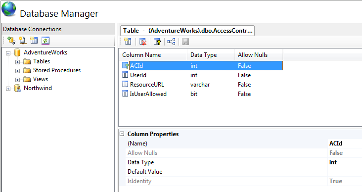

Working with Tables
====================
by [Saad Ladki](https://twitter.com/saadladki)

## Prerequisites

This walkthrough assumes the following environment:

1. The IIS Database Manager is installed on your Web Server (&lt;Link to DB Manager download&gt;).
2. A database server (that could reside on the same physical machine as your web server)

## Setting the Stage Up

Let's use a scenario for this walkthrough and assume that we would like to create an access control list for resources on our fictitious site www.fabrikam.com. For that, we will build 2 tables:

The first table, "FabrikamUsers", will contain the user ID, username and email address for each user.  
The second table, "AccessControls", will contain a reference to a user ID, a resource URL, and whether the user is allowed access to the resource or not.   

## Creating a New Table

To create a new table:

1. Open Internet Information Services (IIS) Manager.
2. Go to Database Manager and expand your database connection node (For more information on creating connections to a database, see [Basics of the IIS Database Manager](https://go.microsoft.com/fwlink/?LinkId=145667)).
3. On the 'Tables' node, right click and select 'New Table'.   
      
 A new tab will appear in the editor area. Take a moment to get familiar with the buttons on the toolbar: 

    1. New Column: allows you to add a new column to the table definition.
    2. Delete Column: allows you to remove an existing column for the table definition.
    3. Indexes/Keys: allows you to define an index or primary key on the table.
    4. Relationships: allows you to define a foreign key relationship on the table.
    5. Save: allows you to save changes to the table.

    
4. Click on 'New Column' in the toolbar. A new column is created and a 'Column Properties' pane appears.
5. In the 'Column Properties', do the following: 

    1. Type 'UserId' for the name of the column.
    2. Set 'Allow Nulls' to 'False'.
    3. Set 'Data Type' to 'int'.
    4. Leave 'Default Value' blank.
    5. Set 'IsIdentity' to 'True'.

    
6. Let's now make this field a primary key by clicking on the 'Indexes/Keys' icon. A new dialog will open up.   
    
7. On the dialog, click the 'Add' button and then fill out the information for the primary key as follows: 

    1. Set 'Columns' to 'UserId'.
    2. Set 'Is Unique' to 'True'.
    3. Set 'Type' to 'Primary Key'.
    4. Set 'Name' to 'PK\_UserId'.
  
    
8. Click 'Close' to close the dialog.
9. Add another column for the username by clicking on 'New Column' in the toolbar.
10. In the 'Column Properties', do the following: 

    1. Type 'Username' for the name of the column.
    2. Set 'Allow Nulls' to 'False'.
    3. Set 'Data Type' to 'varchar'.
    4. Set 'Length' to 50.
11. Finally, add another column for the email address by clicking on 'New Column' in the toolbar.
12. In the 'Column Properties', do the following: 

    1. Type 'Email' for the name of the column.
    2. Set 'Allow Nulls' to 'True'.
    3. Set 'Data Type' to 'varchar'.
    4. Set 'Length' to 100.
13. Click 'Save' on the toolbar, a save dialog opens up.   
    
14. In the 'Table Name', type 'FabrikamUsers'. You can also specify a schema or leave the 'Schema Name' field empty to use the default schema for your database user.   
    

Now, let us define the 'AccessControls' table. We will follow similar steps to the above:

1. On the 'Tables' node, right click and select 'New Table'. A new tab will appear in the editor area.
2. Click on 'New Column' in the toolbar. A new column is created and a 'Column Properties' pane appears.
3. In the 'Column Properties', do the following: 

    1. Type 'ACId' for the name of the column.
    2. Set 'Allow Nulls' to 'False'.
    3. Set 'Data Type' to 'int'.
    4. Leave 'Default Value' blank.
    5. Set 'IsIdentity' to 'True'.
4. Let's now make this field a primary key by clicking on the 'Indexes/Keys' icon. A new dialog will open up.
5. On the dialog, click the 'Add' button and then fill out the information for the primary key as follows: 

    1. Set 'Columns' to 'ACId'.
    2. Set 'Is Unique' to 'True'.
    3. Set 'Type' to 'Primary Key'.
    4. Set 'Name' to 'PK\_ACId'.
6. Click 'Close' to close the dialog.
7. Add another column for the referenced user by clicking on 'New Column' in the toolbar.
8. In the 'Column Properties', do the following: 

    1. Type 'UserId' for the name of the column.
    2. Set 'Allow Nulls' to 'False'.
    3. Set 'Data Type' to 'int'.
    4. Set 'IsIdentity' to 'False'.
9. Add yet another column for the resource by clicking on 'New Column' in the toolbar.
10. In the 'Column Properties', do the following: 

    1. Type 'ResourceURL' for the name of the column.
    2. Set 'Allow Nulls' to 'False'.
    3. Set 'Data Type' to 'varchar'.
    4. Set 'Length' to 200.
11. Finally, add another column for specifying the access right by clicking on 'New Column' in the toolbar.
12. In the 'Column Properties', do the following: 

    1. Type 'IsUserAllowed' for the name of the column.
    2. Set 'Allow Nulls' to 'False'.
    3. Set 'Data Type' to 'Bit'.
    4. Set 'Default Value' to 'False'.
13. Click 'Save' on the toolbar, a save dialog opens up.   
    
14. In the 'Table Name', type 'AccessControls'. You can also specify a schema or leave the 'Schema Name' field empty to use the default schema for your database user.

## Modifying an Existing Table

The Database Manager allows you to edit the definition of an existing table. More specifically, you can:

- Add, modify or delete new columns.
- Add, modify or delete a primary key.
- Add, modify or delete a foreign key relationship.

Now that we have created the two tables, "FabrikamUsers" and "AccessControls", let us link them together. We will need to edit the "AccessControls" table and add a foreign key relationship to the "FabrikamUsers" table:

1. Open IIS Manager and navigate to the Database Manager.
2. Expand the database connection node in the Database Manager tree view (For more information on creating connections to a database, see [Basics of the IIS Database Manager](https://go.microsoft.com/fwlink/?LinkId=145667)).
3. Expand the 'Tables' node. You should now see a list of all your database tables, including "FabrikamUsers" and "AccessControls".
4. Select "AccessControls" and then click 'Open Table Definition' on the toolbar. A table design view opens up and displays the columns that we created in '[Create a New Table](#NewTable)'.   
    
5. On the table design view's toolbar, click on 'Relationships'. The 'Foreign Key Relationships' dialog opens up.   
    
6. Click Add. A new foreign key relationship editor is displayed.
7. In the foreign key relationship editor, select the 'Tables and Columns Specifications' and click on the ellipsis '…' button. The 'Tables and Columns' dialog opens up.   
    
8. In the 'Relationship name' field, type 'FK\_AccessControlsForUsers'.
9. In the 'Primary key table' drop down, select "FabrikamUsers". Now you should see a drop down list of primary keys from the "FabrikamUsers" table. Make sure that "UserId" is selected.
10. In the second drop down, you should see a list of columns from "AccessControls". Select "UserId" and click OK to close the dialog.   
    
11. Click Close on the 'Foreign Key Relationships' dialog.   
    
12. Click 'Save' to update the tables. We now just created a relationship between the "FabrikamUsers" and "AccessControls" tables.

## Changing Table Data

The Database Manager allows you to modify data in an existing table. More specifically, you can:

- Add new rows.
- Modify a value in an existing row (available for supported data types &lt;link to supported data types&gt;).
- Delete an existing row.

Let us start populating our "FabrikamUsers" and "AccessControls" table with some user information:

1. Open IIS Manager and navigate to the Database Manager.
2. Expand the database connection node in the Database Manager tree view (For more information on creating connections to a database, see [Basics of the IIS Database Manager](https://go.microsoft.com/fwlink/?LinkId=145667)).
3. Expand the 'Tables' node. You should now see a list of all your database tables, including "FabrikamUsers" and "AccessControls".
4. Right-click on "FabrikamUsers" and select 'Show Table Data'. You should now see the data inside your table. There should also be a row preceded by a '\*' that you can use to enter new data.   
    
5. In the new row (\*), click in the 'Username' column and type 'John Doe'. Next, click on the 'Email' column and type 'JohnDoe@fabrikam.com'.   
    
6. When you are done entering information for the new row, hit Enter. The information is now saved in the database. Notice that the 'UserId' field is automatically populated with an incremental value since it is marked as an identity.
7. Add a few more rows of sample user names and email addresses.
8. Right-click on "AccessControls" and select 'Show Table Data'. You should now see the data inside your table. There should also be a row preceded by a '\*' that you can use to enter new data.
9. In the new row (\*), click in the 'UserId' column and type '1'. Entering this UserId value will point to the first record in your "FabrikamUsers" table (which should be 'John Doe' according to our example.
10. Next, click on the 'ResourceURL' column and type 'admin.aspx' and type 'True' in the IsUserAllowed column. This implies that user 'John Doe' can access the admin.aspx page of our fictitious site.   
    
11. Add a few more rows of sample access rights for other users.

Now that we have some data in the table, let us modify and delete an existing row:

1. Click on any table cell that you would like to modify. Type a new value in the cell. Notice that a pencil appears next to the row you are editing.
2. Click on another cell or close the table to save the information. Notice that the information is saved to the server and the pencil icon disappears.
3. Now select a row by clicking on the arrow to the left of the row, and then click the 'Delete' button on the toolbar. A dialog asks for confirmation before deleting.   
    
4. If you select 'Yes', the row of information is deleted on the server.