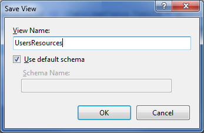

Working with Views
====================
by IIS Team

## Prerequisites

This walkthrough assumes the following environment:

1. The IIS Database Manager is installed on your Web Server.
2. A database server (that could reside on the same physical machine as your web server)

## Setting the Stage Up

The instructions found in this walkthrough are generic enough to be applied to any database deployment. We will, however, use the tables that we created in another walkthrough '[Working with Tables](https://go.microsoft.com/fwlink/?LinkId=145669)' to show you how to create new views, and manage and delete existing ones.

## Create a New View

Based on our earlier example, we will build a view that gathers and displays data from the "FabrikamUsers" and "AccessControls" tables. To create a new view:

1. Open Internet Information Services (IIS) Manager.
2. Go to Database Manager and expand your database connection node (For more information on creating connections to a database, see [Basics of the IIS Database Manager](https://go.microsoft.com/fwlink/?LinkId=145667)).
3. On the 'Views' node, right-click and select 'New View'. A new query editor opens up.
    
4. In the query editor, type the query that will select data for this view. For this example, we will select information about all users and their associated resources and sort the list by user name. Here is the query that you will need to type:

    [!code-sql[Main](working-with-views/samples/sample1.sql)]
  
    
5. On the query editor's toolbar, click on 'Execute'. The results of the query will be displayed and this ensures that our view returns the expected results.
    
6. On the query editor's toolbar, click on 'Save and Close'.
7. In the 'View Name', type 'UsersResources'. You can also specify a schema or leave the 'Schema Name' field empty to use the default schema for your database user.
    
8. Click on 'OK'. The query editor will be closed and the view will be saved. You can verify that your view has been added by looking through the list of views under the 'Views' node.
    

## Modify an Existing View

The Database Manager allows you to edit the query of a view after the view has been created. We will show you how to edit a view by using the 'UsersResources' view from our earlier example from '[Create a New View](#NewView)'. We will sort the data from the 'UsersResources' view by username. To edit a view:

1. Open Internet Information Services (IIS) Manager.
2. Go to Database Manager and expand your database connection node (For more information on creating connections to a database, see [Basics of the IIS Database Manager](https://go.microsoft.com/fwlink/?LinkId=145667)).
3. Expand the 'Views' node. You should now see a list of all your database views, including "UsersResources".
4. Select 'UsersResources' and then click the 'Open/Edit View' button on the Database Manager toolbar. A query editor opens up and is populated with the query for you to view.  
    
5. You can make any changes in the editor to the existing query. For this example, we will sort the data in the view by username. To do this, we will modify the query as follows:

    [!code-sql[Main](working-with-views/samples/sample2.sql)]

    > [!NOTE]
    > In SQL Server, the use of the 'ORDER BY' command is not supported in a view unless 'TOP' is also specified.
6. On the query editor's toolbar, click on 'Execute'. The results of the query will be displayed, this time in sorted order.  
    
7. On the query editor's toolbar, click on 'Save'. The changes to your view are now saved. The Save button will be grayed out until you make further changes to the view. You can continue editing the view or close the editor.

## Delete an Existing View

The Database Manager allows you to delete an existing view. To delete a view:

1. Open Internet Information Services (IIS) Manager.
2. Go to Database Manager and expand your database connection node (For more information on creating connections to a database, see [Basics of the IIS Database Manager](https://go.microsoft.com/fwlink/?LinkId=145667)).
3. Expand the 'Views' node. You should now see a list of all your database views.
4. Select the view that you wish to delete.  
    
5. Right-click and select 'Delete'. You are prompted to confirm the operation.
6. If you choose 'Yes', the view will be deleted. You can confirm that the view is indeed deleted by inspecting the list of views under the 'Views' node.
