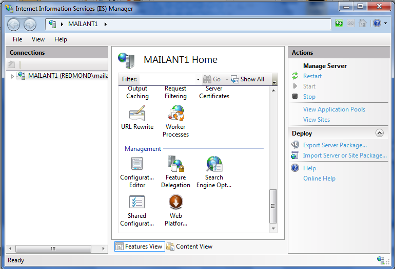

Getting Started with the SEO Toolkit
====================
by [Mai-lan Tomsen Bukovec](https://twitter.com/mailant)

The free IIS SEO Toolkit gives you an easy way to improve discoverability and user experience for your Web sites. Using the robots exclusion, sitemaps and site analysis tools in the Toolkit, you can increase Web site traffic and revenue by optimizing your site for search engine discoverability and enhancing the quality of your site.

## Powerful Tools in a Single Package

The IIS SEO Toolkit gives you multiple tools to use in improving the search engine discoverability and site quality of your Web site. Keeping search engines current with the latest information from your Web site means that users can find your Web site more easily based on relevant keyword searches. Making it easy for users to find your Web site on the Internet can direct more traffic to your site, which can help you make more money from your site. The site analysis reports in the Toolkit also simplify finding problems with your Web site, like slow pages and broken link that impact how users experience your Web site.

You can point the site analysis tool in the Toolkit at the top-level URL of your web-site, and it will automatically crawl your site like a search engine would – following each link, reviewing the HTML on each page, and generating a report of every SEO or content violation it finds on the site - along with suggestions on how to fix each of them.

The SEO toolkit also makes it easy to optimize which content on your Web site gets indexed by search engines. You can manage robots.txt files, which search engine crawlers use to understand which URLs are excluded from the crawling process. You can also manage sitemaps, which provide URLs for crawling to search engine crawlers. You can also use the SEO Toolkit to provide additional metadata about the URL, such as last modified time, which search engines take into account when calculating relevancy in search results.

## Installs Quickly and Easily

You can install the free IIS SEO Toolkit on Windows Vista, Windows 7, Windows Server 2008 or Windows Server 2008 R2 quickly and easily with the Web Platform Installer. When you click this link, the Web Platform Installer will check your computer for the required dependencies and install both the dependencies and the IIS SEO Toolkit. (You may be prompted to install the Web Platform Installer first if you do not have it already installed on your computer.)

## Launching the IIS SEO Toolkit

The IIS SEO Toolkit integrates into the IIS management console. To start using the Toolkit, launch the IIS Management Console first by clicking Run in the Start Menu and typing inetmgr in the Run command line. When the IIS Manager launches, you can scroll down to the Management section of the Features View and click the "Search Engine Optimization (SEO) Toolkit" icon.

On the home page for the IIS SEO Toolkit, you can choose "Site Analysis" to run reports that help you optimize SEO or site quality issues, "Sitemaps and Sitemap Indexes" for an easy-to-use interface to create and manage sitemaps, and "Robots Exclusion" for a simple way to manage access to your site by search engine robots.

## Using the IIS SEO Toolkit

For tutorials on how to use the IIS SEO Toolkit, you can review the following tutorials:

- [Crawling a Web site with the IIS SEO Toolkit Site Analysis Tool](using-site-analysis-to-crawl-a-web-site.md)
- [Generating and Using Site Analysis Reports](understanding-site-analysis-reports.md)
- [Managing Robots Exclusion and Sitemaps](managing-robotstxt-and-sitemap-files.md)
- [14 minute Video Overview of IIS SEO toolkit](iis-site-analysis-video-walkthrough.md)
- [Scott Guthrie's Blog Tutorial on Site Analysis in the IIS SEO Toolkit](https://weblogs.asp.net/scottgu/archive/2009/06/03/iis-search-engine-optimization-toolkit.aspx)

You can post questions and get free help in the [SEO Toolkit Forum](https://forums.iis.net/1162.aspx) on [www.iis.net](https://www.iis.net/).

## Extending the IIS SEO Toolkit

The IIS SEO Toolkit gives you many built-in reports (as well as a query generator for new reports) to analyze the discoverability and quality of your Web site. You also have the ability to customize the IIS SEO Toolkit in two ways:

1. Create your own definitions of violations and warnings, so that when the IIS SEO Toolkit crawls your Web site, the reports include the new information that you want to collect.
2. Extend the user console of the IIS SEO Toolkit for new tasks in the Site Analysis, Robots, and Sitemaps management tools.

For more information, you can review a series of [blog postings](https://blogs.iis.net/carlosag/default.aspx "blog postings"), starting with an overview of the [IIS SEO Toolkit extensibility](https://blogs.iis.net/carlosag/archive/2009/11/23/iis-seo-toolkit-extensibility.aspx) and [how to define your own violations and warnings](https://blogs.iis.net/carlosag/archive/2009/11/23/iis-seo-toolkit-crawler-module-extensibility.aspx) for the IIS SEO Toolkit to capture.

## Summary

You can [download](https://www.microsoft.com/web/page.aspx?templang=en-us&amp;chunkfile=seo.html) the IIS SEO Toolkit today to simplify how you improve the discoverability and quality of your Web site. The IIS SEO Toolkit is free, easy-to-use, and highly extensible, making it a powerful tool for any Web site administrator and developer.

[Discuss in IIS Forums](https://forums.iis.net/1162.aspx)