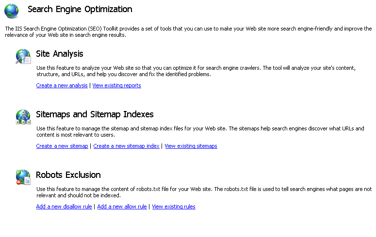
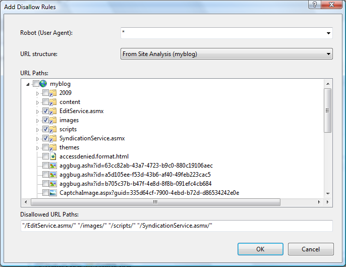

Managing Robots.txt and Sitemap Files
====================
by Ruslan Yakushev

The IIS Search Engine Optimization Toolkit includes a **Robots Exclusion** feature that you can use to manage the content of the Robots.txt file for your Web site, and includes the **Sitemaps and Sitemap Indexes** feature that you can use to manage your site's sitemaps. This walkthrough explains how and why to use these features.

## Background

Search engine crawlers will spend limited time and resources on your Web site. Therefore, it's critical to do the following:

1. Prevent the crawlers from indexing content that is not important or that should not be surfaced in search result pages.
2. Point the crawlers to the content that you deem most important for indexing.

There are two protocols that are commonly used to achieve these tasks: the [Robots Exclusion protocol](http://www.robotstxt.org/robotstxt.html) and the [Sitemaps protocol](http://www.sitemaps.org/).

The Robots Exclusion protocol is used to tell search engine crawlers which URLs it should NOT request when crawling a Web site. The exclusion instructions are placed into a text file named Robots.txt, which is located at the root of the Web site. Most search engine crawlers usually look for this file and follow the instructions in it.

The Sitemaps protocol is used to inform search engine crawlers about URLs that are available for crawling on your Web site. In addition, Sitemaps are used to provide some additional metadata about the site's URLs, such as last modified time, modification frequency, relative priority, etc. Search engines might use this metadata when indexing your Web site.

## Prerequisites

### 1. Setting up a Web site or an application

In order to complete this walkthrough, you will need an IIS 7 or above hosted Web site or a Web application that you control. If you do not have one, you can install one from the [Microsoft Web Application Gallery](https://www.microsoft.com/web/gallery/). For the purposes of this walkthrough, we will use the popular blogging application [DasBlog](https://www.microsoft.com/web/gallery/DasBlog.aspx).

### 2. Analyzing the Web Site

Once you have a Web site or a Web application, you may want to analyze it to understand how a typical search engine will crawl its contents. To do this, follow the steps outlined in the articles "[Using Site Analysis to Crawl a Web Site](using-site-analysis-to-crawl-a-web-site.md)" and "[Using Site Analysis Reports](understanding-site-analysis-reports.md)". When you do your analysis, you will probably notice that you have certain URLs that are available for the search engines to crawl, but that there is no real benefit in having them being crawled or indexed. For example, login pages or resource pages should not be even requested by search engine crawlers. URLs like these should be hidden from search engines by adding them to the Robots.txt file.

## Managing the Robots.txt File

You can use the Robots Exclusion feature of the IIS SEO Toolkit to author a Robots.txt file which tells search engines which parts of the Web site should not be crawled or indexed. The following steps describe how to use this tool.

1. Open the IIS Management Console by typing INETMGR in the Start menu.
2. Navigate to your Web site by using the tree view on the left hand side (for example, Default Web Site).
3. Click on the **Search Engine Optimization** icon within the Management section:  
    
4. On the SEO main page, click on the "**Add a new disallow rule**" task link within the **Robots Exclusion** section.  
    

### Adding Disallow and Allow Rules

The "Add Disallow Rules" dialog will open automatically:

Robots Exclusion protocol uses "Allow" and "Disallow" directives to inform search engines about URL paths that can be crawled and the ones that cannot. These directives can be specified for all search engines or for specific user agents identified by a user-agent HTTP header. Within the "Add Disallow Rules" dialog you can specify which search engine crawler the directive applies to by entering the crawler's user-agent into the "Robot (User Agent)" field.

The URL Path tree view is used to select which URLs should be disallowed. You can choose from several options when selecting the URL paths by using the "URL structure" drop down list:

- Physical Location - you can choose the paths from the physical file system layout of your Web site.
- From Site Analysis (analysis name) - you can choose paths from the virtual URL structure that was discovered when site was analyzed with the IIS Site Analysis tool.
- &lt;Run new Site Analysis...&gt; - you can run a new site analysis to get the virtual URL structure for your Web site, and then select URL paths from there.

After have completed the steps described in the prerequisites section, you will have a site analysis available. Choose the analysis in the drop down list and then check the URLs that need to be hidden from search engines by using the checkboxes in the "URL Paths" tree view:

After selecting all the directories and files that need to be disallowed, click OK. You will see the new disallow entries in the main feature view:

Also, the Robots.txt file for the site will be updated (or created if it did not exist). Its content will look similar to this:

[!code-console[Main](managing-robotstxt-and-sitemap-files/samples/sample1.cmd)]

To see how Robots.txt works, go back to the Site Analysis feature and re-run the analysis for the site. On the Reports Summary page, in the **Links** category, choose **Links Blocked by Robots.txt**. This report will display all the links that have not been crawled because they have been disallowed by the Robots.txt file that you have just created.

## Managing Sitemap Files

You can use the Sitemaps and Sitemap Indexes feature of the IIS SEO Toolkit to author sitemaps on your Web site to inform search engines of the pages that should be crawled and indexed. To do this, follow these steps:

1. Open the IIS Manager by typing INETMGR in the **Start** menu.
2. Navigate to your Web site by using the tree view on the left.
3. Click on the **Search Engine Optimization** icon within the Management section:  
    
4. On the SEO main page, click on the "**Create a new sitemap**" task link within the **Sitemaps and Sitemap Indexes** section.  
    
5. The **Add Sitemap** dialog will open automatically.   
    
6. Type a name for your sitemap file and click **OK**. The **Add URLs** dialog appears.

### Adding URLs to the sitemap

The **Add URLs** dialog looks like this:

The Sitemap file is basically a simple XML file that lists URLs along with some metadata, such as change frequency, last modified date, and relative priority. You use the **Add URLs** dialog to add new URL entries to the Sitemap xml file. Each URL in the sitemap must be in a fully qualified URI format (i.e. it must include protocol prefix and domain name). So, the first thing you have to specify is the domain that will be used for the URLs that you are going to add to the sitemap.

The URL Path tree view is used to select which URLs should be added to the sitemap for indexing. You can choose from several options by using the "URL structure" drop down list:

- Physical Location - you can choose the URLs from the physical file system layout of your Web site.
- From Site Analysis (analysis name) - you can choose URLs from the virtual URL structure that was discovered when the site was analyzed with Site Analysis tool.
- &lt;Run new Site Analysis...&gt; - you can run a new site analysis to get the virtual URL structure for your Web site, and then select the URL paths from there that you want to add for indexing.

After you have completed the steps in the prerequisites section, you will have a site analysis available. Choose it from the drop-down list, and then check the URLs that need to be added to the sitemap.

If necessary, modify the **Change Frequency**, **Last Modified Date**, and **Priority** options, and then click **OK** to add the URLs to the sitemap. A sitemap.xml file will be updated (or created if it did not exist), and its content will look like the following:

[!code-unknown[Main](managing-robotstxt-and-sitemap-files/samples/sample-127348-2.unknown)]

### Adding the sitemap location to the Robots.txt file

Now that you have created a sitemap, you will need to let search engines know where it is located so that they can start using it. The simplest way to do this is to add the sitemap location URL to the Robots.txt file.

In the Sitemaps and Sitemap Indexes feature, choose the sitemap that you have just created, and then click **Add to Robots.txt** in the **Actions** pane:

Your Robots.txt file will look similar to the following:

[!code-console[Main](managing-robotstxt-and-sitemap-files/samples/sample3.cmd)]

## Registering sitemaps with search engines

In addition to adding the sitemap location to the Robots.txt file, it is recommended that you submit your sitemap location URL to the major search engines. This will allow you to obtain useful status and statistics about your Web site from the search engine's webmasters tools.

- To submit a sitemap to **bing.com,** use the [Bing Webmasters Tools](http://www.bing.com/webmaster)
- To submit a sitemap to **google.com,** use the [Google Webmasters Tools](https://www.google.com/webmasters/)

## Summary

In this walkthrough, you have learned how to use the Robots Exclusion and Sitemaps and Sitemap Indexes features of the IIS Search Engine Optimization Toolkit to manage the Robots.txt and sitemap files on your Web site. The IIS Search Engine Optimization Toolkit provides an integrated set of tools that work together to help you author and validate the correctness of the Robots.txt and sitemap files before search engines start using them.
  
  
[Discuss in IIS Forums](https://forums.iis.net/1162.aspx)