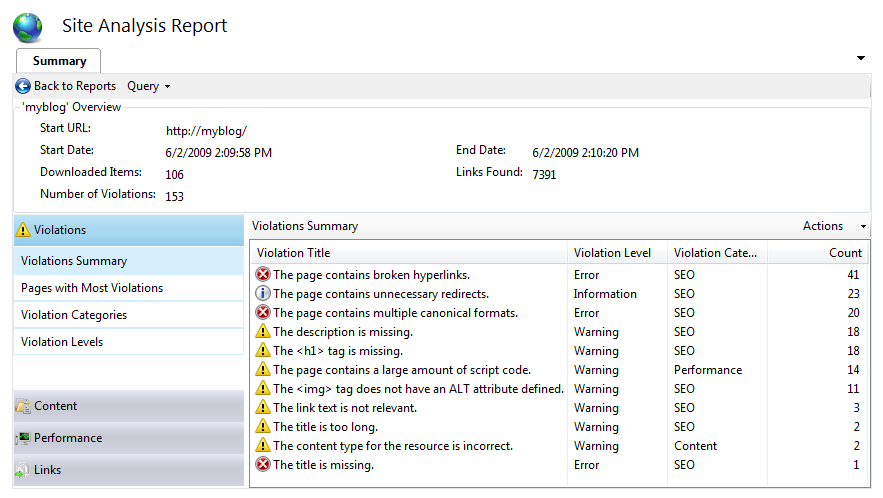

Understanding Site Analysis Reports
====================
by [Ruslan Yakushev](https://github.com/ruslany)

IIS Site Analysis is a tool within the IIS Search Engine Optimization Toolkit that can be used to analyze Web sites with the purpose of optimizing the site's content, structure, and URLs for search engine crawlers. In addition, the tool can be used to discover and fix common problems in site content that negatively affect the site user experience. The IIS Site Analysis tool includes a user interface that offers a comprehensive set of pre-built reports for Search Engine Optimization (SEO) and displays content-specific problems found during analysis. The IIS Site Analysis tool also lets you create custom queries on the data that was gathered during the analysis.

## Getting the Site Analysis Reports

To perform an analysis of your Web site, follow these steps:

1. Launch IIS Manager.
2. Select the Server node or a site node in the tree view on the left, and then choose the "Search Engine Optimization" feature. You will see a starting page that allows you to look at analyzing your site, adding robots or sitemaps.
3. Open the "Site Analysis" feature. This shows the list of all available analysis reports. If you have not run any analysis yet, then click "New Analysis" on the right-hand Actions pane to create one.  
    
4. Select and open a report from the list of available reports. This will open the summary page for the report, which you can use to get a snapshot of all the SEO violations and content problems found on your Web site. Also, this page can be used as a starting point for getting to reports details.  
    

## Navigating Through the Site Analysis Reports

### Summary Page

The site analysis summary page provides an overview of all SEO related violations and problems found on your Web site. In addition, it contains a large set of pre-built reports about your site content and structure. Those reports can be accessed by using the navigation bars on the left side.

You can drill down into each individual item in the report by double-clicking on it, or by using the "View Group Details" command in the context menu. To open a particular report in a separate query page, use the "Open Query" command in the context menu:

### Query Page

Opening any of the pre-built reports from the summary page will result in a new query page:

The query page is used to issue queries against the site analysis data that was collected during the crawl of the Web site. In the screenshot above, the query is used to get all the pages that reference images without specifying an ALT attribute within the &lt;img&gt; HTML tag.

There is a set of actions that you can perform for each item within the query results pane. Those are accessible by using the context menu. The following actions can be performed:

#### View Details

This option will bring up a dialog box which can be used to get the detailed information about the item. Specifically, you can see the violation details and suggested corrective actions:

In addition, the actual response data is available if you need to further investigate the causes of the reported violation. For example, if you want to find out where in the response HTML this violation occurred, choose the "Content" tab. This will bring up the response content with the offending section of the markup highlighted.

#### View in Browser

If you right-click a URL, you can select **View in Browser** from the context menu to show the URL in the browser.

#### View Pages Linking to This Page

If you right-click a URL, you can also select **View Pages Linking to This Page**. This option will open a new query page that will show all the pages on the site that reference the URL for the selected item. This kind of report is useful when you want to find out which pages may be affected if you change a particular URL on your site.

#### View Pages Linked by This Page

This option will open a new query page that will show all the URLs and resources that the HTML markup for the currently selected URL references.

#### View Violations in This Page

This option will open a new query page that will show all the violations found on the page of the selected URL.

#### View in Hierarchy

This option will bring up a hierarchy view page which consist of the following parts:

- URLs of all pages that lead to the selected page
- URL of the selected page
- URLs of all the resources and pages referenced by the selected page

Double clicking on any item within the "Linking URLs" or "Linked URLs" list views will make that item a selected page and will update the linked and linking pages views accordingly.

#### View Routes to This Page

This option will open a new page which will display the 5 shortest unique routes from the analysis start page to the currently selected page.

Each route is shown with the start page at the bottom, each subsequent page above, with the selected page on top. This report can be used to analyze how visitors can get to a particular page on your Web site and if there any unnecessary pages that can be eliminated in order for users to more easily discover the selected page.

### Word Analysis

The Word Analysis feature can be used to get an idea of the most commonly used words in a page's content. These can be used as keywords for accurately describing the Web page content for search engines. To perform a word analysis:

1. In any report, select the Web page that you want to analyze.
2. Double click on the row in the report to bring up the **Details** dialog.
3. Choose the **Word Analysis** tab:  
    

The most often used words within a page will be displayed, which can give you an idea of which keywords to choose for this page. In addition, the text of links that reference this page are listed at the bottom of the dialog. This helps you to check whether the anchor text used within those links accurately describes the content of the page.

## Summary

The Site Analysis feature of the IIS Search Engine Optimization Toolkit is a powerful and flexible tool that enables you to perform deep analysis of various aspects of your Web site, from compliance with SEO best practices to content statistics, paths analysis, and selection of keywords.
  
  
[Discuss in IIS Forums](https://forums.iis.net/1162.aspx)