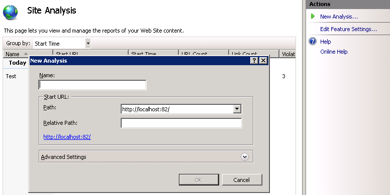

Using Site Analysis to Crawl a Web Site
====================
by [Ruslan Yakushev](https://github.com/ruslany)

IIS Site Analysis is a tool within the IIS Search Engine Optimization Toolkit that can be used to analyze Web sites with the purpose of optimizing the site's content, structure, and URLs for search engine crawlers. In addition, you can use the tool to discover and fix common problems in site content that negatively affect the site user experience. The IIS Site Analysis tool includes a Web crawler that crawls all publicly available site links and resources and downloads the content that will be used for site analysis.

## Crawling a Web site

The first step in analyzing a Web site is to crawl all the resources and URLs that are publicly exposed by the site. This is what the IIS Site Analysis tool does when a new site analysis is created. To have the IIS Site Analysis tool crawl a Web site and collect data for analysis, follow these steps:

1. Launch the SEO tool by going to Start &gt; Program Files &gt; IIS 7.0 Extensions and click the **Search Engine Optimization (SEO) Toolkit** icon.
2. Select the server node in the **Connections** pane. The SEO main page will open automatically.
3. Click on the "**Create a new analysis**" task link within the **Site Analysis** section.  
    
4. In the **New Analysis** dialog box, enter a name that will uniquely identify the analysis report. Also, enter the URL where the crawler should begin.  
      
 Note that because the server node is selected in the     **Connections**  pane (we have not selected a specific Web site on the server), it is possible to crawl any Web site that is publicly accessible on the internet. Refer to the "    [Web Crawler Settings](using-site-analysis-to-crawl-a-web-site.md#Web_Crawler_Settings_) " section for more details about the "New Analysis" dialog box.
5. Once all the parameters have been specified, click **OK** to start the analysis:  
      
 The two numbers reported during analysis are:  

    - **Links Processed** - this is the total number of links that have been crawled and downloaded by the Web crawler.
    - **Total Links** - this is the total number of links found while crawling the Web site.

> [!NOTE]
> that the Web crawler always runs on a client computer. If you connect to a remote IIS server and start a new analysis, the Web crawler will be hosted within the IIS Manager process (InetMgr.exe) on the local computer that is connected to the remote IIS server. All the collected data and cached Web content are kept on the local client file system.

After the Web site has been crawled and analyzed, the Site Analysis Report Summary view will be shown. Refer to the "Using the Site Analysis Reports" article for more details on how to analyze the site for SEO and content specific problems.

## Web Crawler Settings

Other parameters that can be specified when starting a new analysis are: 

- **Maximum Number of Links** - this setting controls how many unique links will be processed and downloaded from a Web site during a crawl. A link is any URL that is used within a page's markup, including hyperlinks, references to image files, css files, and javascript files. Increasing this number will increase the size of the reports file and will make the crawling process run longer.
- **Maximum Download Size per Link** - this setting controls how many kilobytes of content will be downloaded per link. Increasing this number will increase the size of the cached content stored by Site Analysis on the local file system.
- **Ignore 'nofollow' attribute** - The 'nofollow' attribute and the '[nofollow](http://www.robotstxt.org/meta.html)' meta tag are used to tell search engine crawlers to not follow certain or all hyperlinks in the page. This is a means of protection against spam in blog comments. If pages on your site use this attribute, then the hyperlinks on those pages will not be processed or analyzed during site analysis. Note that links to resources such as images, css, and javascript files will be still processed. If it is necessary to analyze even the hyperlinks that use this attribute, use this setting to ignore the 'nofollow' attributes and meta tags.
- **Ignore 'noindex' meta tag** - The '[noindex](http://www.robotstxt.org/meta.html)' tag is used to tell search engine crawlers not to index the content of the page. If pages on your site use this meta tag, then the content of those pages will not be searched for any violations. If it is necessary to analyze even the pages that use this attribute, use this setting to ignore the 'noindex' meta tag.
- **External Links** - You can use this drop-down list when your Web site has sub-domains or when you want to run an analysis on a particular directory within a site. This setting controls whether sub-domains and/or subdirectories should be treated as external or internal links.

In addition, the following generic settings can be configured for the Web crawler by selecting **Edit FeatureSettings in the Actions pane:** 

- **Maximum Number of Concurrent Requests** - this setting controls how many concurrent requests the Web crawler will make.
- **Reports Directory** - specifies the directory on the local file system where all crawled data and cached Web site content is stored.

## Blocking the IIS Site Analysis Web Crawler

All HTTP requests made by the IIS Site Analysis Web crawler have an HTTP header "user-agent" set to:

[!code-console[Main](using-site-analysis-to-crawl-a-web-site/samples/sample1.cmd)]

The IIS Site Analysis Web crawler is fully compliant with [the robots exclusion protocol](http://www.robotstxt.org/robotstxt.html). This means that you can use the Robots.txt file to prevent the IIS Site Analysis Web crawler from crawling your Web site. You may want to use it to prevent other people from running IIS Site Analyses against your Web sites.

In order to prevent the IIS Site Analysis crawler from crawling a Web site, add the following lines at the end of the Robots.txt file that is located in the site's root directory:

[!code-console[Main](using-site-analysis-to-crawl-a-web-site/samples/sample2.cmd)]

## Summary

You have now successfully configured the IIS Site Analysis tool to crawl a Web site and gather the data about site's content and structure. For information on how to analyze the gathered data by using Site Analysis reports, refer to "Using Site Analysis Reports".
  
  
[Discuss in IIS Forums](https://forums.iis.net/1162.aspx)