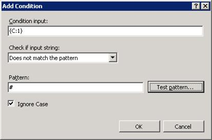
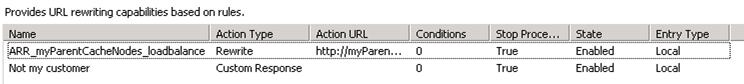
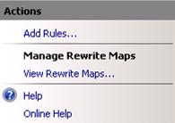

# Deploying Application Request Routing in CDN

by Won Yoo

This section of the document applies to **Microsoft Application Request Routing Version 2 for IIS 7 and Above.**

## Goal

To successfully configure a child/edge cache node and a parent cache node in a 2-tier cache hierarchy deployment in a content delivery network/edge caching network (CDN/ECN) environment. The focus of this walkthrough is to understand the URL rewrite rules on the child/edge cache node and on the parent cache node. Ultimately, this walkthrough will go through step-by-step instructions to set up the following configuration:

Some of the highlights of this configuration are:

- Origin lookup is done by the child/edge cache node.

  - The list of customers (that is, the list of acceptable origin servers) is managed explicitly using a rewrite map in URL rewrite.
  - The host names that are not found in the rewrite map are blocked.
- The parent cache node is, for the most part, configured as a forward proxy.
- SAN is configured to be shared by the child/edge cache nodes.

  - Effectively, there are 3 tiers of cache:

     1. Child/edge cache node.
     2. SAN.
     3. Parent cache node.

## Prerequisites

This walkthrough assumes that you are familiar with the disk cache and cache hierarchy management configurations in ARR Version 2. If you have not done so already, it is strongly recommended that you review the following walkthroughs before proceeding:

- [Configure and enable disk cache in Application Request Routing](../configuring-application-request-routing-arr/configure-and-enable-disk-cache-in-application-request-routing.md)
- [Cache hierarchy management using Application Request Routing](../configuring-application-request-routing-arr/cache-hierarchy-management-using-application-request-routing.md)

If Application Request Routing Version 2 has not been installed, you can download it at:

- Microsoft Application Request Routing Version 2 for IIS 7 (x86) [here](https://download.microsoft.com/download/4/D/F/4DFDA851-515F-474E-BA7A-5802B3C95101/ARRv2_setup_x86.EXE).
- Microsoft Application Request Routing Version 2 for IIS 7 (x64) [here](https://download.microsoft.com/download/3/4/1/3415F3F9-5698-44FE-A072-D4AF09728390/ARRv2_setup_x64.EXE).

Follow the steps outlined in the [Install Application Request Routing Version 2](install-application-request-routing-version-2.md) article to install ARR Version 2.

## Configuring Child/Edge Cache Node

### Step 1 - Configure disk cache

Configure and enable disk cache by following the [Install Application Request Routing Version 2](../configuring-application-request-routing-arr/configure-and-enable-disk-cache-in-application-request-routing.md) article. This article also discusses how to configure a SAN to use as a secondary cache drive location.

### Step 2 - Define a server farm for parent cache nodes

Define a server farm and add parent cache nodes by following the [Cache Hierarchy Management Using Application Request Routing](../configuring-application-request-routing-arr/cache-hierarchy-management-using-application-request-routing.md) article.

### Step 3 - Make additional URL rewrite rules for child/edge cache node

At this point, using **myParentCacheNodes** as the name of the server farm, the following URL rewrite rule has been written in the applicationHost.config file, located at `%windir%\system32\inetsrv\config\`:

[!code-xml[Main](deploying-application-request-routing-in-cdn/samples/sample1.xml)]

The above rule is not sufficient for a CDN/ECN deployment because the cache nodes are tiered, and the next tier of cache nodes (that is, the parent cache nodes) would not know how to find the origin servers when there is a cache miss at the parent cache tier.

This walkthrough addresses the problem by having the child cache node map the origin server before the request is routed to the parent cache node. There are two most common ways where the origin servers are mapped based on the URL that the child cache node receives:

1. The customer of the CDN/ECN is specified as the sub-domain. In this case, there can be many host name bindings to the same IP address of the child cache node.  
 For example, `http://customer1.mycnd.net/`, `http://customer2.mycdn.net/`, etc.
2. The customer of the CDN/ECN is specified as the first path in the URL.  
 For example, `http://static.mycdn.net/customer1/`, `http://static.mycdn.net/customer2/`, etc.

In this walkthrough, the first example is used for demonstration. Similar rules can be written to enable the second scenario as well.

1. Define the URL rewrite maps that can be used to look up the origin server's host name. Launch IIS Manager.
2. Select and expand the root of the server. This is your child (edge) cache node.

    
3. Double-click **URL Rewrite**.
4. In the **Actions** pane, click **View Rewrite Maps**.

    
5. In the **Actions** pane, click **Add Rewrite Map**.

    
6. In the **Add Rewrite Map** dialog box, name the rewrite map, **OriginServers**.

    
7. In the rewrite map, you will explicitly identify the mapping between the host name that the child cache node receives and the corresponding origin host names. In the **Actions** pane, click **Add Mapping Entry...**.

    
8. In the **Add Mapping Entry** dialog box, add the host name that the child cache node receives and the origin host name. In the example below, the ARR child cache node receives **customer1.mycdn.net** as the host name header. The corresponding origin server is **images.customer1.com**.

    
9. Repeat Step 8 as many times as needed to include all customers to which your CDN/ECN provides services. This is how you can manage the explicit list of your customers to ensure that your service is provided only to your customers.
10. To block the customers that are not on the rewrite map list, set the default value of this rewrite map to **#**, which is an illegal character that cannot be used as part of the host name header, per RFC. In the **Actions** pane, click **Edit Map Settings...**.

    
11. In the **Edit Rewrite Map** dialog box, enter **#** as the default value for this rewrite map.

    
12. Rewrite the host name header with the rules that have been configured in the OriginServers rewrite map. When there is a cache miss and the request is routed to the parent cache node, the request will have the host name that matches the origin server. This is why, for the most part, the parent cache node is configured as a forward proxy. When there is a cache miss at the parent cache node, the request is simply routed to the origin server based on the host name header that the parent cache node receives.
13. In the URL rewrite UI, locate the rule. In this walkthrough, the name of the rule should be **ARR\_myParentCacheNodes\_loadbalance**.

    
14. Select the rule, and in the **Actions** pane, click **Edit**.
15. Click **Add Conditions** to add two rules.
16. The first rule will use the **OriginServers** rewrite map that you created in Step 6. The following rule will match the host header as the key to match the entries in **OriginServers:**

    
17. The second rule will set the default value as **#** when the host header does not match the entries in **OriginServers**. As noted above, **#** is not a valid character and cannot be used as a host name. The following rule is used later to ensure that only the customers (as represented by host names) in **OriginServers** are serviced by ARR:

    
18. Select **Track capture groups across conditions**.
19. To set the HTTP\_HOST values to match the conditions above, click **Server Variables**.
20. Enter the following values to reset HTTP\_HOST:

    
21. Click **OK** to save the changes.
22. In the **Actions** pane, click **Apply** to save the changes.
23. To verify that the correct rules have been written, open the applicationHost.config file using Notepad. The configuration file is located at `%windir%\system32\inetsrv\config\`.
24. Locate the URL rewrite rule for the server farm, **myParentCacheNodes**. It should look like the following:

    [!code-xml[Main](deploying-application-request-routing-in-cdn/samples/sample2.xml)]

25. **Strongly recommended.** To block requests that do not match the host names defined in the above rewrite map, create a default URL rewrite rule that sends a 400 response to such requests.

    Launch IIS Manager.
26. Select and expand the root of the server. This is your child (edge) cache node.

    
27. Double-click **URL Rewrite**.
28. In the **Actions** pane, click **Add Rules**. 

    
29. In the **Add Rule(s)** dialog box, select **Blank rule**.

    
30. Enter the following values, and then save the rule:  
    **Name:** Not my customer  
    **Using:** Wildcards  
    **Pattern:** \*  
    **Action Type:** Custom Response  
    **Status code:** 400  
    **Sub status code:** 0

    
31. The order of the rules is important. The URL rewrite rules are processed from top to bottom. In this example, if the incoming host name matches one of the host names specified in the above rewrite map, the first rule, **ARR\_myParentCacheNodes\_Loadbalance**, is executed. If the incoming host name does not match any of the host names that are defined in the above rewrite map, the second rule, **Not my customer**, is executed.

    
32. **The child/edge cache node configuration is complete.**  
  
To streamline the configuration of additional child cache nodes, a shared configuration can be used so that there is only one place to manage the configuration of the child cache node. Otherwise, the above configuration changes must be made individually on all child cache nodes in the CDN/ECN environment. To learn more about shared configuration, see the  [Shared Configuration](../../manage/managing-your-configuration-settings/shared-configuration_264.md) article.

## Configuring Parent Cache Node

There are two ways to configure ARR as the parent cache node:

1. Set up ARR as the forward proxy.
2. Set up ARR as the "reverse" proxy with the rewrite map.

Even with the second option above, the rewrite maps simply rewrite the incoming host name with the same value, effectively making it a forward proxy. The rewrite map is used to explicitly configure the list of host names that the parent cache will accept, similar to how the child cache node is configured above. In this second part of the walkthrough, the parent cache node will be configured using the first option as a straightforward forward proxy.

### Step 1 - Configure disk cache

Configure and enable disk cache by following the [Configure and Enable Disk Cache in Application Request Routing](../configuring-application-request-routing-arr/configure-and-enable-disk-cache-in-application-request-routing.md) article.

### Step 2 - Configure ARR as a forward proxy

1. Enable ARR as a proxy. Launch IIS Manager.
2. This configuration does not involve any server farms. All settings are done at the server level.

    
3. Double-click **Application Request Routing Cache**.

    
4. In the **Actions** pane, click **Server Proxy Settings**.

    
5. Select the **Enable proxy** checkbox, and then click **Apply**. You have just enabled ARR as a proxy at the server level.
6. To turn ARR into a forward proxy, click on the server node in the navigation pane.

    
7. Double-click **URL Rewrite**.
8. In the **Actions** pane, click **Add Rules...**.

    
9. In the **Add Rule(s)** dialog box, select **Blank rule**.

    
10. Enter the following values, and then save the rule:  
    **Name:** Forward proxy  
    **Using:** Wildcards  
    **Pattern:** \*  
    **Conditions:**  
    **Input:** {HTTP\_HOST}  
    **Type:** Matches the pattern  
    **Pattern:** \*  
    **Action Type:** Rewrite  
    **Rewrite URL:** http://{C:1}/{R:0}  

    
11. **The parent cache node configuration is complete.**  
  
    To streamline the configuration of additional parent cache nodes, a shared configuration can be used so that there is only one place to manage the configuration of the parent cache node. Otherwise, the above configuration changes must be made individually on all parent cache nodes in the CDN/ECN environment. To learn more about the shared configuration, see the following [article](../../manage/managing-your-configuration-settings/shared-configuration_264.md) .

## Summary

You have now successfully configured child cache node(s) and parent cache node(s) in a 2-tiered cache hierarchy CDN/ECN environment using advanced URL rewrite rules. To verify functionality, you can follow Step 4 and Step 5 in the [Configure and Enable Disk Cache in Application Request Routing](../configuring-application-request-routing-arr/configure-and-enable-disk-cache-in-application-request-routing.md) article. If there are errors, enable Failed Request Tracing rules by following the steps in [Using Failed Request Tracing Rules to Troubleshoot Application Request Routing](../../troubleshoot/using-failed-request-tracing/using-failed-request-tracing-rules-to-troubleshoot-application-request-routing-arr.md) article.

For other ARR Version 2 walkthroughs, see the documents in [Application Request Routing Version 2 Overview](../planning-for-arr/application-request-routing-version-2-overview.md) article.
