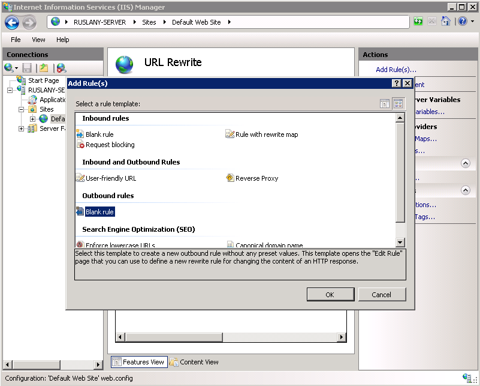
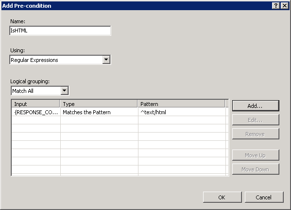

Creating Outbound Rules for URL Rewrite Module
====================
by [Ruslan Yakushev](https://github.com/ruslany)

This section of the documentation applies to the **URL Rewrite Module Version 2.0 for IIS 7**.

This walkthrough will guide you through how to create and test an outbound rewrite rule for the URL Rewrite Module 2.0.

## Prerequisites

This walkthrough requires the following prerequisites:

1. IIS 7 or above with ASP.NET role service enabled;
2. URL Rewrite Module 2.0 RC release installed.

## Setting up a test Web page

To demonstrate how the URL rewrite module 2 works, you will use a simple ASP.NET page. This page reads the Web server variables and displays their values in the browser. It also constructs a hyperlink by using the server variables and then puts that link into the response HTML.

**To create the test page**

1. Create a file named article.aspx in the following folder:  

    [!code-console[Main](creating-outbound-rules-for-url-rewrite-module/samples/sample1.cmd)]
2. Copy the following ASP.NET markup, paste it into the file and save the file:  

    [!code-aspx[Main](creating-outbound-rules-for-url-rewrite-module/samples/sample2.aspx)]
3. Open a Web browser and request the following URL in order to make sure that the page renders correctly:  

    [!code-console[Main](creating-outbound-rules-for-url-rewrite-module/samples/sample3.cmd)]

## Adding an Inbound Rewrite Rule

The next step is to add a rule that rewrites URLs that have the following format:

[!code-console[Main](creating-outbound-rules-for-url-rewrite-module/samples/sample4.cmd)]

These URLs will be rewritten to have a format like the following:

[!code-console[Main](creating-outbound-rules-for-url-rewrite-module/samples/sample5.cmd)]

**To add the inbound rewrite rule:** 

1. Open the **web.config** file located in the following location:   

    [!code-console[Main](creating-outbound-rules-for-url-rewrite-module/samples/sample6.cmd)]
2. Under the **/configuration/system.webServer** element, add the following and then save the file:  

    [!code-xml[Main](creating-outbound-rules-for-url-rewrite-module/samples/sample7.xml)]

For more information about creating inbound rewrite rules, see [Creating Rewrite Rules for the URL Rewrite Module](creating-rewrite-rules-for-the-url-rewrite-module.md).

### Testing the Inbound Rewrite Rule

You can now test that the inbound rewrite rule is working as designed.

**To test the inbound rewrite rule:** 

Open a Web browser and request the following URL:

[!code-console[Main](creating-outbound-rules-for-url-rewrite-module/samples/sample8.cmd)]

If the rewrite rule is working correctly, you will get a response form the server that looks like the following:

You can see that because of the inbound rule it is possible to access this web page by using a simple and user friendly URL structure. However, if a user clicks on the hyperlink within the HTML page then the URL with query string parameters will be used by the Web browser. This is not preferable for several reasons:

1. Web site visitors will see the internal URL structure that you wanted to hide by using a URL rewrite rule.
2. The same page will be accessible by multiple URLs, which is not ideal for search engine optimization.

The most straightforward way to fix this is to modify the HTML page to use the simple link structure. However, in many cases this is not possible. For example, if you already have a complex legacy Web application or a Web application that you cannot make modifications to, then the task of fixing all the URL links in the application can be very time-consuming, or not feasible at all.

This is when outbound URL rewriting can help. Outbound URL rewriting can fix the links on a fly in the response generated by an application.

## Create an outbound rewrite rule

You will now create an outbound rewrite rule that changes the URLs in the HTML responses. The rule will change the URLs that have the following format:

[!code-console[Main](creating-outbound-rules-for-url-rewrite-module/samples/sample9.cmd)]

These URLs will be rewritten as the following:

[!code-console[Main](creating-outbound-rules-for-url-rewrite-module/samples/sample10.cmd)]

You will create an outbound rule by using the URL Rewrite user interface in IIS Manager.

**To create the outbound rule:** 

1. Open IIS Manager
2. Select "Default Web Site"
3. In the Feature View select "URL Rewrite"  
    
4. In the Actions pane on the right hand side click on "**Add Rules...**". In the "Add Rules" dialog select the "Blank Rule" under the "Outbound rules" category and click OK.  
    

Now you must define the actual outbound rule. In the URL Rewrite Module 2.0, an outbound rewrite rule is defined by specifying the following information:

- Name of the rule.
- An optional precondition that controls whether this rule should be applied to a response.
- The pattern to use for matching the string in the response.
- An optional set of conditions.
- The action to perform if a pattern is matched and all condition checks succeeded.

### Naming the rule

In the "Name" text box enter a name that will uniquely identify the rule, for example: "Rewrite to clean URL".

### Defining a Precondition

A precondition is used to evaluate whether the outbound rules evaluation should be performed on a response. For example if a rule that modifies HTML content, only HTTP responses with content-type header set to "text/html" should be evaluated against this rule. Outbound rules evaluation and content rewriting is a CPU intensive operation that may negatively affect the performance of a web application. Therefore, use preconditions to narrow down the cases when outbound rules are applied.

Because the rule that you are creating should be applied only on HTML responses, you will define a precondition that checks whether the HTTP response header **content-type** is equial to "text/html".

**To define a precondition:** 

1. In the Pre-conditions list, select "&lt;Create New Pre-condition&gt;".
2. This will bring you to the Pre-condition editor dialog, where you will need to define the precondition. Specify the precondition settings as follows: 

    - Name: "**IsHTML**"
    - Using: "**Regular Expressions**"
    - Click "Add" to bring up the "Add condition" dialog. In this dialog specify: 

        - Condition input: "**{RESPONSE\_CONTENT\_TYPE}**"
        - Check if input string: "**Matches the pattern**"
        - Pattern: "**^text/html**"

        
3. Click OK to save the precondition and to return to the "Edit Rule" page.

### Defining a matching scope

The outbound rewrite rule can operate on the content of an HTTP header or on the response body content. This rule needs to replace links in the response content so in the "Matching Scope" drop down list choose "Response".

### Defining a tag filter

Tag filters are used to scope the pattern matching to a certain HTML elements only, instead of evaluating the entire response against the rule's pattern. Pattern matching is a very CPU-intensive operation and if an entire response is evaluated against a pattern, it can significantly slow down the Web application response time. Tag filters allow you to specify that the pattern matching should be applied only within the content of certain HTML tags, thus significantly reducing the amount of data that has to be evaluated against regular expression pattern.

To define a tag filter, expand the drop down list "**Match the content within:** " and then select and check the check box "**A (href attribute)**".

This sets the rule to apply the pattern only to the value of the **href** attribute of the hyperlink, as in the following example:

[!code-html[Main](creating-outbound-rules-for-url-rewrite-module/samples/sample11.html)]

### Defining a pattern

In the "Pattern" text box enter the following string:

[!code-console[Main](creating-outbound-rules-for-url-rewrite-module/samples/sample12.cmd)]

This string is a regular expression that specifies that the pattern will match any URL string that meets the following conditions:

- Starts with the sequence of characters "/article.aspx?".
- Contains a first query string parameter that has a numeric value.
- Contains a second query string parameter that has a alphanumeric value.

Notice that certain parts of the regular expression are within parentheses. These parentheses create capture groups, which can be later referenced in the rule by using back-references. Also, in most cases the "&amp;" symbol is HTML encoded in the response, so the regular expression pattern needs to take that into account.

### Defining an action

Choose the "Rewrite" action type in the "Action" group box. In the "Value" text box, enter the following string:

[!code-console[Main](creating-outbound-rules-for-url-rewrite-module/samples/sample13.cmd)]

This string specifies the new value to which the link address should be rewritten. Notice that for the values of the query string parameters the expression uses {R:1} and {R:2}, which are the back-references to the capture groups that were defined in the rule pattern by using parentheses.

Leave default values for all other settings. The "Edit Rule" property page will look like the following page:

Save the rule by clicking on "Apply" action on the right hand side.

### Viewing the Rewrite Rule in the Configuration File

The rewrite rules are stored either in **aplicationHost.config** file or in **web.config** files. To check the configuration of the rule that you have just created, open a web.config file located in

[!code-console[Main](creating-outbound-rules-for-url-rewrite-module/samples/sample14.cmd)]

In this file you see the `&lt;rewrite&gt;` section that contains all the rules definitions, as in the following example:

[!code-xml[Main](creating-outbound-rules-for-url-rewrite-module/samples/sample15.xml)]

### Testing the rule

You can now test that the rule correctly rewrites URLs. Open a Web browser and request the following URL:

[!code-console[Main](creating-outbound-rules-for-url-rewrite-module/samples/sample16.cmd)]

You should see that the outbound rewrite rule has changed the link within the HTML response:

Now, if a site visitor clicks on this link, the clean URL format will be used and an internal URL representation used by this page will not be revealed.

## Summary

In this walkthrough you have learned how to configure outbound rewrite rules in URL Rewrite Module 2.0 by using IIS Manager or by manually editing **web.config** file. The rules that were created in this walkthrough demonstrated some of the important features of URL Rewrite Module 2.0, such as outbound rewriting, preconditions and tag filters.