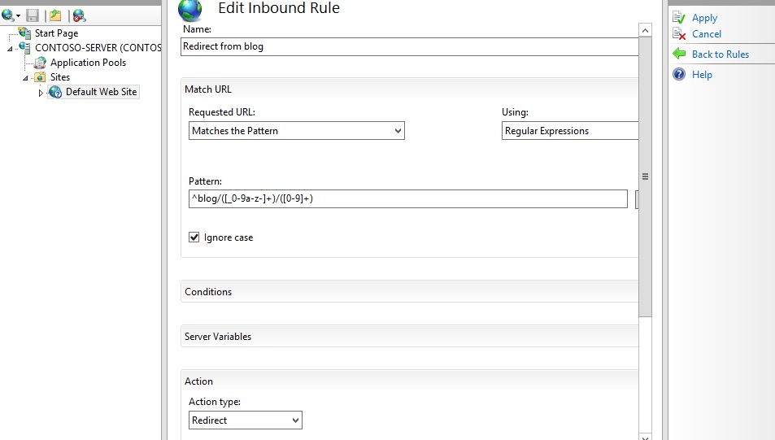

Creating Rewrite Rules for the URL Rewrite Module
====================
by [Ruslan Yakushev](https://github.com/ruslany)

The URL rewrite module is an extension to IIS which is available as a download for your stand-alone IIS Server, and is also pre-installed on any website on [Windows Azure Web Sites (WAWS)](https://www.windowsazure.com/en-us/documentation/services/web-sites/) and available [for your use](https://blogs.msdn.com/b/davidlem/archive/2010/04/26/wcf-rest-and-url-rewriting-with-windows-azure.aspx). This walkthrough will guide you through how to create and test a set of rewrite rules for the URL Rewrite Module.

## Prerequisites

This walkthrough requires the following prerequisites:

1. IIS 7 or above with ASP.NET role service enabled.
2. URL Rewrite Module installed. For more information, see [Using the URL Rewrite Module](using-the-url-rewrite-module.md).

## Setting up a test Web page

To demonstrate how the URL Rewrite Module works, we will use a simple test ASP.NET page. This page reads the Web server variables and outputs their values in the browser.

Copy the following ASP.NET code and put it in the %*SystemDrive*%\inetpub\wwwroot\ folder in a file called **article.aspx**:

[!code-aspx[Main](creating-rewrite-rules-for-the-url-rewrite-module/samples/sample1.aspx)]

After copying this file, browse to `http://localhost/article.aspx` and check that the page was rendered correctly in a browser.

## Creating a rewrite rule

We will create a simple rewrite rule that will rewrite URLs using the following format:

`http://localhost/article/342/some-article-title`  
to:  
`http://localhost/article.aspx?id=342&title=some-article-title`.

We will create a rewrite rule by using URL Rewrite UI in IIS Manager. To do this, follow these steps:

1. Go to IIS Manager.
2. Select **Default Web Site**.
3. In the Feature View click **URL Rewrite**.  
    
4. In the **Actions** pane on the right-hand side, click **Add rules…**  
    
5. In the **Add Rules** dialog box, select **Blank Rule** and click **OK.**  
    

Now you must define the actual rewrite rule. In the URL Rewrite Module, a rewrite rule is defined by specifying four required pieces of information:

- Name of the rule.
- Pattern to use for matching the URL string.
- Optional set of conditions.
- Action to perform if a pattern is matched and whether all conditions checks succeed.

### Naming a rule

In the **Name** text box, enter a name that will uniquely identify the rule, for example: "Rewrite to article.aspx".
  

### Defining a pattern

In the **Pattern** text box, enter the following string:

[!code-console[Main](creating-rewrite-rules-for-the-url-rewrite-module/samples/sample2.cmd)]

This string is a regular expression that specifies that the pattern will match any URL string that meets the following conditions:

1. Starts with the sequence of characters "article/".
2. Contains one or more numeric characters after the first "/".
3. Contains one or more alphanumeric or "\_" or "-" characters after the second "/".

Notice that certain parts of the regular expression are within parentheses. These parentheses create capture groups, which can be later referenced in the rule by using back-references.

### Defining an action

Since the rule that we are creating is supposed to rewrite the URL, choose the **Rewrite** action type that is listed in the **Action** group box. In the **Rewrite URL:** text box, enter the following string:

[!code-console[Main](creating-rewrite-rules-for-the-url-rewrite-module/samples/sample3.cmd)]

This string specifies the new value to which the input URL should be rewritten. Notice that for the values of the query string parameters we used {R:1} and {R:2}, which are back-references to the capture groups that were defined in the rule pattern by using parentheses.

Leave default values for all other settings. The **Edit Inbound Rule** property page should look like the following page:

Save the rule by clicking **Apply** on the right-hand side.

### Viewing the rewrite rule in configuration file

The rewrite rules are stored either in the ApplicationHost.config file or in Web.config files. To check the configuration of the rule that we have just created, open a Web.config file located in %*SystemDrive*%\inetpub\wwwroot\. In this file you should see the `<rewrite>` section that contains this rule definition:

[!code-xml[Main](creating-rewrite-rules-for-the-url-rewrite-module/samples/sample4.xml)]

The syntax above also applies to configuring URL Rewrite in Web.config in [Windows Azure Web Sites (WAWS)](https://www.windowsazure.com/en-us/documentation/services/web-sites/).

### Testing the rewrite rule

To test that the rule correctly rewrites URLs, open a Web browser and request the following URL:

`http://localhost/article/234/some-title`

You should see that the rewrite rule on your Web server has changed the original URL to Article.aspx and it has passed "234" and "some-title" as values for query string parameters.

## Creating a redirect rule

Now we will create a redirect rule that will redirect all URLs in the following format:

`http://localhost/blog/some-other-title/543`   
to the following format:  
`http://localhost/article/543/some-other-title`

A redirect rule enables more than one URL to point to a single Web page.

To do this, open the URL Rewrite feature view UI in IIS Manager. Click **Add Rule(s)…**, and then select the **Blank Rule** template again.

Within the **Edit Rule** page, enter the following:

- Name: **Redirect from blog** (This is a unique name for the rule.)
- Pattern: **^blog/([\_0-9a-z-]+)/([0-9]+)** (This pattern will match the URL string that starts with "blog" and captures the second and third segments of the URL into back-references.)
- Action: **Redirect** (The redirect action will cause a redirect response to be sent back to the browser.)
- Redirect URL: **article/{R:2}/{R:1}** (This substitution string will be used as a redirect URL; notice that it uses back-references to preserve and rearrange the original URL pieces captured during pattern match.)

Enter the name, pattern, and action as shown below:

Enter the redirect URL as shown below:

Leave default values for all other settings. Save the rule by clicking **Apply** on the right-hand side.

### Testing the redirect rule

To test that the rule redirects requests correctly, open a Web browser and request the following URL:

`http://localhost/blog/some-other-title/323`

You should see that the browser was redirected to `http://localhost/article/323/some-other-title` as a result of redirect rule execution and then the request was rewritten in accordance with the rewrite rule that you have created earlier.

## Creating an access block rule

The third rule that we will create is used to block all requests made to a Web site if those requests do not have the host header set. This type of rule is useful when you want to prevent hacking attempts that are made by issuing HTTP requests against the IP address of the server instead of using the host name.

We will create this rule without using IIS Manager. Open the Web.config file in the `%SystemDrive%\inetpub\wwwroot\` folder that you used for the article.aspx test file early in this article. Locate the `<rewrite>` section. Insert the following rule into the &lt;rules&gt; collection, so that it is the first rule in the collection:

[!code-xml[Main](creating-rewrite-rules-for-the-url-rewrite-module/samples/sample5.xml)]

The `<rewrite>` section should look like the following code:

[!code-xml[Main](creating-rewrite-rules-for-the-url-rewrite-module/samples/sample6.xml)]

Let's analyze the rule to understand what it does.

[!code-xml[Main](creating-rewrite-rules-for-the-url-rewrite-module/samples/sample7.xml)]

The element above says that the rule will match any URL string.

[!code-xml[Main](creating-rewrite-rules-for-the-url-rewrite-module/samples/sample8.xml)]

The element above adds a condition to the rule that retrieves the host header value by reading the server variable HTTP\_HOST, matches it against the pattern &quot;localhost&quot; and then negates the result of matching. In other words, the condition verifies that the host header does not match &quot;localhost&quot;.

[!code-xml[Main](creating-rewrite-rules-for-the-url-rewrite-module/samples/sample9.xml)]

The element above tells the URL Rewrite Module to end the HTTP request.

### Testing the access block rule

To test this rule, open a Web browser and make a request to `http://127.0.0.1/article/234/some-title`. What you should see is a browser that does not receive any response from the server. However, if you request `http://localhost/article/234/some-title`, then the Web server will respond successfully.

The unsuccessful display will be the following:

The successful display will be the following:

## Summary

In this walkthrough, you have learned how to configure URL rewrite rules by using IIS manager or by manually editing Web.config files. The rules that were created in this walkthrough demonstrated some of the important features of the URL Rewrite Module, such as regular expressions support and the ability to use HTTP headers and server variables to make rewriting decisions.