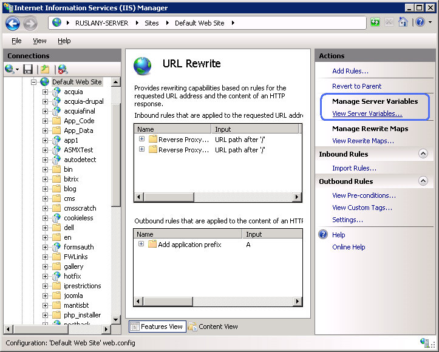
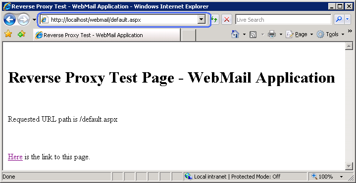

Modifying HTTP Response Headers
====================
by [Ruslan Yakushev](https://github.com/ruslany)

This section of the documentation applies to the **URL Rewrite Module Version 2.0 for IIS 7**.

This walkthrough will guide you through how to use URL Rewrite Module v 2.0 to set HTTP response headers.

## Prerequisites

This walkthrough requires the following prerequisites:

1. IIS 7 or above with ASP.NET role service enabled;
2. URL Rewrite Module 2.0 Release Candidate installed;
3. Completed walkthrough on [Reverse Proxy with URL Rewrite v2 and Application Request Routing](reverse-proxy-with-url-rewrite-v2-and-application-request-routing.md).

## Introduction

URL Rewrite Module 2.0 provides support for rules-based rewriting of the response HTTP headers. A very common usage scenario for setting the response headers is to modify the redirection response generated by an application behind a load balancer or a reverse proxy. For example when an application behind a reverse proxy returns a redirect response, the HTTP Location header in the response may not represent the internet-facing address, but rather an internal application address. URL Rewrite Module 2.0 can be used on the reverse proxy server to modify the Location header in the response. The scenario is represented on the following diagram:

1. An HTTP client makes a request to a web page `http://www.contoso.com/webmail/oldpage.aspx`.
2. The reverse proxy server uses URL Rewrite 2.0 and Application Request Routing to forward the request to an internal content server based on the name of the folder in the requested URL path, e.g. `http://webmail/oldpage.aspx`;
3. The web application that is running on the content server issues a redirect response (HTTP/1.1 301) pointing an HTTP client to `http://webmail/newpage.aspx`;
4. The reverse proxy server uses URL Rewrite 2.0 to replace the internal-based redirection location in the response with the internet-based redirection location: `http://www.contoso.com/webmail/newpage.aspx`.

## Setting up a walkthrough scenario

To setup the walkthrough scenario complete the walkthrough about [Reverse Proxy with URL Rewrite v2 and Application Request Routing](reverse-proxy-with-url-rewrite-v2-and-application-request-routing.md). At the end of that walkthrough you should have a reverse proxy web site that routes requests to two content applications: webmail and payroll.

For this walkthrough you will need to add a redirection logic to the webmail application. In real-life scenario that would probably be a redirection initiated by the web application code, but, for simplicity, in this walkthrough you will use a redirect rule in URL Rewrite Module.

1. Create a file named web.confg in the following folder:  

    [!code-console[Main](modifying-http-response-headers/samples/sample1.cmd)]
2. Open the file in a text editor, paste the following XML code inside and then save the file:  

    [!code-xml[Main](modifying-http-response-headers/samples/sample2.xml)]

   This is a rule that will redirect all requests for index.aspx to default.aspx.

Now open a web browser and make a request `http://localhost/webmail/index.aspx`. You will see that the browser got redirected to `http://localhost:8081/default.aspx`, which is basically an internal URL used by the webmail web application. Now you will configure the URL Rewrite rules to modify the HTTP Location header in the HTTP redirection responses so that the browser is redirected to a proper URL: `http://localhost/webmail/default.aspx`.

## Modifying the inbound rule to preserve the host header

In order to be able to modify the HTTP Location header it is necessary to preserve the original value of the HTTP host header. The outbound rewrite rule will use the preserved value when modifying the response. To preserve the original value you will store it in a temporary server variable ORIGINAL\_HOST.

1. In the main URL Rewrite feature view page click "View Server Variables..." in the **Actions** pane on the right hand side:  
    
2. In the "Allowed Server Variables" page click "Add..." and then enter the name of the server variable that will be used to temporarily store the value of the HTTP Host header, e.g. ORIGINAL\_HOST:  
     
3. Click OK to save the changes and then return to the main URL Rewrite feature view page. After that select the "Reverse Proxy to webmail" inbound rule and click "Edit..."
4. In the "Edit Inbound Rule" page, expand the "Server Variables" group box; then click "Add..." and enter "ORIGINAL\_URL" for the server variable name and "{HTTP\_HOST}" for the "Value":  
     

## Creating an outbound rule to modify the HTTP response header

Now you will create an outbound rewrite rule that will rewrite the HTTP Location header in redirection responses to add back the application folder to the URL path and to replace the host name.

1. In the main URL Rewrite feature view page click "**Add Rules...**" and then select "**Blank Rule**" under the "**Outbound Rules**" category.
2. In the "**Edit Outbound Rule**" page name the rule as "**Rewrite Location Header**".
3. In the "**Pre-condition**" drop-down list choose "**&lt;Create New Pre-Condition...&gt;**".
4. In the "Add Pre-Condition dialog" name the pre-condition as "**IsRedirection**"
5. Click "**Add**..." and then enter **{RESPONSE\_STATUS}** as a condition input and "**3\d\d**" as the pattern. This pre-condition will be used to check if the response has a redirection status code, e.g. 301, 302, 307, etc. The pre-condition dialog will look similar to below:  
    
6. Click OK to return to the "**Edit Outbound Rule**" page.
7. In the "**Match**" group box use the "**Matching scope**" drop down list to select "**Server Variable**".
8. Enter "**RESPONSE\_Location**" for the "**Variable name**" and "**^http://[^/]+/(.\*)**" for the "**Pattern**". This will configure the rule to operate on the response HTTP header "Location" and match its value against a regex pattern that will store the URL path into a back-reference.
9. Expand the "**Conditions**" group box, click "**Add...**" and enter **{ORIGINAL\_URL}** as a condition input and "**.+**" as a condition pattern. This condition checks if the temporary server variable ORIGINAL\_URL exists and has a non-empty value.
10. Click "**Add...**" one more time and add another condition. Set the condition input to **{URL}** and the pattern to "**^/(webmail|payroll)/.\\***". This regular expression will be used to match the URL paths that start with either /webmail or /payrol. Also the parenthesis within the pattern will capture the part of the matched URL string, so that it can be re-used when constructing the replacement URL.
11. Finally, in the "**Action**" group box choose the "**Rewrite**" action and enter "`http://{ORIGINAL_URL}/{C:1}/{R:1}`" as a value. This action will replace the value of the HTTP Location header with a string constructed by using the host name from the server variable, the condition back-reference that contains the URL path folder prefix and the rule back-reference that contains the current URL path in the Location header.

The complete page will look as below:

### Testing the rule

To test that the rules work correctly, open a web browser and make a request to `http://localhost/webmail/index.aspx`. The browser should get redirected to `http://localhost/webmail/default.aspx`:

## Summary

In this walkthrough you have learned how to use several new features in URL Rewrite 2.0 to implement a fully functional reverse proxy scenario. You have configured the inbound rule to forward the requests to a backend content servers and to set a temporary server variable. Then you have defined an outbound rule that modifies the HTTP Location header in the redirection response generated by the web application from the backend content server.