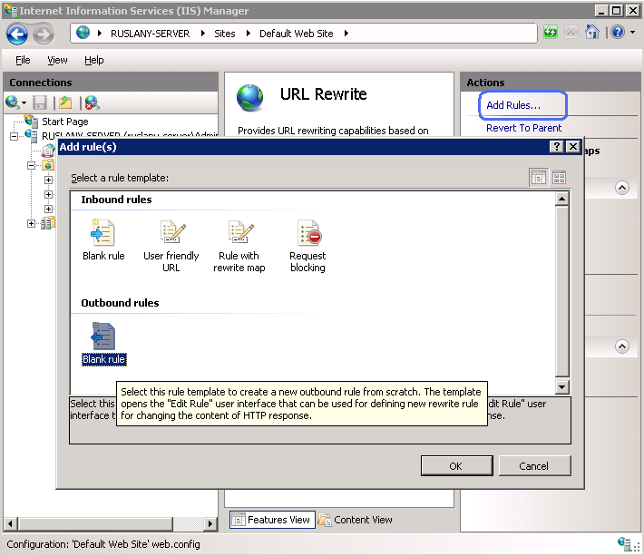
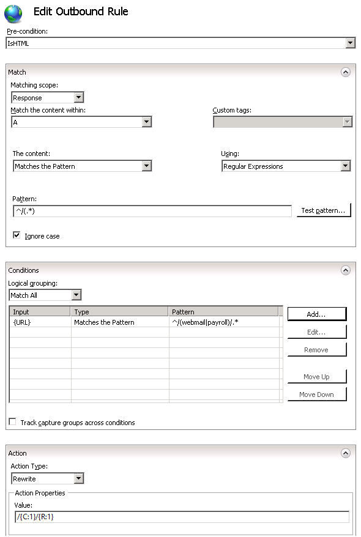

# Reverse Proxy with URL Rewrite v2 and Application Request Routing

by [Ruslan Yakushev](https://github.com/ruslany)

This walkthrough will guide you through how to use URL Rewrite Module and [Application Request Routing](../planning-for-arr/using-the-application-request-routing-module.md) (ARR) to implement a [reverse proxy server](http://en.wikipedia.org/wiki/Reverse_proxy) for multiple back-end applications.

## Prerequisites

To run this walkthrough, you must have the following:

1. IIS 7 or above with ASP.NET role service enabled.
2. URL Rewrite Module installed (version 2.0 is required if you want to complete the part about response rewriting)
3. Application Request Routing version 1.0 or version 2.0 installed

## Introduction

By using URL Rewrite Module and Application Request Routing you can implement complex and flexible load balancing and reverse proxy configurations. A very common reverse proxy scenario is to make available several internal web applications over the Internet. An Internet-accessible Web server is used as a reverse-proxy server that receives Web requests and then forwards them to several intranet applications for processing: The following figure illustrates a typical configuration for a reverse-proxy scenario:

Assuming that the ARR server has a domain name `http://contoso.com`, each web application can be accessed by using these URLs:

- `http://contoso.com/webmail/`
- `http://contoso.com/payroll/`

When a request is made to `http://contoso.com/webmail/default.aspx`, ARR forwards these requests to an internal server using the URL `http://webmail/default.aspx`. Similarly, requests to `http://contoso.com/payroll/` are forwarded to `http://payroll/default.aspx`.

In addition, if internal application inserts links into its response HTML that link to elsewhere in those applications, those links should be modified before the response is returned to the client. For example, a page from `http://webmail/default.aspx` might contain a link like this:

[!code-html[Main](reverse-proxy-with-url-rewrite-v2-and-application-request-routing/samples/sample1.html)]

Then ARR server should change this link to the following:

[!code-html[Main](reverse-proxy-with-url-rewrite-v2-and-application-request-routing/samples/sample2.html)]

## Creating the Example Web Sites

For simplicity, the reverse-proxy scenario you will work with in this walkthrough will be implemented on a single server, with the IIS "Default Web Site" acting as a reverse-proxy site and webmail and payroll applications hosted in separate IIS web sites on the same server.

To create the example Web sites:

1. Create two folders called "**webmail**" and "**payroll**" in the following folder:  

    [!code-console[Main](reverse-proxy-with-url-rewrite-v2-and-application-request-routing/samples/sample3.cmd)]
2. Create two IIS web sites called "**webmail**" and "**payroll**" that point to corresponding folders under `%SystemDrive%\inetpub\`. Use different IP ports for each site.  
 You can use the following commands to create the sites:  

    [!code-console[Main](reverse-proxy-with-url-rewrite-v2-and-application-request-routing/samples/sample4.cmd)]
3. Create a file named default.aspx in the following folder:  

    [!code-console[Main](reverse-proxy-with-url-rewrite-v2-and-application-request-routing/samples/sample5.cmd)]
4. Copy the following ASP.NET markup, paste it into the file, and save the file:  

    [!code-aspx[Main](reverse-proxy-with-url-rewrite-v2-and-application-request-routing/samples/sample6.aspx)]
5. Create a file named default.aspx in the following folder:  

    [!code-console[Main](reverse-proxy-with-url-rewrite-v2-and-application-request-routing/samples/sample7.cmd)]
6. Copy the following ASP.NET markup, paste it into the file, and save the file:  

    [!code-aspx[Main](reverse-proxy-with-url-rewrite-v2-and-application-request-routing/samples/sample8.aspx)]
7. To make sure that sites are working correctly, open a Web browse and request the following URLs:  

    [!code-console[Main](reverse-proxy-with-url-rewrite-v2-and-application-request-routing/samples/sample9.cmd)]

    [!code-console[Main](reverse-proxy-with-url-rewrite-v2-and-application-request-routing/samples/sample10.cmd)]

## Configuring Rules for the Reverse Proxy

In this section of the walkthrough, you will configure reverse proxy functionality to work with the example Web sites that you have created.

### Enabling Reverse Proxy functionality

Reverse Proxy functionality is disabled by default, so you must begin by enabling it.

1. Open IIS Manager
2. Select a server node in the tree view on the left hand side and then click on the "Application Request Routing" feature:  
    
3. Check the "Enable Proxy" check box. Leave the default values for all the other settings on this page:  
    

### Creating a rule for webmail application

You will create two rewrite rules:

- A rewrite rule that will proxy any request to webmail application at `http://localhost:8081/` as long as requested URL path starts with "webmail".
- A rewrite rule that will proxy any request to payroll application at `http://localhost:8082/` as long as requested URL path starts with "payroll".

**To add the reverse proxy rewrite rules:** 

1. Open the **web.config** file located in the following location:   

    [!code-console[Main](reverse-proxy-with-url-rewrite-v2-and-application-request-routing/samples/sample11.cmd)]
2. Under the **/configuration/system.webServer** element, add the following and then save the file:  

    [!code-xml[Main](reverse-proxy-with-url-rewrite-v2-and-application-request-routing/samples/sample12.xml)]

For more information about creating rewrite rules, see [Creating Rewrite Rules for the URL Rewrite Module](creating-rewrite-rules-for-the-url-rewrite-module.md).

### Testing the reverse proxy functionality

Open a web browser and make a request to `http://localhost/webmail/default.aspx`. You should see the response from the webmail test page. Also, make a request to `http://localhost/payroll/default.aspx`. You should see the response from the payroll test page.

Notice that in both cases the link inside of the response points to `http://localhost/default.aspx`. If you click on this link it will result in 404 (File Not Found) response from the server. In next section you will learn how create an outbound rule to fix the links the response HTML generated by the application.

## Configuring rules for response rewriting

This section of the documentation applies to the **URL Rewrite Module Version 2.0 for IIS 7**.

You will define an outbound rule that replaces all the links within the response HTML as follows:

[!code-html[Main](reverse-proxy-with-url-rewrite-v2-and-application-request-routing/samples/sample13.html)]

will be replaced with:

[!code-html[Main](reverse-proxy-with-url-rewrite-v2-and-application-request-routing/samples/sample14.html)]

(if the response came from webmail application)

and

[!code-html[Main](reverse-proxy-with-url-rewrite-v2-and-application-request-routing/samples/sample15.html)]

(if the response came from payroll application)

> [!WARNING]
> When response headers or the response content is modified by an outbound rewrite rule an extra caution should be taken to ensure that the text which gets inserted into the response does not contain any client side executable code, which can result in cross-site scripting vulnerabilities. This is especially important when rewrite rule uses un-trusted data, such as HTTP headers or the query string, to build the string that will be inserted into the HTTP response. In such cases the replacement string should be HTML encoded by using the **HtmlEncode** function, e.g:
> 
> [!code-xml[Main](reverse-proxy-with-url-rewrite-v2-and-application-request-routing/samples/sample16.xml)]

To create the rule, follow these steps:

1. Go to IIS Manager
2. Select "Default Web Site"
3. In the Feature View click "URL Rewrite"  
    
4. In the Actions pane on the right hand side click on "**Add Rules...**". In the "Add Rules" dialog select the "Blank Rule" under the "Outbound Rules" category and click OK:  
    

Now you must define the actual outbound rule. In the URL Rewrite Module 2.0, an outbound rewrite rule is defined by specifying the following information:

- Name of the rule.
- An optional precondition that controls whether this rule should be applied to a response.
- The pattern to use for matching the string in the response.
- An optional set of conditions.
- The action to perform if a pattern is matched and all condition checks succeeded.

### Naming the rule

In the "Name" text box enter a name that will uniquely identify the rule, for example: "Add application prefix".

### Defining a Precondition

A precondition is used to evaluate whether the outbound rules evaluation should be performed on a response. For example if a rule that modifies HTML content, only HTTP responses with content-type header set to "text/html" should be evaluated against this rule. Outbound rules evaluation and content rewriting is a CPU intensive operation that may negatively affect the performance of a web application. Therefore, use preconditions to narrow down the cases when outbound rules are applied.

Because the rule that you are creating should be applied only on HTML responses, you will define a precondition that checks whether the HTTP response header **content-type** is equial to "text/html".

**To define a precondition:** 

1. In the Pre-conditions list, select "&lt;Create New Pre-condition...&gt;".
2. This will bring you to the Pre-condition editor dialog, where you will need to define the precondition. Specify the precondition settings as follows: 

   - Name: "IsHTML"
   - Using: "**Regular Expressions**"
   - Click "Add" to bring up the "Add condition" dialog. In this dialog specify: 

     - Condition input: "**{RESPONSE\_CONTENT\_TYPE}**"
     - Check if input string: "**Matches the pattern**"
     - Pattern: "**^text/html**"
  
       
3. Click OK to save the precondition and to return to the "Edit Rule" page.

### Defining a matching scope

The outbound rewrite rule can operate on the content of an HTTP header or on the response body content. This rule needs to replace links in the response content so in the "**Matching Scope**" drop down list choose "**Response**".

### Defining a tag filter

Tag filters are used to scope the pattern matching to a certain HTML elements only, instead of evaluating the entire response against the rule's pattern. Pattern matching is a very CPU-intensive operation and if an entire response is evaluated against a pattern, it can significantly slow down the Web application response time. Tag filters allow you to specify that the pattern matching should be applied only within the content of certain HTML tags, thus significantly reducing the amount of data that has to be evaluated against regular expression pattern.

To define a tag filter, expand the drop down list "**Match the content within:** " and then select and check the check box "**A (href attribute)**".

This sets the rule to apply the pattern only to the value of the **href** attribute of the hyperlink, as in the following example:

[!code-html[Main](reverse-proxy-with-url-rewrite-v2-and-application-request-routing/samples/sample17.html)]

### Defining a pattern

In the "Pattern" text box enter the following string:

[!code-console[Main](reverse-proxy-with-url-rewrite-v2-and-application-request-routing/samples/sample18.cmd)]

This string is a regular expression that specifies that the pattern will match any URL path string that starts with "/" symbol.

Note the usage of parenthesis within the pattern. These parentheses create a capture group, which can be later referenced in the rule by using back-references.

### Defining a condition

You need to change the links in the response HTML only if response is from the webmail or payroll application. To check that you will use a condition that analyzes the URL path requested by client. Also you will define a condition pattern that captures the application folder from the requested URL, so that rule could re-use that when rewriting the links in the response.

1. Expand the conditions group box.
2. Click "Add…" button to bring up the dialog box for defining conditions.
3. For "Condition input:" enter this string: "**{URL}"**. This configures URL rewrite module to use the URL path that was requested by web client.
4. In the drop down combo box select "**Matches the pattern**".
5. Enter `^/(webmail|payroll)/.*` in the **Pattern** textbox. This regular expression is used to match the URL paths that start with either `/webmail` or `/payrol`. The parenthesis within the pattern captures the part of the matched URL string, so that it can be used when constructing the replacement URL.
6. Click OK to save the condition and return to the "Add Rule" UI.

### Defining an action

Choose the "Rewrite" action type that is listed in the "Action" group box. In the "Value" text box, enter the following string:

[!code-console[Main](reverse-proxy-with-url-rewrite-v2-and-application-request-routing/samples/sample19.cmd)]

This string specifies the new value to which the link address should be rewritten. The {C:1} is a back-reference to the condition pattern capture group and it will be substituted with either "webmail" or "payroll" strings. The {R:1} is a back-reference to the rule pattern capture group and in this particular case it will be substituted with the original URL path that was used in the hyperlink.

Leave default values for all other settings. The "Edit Outbound Rule" property page should look like below:

Save the rule by clicking on "Apply" action on the right hand side.

To check the configuration of the rules that we have just created, open a web.config file located in `%SystemDrive%\inetput\wwwroot\`. In this file you should see the `<rewrite>` section that contains this rule definition:

[!code-xml[Main](reverse-proxy-with-url-rewrite-v2-and-application-request-routing/samples/sample20.xml)]

### Testing the rule

To test that the rule correctly rewrites URLs in the response, open a Web browser and make a request to `http://localhost/webmail/default.aspx` or `http://localhost/payroll/default.aspx`. You should see that the outbound rewrite rule has changed the link within the HTML response:

## Summary

In this walkthrough you have learned how to configure URL Rewrite Module and Application Request Routing to implement a reverse proxy scenario. Also you have learned how to use new outbound rewriting feature of URL Rewrite Module 2.0 to fix up the links in the applications' responses before serving them to web client.

Note that when using reverse proxy it often is also required to rewrite the HTTP response headers. To learn how to use URL Rewrite Module 2.0 to modify the response HTTP header refer to [Modifying HTTP Response Headers](modifying-http-response-headers.md).
