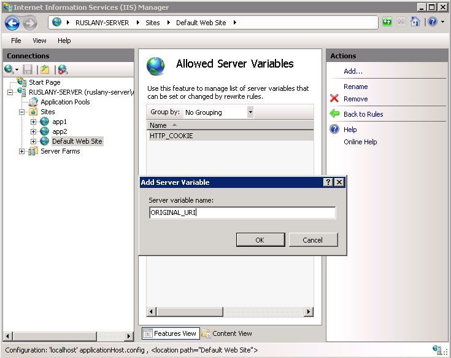

Setting HTTP request headers and IIS server variables
====================
by [Ruslan Yakushev](https://github.com/ruslany)

This section of the documentation applies to the **URL Rewrite Module Version 2.0 for IIS 7**.

This walkthrough will guide you through how to use URL Rewrite Module v 2.0 to set HTTP request headers and IIS server variables.

## Prerequisites

This walkthrough requires the following prerequisites:

1. IIS 7.0 or above with ASP.NET role service enabled
2. URL Rewrite Module 2.0 installed

## Setting up a walkthrough scenario

To demonstrate how to use URL Rewrite Module 2.0 to set HTTP headers and IIS server variables, we will implement a scenario where HTTP Cookie header on the request is set based on the requested URL. For example, assume that you have a web application that serves localized web pages. The web application determines the language for the response based on the HTTP cookie in the request. The problem with this approach is that search engines will not index the localized content of this application, because search engine crawlers do not use HTTP cookies and hence only the content in default language will be served by the web application. To overcome this problem you decide to add information about the language as part of the URL, e.g. `http://www.contoso.com/en-us/default.aspx`, and then use URL Rewrite Module 2.0 to set the cookie that the web application expects in order to determine the language for the response. In addition, you want to set another server variable called **ORIGINAL\_URI** that will contain the originally requested URI string.

To setup the walkthrough scenario copy the following ASP.NET code and put it in the %SystemDrive%\inetpub\wwwroot\ folder in a file called **language.aspx**:

[!code-aspx[Main](setting-http-request-headers-and-iis-server-variables/samples/sample1.aspx)]

After copying this file, browse to `http://localhost/language.aspx` and check that the page was rendered correctly in a browser.

## Creating a rewrite rule

You will create a rewrite rule that rewrites URLs by using the following format:

`http://localhost/<language>/anyfile.aspx`  
will be rewritten as:  
`http://localhost/anyfile.aspx`

The rewrite rule will also set two IIS server variables:

- HTTP\_COOKIE
- ORIGINAL\_URI

You will create a rewrite rule by using URL Rewrite UI in IIS Manager.

Open IIS Manager, choose the "Default Web Site" in the tree view on the left hand side and then open the "URL Rewrite" feature:

### Allowing server variables to be changed

By default, the distributed rewrite rules (i.e. the rules that are defined for specific sites or web applications) cannot set or change any IIS server variable, unless the server variable is added to the "Allowed" list. For this walkthrough you will need to add the following two server variables to the "Allowed Server Variables" list:

- HTTP\_COOKIE
- ORIGINAL\_URI

> [!NOTE]
> the "Allowed Server Variables" list is not applicable to the global rules, which are defined on a server level. It is not necessary to add a server variable to the "Allowed" list if that server variable is set by using a global rewrite rule.

Select the "View Server Variables..." action from the "Actions" pane:

Use the "Add..." action to add the server variables HTTP\_COOKIE and ORIGINAL\_URI to the "Allowed Server Variables" list:

After the "Allowed Server Variables" list has been updated, click "Back to Rules" action to go back to the rules list view.

### Defining the rewrite map

The next step is to define a rewrite map that will be used to map the URL part, representing the language to the locale identifier that will be saved by the rewrite rule into the HTTP cookie header.

Select the "View Rewrite Maps..." action in the "Actions" pane:

Click "Add Rewrite Map..." and specify the name of the map as "Languages":

This map will define mappings between the URL part that represents a language and the locale identifier to be used when setting the HTTP request cookie. Click "Edit Map Settings..." action to specify the default value to use when no mapping can be found. Enter "en\_US" as a default value:

Close the dialog and then use the "Add Mapping Entry..." action to add the following mappings:

| Original Value: | New Value: |
| --- | --- |
| fr-fr | fr\_FR |
| de-de | de\_DE |
| ru-ru | ru\_RU |

### Defining the rewrite rule

Finally, you will create a rewrite rule that sets the server variables by using the rewrite map defined earlier.

Bring up the "Edit Rule" dialog by clicking on the "Add Rules..." action in the main feature view and selecting the "Blank Rule" from the "Inbound Rules" category. Enter the rule configuration as below:

- Rule name: "**set server variables**"
- Requested URL: "**Matches the Pattern**"
- Using: "**Regular Expressions**"
- Pattern: "**^([a-z]{2}-[a-z]{2})/(.\*)**"
- Conditions: 

    - Input: "{Languages:{R:1}"
    - Type: "Matches the Patterns"
    - Pattern: "(.+)"
- Action: 

    - Type: "Rewrite"
    - Rewrite URL: "{R:2}"

The pattern of the rule matches any URL path that contains the language segment (for example "http://www.contoso.com/de-de/default.aspx"). It also captures the language segment and the remainder of the URL path in the rule back-references, so that they can be re-used later in the rule. The rule condition uses the previously captured language segment as a lookup key that is passed to the rewrite map "Languages". The result of the map lookup is stored in the condition back-reference. The rule action rewrites the URL to not contain the language segment.

Expand the "Server Variables..." and specify the values to use for setting the server variables:

- Name: HTTP\_COOKIE, Value: Language={C:1}
- Name: ORIGINAL\_URI, Value: http://{HTTP\_HOST}{REQUEST\_URI}

The HTTP cookie is set by using the condition back-reference, which contains the locale identifier obtained from the "Languages" rewrite map. The value for the ORIGINAL\_URI server variable is built by using {HTTP\_HOST} and {REQUEST\_URI} server variables.

Click "Ok" to close the dialog and then click "Apply" in the "Actions" pane on the right hand side to save the rule.

## Testing the rule

To test that the rule correctly sets the cookie and a server variable, open a Web browser and request the following URL:

`http://localhost/fr-fr/language.aspx`

****

You should see that the rewrite rule has set the "Language" cookie in accordance to the URL that was requested. Also, the original URL string has been made accessible for the ASP.NET page via "ORIGINAL\_URI" server variable.
  
  
[Discuss in IIS Forums](https://forums.iis.net/1152.aspx)