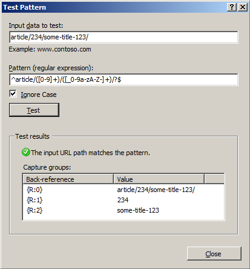

Testing Rewrite Rule Patterns
====================
by [Ruslan Yakushev](https://github.com/ruslany)

URL Rewrite Module UI for IIS 7 and above includes a tool that can be used to test the regular expression and wildcard patterns used within rewrite rules and conditions. With this tool you can very quickly verify the correctness of the pattern; you can check how the pattern is applied to various input strings and what values are stored in back-references. Also, this tool can be used as a first step in troubleshooting of rewrite rules, by checking if the problematic URL matches the rule patterns correctly. This article explains how to use the "Test Pattern" tool.

## Launching the "Test pattern" dialog

The "Test pattern" tool can be used to test rule pattern and condition patterns. To test rule patterns open URL Rewrite Module UI and select a rule in the rules list and click on "Edit...":

Then click on the "Test pattern..." button in the "Edit Rule" page:

To test condition pattern, select a condition in the conditions list view and then click "**Edit...**". In the "Edit Condition" dialog click on "**Test pattern...**" button:

## Using "Test pattern" tool

In the "Test Pattern" dialog, enter a string that you want to match against the pattern. Click on "Test" button:

The results of the pattern match and the list of rule back-references will be displayed. Similarly, if you use "Test pattern" tool for testing of patterns used in conditions, the results will show the list of condition back-references:

Note that you can make changes to the pattern, while within "Test Pattern" dialog. If you've made any changes to the pattern, when you click on "Close" button you can choose whether to preserve or ignore the changes to the pattern.

## Summary

The "Test pattern" tool provide a simple way for testing regular expression and wildcard patterns used in rewrite rules and conditions. The tool can be used to test and adjust patterns as well as to troubleshoot rewrite rules with incorrect patterns.
  
  
[Discuss in IIS Forums](https://forums.iis.net/1152.aspx)