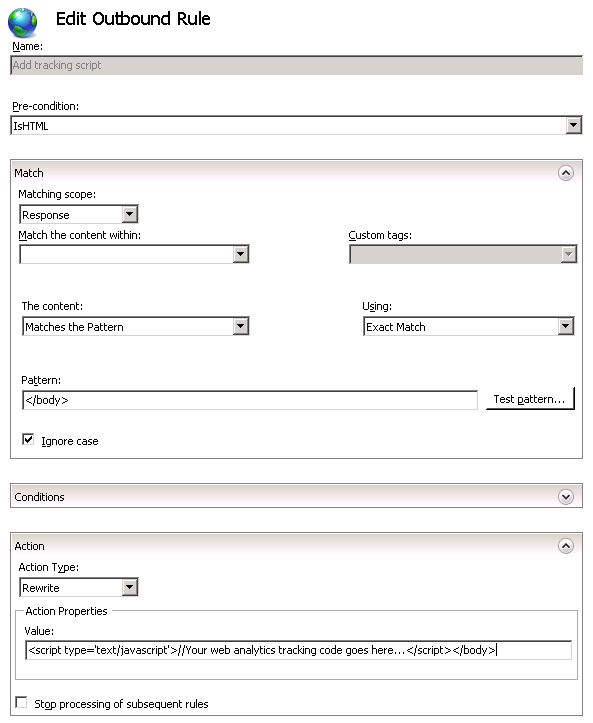

Using Outbound Rules to add Web Analytics tracking code
====================
by [Ruslan Yakushev](https://github.com/ruslany)

This section of the documentation applies to the **URL Rewrite Module Version 2.0 for IIS 7**.

This walkthrough will guide you through how to create an IIS outbound rewrite rule that inserts Web analytics tracking script into Web pages.

## Prerequisites

To run this walkthrough, you must have the following:

1. URL Rewrite Module 2.0 RCrelease installed.

## Introduction

The purpose of a Web analytics service is to provide Web site publishers with statistical information about visitors to their sites. This information helps site publishers optimize the content, advertisements, and service offerings in order to increase customer satisfaction and ROI. Typically, online Web analytics services such as Google Analytics or Omniture work by collecting data about Web site visitors. When site owners request reports, the Web analytics provider processes this data and presents it to site owners in a convenient, easy-to-understand format. In order to enable the data collection required for analytics, Web site owners must instrument all the pages on a Web site with a tracking script that is issued by the Web analytics service provider

In some cases, the addition of tracking code to the Web pages is a simple task. However, in many cases it might be necessary to manually add the script to numerous Web pages. In those cases, the Web analytics instrumentation becomes an expensive and time-consuming task. The response rewriting capability in URL rewrite module version 2 can help in those situations by executing the outbound rules that change the response content on the fly.

## Creating an Outbound Rewrite Rule

To begin, you will create an outbound rewrite rule that adds a JavaScript code snippet into the HTML response. The code snippet is inserted immediately before the closing &lt;/body&gt; tag, as in the following illustration

[!code-html[Main](using-outbound-rules-to-add-web-analytics-tracking-code/samples/sample1.html)]

 **WARNING:** In this particular example the JavaScript code is assumed to be from a trusted source and it should be inserted into the HTML page as is. In many other cases when response headers or the response content is modified by an outbound rewrite rule an extra caution should be taken to ensure that the text which gets inserted into the response does not contain any client side executable code, which can result in cross-site scripting vulnerabilities. This is especially important when rewrite rule uses un-trusted data, such as HTTP headers or the query string, to build the string that will be inserted into the HTTP response. In such cases the replacement string should be HTML encoded by using the **HtmlEncode** function, e.g:

[!code-xml[Main](using-outbound-rules-to-add-web-analytics-tracking-code/samples/sample2.xml)]

**To create the outbound rule:** 

1. Open IIS Manager
2. Select "Default Web Site"
3. In the Feature View select "URL Rewrite Module"  
    
4. In the Actions pane on the right hand side click on "**Add Rules...**". In the "Add Rules" dialog select the "Blank Rule" under the "Outbound rules" category and click OK.  
    

Now you must define the actual outbound rule. In the URL Rewrite Module 2.0, an outbound rewrite rule is defined by specifying the following information:

- Name of the rule.
- An optional precondition that controls whether this rule should be applied to a response.
- The pattern to use for matching the string in the response.
- An optional set of conditions.
- The action to perform if a pattern is matched and all condition checks succeeded.

### Naming the rule

In the "Name" text box enter a name that will uniquely identify the rule, for example: "Add tracking script".

### Defining a Precondition

A precondition is used to evaluate whether the outbound rules evaluation should be performed on a response. For example if a rule that modifies HTML content, only HTTP responses with content-type header set to "text/html" should be evaluated against this rule. Outbound rules evaluation and content rewriting is a CPU intensive operation that may negatively affect the performance of a web application. Therefore, use preconditions to narrow down the cases when outbound rules are applied.

Because the rule that you are creating should be applied only on HTML responses, you will define a precondition that checks whether the HTTP response header **content-type** is equial to "text/html".

**To define a precondition:** 

1. In the Pre-conditions list, select "&lt;Create New Pre-condition...&gt;".
2. This will bring you to the Pre-condition editor dialog, where you will need to define the precondition. Specify the precondition settings as follows: 

    - Name: "**IsHTML**"
    - Using: "**Regular Expressions**"
    - Click "Add" to bring up the "Add condition" dialog. In this dialog specify: 

        - Condition input: "**{RESPONSE\_CONTENT\_TYPE}**"
        - Check if input string: "**Matches the pattern**"
        - Pattern: "**^text/html**"
  
        
3. Click OK to save the precondition and to return to the "Edit Rule" page.

### Defining a matching scope

The outbound rewrite rule can operate on the content of an HTTP header or on the response body content. This rule needs to modify the response content so in the "Matching Scope" drop-down list choose "Response".

### Defining a pattern

In the "Using:" drop down list, choose "**Exact match**" option.

In the "Pattern" text box enter the following string:

[!code-xml[Main](using-outbound-rules-to-add-web-analytics-tracking-code/samples/sample3.xml)]

### Defining an action

Choose the "Rewrite" action type that is listed in the "Action" group box. In the "Value" text box, enter the following string:

[!code-html[Main](using-outbound-rules-to-add-web-analytics-tracking-code/samples/sample4.html)]

This string specifies the new value that will be used as a replacement for the matched string within a response. In this particular case the string "&lt;/body&gt;" will be replaced with the JavaScript code snippet followed by the closing HTML body tag.

Leave default values for all other settings. The "Edit Rule" property page should look like the following page:

Save the rule by clicking on "Apply" action on the right hand side.

### Viewing the rewrite rule in configuration file

The rewrite rules are stored either in aplicationHost.config file or in web.config files. To check the configuration of the rule that we have just created, open a web.config file located in %SystemDrive%\inetput\wwwroot\. In this file you should see the **&lt;rewrite&gt;** section that contains all the rules definitions:

[!code-xml[Main](using-outbound-rules-to-add-web-analytics-tracking-code/samples/sample5.xml)]

### Testing the rule

To test that the rule correctly adds a JavaScript code to the web page, request this URL `http://localhost/iisstart.htm`.

Once you get a response from the server, open the actual HTML source code (if using Internet Explorer 8 then go to Page --&gt; View Source). The response HTML will contain the JavaScript code before the closing HTML body tag:

## Summary

In this walkthrough you have learned how to use outbound rules in URL rewrite module version 2 to modify the content of the HTTP response on the fly. This capability is very useful when you need to perform minor modifications to HTTP responses generated by Web applications, but you do not have control of the application or it is not practical to make large-scale changes to the application.
  
  
[Discuss in IIS Forums](https://forums.iis.net/1152.aspx)