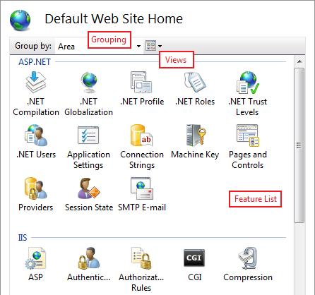

Getting Started with the IIS Manager in IIS
====================
by IIS Team, [Tobin Titus](https://github.com/tobint)

### Compatibility

| Version | Notes |
| --- | --- |
| IIS 7.0 and later | The features described in this article were introduced in IIS 7.0. |
| IIS 6.0 and earlier | The features described in this article were not supported prior to IIS 7.0. |

## Introduction

IIS 7.0 and later have a new user interface from previous versions of IIS: the IIS Manager. This article describes the look and feel, feature delegation, interaction with configuration, and remoting. Note that some versions of IIS may not have some of the functionality/features discussed in this document.

**Why did it have to change?** Here are a few top reasons:

- **IIS and ASP.NET work together**: IIS 6.0 users right-click on a web site, select "All Properties", and get a dialog with a number of tabs for different settings. With IIS 7.0 and above, IIS Manager needed to show configuration for new features like Output Caching, [Failed Request Tracing](../../troubleshoot/using-failed-request-tracing/troubleshooting-failed-requests-using-tracing-in-iis.md), and [Request Filtering](../../manage/configuring-security/use-request-filtering.md), as well as configuration for ASP.NET and relevant portions of the .NET Framework. The new functionality would have required many more of new tabs, an unacceptable option.
- **Delegated Administration**: Moving our configuration from the metabase to the .NET configuration system means that users can, if permitted, set IIS configuration in web.config files. For example, configuration for an application [http://www.contoso.com/sales](http://www.contoso.com/sales) can be written to the root config file applicationHost.config, to the site [http://www.contoso.com/](http://www.contoso.com/) web.config file, or directly to the application's web.config file. The new IIS Manager has to: 1) allow an administrator to control the configuration permitted in web.config files, 2) show the administrator/user where configuration is being written. The older IIS Manager was not up to these challenges.
- **Engineering Reasons**: Software has a shelf life. Time brings new technologies, new requirements, new conventions, and there comes a point where updating existing software becomes more labour intensive and costly that rebuilding the software. IIS Manager was approaching the end of its shelf life.

**Anything else to know?** Once we decided to rewrite IIS Manager, we took the opportunity to improve in a number of key ways:

- **Extensibility**: Extending the IIS 6.0 version of IIS Manager was prohibitively difficult. The new IIS Manager makes it much easier to add feature pages, treeview nodes, and menu items; all using managed code and WinForms. New IIS Manager extensions are automatically detected and downloaded by remote IIS Manager clients connecting to the server.
- **Remote Administration**: Remote administration is all done over HTTPS, making it firewall friendly and easier to manage. The Web Management Service (WMSVC) is the optionally installable component that enables remote administration.
- **New Look and Feel**: The IIS Manager needed a more scalable model for exposing settings, and the resulting feature list view resembles the Control Panel. A list view can be sorted, grouped, and viewed in different ways, all making it easier to find what you're looking for. IIS Manager navigation has also taken on a more browser-like feel with an address bar a la Windows Explorer.

> [!NOTE]
> This document was written for Windows Server 2008. Windows Vista® may not have some of the functionality/features discussed in this document.

## New Look and Feel

Internet Information Services (IIS) Manager has had Back/Forward type navigation in past releases, and the new IIS Manager takes this even farther by adding an **address bar** that works like Windows Explorer.

**Figure 1: New IIS Manager**

## Home Page

The Home Page will become very familiar as soon as you start using IIS Manager. The feature list in the middle can be sorted by feature name or description, grouped by area or category, and viewed in different layouts.

**Figure 2: Grouping in IIS Manager**

### Feature Scopes

Server, site, application, virtual directory, and folder nodes in the treeview all show a Home Page with a feature list. Most features appear on Home Pages for all these nodes, but there are exceptions.

These features appear on the **server Home Page** **only** because they are server-wide configuration, data, or information:

- ISAPI and CGI Restrictions
- Certificates (but doesn't appear at all in remote connections)
- Management Service (but doesn't appear at all in remote connections)
- Worker Processes

These features appear **everywhere except the server Home Page** because they are application configuration and they aren't logical at the server level, or because they just work better that way (SSL):

- Membership Users
- Membership Roles
- Profile
- SSL

The features associated with delegation have **special rules** for where they appear:

- Feature Delegation: always appears only for the root node of a connection
- Administrators: appears only for Server, Site and Application nodes

## Feature Page Layouts

There are three types of pages in IIS 
### List Page

List pages contain lists. Most list pages let you group by values in one or more columns. The main list pages, like Sites and Application Pools, let you to filter the list entries by searching in a list column for entries that match a search string.

****

**Figure 3: IIS Manager List Page**

The **Add/Edit/Remove** tasks in the task pane let you manipulate the contents of the list. Feature settings that aren't specific to a list entry, e.g. specifying that custom errors should be overridden by detailed errors for local requests, are generally configured through the **Edit Feature Settings…** task.

**Figure 4: IIS Manager Actions**

### Property Grid

Property grid pages show grids of related properties. The **Display** selector at the top of the property grid lets you choose whether you would like to view friendly property names, the configuration property names, or both. The screenshot below shows both names.

**Figure 5: Property Grids in IIS Manager**

### Dialog

Dialog pages have checkboxes, textboxes and radio buttons, and are generally the most familiar type of page. Use Apply/Cancel in the task pane to save changes.

## Content View

Content View is a read-only display; you can't create, copy, move, or delete files or folders in this view. You can get into Content View by clicking "Content View" in the Features View/Content View switcher at the bottom of the IIS Manager middle pane, or by right-clicking a treeview node and selecting "Switch to Content View".

The only way to **set configuration for a file** is to switch to Content View, select the file, and click "Switch to Features View" in the right-click menu or in the task pane.

**Figure 6: Switch to Features View**

## Feature Delegation

You might be interested in feature delegation if you are a **server administrator** and you are not the primary person providing content on your server, or if you are a **developer** and you want more control over IIS configuration for your application.

IIS **feature delegation** means managing:

- **configuration section locking** to control what configuration can be set in web.config (generally, one IIS configuration section is one IIS module)
- the set of **site and application users that are permitted to use IIS Manager** to view configuration and set configuration for features with unlocked configuration sections

What follows is a cursory explanation of feature delegation in IIS Manager. For an in-depth walk-through, see [How To Manage Feature Delegation](../../manage/remote-administration/configuring-remote-administration-and-feature-delegation-in-iis-7.md).

## Configuration Locking

If a configuration section is "locked" by default, it can only be configured in applicationHost.config. IIS Manager provides a means for server administrators to "unlock" IIS configuration sections. Once a section of configuration is unlocked, it can be set in web.config files by non-administrators.

For example, the "Custom Error Pages" feature in IIS Manager interacts with configuration in the "system.webServer/httpErrors" section. If the server administrator uses IIS Manager or appcmd to unlock the system.web/httpErrors configuration section, the httpErrors section will appear inside a location tag with overrideMode="allow" in applicationHost.config:

[!code-xml[Main](getting-started-with-the-iis-manager-in-iis-7-and-iis-8/samples/sample1.xml)]

OverrideMode="allow" means that it's valid to set configuration for httpErrors in a web.config file:

[!code-xml[Main](getting-started-with-the-iis-manager-in-iis-7-and-iis-8/samples/sample2.xml)]

See the "Server, Site and Application Connections" section below to see how configuration locking affects connections. For in-depth information on configuration locks, see [How To Use Configuration Locking](../planning-for-security/how-to-use-locking-in-iis-configuration.md).

## Site and Application Administrators

Additionally, server administrators can enable **non-administrators to use IIS Manager** to connect to a site or application. Non-administrators that can connect to sites or applications are called "Site Administrators" or "Application Administrators", and they can:

- **Manage unlocked configuration** for their site or application (settings are written into web.config files)
- **View locked configuration settings** without being able to modify them
- **Add other site or application administrators** for their site or application

For information on how to create site and application administrators, see the online documentation [Create Site and Application Administrators for Delegation](https://technet.microsoft.com/library/cc725632(v=ws.10).aspx).

## Server, Site and Application Connections

Only machine administrators can use IIS Manager to connect to a web server. **Server connections** can write to both root configuration files, applicationHost.config and root web.config, and all distributed web.config files. If a configuration section is locked in applicationHost.config, the corresponding feature will be read/write in a server connection because configuration changes are written to applicationHost.config in a location tag.

Machine administrators and designated Site Administrators can connect to web sites. **Site connections can only write to web.config files under the site's root folder**. If a configuration section is locked in applicationHost.config, the corresponding feature will appear read-only in site connections because site connections cannot write configuration to applicationHost.config (even in a location tag). This affects both machine administrators and Site Administrators.

**Figure 7: Configuration Hiearchary in IIS Manager**

Machine administrators, designated Application Administrators, and Site Administrators for the application's parent site, can connect to an application. **Application connections can only write to web.config files under the application's root folder**. If a configuration section is locked in applicationHost.config or the site's web.config file, the corresponding feature will appear read-only in application connections.

For information on how to connect to a server, site or application, see the online documentation on [Managing Connections in IIS 7.0](https://technet.microsoft.com/library/cc753400(v=ws.10).aspx).

## Configuration

Even if you never change configuration locking and never use feature delegation, at some point you're going to wonder how IIS Manager decides where to write configuration. There are two rules that define this behavior:

- ApplicationHost.config vs. root Web.config: if the feature is listed under the ASP.NET area in IIS Manager, server level configuration will be written to the root web.config file for .NET Framework v2.0. If the feature is listed under the IIS area in IIS Manager, server level configuration will be written to applicationHost.config. The only exception to this rule is Forms Authentication, which is in the Authentication feature under the IIS area.
- Locked vs. Unlocked Configuration: All ASP.NET configuration sections, and a few IIS configuration sections, are unlocked by default. For unlocked sections, IIS Manager will write to the site's web.config if the configuration is changed for the site, or an application's configuration if the configuration is changed for an application. Most IIS configuration sections are locked by default. For locked sections, IIS Manager will always write to applicationHost.config even when modifying configuration for sites and applications.

## Status Bar

The status bar shows where IIS Manager will write configuration:

Configuration: '**&lt;config\_file\_object\_path&gt;**' **&lt;config\_file\_name&gt;**, &lt;location path="**&lt;path&gt;**"&gt;

The `<config\_file\_object\_path>` is the path to the configuration file object, for example:

- "localhost": server-level configuration; applicationHost.config for IIS features, root web.config for ASP.NET features.
- "localhost/Default Web Site": the web.config file in the Default Web Site's physical folder
- "localhost/Default Web Site/careers/technical": the web.config file in the physical folder that maps to the URL "/careers/technical" under the Default Web Site

The `<config\_file\_name>` is the name of the target configuration file, for example:

- "applicationHost.config or root Web.config": applicationHost.config for IIS features, root web.config for ASP.NET features
- "web.config": a web.config file in the web namespace

The `<location\_path>` is the location path to the object being configured (for more information on location paths, see [Configuration Overview](../planning-your-iis-architecture/getting-started-with-configuration-in-iis-7-and-above.md)). This portion of the text only appears if the feature's configuration section is locked at a higher level.

## Example: Writing to ApplicationHost.config vs. root Web.config

Compression is an IIS feature, and it appears under IIS if you group/filter the home page feature list by Area. If you've navigated to the server-level Compression page and you disable static compression, IIS Manager will write this configuration into `%windir%\Windows\system32\inetsrv\applicationHost.config`:

[!code-xml[Main](getting-started-with-the-iis-manager-in-iis-7-and-iis-8/samples/sample3.xml)]

.NET Compilation is .NET Framework configuration, and it appears under ASP.NET if you group/filter the home page feature list by Area. If you've navigated to the server-level .NET Compilation page and you set the default language to C#, IIS Manager will add the defaultLanguage attribute to the compilation section in the root web.config file, i.e. `%windir%\Windows\\Microsoft.NET\Framework\v2.0.50727\CONFIG\web.config`:

[!code-xml[Main](getting-started-with-the-iis-manager-in-iis-7-and-iis-8/samples/sample4.xml)]

The status bar for both these situations will read: Configuration: 'localhost' applicationHost.config or root web.config

## Example: Writing to Locked vs. Unlocked Configuration

The IIS "defaultDocument" configuration section is unlocked by default. If you configure the default document for the Default Web Site, IIS Manager will write this configuration to `%windir%\inetpub\wwwroot\web.config`:

[!code-xml[Main](getting-started-with-the-iis-manager-in-iis-7-and-iis-8/samples/sample5.xml)]

The status bar will read: Configuration: 'Default Web Site' web.config

The IIS "httpErrors" configuration section is unlocked by default. If you customize the HTTP 404 response for the Default Web Site, IIS Manager will write this configuration to `%windir%\Windows\system32\inetsrv\applicationHost.config`:

[!code-xml[Main](getting-started-with-the-iis-manager-in-iis-7-and-iis-8/samples/sample6.xml)]

The status bar will read: 'localhost' applicationHost.config or root web.config, &lt;location path="Default Web Site"&gt;

IIS Manager remoting for IIS 6.0, and previous versions of IIS, was through MMC and was always enabled. With IIS 7.0 and above, IIS Manager remoting must be explicitly enabled. All remote management is done over HTTPS and is handled by an IIS component called the Web Management Service (WMSVC). If you want enable remote management of IIS 7.0 and above through IIS Manager, read [How to Enable IIS Manager Remoting](../../manage/remote-administration/configuring-remote-administration-and-feature-delegation-in-iis-7.md).

## Web Management Service (WMSVC)

The Web Management Service (WMSVC) is a stand-alone web server (hostable web core (HWC)) hosted in an NT service. After WMSVC is installed and started, it listens on port 8172 on all unassigned IP addresses. It expects to receive only 4 types of requests, and each is serviced by its own handler:

- Login requests to login.axd
- Code download requests to download.axd
- Management service requests to service.axd
- Ping requests to ping.axd

### Login Requests

IIS Manager sends a login request across the wire to WMSVC to intiate a connection. Authentication is either NTLM or basic, depending on what the user selected when they were asked to provide credentials in the connection dialog.

**Figure 9: Specifying Credentials**

### Code Download Requests

If login is successful, WMSVC returns a list of UI modules for the connection. For example, each IIS Manager page like "Custom Error Pages" corresponds to a module. If there's a module that IIS Manager doesn't have, it will request to download the module binaries (e.g. this would happen if a server administrator installed a new RSA Security product on his production server, but didn't install the product on his desktop machine that he uses to connect to the server).

### Management Service Requests

After the connection is established, the end user interacts with IIS Manager causing management service requests. Management service requests direct module services in WMSVC to read/write configuration, runtime state, and providers on the server.

### Ping Requests

Ping requests are made from within the WMSVC service to the web server (HWC) it hosts. Ping requests are a simple mechanism to ensure the hostable web core continues to be responsive.

**Service Configuration**  
WMSVC has very small set of editable configuration stored in the registry. Each time the service is started, the web configuration files are regenerated in `%windir%\ServiceProfiles\LocalService\AppData\Local\Temp\WMSvc<GUID>\`. The web configuration files cannot be edited, even by administrators.

**Figure 10: Changing Configuration in Registry**

## Security

IIS Manager and Web Management Service (WMSVC) remoting has been through a series of reviews to ensure the functionality is simple and secure. These are a few of the security measures taken:

- **Requires** **SSL** (HTTPS) for all connections to secure data passed between the remote IIS Manager client and WMSVC
- **Runs as Local Service** with a reduced permission set

**Locked down Hostable Web Core (HWC) configuration**, including a minimal set of required modules and carefully crafted request filtering rules.