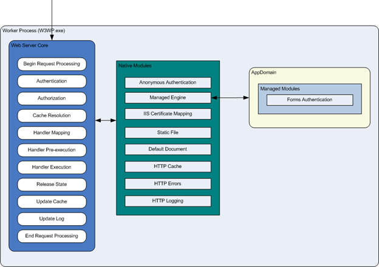

Introduction to IIS Architectures
====================
by IIS Team, Reagan Templin

### Compatibility

| Version | Notes |
| --- | --- |
| IIS 7.0 and later | The features described in this article were introduced in IIS 7.0. |
| IIS 6.0 and earlier | The features described in this article were not supported prior to IIS 7.0. |

## Introduction

Internet Information Services (IIS) 7 and later provide a request-processing architecture which includes:

- The Windows Process Activation Service (WAS), which enables sites to use protocols other than HTTP and HTTPS.
- A Web server engine that can be customized by adding or removing modules.
- Integrated request-processing pipelines from IIS and ASP.NET.

This article describes the components, modules, and request-processing architecture in the following sections:

- [Components in IIS](#Components)
- [Protocol Listeners](#Protocol)
- [Hypertext Transfer Protocol Stack (HTTP.sys)](#Hypertext)
- [World Wide Web Publishing Service (WWW service)](#WWW)
- [Windows Process Activation Service (WAS)](#WAS)
- [Modules in IIS](#IIS)
- [Native Modules](#Native)
- [Managed Modules](#Managed)
- [Request Processing in IIS](#Request)
- [Application Pools in IIS](#Application)
- [HTTP Request Processing in IIS](#HTTP)

## Components in IIS

IIS contains several components that perform important functions for the application and Web server roles in Windows Server® 2008 (IIS 7.0) and Windows Server 2008 R2 (IIS 7.5). Each component has responsibilities, such as listening for requests made to the server, managing processes, and reading configuration files. These components include protocol listeners, such as HTTP.sys, and services, such as World Wide Web Publishing Service (WWW service) and Windows Process Activation Service (WAS).

## Protocol Listeners

Protocol listeners receive protocol-specific requests, send them to IIS for processing, and then return responses to requestors. For example, when a client browser requests a Web page from the Internet, the HTTP listener, HTTP.sys, picks up the request and sends it to IIS for processing. Once IIS processes the request, HTTP.sys returns a response to the client browser.

By default, IIS provides HTTP.sys as the protocol listener that listens for HTTP and HTTPS requests. HTTP.sys was introduced in IIS 6.0 as an HTTP-specific protocol listener for HTTP requests. HTTP.sys remains the HTTP listener in IIS 7 and later, but includes support for Secure Sockets Layer (SSL).

To support services and applications that use protocols other than HTTP and HTTPS, you can use technologies such as Windows Communication Foundation (WCF). WCF has listener adapters that provide the functionality of both a protocol listener and a listener adapter. Listener adapters are covered later in this document. For more information about WCF, see [Windows Communication Foundation](https://go.microsoft.com/fwlink/?LinkId=88604) on MSDN.

## Hypertext Transfer Protocol Stack (HTTP.sys)

The HTTP listener is part of the networking subsystem of Windows operating systems, and it is implemented as a kernel-mode device driver called the HTTP protocol stack (HTTP.sys). HTTP.sys listens for HTTP requests from the network, passes the requests onto IIS for processing, and then returns processed responses to client browsers.

In IIS 6.0, HTTP.sys replaced Windows Sockets API (Winsock), which was a user-mode component used by previous versions of IIS to receive HTTP requests and send HTTP responses. IIS 7 and later continue to rely on HTTP.sys for HTTP requests.

HTTP.sys provides the following benefits:

- Kernel-mode caching. Requests for cached responses are served without switching to user mode.
- Kernel-mode request queuing. Requests cause less overhead in context switching because the kernel forwards requests directly to the correct worker process. If no worker process is available to accept a request, the kernel-mode request queue holds the request until a worker process picks it up.
- Request pre-processing and security filtering.

## World Wide Web Publishing Service (WWW service)

In IIS 7 and later, functionality that was previously handled by the World Wide Web Publishing Service (WWW Service) alone is now split between two services: WWW Service and a new service, Windows Process Activation Service (WAS). These two services run as LocalSystem in the same Svchost.exe process, and share the same binaries.

> [!NOTE]
> You may also see the WWW Service referred to as W3SVC in documentation.

### How WWW Service works in IIS 6.0

In IIS 6.0, WWW Service manages the following main areas in IIS:

- HTTP administration and configuration
- Process management
- Performance monitoring

#### HTTP Administration and Configuration

The WWW Service reads configuration information from the IIS metabase and uses that information to configure and update the HTTP listener, HTTP.sys. In addition, WWW service starts, stops, monitors, and manages worker processes that process HTTP requests.

#### Performance Monitoring

The WWW Service monitors performance and provides performance counters for Web sites and for the IIS cache.

#### Process Management

The WWW Service manages application pools and worker processes, such as starting, stopping, and recycling worker processes. Additionally, the WWW Service monitors the health of the worker processes, and invokes rapid fail detection to stop new processes from starting when several worker processes fail in a configurable amount of time.

### How the WWW Service works in IIS

In IIS, the WWW service no longer manages worker processes. Instead, the WWW Service is the listener adapter for the HTTP listener, HTTP.sys. As the listener adapter, the WWW Service is primarily responsible for configuring HTTP.sys, updating HTTP.sys when configuration changes, and notifying WAS when a request enters the request queue.

Additionally, the WWW Service continues to collect the counters for Web sites. Because performance counters remain part of the WWW Service, they are HTTP specific and do not apply to WAS.

## Windows Process Activation Service (WAS)

In IIS 7 and later, Windows Process Activation Service (WAS) manages application pool configuration and worker processes instead of the WWW Service. This enables you to use the same configuration and process model for HTTP and non-HTTP sites.

Additionally, you can run WAS without the WWW Service if you do not need HTTP functionality. For example, you can manage a Web service through a WCF listener adapter, such as NetTcpActivator, without running the WWW Service if you do not need to listen for HTTP requests in HTTP.sys. For information about WCF listener adapters and about how to host WCF applications in IIS 7 and later by using WAS, see [Hosting in WCF](https://go.microsoft.com/fwlink/?LinkId=81261) on MSDN.

### Configuration Management in WAS

On startup, WAS reads certain information from the ApplicationHost.config file, and passes that information to listener adapters on the server. Listener adapters are components that establish communication between WAS and protocol listeners, such as HTTP.sys. Once listener adapters receive configuration information, they configure their related protocol listeners and prepare the listeners to listen for requests.

In the case of WCF, a listener adapter includes the functionality of a protocol listener. So, a WCF listener adapter, such as NetTcpActivator, is configured based on information from WAS. Once NetTcpActivator is configured, it listens for requests that use the net.tcp protocol. For more information about WCF listener adapters, see [WAS Activation Architecture](https://go.microsoft.com/fwlink/?LinkId=88413) on MSDN.

The following list describes the type of information that WAS reads from configuration:

- Global configuration information
- Protocol configuration information for both HTTP and non-HTTP protocols
- Application pool configuration, such as the process account information
- Site configuration, such as bindings and applications
- Application configuration, such as the enabled protocols and the application pools to which the applications belong

If ApplicationHost.config changes, WAS receives a notification and updates the listener adapters with the new information.

#### Process Management

WAS manages application pools and worker processes for both HTTP and non-HTTP requests. When a protocol listener picks up a client request, WAS determines if a worker process is running or not. If an application pool already has a worker process that is servicing requests, the listener adapter passes the request onto the worker process for processing. If there is no worker process in the application pool, WAS will start a worker process so that the listener adapter can pass the request to it for processing.

> [!NOTE]
> Because WAS manages processes for both HTTP and non-HTTP protocols, you can run applications with different protocols in the same application pool. For example, you can develop an application, such as an XML service, and host it over both HTTP and net.tcp.

## Modules in IIS

IIS provides a new architecture that is different from previous versions of IIS. Instead of keeping the majority of functionality within the server itself, IIS include a Web server engine in which you can add or remove components, called modules, depending on your needs.

Modules are individual features that the server uses to process requests. For example, IIS uses authentication modules to authenticate client credentials, and cache modules to manage cache activity.

The new architecture provides the following advantages over previous versions of IIS:

- You can control which modules you want on the server.
- You can customize a server to a specific role in your environment.
- You can use custom modules to replace existing modules or to introduce new features.

The new architecture also improves security and simplifies administration. By removing unnecessary modules, you reduce the server's attack surface and memory footprint, which is the amount of memory that server worker processes use on the machine. You also eliminate the need to manage features that are unnecessary for your sites and applications.

## Native Modules

The following sections describe the native modules that are available with a full installation of IIS 7 and later. You can remove them or replace them with custom modules, depending on your needs.

### HTTP Modules

Several modules in IIS 7 and later perform tasks specific to Hypertext Transfer Protocol (HTTP) in the request-processing pipeline. HTTP modules include modules to respond to information and inquiries sent in client headers, to return HTTP errors, to redirect requests, and more.

| Module Name | Description | Resource |
| --- | --- | --- |
| CustomErrorModule | Sends default and configured HTTP error messages when an error status code is set on a response. | Inetsrv\Custerr.dll |
| HttpRedirectionModule | Supports configurable redirection for HTTP requests. | Inetsrv\Redirect.dll |
| ProtocolSupportModule | Performs protocol-related actions, such as setting response headers and redirecting headers based on configuration. | Inetsrv\Protsup.dll |
| RequestFilteringModule | Added in IIS 7.5. Filters requests as configured to control protocol and content behavior. | Inetsrv\modrqflt.dll |
| WebDAVModule | Added in IIS 7.5. Allows more secure publishing of content by using HTTP over SSL. | Inetsrv\WebDAV.dll |

### Security Modules

Several modules in IIS perform tasks related to security in the request-processing pipeline. In addition, there are separate modules for each of the authentication schemes, which enable you to select modules for the types of authentication you want on your server. There are also modules that perform URL authorization, and a module that filters requests.

| Module Name | Description | Resource |
| --- | --- | --- |
| AnonymousAuthenticationModule | Performs Anonymous authentication when no other authentication method succeeds. | Inetsrv\Authanon.dll |
| BasicAuthenticationModule | Performs Basic authentication. | Inetsrv\Authbas.dll |
| CertificateMappingAuthenticationModule | Performs Certificate Mapping authentication using Active Directory. | Inetsrv\Authcert.dll |
| DigestAuthenticationModule | Performs Digest authentication. | Inetsrv\Authmd5.dll |
| IISCertificateMappingAuthenticationModule | Performs Certificate Mapping authentication using IIS certificate configuration. | Inetsrv\Authmap.dll |
| RequestFilteringModule | Performs URLScan tasks such as configuring allowed verbs and file name extensions, setting limits, and scanning for bad character sequences. | Inetsrv\Modrqflt.dll |
| UrlAuthorizationModule | Performs URL authorization. | Inetsrv\Urlauthz.dll |
| WindowsAuthenticationModule | Performs NTLM integrated authentication. | Inetsrv\Authsspi.dll |
| IpRestrictionModule | Restricts IPv4 addresses listed in the ipSecurity list in configuration. | Inetsrv\iprestr.dll |

### Content Modules

Several modules in IIS perform tasks related to content in the request-processing pipeline. Content modules include modules to process requests for static files, to return a default page when a client doesn't specify a resource in a request, to list the contents of a directory, and more.

| Module Name | Description | Resource |
| --- | --- | --- |
| CgiModule | Executes Common Gateway Interface (CGI) processes to build response output. | Inetsrv\Cgi.dll |
| DefaultDocumentModule | Attempts to return a default document for requests made to the parent directory. | Inetsrv\Defdoc.dll |
| DirectoryListingModule | Lists the contents of a directory. | Inetsrv\dirlist.dll |
| IsapiModule | Hosts ISAPI extension DLLs. | Inetsrv\Isapi.dll |
| IsapiFilterModule | Supports ISAPI filter DLLs. | Inetsrv\Filter.dll |
| ServerSideIncludeModule | Processes server-side includes code. | Inetsrv\Iis\_ssi.dll |
| StaticFileModule | Serves static files. | Inetsrv\Static.dll |
| FastCgiModule | Supports FastCGI, which provides a high-performance alternative to CGI. | Inetsrv\iisfcgi.dll |

### Compression Modules

Two modules in IIS perform compression in the request-processing pipeline.

| Module Name | Description | Resource |
| --- | --- | --- |
| DynamicCompressionModule | Compresses responses and applies Gzip compression transfer coding to responses. | Inetsrv\Compdyn.dll |
| StaticCompressionModule | Performs pre-compression of static content. | Inetsrv\Compstat.dll |

### Caching Modules

Several modules in IIS perform tasks related to caching in the request-processing pipeline. Caching improves the performance of your Web sites and Web applications by storing processed information, such as Web pages, in memory on the server, and then reusing that information in subsequent requests for the same resource.

| Module Name | Description | Resource |
| --- | --- | --- |
| FileCacheModule | Provides user mode caching for files and file handles. | Inetsrv\Cachfile.dll |
| HTTPCacheModule | Provides kernel mode and user mode caching in HTTP.sys. | Inetsrv\Cachhttp.dll |
| TokenCacheModule | Provides user mode caching of user name and token pairs for modules that produce Windows user principals. | Inetsrv\Cachtokn.dll |
| UriCacheModule | Provides user mode caching of URL information. | Inetsrv\Cachuri.dll |

### Logging and Diagnostics Modules

Several modules in IIS perform tasks related to logging and diagnostics in the request-processing pipeline. The logging modules support loading of custom modules and passing information to HTTP.sys. The diagnostics modules follow and report events during request processing.

| Module Name | Description | Resource |
| --- | --- | --- |
| CustomLoggingModule | Loads custom logging modules. | Inetsrv\Logcust.dll |
| FailedRequestsTracingModule | Supports the Failed Request Tracing feature. | Inetsrv\Iisfreb.dll |
| HttpLoggingModule | Passes information and processing status to HTTP.sys for logging. | Inetsrv\Loghttp.dll |
| RequestMonitorModule | Tracks requests currently executing in worker processes and reports information with Runtime Status and Control Application Programming Interface (RSCA). | Inetsrv\Iisreqs.dll |
| TracingModule | Reports events to Microsoft Event Tracing for Windows (ETW). | Inetsrv\Iisetw.dll |

### Managed Support Modules

A couple of modules in IIS support managed integration in the IIS request-processing pipeline.

| Module Name | Description | Resource |
| --- | --- | --- |
| ManagedEngine | Provides integration of managed code modules in the IIS request-processing pipeline. | Microsoft.NET\Framework\v2.0.50727\webengine.dll |
| ConfigurationValidationModule | Validates configuration issues, such as when an application is running in Integrated mode but has handlers or modules declared in the system.web section. | Inetsrv\validcfg.dll |

## Managed Modules

In addition to native modules, IIS enables you to use managed code modules to extend IIS functionality. Some of the managed modules, such as UrlAuthorization, have a native module counterpart that provides a native alternative to the managed module.

> [!NOTE]
> Managed modules depend on the ManagedEngine module.

The following table lists the managed modules that are available with a full installation of IIS 7 and later. For more information about the managed modules, see the [.NET Framework SDK 2.0](https://go.microsoft.com/fwlink/?LinkId=88414) on MSDN.

| Module Name | Description | Resource |
| --- | --- | --- |
| AnonymousIdentification | Manages anonymous identifiers, which are used by features that support anonymous identification such as ASP.NET profile. | System.Web.Security.AnonymousIdentificationModule |
| DefaultAuthentication | Ensures that an authentication object is present in the context. | System.Web.Security.DefaultAuthenticationModule |
| FileAuthorization | Verifies that a user has permission to access the requested file. | System.Web.Security.FileAuthorizationModule |
| FormsAuthentication | Supports authentication by using Forms authentication. | System.Web.Security.FormsAuthenticationModule |
| OutputCache | Supports output caching. | System.Web.Caching.OutputCacheModule |
| Profile | Manages user profiles by using ASP.NET profile, which stores and retrieves user settings in a data source such as a database. | System.Web.Profile.ProfileModule |
| RoleManager | Manages a RolePrincipal instance for the current user. | System.Web.Security.RoleManagerModule |
| Session | Supports maintaining session state, which enables storage of data specific to a single client within an application on the server. | System.Web.SessionState.SessionStateModule |
| UrlAuthorization | Determines whether the current user is permitted access to the requested URL, based on the user name or the list of roles of which a user is a member. | System.Web.Security.UrlAuthorizationModule |
| UrlMappingsModule | Supports mapping a real URL to a more user-friendly URL. | System.Web.UrlMappingsModule |
| WindowsAuthentication | Sets the identity of the user for an ASP.NET application when Windows authentication is enabled. | System.Web.Security.WindowsAuthenticationModule |

## Request Processing in IIS

In IIS, the IIS and ASP.NET request pipelines combine to process requests with an integrated approach. The new request-processing architecture consists of an ordered list of native and managed modules that perform specific tasks in response to requests.

This design provides several benefits over previous versions of IIS. First, all file types can use features that were originally available only to managed code. For example, you can now use ASP.NET Forms authentication and Uniform Resource Locator (URL) authorization for static files, Active Server Pages (ASP) files, and all other file types in your sites and applications.

Second, this design eliminates the duplication of several features in IIS and ASP.NET. For example, when a client requests a managed file, the server calls the appropriate authentication module in the integrated pipeline to authenticate the client. In previous versions of IIS, this same request would go through an authentication process in both the IIS pipeline and in the ASP.NET pipeline.

Third, you can manage all of the modules in one location, instead of managing some features in IIS and some in the ASP.NET configuration. This simplifies the administration of sites and applications on the server.

## Application Pools in IIS

Application pools separate applications by process boundaries to prevent an application from affecting another application on the server. In IIS 7 and later, application pools continue to use IIS 6.0 worker process isolation mode. In addition, you can now specify a setting that determines how to process requests that involve managed resources: Integrated mode or Classic mode.

> [!NOTE]
> In IIS 6.0, worker process isolation mode and IIS 5.0 isolation mode are set at the server level. This makes it impossible to run both isolation modes on the same server. However, in IIS 7 and later, Integrated mode and Classic mode are set at the application pool level, which enables you to run applications simultaneously in application pools with different process modes on the same server.

### Integrated application pool mode

When an application pool is in Integrated mode, you can take advantage of the integrated request-processing architecture of IIS and ASP.NET. When a worker process in an application pool receives a request, the request passes through an ordered list of events. Each event calls the necessary native and managed modules to process portions of the request and to generate the response.

There are several benefits to running application pools in Integrated mode. First the request-processing models of IIS and ASP.NET are integrated into a unified process model. This model eliminates steps that were previously duplicated in IIS and ASP.NET, such as authentication. Additionally, Integrated mode enables the availability of managed features to all content types.

### Classic application pool mode

When an application pool is in Classic mode, IIS 7 and later handles requests in the same way as in IIS 6.0 worker process isolation mode. ASP.NET requests first go through native processing steps in IIS and are then routed to Aspnet\_isapi.dll for processing of managed code in the managed runtime. Finally, the request is routed back through IIS to send the response.

This separation of the IIS and ASP.NET request-processing models results in duplication of some processing steps, such as authentication and authorization. Additionally, managed code features, such as Forms authentication, are only available to ASP.NET applications or applications for which you have script mapped all requests to be handled by aspnet\_isapi.dll.

Be sure to test your existing applications for compatibility in Integrated mode before upgrading a production environment to IIS 7 and later and assigning applications to application pools in Integrated mode. You should only add an application to an application pool in Classic mode if the application fails to work in Integrated mode. For example, your application might rely on an authentication token passed from IIS to the managed runtime, and, due to the new architecture in IIS 7 and later, the process breaks your application.

## HTTP Request Processing in IIS

IIS 7 and later have a similar HTTP request-processing flow as IIS 6.0. The diagrams in this section provide an overview of an HTTP request in process.

The following list describes the request-processing flow that is shown in Figure 1:

1. When a client browser initiates an HTTP request for a resource on the Web server, HTTP.sys intercepts the request.
2. HTTP.sys contacts WAS to obtain information from the configuration store.
3. WAS requests configuration information from the configuration store, applicationHost.config.
4. The WWW Service receives configuration information, such as application pool and site configuration.
5. The WWW Service uses the configuration information to configure HTTP.sys.
6. WAS starts a worker process for the application pool to which the request was made.
7. The worker process processes the request and returns a response to HTTP.sys.
8. The client receives a response.

**Figure 1: Overview of an HTTP Request**

In a worker process, an HTTP request passes through several ordered steps, called events, in the Web Server Core. At each event, a native module processes part of the request, such as authenticating the user or adding information to the event log. If a request requires a managed module, the native ManagedEngine module creates an AppDomain, where the managed module can perform the necessary processing, such as authenticating a user with Forms authentication. When the request passes through all of the events in the Web Server Core, the response is returned to HTTP.sys. Figure 2, below, shows an HTTP request entering the worker process.

**Figure 2: Detail of a HTTP request inside the Worker Process**

[Discuss in IIS Forums](https://forums.iis.net/default.aspx?GroupID=41)