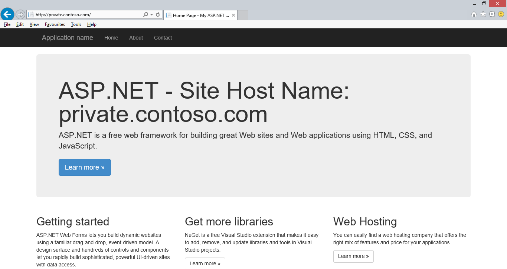
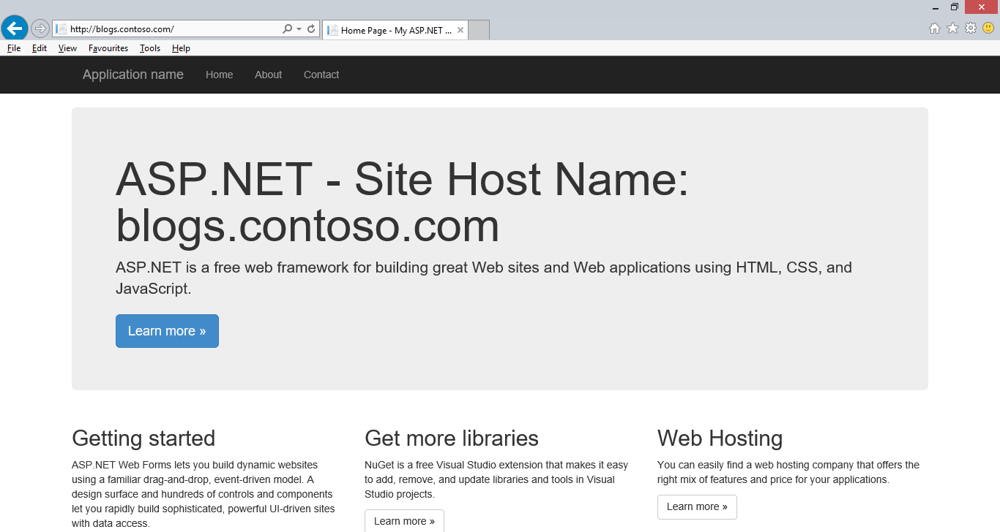

Wildcard Host Header Support
====================
by [Andrew Westgarth](https://github.com/apwestgarth)

### Compatibility

| Version | Notes |
| --- | --- |
| IIS 10.0 | Wildcard Host Header Support was introduced in IIS 10.0 |
| IIS 8.5 and earlier | Wildcard Host Headers were not supported prior to IIS 10.0 |

> [!WARNING]
> Top-level wildcard bindings (`http://*:80/` and `http://+:80`) should **not** be used. Top-level wildcard bindings can open up your app to security vulnerabilities. This applies to both strong and weak wildcards. Use explicit host names rather than wildcards. Subdomain wildcard binding (for example, `*.mysub.com`) doesn't have this security risk if you control the entire parent domain (as opposed to `*.com`, which is vulnerable). See [rfc7230 section-5.4](https://tools.ietf.org/html/rfc7230#section-5.4) for more information.

## Problem

For quite some time, customers have requested that we support Wildcard Host Headers in IIS. IIS 10 now supports Wildcard Host Headers.

## Solution

Wildcard Host Headers enable admins to setup a webserver for a domain, e.g. contoso.com and then have the webserver serve requests for any subdomain. For example the following would all be valid hosts:

- intranet.contoso.com
- private.contoso.com
- blogs.contoso.com

Wildcards are only allowed in the left-most subdomain of the hostname. For example, `http://*.service.contoso.com` is a legal wildcard host binding whereas `http://service.*.contoso.com` is not permissible.

## Step by Step Instructions

### Adding a new site with a Wildcard Host Header

To add a new site with a Wildcard Host Header in IIS you need to follow these simple steps:

1. Open Internet Information Services Manager on the server your site is hosted on: 

    - If you are using Windows Server Technical Preview: 

        1. On the taskbar, click **Server Manager**, click **Tools**, and then click **Internet Information Services (IIS) Manager**.
    - If you are using Windows Technical Preview 

        1. Hold down the **Windows** Key, press the letter **X** and then click **Control Panel**.
        2. Click **Administrative Tools**, and then double-click **Internet Information Services (IIS) Manager**.
2. Select the server on which you wish to create your site, from the list in connections.
3. Click the **"Add Website.."** option in the **Actions Pane**  
    
4. Enter configuration for your site, in the text box for **Host name** enter your **Wildcard Host Header** e.g. \*.contoso.com and click OK.  
    
5. Your new site has been configured with a **Wildcard Host Header**

### Adding a Wildcard Host Header to an Existing Site

To configure and existing site to make use of a Wildcard Host Header in IIS you need to follow these simple steps:

1. Open Internet Information Services Manager on the server your site is hosted on: 

    - If you are using Windows Server Technical Preview: 

        1. On the taskbar, click **Server Manager**, click **Tools**, and then click **Internet Information Services (IIS) Manager**.
    - If you are using Windows Technical Preview 

        1. Hold down the **Windows** Key, press the letter **X** and then click **Control Panel**.
        2. Click **Administrative Tools**, and then double-click **Internet Information Services (IIS) Manager**.
2. Select the server on which your site is deployed, from the list in connections.
3. Select the website (.e.g. Default Web Site) you wish to configure from the list of sites.
4. In the Actions pane select **Bindings:  
    **
5. Select the binding you would like to edit (e.g. http) and click **Edit...**  
    
6. In the text box for **Host name** enter your **Wildcard Host Header** e.g. \*.contoso.com and click OK 
7. Now you can see the Wildcard Host Header value in the list of bindings:  
    
8. Click close to return to IIS Manager.

### Testing a Wildcard Host Header

Once you have configured a Wildcard Host Header you will need to configure DNS for the domain and then you can test traffic to your website. In the below screenshots we have used three different subdomains to route to the site which we configured with a Wildcard Host Header (\*.contoso.com). The demonstration asp.net application we deployed to this site renders the host name requested on the home page.

## Issues

## Summary

IIS 10.0 has added support for Wildcard Host Headers in bindings.
