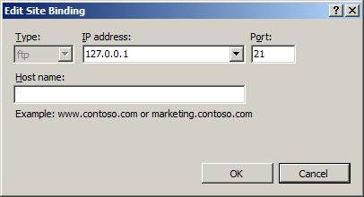
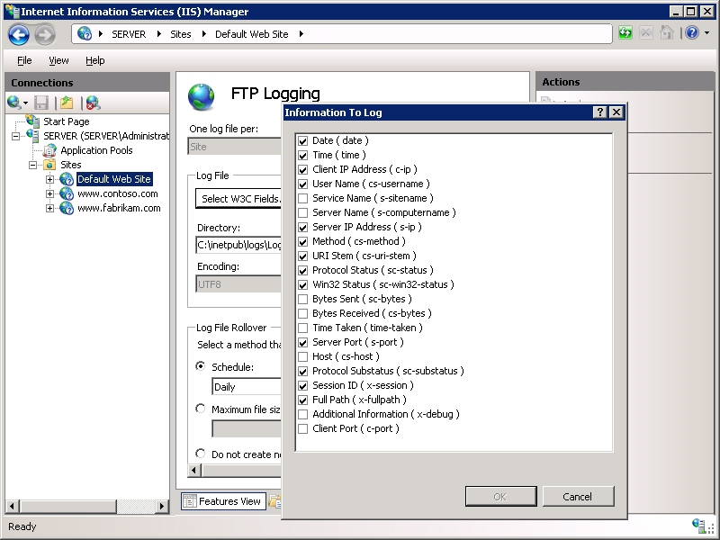

What's New for Microsoft and FTP in IIS 7?
====================
by [Tim Elhajj and R McMurray](https://github.com/rmcmurray)

## Compatibility

| Version | Notes |
| --- | --- |
| IIS 7.5 | The FTP 7.5 service ships as a feature for IIS 7.5 in Windows 7 and Windows Server 2008 R2. |
| IIS 7.0 | The FTP 7.0 and FTP 7.5 services were shipped out-of-band for IIS 7.0, which required downloading and installing the service from the following URL: [https://www.iis.net/download/FTP](https://www.iis.net/downloads/microsoft/ftp). |

## Introduction

Microsoft released an updated FTP service that is available as a separate download for Windows Server® 2008 and above that provides a a robust, secure solution for FTP in a Windows environment. This FTP service was written specifically for Windows Server 2008 and above, and enables Web authors to publish content more easily and securely than before, and offers both Web administrators and hosters better integration, management, authentication and logging features. It should be noted that there are two FTP services available for IIS:

- The new Microsoft FTP service for IIS is provided as a download from the Web for Windows Server 2008.
- The other FTP service ships on the Windows Vista™ and Windows Server 2008 DVD. (This FTP service is essentially the same FTP service from IIS 6.0.)

There are two separate downloadable packages for the new FTP server; you will need to download the appropriate package for your version of Windows Server 2008:

- **32-bit Installation Package**: 

    - [FTP 7.5 for IIS 7.0 (x86)](https://go.microsoft.com/fwlink/?LinkID=143196)
- **64-bit Installation Package**: 

    - [FTP 7.5 for IIS 7.0 (x64)](https://go.microsoft.com/fwlink/?LinkID=143197)

For more information about installing the new FTP service, see the following walkthrough:

- [Installing and Troubleshooting FTP7.5](https://go.microsoft.com/fwlink/?LinkId=88547)

### FTP Service Features

This new FTP service for IIS supports a wide range of features and improvements, and the following list contains several of the improvements in this version:

- **Integration with IIS**:  
 IIS has an updated administration interface and configuration store, and the new FTP service is tightly integrated with this new design. The old IIS 6 metabase is gone, and a new configuration store that is based on the .NET XML-based \*.config format has taken its place. In addition, IIS has an updated administration tool, and the new FTP server plugs seamlessly into that paradigm.
- **Security and support for new Internet standards**:  
 One of the most significant features in the new FTP service is support for FTP over SSL. We also support the use of non-Windows accounts for authentication, making it possible for IT Pros and Developers to create FTP users that do not have Windows user accounts. The new FTP service also supports other Internet improvements such as UTF8 and IPv6.
- **Shared hosting improvements**:  
 By fully integrating into IIS, the new FTP service makes it possible to host FTP and Web content from the same site by simply adding an FTP binding to an existing Web site. In addition, the FTP service now has virtual host name support, making it possible to host multiple FTP sites on the same IP address. The new FTP service also has improved user isolation, now making it possible to isolate users through per-user virtual directories.
- **Improved logging and supportability features**:  
 FTP logging has been enhanced to include all FTP-related traffic, unique tracking for FTP sessions, FTP sub-statuses, additional detail fields in FTP logs, and much more. IIS has the option to display detailed error messages for local users, and the FTP service follows this paradigm by providing detailed error responses when logging on locally to an FTP server. The FTP service also logs detailed information using Event Tracing for Windows (ETW), which provides additional detailed information for troubleshooting.
- **Extensible feature set**:  
 FTP supports extensibility that allows you to extend the built-in functionality that ships with the FTP service. More specifically, there is support for creating your own authentication and authorization providers. You can also create providers for custom FTP logging and for determining the home directory information for your FTP users.

Here is a closer look at each of these new feature areas.

### Integration with IIS

The new FTP service is tightly-integrated with IIS, and adopts the new configuration store that IIS is using. By way of explanation, the metabase from earlier IIS versions has been deprecated, and a new configuration system has taken its place that is based on .NET's \*.config XML files. This new format is much easier to read and configure than the metabase, and the FTP service takes full advantage of this new design. The central configuration store for IIS is applicationHost.config, and all the information for the FTP is kept in this file. IIS also contains a new shared user interface, IIS Manager (pictured below), that is used to manage both Web sites and FTP sites.

What's more, because of the full FTP integration in IIS, the FTP service can be managed from any other IIS management tool or API; for example: AppCmd, Microsoft.Web.Administration, PowerShell, etc.

This version of the FTP service streamlines content publishing by allowing administrators to bind the FTP protocol to an existing Web site, the same as you bind HTTPS to provide SSL. The minimal configuration steps are to add an FTP binding to an existing Web site and then define your FTP settings for authentication and authorization, but a wizard is provided to assist configuring all your FTP settings to enable publishing.

On the first screen of the publishing wizard (pictured below), you configure your SSL settings and binding options, which consist of the IP address, port, and virtual host name.

On the second screen of the publishing wizard (pictured below), you configure your authentication and authorization settings. (Additional authentication and authorization settings can be added later.)

Of course, you do not have to bind the FTP protocol to your Web site. If you want only an FTP site, you can still set up a site that has only FTP bindings.

For more information about adding FTP publishing and FTP sites, see the following walkthroughs:

- [Creating a New FTP Site](https://go.microsoft.com/fwlink/?LinkId=89115)
- [Add FTP publishing to an existing Web site](https://go.microsoft.com/fwlink/?LinkId=89116)

### Security and Support for new Internet standards

The FTP service for IIS supports for emerging Internet standards like IPv6, UTF8, and FTP over SSL. We offer an RFC-based implementation of FTPS (FTP over SSL), and configuration options that allow you to encrypt data on the control channel, on the data channel, or on both channels. Since we have a standards-based implementation of FTPS, we support several third-party FTP clients.

The industry has addressed how to secure FTP traffic in several different ways. Although there no single standard has emerged, there are two similarly named protocols: FTPS and SFTP. To clarify, Microsoft offers an FTP over SSL (FTPS) solution. Microsoft currently does not provide a solution for securing FTP traffic using FTP over SSH (SFTP).

For more information about FTP and SSL, see the following walkthrough:

- [Configure FTP over SSL](https://go.microsoft.com/fwlink/?LinkId=89117)

#### Authentication for Non-Windows Accounts

We have added support for additional authentication methods that enable Web hosters to use non-Windows accounts to authenticate FTP users. The FTP service ships with two such authentication methods:

- Web Manager authentication: these accounts are usually created for managing IIS web sites
- .NET Membership authentication: these accounts are usually used with ASP.NET's forms-based authentication

For more information about using non-Windows authentication with FTP, see the following walkthroughs:

- [Configure IIS Manager Authentication](https://go.microsoft.com/fwlink/?LinkId=100142)
- [Configuring FTP with .NET Membership Authentication](https://go.microsoft.com/fwlink/?LinkId=129533)

### Shared Hosting Improvements

#### FTP Virtual Host Names

In this FTP service we have added virtual host name support to FTP. By using host name support, you can host multiple FTP sites, each with different domain names, on the same IP address.

For more information about using FTP virtual host names, see the following walkthrough:

- [Configure FTP virtual host names](https://go.microsoft.com/fwlink/?LinkId=89119)

#### FTP User Isolation

We have improved support for FTP user isolation configuration. All of the previous FTP user isolation features remain available for backward compatibility, but we have made some changes to the way FTP user isolation works:

- If you enable FTP user isolation with **User name directory (disable global virtual directories)**, users start in a directory that matches the name of their user account when they first logon to the server. In earlier versions of FTP, you had to create a physical directory for each of these accounts. This is no longer necessary; with the new FTP, you can use virtual directories. However, if you use this new isolation option, you can no longer use global virtual directories. This means that to share a folder between multiple FTP users, you must create a virtual directory for each user.

- In earlier versions of FTP, it was possible to use global virtual directories if you used physical directories for users to start in when they first logged on to the server. If you wanted to share content between a number of FTP users, global virtual directories were helpful. We have kept this option, but now it is only available with **User name physical directory (enable global virtual directories)**, and you must create physical directories to use this option.

For more information about configuring FTP user isolation, see the following walkthrough:

- [Configure FTP User Isolation](https://go.microsoft.com/fwlink/?LinkId=89118)

#### FTP Directory Browsing

You can now make virtual directories visible to FTP clients by selecting an option on the improved FTP Directory Browsing page.

You can also configure the directory browsing options to return the available bytes to FTP clients, which is especially useful if you are using Disk Quotas from Windows Server's File System Resource Manager (FSRM). For more information about using this feature with FTP, see the following walkthrough:

- [Using FSRM Folder Quotas with FTP](https://go.microsoft.com/fwlink/?LinkId=100092)

### Improved logging and supportability features

We now offer better logging support, including logging of all verbs and additional detail fields in FTP logs. These new fields include real session stamps, allowing you to parse logs to discover exactly what users were doing throughout a session. We also offer administrators the option to log the full path for requests for files or folders. This is helpful because servers typically only log the name of the file or folder, and this can make large log files difficult to read.

Finally, the new FTP server has provides detailed local error messages and Event Tracing for Windows (ETW). These features simplify troubleshooting and enable hosters to better support their customers.
