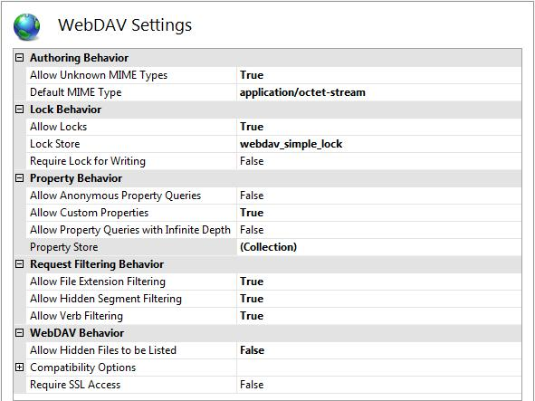

What's New for WebDAV and IIS 7?
====================
by [Robert McMurray](https://github.com/rmcmurray)

## Introduction

### What is WebDAV?

WebDAV is short for Web Distributed Authoring and Versioning, and it is an open-standard extension to the HTTP protocol that enables file management over the Internet. In addition to the usual file system-like operations (copy, move, delete, etc), WebDAV adds a flexible property mechanism (based on name/value pairs) and resource locking. WebDAV is a critical component in Microsoft's web publishing story, used by the WebDAV redirector, Web Folders, SMS/SCCM, and many other components.

Some of Microsoft's new web authoring tools like Expression Web Designer have built-in support for working with WebDAV-enabled sites. With the addition of a first-class WebDAV redirector in Windows Vista and Windows Server® 2008, it is possible to map a drive letter to a web site that is configured to use the WebDAV module, and as such you can open that web site using web authoring tools that do not have built-in WebDAV support like FrontPage 2003 and Visual Studio.

> 

### What's New in the IIS WebDAV Module?

Microsoft has released a brand-new WebDAV implementation for IIS that was written from the ground-up to be more compatible with the WebDAV protocol, more configurable than the WebDAV module for IIS 6.0, and faster than Microsoft's previous versions of WebDAV. This new WebDAV extension module supports a wide range of features and improvements, and the following lists contain several of the improvements in this version.

> [!NOTE]
> This new WebDAV extension module is only for Windows Server 2008 and Internet Information Services 7.0 or above; it will not work on Windows Server 2003 and Internet Information Services 6.0.

> #### Integration with IIS
> 
> - **Integrated Pipeline**: The IIS 6.0 WebDAV implementation was through ISAPI, but the core server required knowledge of the WebDAV ISAPI in order to function correctly. The new IIS native module interface is sufficiently rich that these considerations are unnecessary.
> - **Administration**: IIS has a brand-new administration interface and configuration store, and the new WebDAV extension module is tightly integrated with this new design. The old IIS 6.0 metabase is gone, and a new configuration store that is based on the .NET XML-based \*.config format has taken its place. In addition, IIS has a new administration tool, and the new WebDAV extension module plugs seamlessly into that paradigm.
> 
> > 
> 
> 
> #### WebDAV Configuration
> 
> - **WebDAV-Specific Configuration**: The old WebDAV "overloaded" a number of IIS configuration settings. For example, the standard IIS "directory browsing" setting also controlled directory access via the WebDAV PROPFIND verb. This is a problem for some site administrators who would like to enable PROPFIND access without enabling directory browsing. The new WebDAV implementation leverages the IIS extensible configuration schema and extensible administration tool to decouple these settings and provide more fine-grained control over WebDAV behavior.
> - **Per-Site WebDAV Settings**: WebDAV in IIS 7.0 and above can be enabled at the site-level, unlike IIS 6.0 which enabled WebDAV at the server-level through a Web Service Extension.
> - **Per-URL Security Settings**: The new WebDAV extension module supports per-URL authoring rules, allowing administrators to specify custom WebDAV security settings on a per-URL basis. These authoring rules are separate from the IIS per-URL authorization rules, thereby allowing one set of security settings for normal HTTP requests and a separate set of security settings for WebDAV authoring.
> - **Support for shared and exclusive locks**: The new WebDAV extension supports both shared and exclusive locks to prevent lost updates due to overwrites.
> 
> > 

## Getting Started with WebDAV

### WebDAV Walkthroughs

In order to help get you started working with WebDAV on IIS, Microsoft has written the following walkthroughs:

- [Installing and Configuring WebDAV on IIS 7.0](https://go.microsoft.com/fwlink/?LinkId=105146)
- [How to manage WebDAV using AppCmd](https://go.microsoft.com/fwlink/?LinkId=108319)
- [How to configure WebDAV and Request Filtering](https://go.microsoft.com/fwlink/?LinkId=108321)
- [Migrating FPSE Sites to WebDAV](https://go.microsoft.com/fwlink/?LinkId=108347)
- [How to use custom properties with WebDAV](https://go.microsoft.com/fwlink/?LinkId=108320)
- [How to use WebDAV locks](https://go.microsoft.com/fwlink/?LinkId=141617)

### Community Support

Microsoft provides customer-assisted technical support for WebDAV through the normal channels that are described on the Microsoft [https://support.microsoft.com/](https://support.microsoft.com/) web site.

In addition, Microsoft also provides community support for WebDAV through the following public forums:

- [IIS7 - Publishing](https://forums.iis.net/1045.aspx)

### Changes and Known Issues in WebDAV for IIS 7.0 and Above

> [!NOTE]
> Additional installation notes can be found in the "[Installing and Configuring WebDAV on IIS 7.0](https://go.microsoft.com/fwlink/?LinkId=105146)" document on Microsoft's [https://www.iis.net/](https://www.iis.net/) web site.

The following changes or issues are known for this release:

- IIS can be uninstalled after the new WebDAV extension module has been installed -- this will cause the WebDAV extension to cease working. In addition, if you were to reinstall IIS after this, the WebDAV module would still fail because some of the WebDAV configuration settings would be missing from the IIS applicationHost.config file. Your best solution is to uninstall WebDAV after uninstalling IIS.
- While many Web-based features can be delegated to remote managers and added to web.config files using the new IIS configuration infrastructure, WebDAV extension module features cannot be delegated or stored in web.config files.
- Anonymous PROPFINDs are allowed for file listings, but file uploads and WebDAV-based GET requests require an authenticated user. This is a change from IIS 6.0, where anonymous WebDAV file uploads/downloads could be enabled by opening up your security. In WebDAV for IIS 7.0 and above we changed this behavior so that all WebDAV activity would require authentication, but we allow for the use of anonymous PROPFINDs for backward-compatibility with some WebDAV clients. (More specifically, the PUT, MKCOL, PROPPATCH, COPY, MOVE, DELETE, and WebDAV-based GET requests all require authentication.)
- The new WebDAV module supports a simple property store that uses a separate file that allows you to easily copy your properties between servers. (In IIS 6.0, properties were stored in an NTFS alternate data stream, making it difficult to copy your properties between disparate file systems.)
  
  
[Discuss in IIS Forums](https://forums.iis.net/1045.aspx)