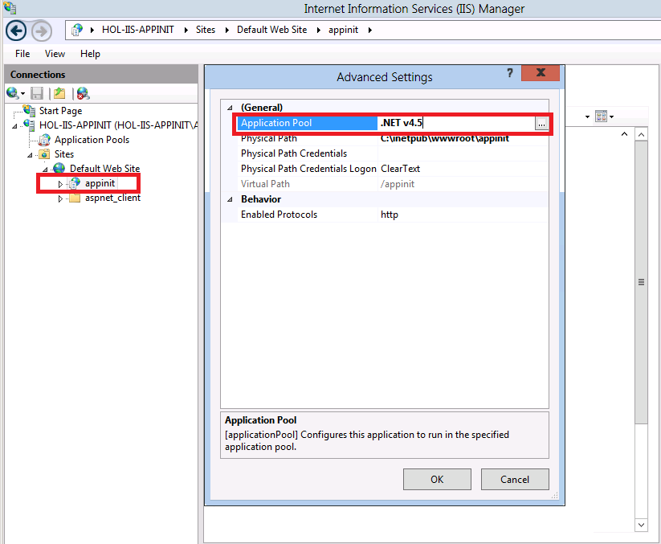

# IIS 8.0 Application Initialization

by [Shaun Eagan](https://github.com/shauneagan)

## Compatibility

| Version | Notes |
| --- | --- |
| IIS 8.0 | Application Initialization was built-in for IIS 8.0. |
| IIS 7.5 | Application Initialization was released as an [out-of-band module for IIS 7.5](https://www.iis.net/downloads/microsoft/application-initialization). |
| IIS 7.0 | Application Initialization was not supported for IIS 7.0. |

## Problem

A common problem faced by website administrators is the need to perform initialization tasks and "warm up" tasks for a web application. Larger and more complex web applications may need to perform lengthy startup processing, prime in-memory caches, generate content, etc... prior to serving the first HTTP request.

## Solution

The IIS 8.0 Application Initialization feature enables website administrators to configure IIS 8.0 to proactively perform initialization tasks for one or more web applications. While an application is being initialized, IIS 8.0 can also be configured to return static content as a placeholder or "splash page" until an application has completed its initialization tasks.

The Application Initialization feature is configured through a combination of global and application-specific rules that tell IIS 8.0 how and when to initialize web applications. The Application Initialization feature also supports integration with the IIS Url Rewrite Module to support more complex handling of placeholder content while an application is still initializing.

> [!NOTE]
> There are known incompatibilities between Application Initialization and Application Request Routing (ARR). It is not recommended to use Application Initialization on machines with ARR installed.

## Step by Step Instructions

### Prerequisites

The Application Initialization feature requires IIS 8.0 to be installed. In addition, the Application Initialization feature within the IIS "Application Development" sub-feature needs to be installed.

The following screenshot from the Windows Server 2012 Server Manager UI shows the Application Initialization feature.

> [!NOTE]
> This walkthrough also uses an ASP.NET 4.5 application to demonstrate the Application Initialization feature. The Appendix at the end of this document includes the sample application and instructions on setting up the application on your machine.

#### Workarounds for known bugs

- There are no known bugs for this feature at this time.

### Global Application Initialization

The Application Initialization feature can be configured in two places: the machine-wide applicationHost.config file, and the application-level web.config file. Configuration in the applicationHost.config file contains "global" application initialization settings, while an application-level web.config file contains "local" application initialization settings.

In this walkthrough, you will configure a sample application to always be initialized when the application pool associated with the application starts up. Since application pool behaviors can only be configured in applicationHost.config, running application initialization whenever an application pool starts up is considered part of the "global" application initialization settings.

#### Modifications in applicationHost.config

Open up the applicationHost.config file located at `%WINDIR%\system32\inetsrv\config` in Notepad. (Remember to run the text editor with the "Run as Administrator" option!)

Find the &lt;applicationPools&gt; configuration section, and then look for the application pool entry with a name of ".NET v4.5".

Modify the application pool entry so that the application pool is always running. For applications where you want global application initialization to occur, you normally want the associated application pool to be started and running. The bolded attribute in the configuration snippet shows what to add to the configuration entry.

[!code-xml[Main](iis-80-application-initialization/samples/sample1.xml)]

Scroll down a little more in applicationHost.config to the `<sites>` configuration element. Within that section there will be an `<application>` entry for the sample application (see the Appendix for instructions on creating the sample application on your machine). The application is called "appinit", and has a path attribute value of "/appinit". Modify the `<application>` entry by adding the bolded **preloadEnabled** attribute as shown in the configuration snippet and then save your changes.

[!code-xml[Main](iis-80-application-initialization/samples/sample2.xml)]

Setting **preloadEnabled** to "true" tells IIS 8.0 that it sends a "fake" request to the application when the associated application pool starts up. That is why in the previous step we set the application pool's **startMode** to "AlwaysRunning".

With the combination of the application pool always running, and the application itself being marked to always receive a fake request, whenever the machine restarts and/or the World Wide Web service is recycled, IIS 8.0 ensures that the application pool instance is running and that the application "/appinit" is always sent a fake request to trigger the application to start up.

#### Modifications in the application's web.config

Using a second instance of Notepad, open up the application level web.config file located in the following location. (Remember to run the text editor with the "Run as Administrator" option!)

[!code-console[Main](iis-80-application-initialization/samples/sample3.cmd)]

Note: Change the drive letter if your Default Web Site is installed on a different physical drive.

The web.config file has a few configuration sections already pre-populated, but commented out. Uncomment the configuration snippet shown that is inside of the `<system.webServer>` configuration section. This snippet is just below the comment "Exercise 1 - Step 1" in the web.config file. Then save your changes.

[!code-xml[Main](iis-80-application-initialization/samples/sample4.xml)]

The **applicationInitialization** element tells IIS that it should issue a request to the application's root Url ("/default.aspx" in this example) in order to initialize the application. While IIS waits for the request to "/default.aspx to complete, it will serve "Startup.htm" to any active browser clients. "Startup.htm" is the "splash page" for the application.

#### Run the application

From an *elevated* command prompt window, recycle the World Wide Web Service with the command shown below:

[!code-console[Main](iis-80-application-initialization/samples/sample5.cmd)]

Remember to run the command prompt window using the "Run as Administrator" option!

Using Internet Explorer, navigate to the following Url:

`http://localhost/appinit/default.aspx`

The browser returns the static "Startup.htm" page with a grey background for the first few seconds because that is the "splash page" that has been configured in web.config. You can continue refreshing the page in your web browser and observe that about eight seconds later (simulated with a thread sleep in the sample application's global.asax) you receive the "real" content for default.aspx with a white background. This indicates that application initialization completed.

#### Configuring overlapped process recycling

IIS 8.0 integrates global application initialization with overlapped process recycling by performing application initialization in an overlapped process in the background. When IIS detects that an active worker process is being recycled, IIS does not switch active traffic over to the new recycled worker process until the new worker process finishes running all application initialization Urls in the new process. This ensures that customers browsing your website don't see application initialization pages once an application is live and running.

Go back to the instance of Notepad that has applicationHost.config. Modify the application pool entry for ".NET v4.5" to look like the configuration snippet shown below:

[!code-xml[Main](iis-80-application-initialization/samples/sample6.xml)]

Remember to save your changes!

The &lt;recycling&gt; element tells IIS to recycle the worker process every 30 HTTP requests.

#### Run the application a second time

From an *elevated* command prompt window, recycle the World Wide Web Service with the command shown below:

[!code-console[Main](iis-80-application-initialization/samples/sample7.cmd)]

Using a new instance of Internet Explorer, once again navigate to:

`http://localhost/appinit/default.aspx`

Note that the "Startup.htm" splash page with the grey background is showing.

Next, pull up Task Manager and make sure the **Processes** tab is showing. Sort the process list by name until you see one instance of w3wp.exe running. That instance is the worker process that is currently running the "appinit" ASP.NET application.

Refresh the browser a few times until the content from the real default.aspx page is being returned. You know that the application is running the "real" default.aspx page when the background changes to white. Next, arrange the windows on your screen so that you can see both Task Manager and the browser.

Now switch back to the browser and refresh the page at least 30 times, this causes IIS to recycle the application pool. You can stop refreshing the page when you see a second instance of w3wp.exe show up in the Task Manager process list as shown below:

The screenshot shows the second instance of w3wp.exe has started due to the process recycling limit set earlier.

You can continue to periodically refresh the browser window for the next ten seconds or so. Note that default.aspx continues to run. When the overlapped recycling completes, one w3wp.exe instance disappears from the Task Manager Process window.

Throughout the duration of the overlapped recycling, you continue to see the content of the "real" default.aspx served, even though application initialization was configured for the application and was running the initialization Url in the background in the new instance of w3wp.exe.

### Url Rewrite and Application Initialization

By default, application initialization only enables you to specify a single "splash page" Url to display while an application is initializing. However the Application Initialization feature supports a few server variables that can be used to control request processing while an application initializes. This enables you to create declarative rules using the Url Rewrite Module containing more complex mappings to pre-generated static content.

In this walkthrough, you replace the **remapManagedRequestsTo** attribute with a set of Url Rewrite rules that accomplish the same end result.

Note: See the appendix for instructions about installing URL Rewrite.

#### Modifications in applicationHost.config

Using the instance of Notepad that has applicationHost.config open, revert both the application pool and the application elements to turn off all global application initialization processing. The global settings are removed in this step since the remainder of this walkthrough focuses on the configured Application Initialization behavior.

The applicationHost.config entries for the application pool and the application are as shown below.

Application pool configuration entry:

[!code-xml[Main](iis-80-application-initialization/samples/sample8.xml)]

Application configuration entry:

[!code-xml[Main](iis-80-application-initialization/samples/sample9.xml)]

Remember to save your changes when you are done!

Also, to ensure the changes take effect in IIS, from an *elevated* command prompt window, recycle the World Wide Web Service with the command shown below:

[!code-console[Main](iis-80-application-initialization/samples/sample10.cmd)]

#### Modifications to application level web.config

Using the instance of Notepad that has the application-level web.config open, remove the **remapManagedRequestsTo** attribute from the `<applicationInitialization>` element. The `<applicationInitialization>` configuration section should now look like this configuration snippet.

[!code-xml[Main](iis-80-application-initialization/samples/sample11.xml)]

Because the `<applicationInitialization>` element no longer defines a Url to remap requests to, add a set of Url Rewrite rules. Next, add a rewrite rule that explicitly maps requests made to "default.aspx", as well as "/" to route to "Startup.htm". Two rules are needed because the Url Rewrite Module doesn't "know" about how default documents work. Since "/" equates to "default.aspx" in ASP.NET applications, you need two Url Rewrite rules - one rule for each Url variation.

The new rules are shown in bold below. Alternatively you can uncomment the pre-populated Url Rewrite rules under the "Exercise 2 - Step 2 Mapping Requests to the Home Page" comment in the web.config file.

[!code-xml[Main](iis-80-application-initialization/samples/sample12.xml)]

Some items to note about these rules: first, the **stopProcessing** attribute is set to "true" on the &lt;rule /&gt; elements. This is necessary to add a catch-all Url Rewrite rule later, and for requests to default.aspx or "/" that you don't want the catch-all rule to run.

Second, note that we have a Url Rewrite condition in the &lt;conditions /&gt; element. This condition effectively says "only apply rule when the application is in an initializing state". The server variable "APP\_WARMING\_UP" is set by IIS to a value of "1" when application initialization is active and IIS is still processing all of the initialization Urls.

Lastly, note that the action has been defined to rewrite the active request to instead run "Startup.htm". This rule has the effect of telling IIS to pass the request on to the static file handler which then renders the static page Startup.htm.

Next, you add a catch-all rewrite rule. When using the Url Rewrite Module in conjunction with application initialization, a catch-all rule that fires if none of the previous rules match is needed. Add the bolded rule shown below to the rewrite section as the catch-all rule. Alternatively you can uncomment the pre-populated catch-all rule in web.config that is located under the "Exercise 2 - Step 2 Setting Up a Catch-All Rule" comment in the web.config file.

[!code-xml[Main](iis-80-application-initialization/samples/sample13.xml)]

Save your changes when you are done!

The new rule matches against any Url that reaches it and tells IIS to continue processing the request that was made to the inbound Url. The rule also sets a server variable called "SKIP\_MANAGED\_MODULES" to a value of "0" - which equates to "false". This setting tells IIS that it should treat the rewritten request from Url Rewrite the same way as if the request had normally arrived off the wire.

#### Run the application

From an elevated command prompt window, recycle the World Wide Web Service with the command shown below:

[!code-console[Main](iis-80-application-initialization/samples/sample14.cmd)]

Using a new instance of Internet Explorer, once again navigate to:

`http://localhost/appinit/default.aspx`

Even though Url Rewrite rules are now used to define the splash page logic, you still see the same behavior from the first walkthrough. The Startup.htm page with the grey background is displayed initially. If you refresh the browser periodically, about eight seconds later you again see the page background switch to white, indicating that the "real" default.aspx page is being served now that application initialization is complete.

### Complex Splash Page Rules

The previous walkthroughs use application initialization as a straight-forward mapping of Url "X" to Url "Y". In this walkthrough, you are going to implement a more complex application initialization scenario.

In your browser navigate to both of the following Urls:

- `http://localhost/appinit/ImageHandler.ashx?image=Lighthouse`
- `http://localhost/appinit/ImageHandler.ashx?image=Tulips`

These Urls are examples of dynamically generated static content. For this sample application, the code inside of ImageHandler.ashx looks at the querystring key "image". If the value of that querystring is either "Lighthouse" or "Tulips" the ASP.NET handler transmits the corresponding JPG that is located in the App\_Data folder.

Since the image handler is just returning images, you want to be able to continue to return an appropriate image even during application initialization. Although the mechanics of serving these images uses managed code, you may want to quickly serve up pre-generated images to customers even if the underlying ASP.NET application is taking a long time to startup and initialize itself.

#### Modifications to application level web.config

Using the instance of Notepad that has application-level web.config open, add another Url Rewrite rule *before* the final catch-all rule. The new snippet to add is shown below. Alternatively you can uncomment the pre-populated image handler rule in web.config that is located under the "Exercise 3 - Step 1 Complex Splash Page Rules" comment in the web.config file.

[!code-xml[Main](iis-80-application-initialization/samples/sample15.xml)]

Save your changes when you are done.

Just as with the rewrite rules for default.aspx and "/", this rule has the **stopProcessing** attribute set to "true" to ensure that requests to ImageHandler.ashx don't accidentally fallthrough to the final catch-all rewrite rule during application initialization.

For requests to "ImageHandler.ashx," the rewrite rule uses a regular expression capture group to extract the requested image from the query-string. The match pattern definition *pattern="image=([A-Za-z]+)&amp;amp;?"* tells IIS to extract the value of the "image" query-string variable. That value is then used in the url attribute of the action attribute: *url="Images/{C:1}\_static.jpg"*.

The url attribute on the action element tells the Url Rewrite module to rewrite ImageHandler.ashx requests to instead point at files in the Images subdirectory of the application. Furthermore the query-string value that was captured by the regular expression is used to help form the name of the file that will ultimately be served from the Images subdirectory. For example, a request to *ImageHandler.ashx?image=Tulips* will be rewritten to *Images/Tulips\_static.jpg*.

If you browse to the inetpub\wwwroot\appinit directory using Windows Explorer and look in the Images subdirectory, you see two files: one representing the "static" version of Tulips.jpg, and the other representing the "static" version of Lighthouse.jpg. These static images act as pre-generated content that can be served while the application initializes.

#### Run the application

From an elevated command prompt window, recycle the World Wide Web Service with the command shown below:

[!code-console[Main](iis-80-application-initialization/samples/sample16.cmd)]

Using Internet Explorer navigate to either:

`http://localhost/appinit/ImageHandler.ashx?image=Lighthouse`

or

`http://localhost/appinit/ImageHandler.ashx?image=Tulips`

Notice how the images returned in either case include a watermark indicating these are the "static" pre-generated versions of the images. The watermark is text in the upper portion of the image saying "This image is the static version of...."

If you refresh your browser about 10 seconds later, you see the returned image content change to the "real" content being served by the ImageHandler.ashx handler. The watermark disappears, which indicates that the content is now being dynamically generated by the ASP.NET handler since the application has completed initialization.

[Note: If Internet Explorer appears to not be refreshing, click either the "broken document" icon in the address bar or the refresh icon to force Internet Explorer to reload the page.]

## Summary

The IIS 8.0 Application Initialization feature gives developers and administrators the ability to return static content to browsers while IIS is initializing a "cold" application. Serving static content immediately to browsers gives customers a better user experience. Instead of cold-start applications resulting in a blank browser page or a spinning wait icon, the Application Initialization feature can be used to serve relevant static content while the underlying application completes expensive initialization processing.

The initialization process can occur automatically whenever a web server is brought online or recycled. For scenarios where server administrators don't want to greedily initialize applications, the initialization process can instead be triggered on-demand when the first request arrives at a "cold" application.

For both global and local application initialization the Url Rewrite module can be integrated to provide richer and more complex initialization rules. Using Url Rewrite rules integrated with the Application Initialization feature it is possible to serve different types of pre-generated static content for different Urls and virtual paths while IIS continues to start-up an application in the background.

## Appendix - Setting up the Sample ASP.NET Application

Note - the following steps assume your server already has *both* IIS 8.0 installed and ASP.NET 4.5 enabled for use in IIS 8.0.

### Unpack the sample application

The sample ASP.NET application is contained in the following .zip file:

:::image type="icon" source="iis-80-application-initialization/_static/image1.png" :::

Unzip the file to the wwwroot folder on your web server. For example if your web server installed the "Default Web Site" on the C:\ drive, unzip the contents of the file to `c:\inetpub\wwwroot\appinit`.

### Create an application in IIS 8.0

After unzipping the "appinit" sample onto the file system, you need to configure the folder as an ASP.NET application in IIS 8.0. The screenshot below shows the appinit sample application configured as an application in IIS 8.0. Also notice that the application is assigned to the ".NET v4.5" application pool.

### Install the Url Rewrite Module

The sample application makes use of the Url Rewrite module for advanced integration with the Application Initialization feature. You need to install the Url Rewrite module on your server; it can be downloaded from: <https://www.iis.net/downloads/microsoft/url-rewrite>.

### Configure the Url Rewrite Module

Once the Url Rewrite module is installed on your web server, you need to modify the IIS applicationHost.config file to allow usage of the SKIP\_MANAGED\_MODULES server variable supported by the Application Initialization feature.

Open up the machine-wide applicationHost.config file in a text editor such as notepad. For example if you installed the operating system on the C:\ drive, the applicationHost.config file is located at `C:\Windows\System32\inetsrv\config`.

Scroll down the file and locate the security section. This section starts with the Xml element: &lt;security&gt;.

Type in the following Xml elements *before* the &lt;security&gt; element:

[!code-xml[Main](iis-80-application-initialization/samples/sample17.xml)]

Save the changes to the applicationHost.config file.
