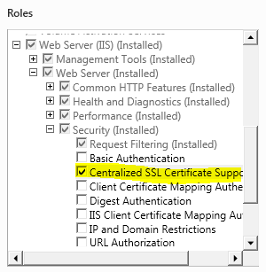
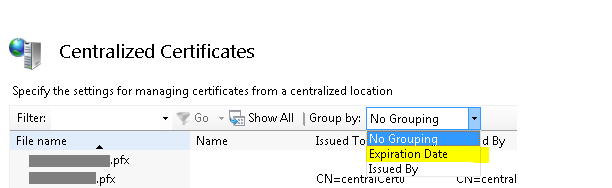
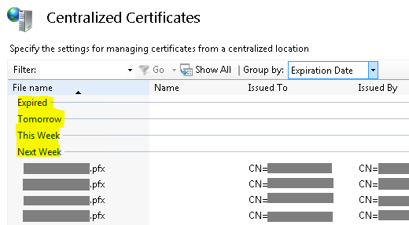
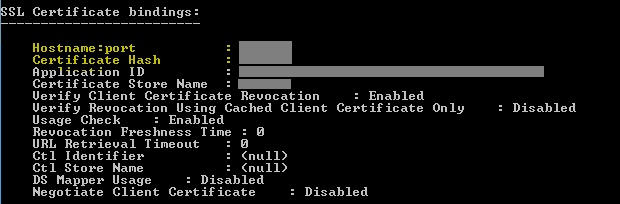

IIS 8.0 Centralized SSL Certificate Support: SSL Scalability and Manageability
====================
by [Shaun Eagan](https://github.com/shauneagan)

### Compatibility

| Version | Notes |
| --- | --- |
| IIS 8.0 | Centralized SSL Certificate Support was introduced in IIS 8.0. |
| IIS 7.5 | Centralized SSL Certificate Support was not supported in IIS 7.5. |
| IIS 7.0 | Centralized SSL Certificate Support was not supported in IIS 7.0. |

## Problem

As more e-commerce sites come on line and more businesses are storing and sharing sensitive documents on line, the ability to host and scale secure sites are increasingly more important. In addition, with cloud hosting and elastic scalability, server capacity must be added and removed dynamically. Prior to Windows Server 2012, there are a couple of challenges when it comes to hosting secure sites:

- **SSL Scalability**: In a multi-tenanted environment, such as a shared hosting, there is a limitation as to how many secure sites can be hosted on Windows Server, resulting in a low site-density.
- **SSL Manageability**: The certificates are stored local to each Windows Server. Therefore, they need to be managed individually on each Windows Server. A simple task such as renewing a certificate must be repeated on every server. In addition, adding a new Windows Server may take hours, if there are thousands of certificates that must be imported.

## Solution

On Windows Server 2012, the Centralized SSL Certificate Support feature allows the server administrators to store and access the certificates centrally on a file share. Similar to Shared Configuration feature introduced in Windows Server 2008, the Windows Servers in a server farm can be configured to load the certificates from the file share on-demand.

With this feature, the management experience of SSL bindings is much simplified. When it comes to SSL, the DNS name and CN name of the certificate must match. Similar contract can be further extended to the file names of the certificates. For example, *www.contoso.com* would use the certificate with a file name *www.contoso.com.pfx*. This contract enables Windows Server 8 to have just one SSL binding, regardless of the number of secure sites that are using this feature. The corresponding certificate is inferred by the SNI value or hostname of the requested web site, and by matching it to the file name of the certificate.

## Step by Step Instructions

#### Prerequisites:

- IIS 8.0 is installed on Windows Server 2012 with Centralized SSL Certificate feature. This feature is an optional component of IIS and is not installed as a part of the default installation. 

    - To install this feature, from **Server Manager**, be sure to select **Centralized SSL Certificate Support** under **Security** node:  
        
- Sample certificates with NULL password. (Or you may have sample certificates with one global password.) 

    - The certificates must have the naming convention of CN\_name.pfx (ie. www.contoso.com.pfx).
    - If the certificate is a wildchar certificate, use "\_" as the wildchar. (ie. \_.contoso.com.pfx).
    - If the certificate has multiple CN names, they must be named as individual files. (ie. www.contoso1.com.pfx, www.contoso2.com.pfx, etc.)
- Two file shares: one for shared configuration and the other for centralized SSL certificates. 

    - The IIS server is using the shared configuration.
    - The sample certificates have been copied to the file share for centralized SSL certificates.
- \windows\system32\drivers\etc\hosts has been modified to be used for sample site and certificate. For example, if CN name of the certificate is centralCert0, then the hosts file must contain: 

    **127.0.0.1 centralCert0**

#### Workarounds for known bugs:

There are no known bugs for this feature at this time.

### Configure the Centralized SSL Certificate Support feature:

1. Open **IIS Manager**.
2. Select server node in the left navigation window:  
    
3. Under **Management**, double-click on **Centralized Certificates**:  
    
4. In the **Actions** pane, select **Edit Feature Settings**:  
    
5. Enter the following information: 

    - **Enable Centralized Certificates**: Selected
    - **Physical** **path**: For example: \\ccdemo\centralcert 

        - This is UNC path to the file share where the certificates are located.
    - **User name**: Specify a user account that has read access to the file share.
    - **Password/Confirm password**.
    - **Certificate Private Key Password**: 

        - This is optional. If the certificates do not have password, leave this empty.
        - If the certificates have one global password, enter that password here.

    
6. Centralized SSL Certificate Support feature is now ready to be used. Note that the IIS Manager reads the certificates and populates the most relevant information about the certificates. This information is cached for better performance.
7. One manageability feature that is noteworthy is the ability to group the certificates by their expiration dates:  
    
8. See how easily it is to be able to see the certificates that: 

    - Expired
    - Expire tomorrow
    - Expire this week
    - Expire next week
    - Expire next month
    - Later

    

### Create a Secure Web Site:

1. Open **IIS Manager**.
2. Select **Sites** in the left navigation window:  
    
3. Select **Add Website**:  
    
4. Fill in the information, as you would create any site: 

    - **Site name**: centralCert0
    - **Physical path**: c:\inetpub\wwwroot
    - **Type**: https
    - **Hostname**: centralcert0 

        - This is new for Windows Server 2012 in that host name can be specified for SSL.
        - The actual value of this configuration varies depending on the sample certificate that is being used.
    - **Require Server Name Indication**: Unselected 

        - You may also choose to select Require Server Name Indication if you choose. Centralized Certificate Store does not require you to use SNI, but it does work properly when using SNI.
        - Note that in the Developer Preview release, Centralized Certificate Store did require using SNI as well. That restriction has been removed as of the Beta release.
    - **Use Centralized Certificate Store**: Selected 

        - Note that there is no need to select a specific corresponding certificate to be used.
        - Through the use of the naming contract, the corresponding certificate is selected automatically. In this example, IIS tries to read centralcert0.pfx from the central SSL certificate file share.

    
5. Verify that the site has been created:  
    
6. That's it. The secure site was created using Centralized SSL Certificate Support. The management experience is very similar to shared configuration and traditional SSL binding. The differences are: 

    - The certificates are stored centrally on a file share.
    - Host name can be specified for SSL site.
    - SSL binding is not managed explicitly 1-to-1.

### Test a Secure Site:

Open a browser and navigate to [https://centralcert0/](https://centralcert0/). Note that as a part of prerequisite, hosts file should are modified to route this request to localhost:

Furthermore, to see the new SSL binding type, enter the following in an elevated command-line window:

[!code-console[Main](iis-80-centralized-ssl-certificate-support-ssl-scalability-and-manageability/samples/sample1.cmd)]

Note that the SSL binding is **hostname:port** with value **\*:443**. In addition, no **certificate** **hash** is associated with this binding because the corresponding certificate is loaded on-demand based on the file name contract of the certificiate.

### Scenarios

Try deploying the following scenarios:

- Centralized SSL Certificate Support is designed to scale for a multi-tenanted environment. Try configuring thousands of secure sites using this feature.
- With thousands of certificates, run the following command on an elevated command-line window. Note that regardless of the number of secure sites, there is simply just one binding: 

    **netsh http show sslcert**
- Try adding a new server in this server farm. Using shared configuration and centralized SSL certificate support feature, this is now a 3 step process: 

    1. Configure the new server to use the shared configuration.
    2. Configure the new server to use the centralized SSL certificate support.
    3. Create the SSL binding. One an elevated command-line window, enter: 

        [!code-unknown[Main](iis-80-centralized-ssl-certificate-support-ssl-scalability-and-manageability/samples/sample-127551-2.unknown)]
- Unlike previous versions of Windows Server, the certificates on Windows Server 2012 are loaded in memory on-demand. After configuring thousands of secure sites using Centralized SSL Certificate Support feature, send a GET request to one of the secure sites and observe the memory usage. It is negligible. On previous versions of Windows Server, if hundreds of secure sites have been configured, sending just one GET request causes the Windows Server to load ***all*** certificates, resulting in a high memory usage, and further limits the scalability.
- Create secure sites with SNI, traditional and Centralized SSL Certificate Support. They are designed to co-exist.

## Summary

You have successfully explored Centralized SSL Certificate feature in Windows Server 2012.
  
  
[Discuss in IIS Forums](https://forums.iis.net/1043.aspx)