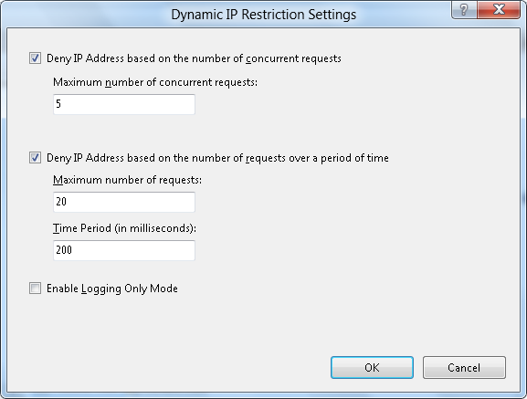
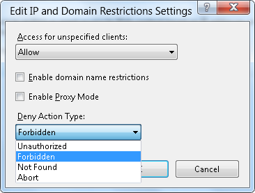

IIS 8.0 Dynamic IP Address Restrictions
====================
by [Robert McMurray](https://github.com/rmcmurray)

### Compatibility

| Version | Notes |
| --- | --- |
| IIS 8.0 | Dynamic IP Address Restrictions built-in for IIS 8.0. |
| IIS 7.5 | Dynamic IP Address Restrictions were available as an [out-of-band module for IIS 7.5](https://www.iis.net/downloads/microsoft/dynamic-ip-restrictions). |
| IIS 7.0 | Dynamic IP Address Restrictions were available as an [out-of-band module for IIS 7.0](https://www.iis.net/downloads/microsoft/dynamic-ip-restrictions). |

## Problem

IIS 7 and earlier versions had built-in functionality that allowed administrators to allow or deny access for individual IP addresses or ranges of IP addresses. When an IP address was blocked, any HTTP clients from that IP address would receive an HTTP error "403.6 Forbidden" reply from the server. This functionality allows administrators to customize the access for their server based on activity that they see in their server's logs or website activity. However, this is a manual process. Even though functionality can be scripted to discover malicious users by examining the IIS log files by using a tool like Microsoft's [LogParser](https://www.microsoft.com/download/details.aspx?id=24659) utility, this still requires manual intervention.

## Solution

In IIS 8.0, Microsoft has expanded the built-in functionality to include several new features:

- Dynamic IP address filtering, which allows administrators to configure their server to block access for IP addresses that exceed the specified number of requests.
- The IP address filtering features now allow administrators to specify the behavior when IIS blocks an IP address, so requests from malicious clients can be aborted by the server instead of returning HTTP 403.6 responses to the client.
- IP filtering now feature a proxy mode, which allows IP addresses to be blocked not only by the client IP that is seen by IIS but also by the values that are received in the x-forwarded-for HTTP header

## Step by Step Instructions

#### Prerequisites:

- Windows Server 2012 machine with IIS 8.0 installed.  
  
    > [!NOTE]
    > The IP and Domain Restrictions feature must be installed as part of IIS.  
  
    

#### Workarounds for known bugs:

There are no known bugs for this feature at this time.

### Configuring IIS to Deny Access based on HTTP Requests

IIS 8.0 can be configured to deny access to websites based on the number of times that an HTTP client accesses the server within a specified time interval, or based on the number of concurrent connections from an HTTP client.

To configure IIS to deny access based on the number of HTTP requests that it receives, use the following steps:

1. Log in as an administrator on your Windows Server 2012 computer.
2. Open the **Internet Information Services (IIS) Manager**.
3. Highlight your server name, website, or folder path in the **Connections** pane, and then double-click **IP Address and Domain Restrictions** in the list of features.  
    
4. Click **Edit Dynamic Restriction Settings** in the **Actions** pane.  
    
5. When the **Dynamic IP Restriction Settings** dialog box appears, check the **Deny IP Address based on the number of concurrent requests** if you want to prevent an HTTP client from establishing too many simultaneous connections. And check the box to **Deny IP Address based on the number of requests over a period of time** if you want to prevent an HTTP client from establishing too many connections within a specific time period.  
    
6. Click **OK**.

### Configuring the Behavior for IIS when Denying IP Addresses

In IIS 7 and earlier versions, IIS would return an HTTP error "403.6 Forbidden" reply from the server when a client IP address was blocked. In IIS 8.0, administrators can configure their server to deny access to IP addresses in several additional ways.

To configure the behavior that IIS will use when denying IP addresses, use the following steps:

1. Log in as an administrator on your Windows Server 2012 computer.
2. Open the **Internet Information Services (IIS) Manager**.
3. Highlight your server name, website, or folder path in the **Connections** pane, and then double-click **IP Address and Domain Restrictions** in the list of features.  
    
4. Click **Edit Feature Settings** in the **Actions** pane.  
    
5. When the **Edit IP and Domain Restriction Settings** dialog box appears, click the **Deny Action Type** drop-down menu and choose the behavior that IIS uses from the following values: 

   - **Unauthorized**: IIS returns an HTTP 401 response.
   - **Forbidden**: IIS returns an HTTP 403 response.
   - **Not Found**: IIS returns an HTTP 404 response.
   - **Abort**: IIS terminates the HTTP connection.

     
6. Click **OK**.

### Configuring IIS for Proxy Mode

One of the challenges to IP filtering is that many clients access IIS through one or more firewalls, load-balancing, or proxy servers; so the IP address may always appear as the server in the request path that is nearest to the IIS server. In IIS 8.0, administrators can configure their server to examine the *x-forwarded-for* HTTP header in addition to the client IP address in order to determine which requests to block. This behavior is called "Proxy Mode."

To configure IIS for proxy mode, use the following steps:

1. Log in as an administrator on your Windows Server 2012 computer.
2. Open the **Internet Information Services (IIS) Manager**.
3. Highlight your server name, website, or folder path in the **Connections** pane, and then double-click **IP Address and Domain Restrictions** in the list of features.  
    
4. Click **Edit Feature Settings** in the **Actions** pane.  
    
5. When the **Edit IP and Domain Restriction Settings** dialog box appears, check the box to **Enable Proxy Mode**.  
    
6. Click **OK**.

## Summary

In this guide, you looked at configuring IIS to dynamically deny access to your server based on the number of requests from a client IP address, as well as configuring the behavior that IIS will use when it denies access to potentially malicious users.