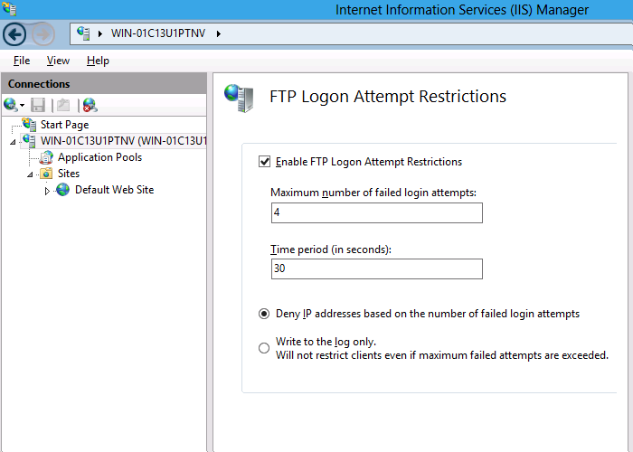

IIS 8.0 FTP Logon Attempt Restrictions
====================
by [Robert McMurray](https://github.com/rmcmurray)

### Compatibility

| Version | Notes |
| --- | --- |
| IIS 8.0 | FTP Logon Attempt Restrictions were introduced in IIS 8.0. |
| IIS 7.5 | FTP Logon Attempt Restrictions were not supported in IIS 7.0 or IIS 7.5. |
| IIS 7.0 |

## Problem

One possible vulnerability for a server is a brute-force password attack via the FTP service. Since the accounts that are used for FTP are often physical user accounts on the host operating system, it is theoretically possible to guess the administrative user name once you have determined the FTP server type. Once an account name has been discovered, a malicious client can connect to a server and attempt a brute-force attack on that account. (For example: "administrator" for Windows systems or "root" for UNIX systems.)

In IIS 7.5, the FTP service introduced extensibility APIs that allowed developers to create custom authentication providers, which allows non-Windows accounts access to FTP. This significantly reduces the surface attack area for the FTP service, because these FTP accounts are not valid Windows accounts, and therefore have no access to resources outside of the FTP service. By using the FTP authentication extensibility features in IIS 7.5, Microsoft provided a way for administrators to reduce the possibility of brute-force attacks for non-Windows accounts by creating a custom authentication provider. This information is documented in the following article:

[*How to Use Managed Code (C#) to Create an FTP Authentication Provider with Dynamic IP Restrictions*](../../develop/developing-for-ftp/how-to-use-managed-code-c-to-create-an-ftp-authentication-provider-with-dynamic-ip-restrictions.md)

## Solution

In IIS 8.0 for Windows Server 2012, Microsoft has added a built-in network security feature that provides this functionality for all logins without the necessity for creating a custom authentication provider. In this walkthrough, we will examine the steps required to enable FTP login restrictions in order to prevent brute-force attacks on your server.

## Step by Step Instructions

#### Prerequisites:

- Windows Server 2012 machine with IIS 8.0 and the FTP service already installed.

#### Workarounds for known bugs:

There are no known bugs for this feature at this time.

### Configure FTP to Prevent Brute-force Attacks

The FTP service can be configured to deny access to the FTP service based on the number of times that an FTP client fails to authenticate within a user-specified time period. Once the number of failed login attempts has been reached, the server closes the FTP connection forcibly, and the FTP clients' IP address is blocked from accessing the FTP service for the duration of the timeout.

To configure the FTP service to deny malicious users from accessing your FTP service, use the following steps:

1. Log in as an administrator on your Windows Server 2012 computer.
2. Open the **Internet Information Services (IIS) Manager**.
3. Highlight your server name in the **Connections** pane, and then double-click **FTP Logon Attempt Restrictions** in the list of features.  
    
4. Check the box to **Enable FTP Logon Attempt Restrictions**, and specify the number of failed login attempts and time period that the FTP service uses to determine whether to block access for FTP clients.  
    
5. Click **Apply**.

"Write to the log only" option does not block logon attempts. Instead, it logs that the condition has been met. The IT administrator can then try different configuration parameters to evaluate how the settings impacts their users before enforcing them.

## Summary

In this walkthrough, you looked at configuring the FTP service to deny malicious clients from attacking your FTP server by configuring the new FTP Logon Attempt Restrictions feature in Windows Server 2012.

Note that the FTP Logon Attempt Restrictions are server-level settings; you cannot set separate logon restrictions on a per-site basis. Because attackers are attempting to gain access to your server, and not a single site, the FTP service will block access for malicious users at the server-level.