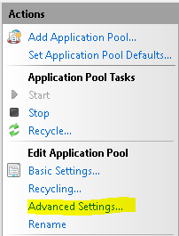

IIS 8.0 Multicore Scaling on NUMA Hardware
====================
by [Robert McMurray](https://github.com/rmcmurray)

### Compatibility

| Version | Notes |
| --- | --- |
| IIS 8.0 | Multicore Scaling on NUMA was introduced in IIS 8.0. |
| IIS 7.5 | Multicore Scaling on NUMA was not supported in IIS 7.5. |
| IIS 7.0 | Multicore Scaling on NUMA was not supported in IIS 7.0. |

## Problem

Generally speaking, increasing the number of cores should result in increased performance. However, there comes a point where increasing the number cores may result in performance degradation because the cost of memory synchronization out-weighs the benefits oon NUMA hardware f additional cores. IIS 8.0 addresses this problem by intelligently distributing and affinitizing its processes on Non-Uniform-Memory-Access (NUMA) hardware.

## Solution

Internet Information Services (IIS) on Windows Server 2012 is NUMA-aware and provides the optimal configuration for the IT administrators. Following section describes the different configuration options to achieve the best performance with IIS 8.0 on NUMA hardware.

IIS supports following two ways of partitioning the workload:

1. **Run multiple worker processes in one application pool (i.e. web garden)**: If you are using this mode, by default, the application pool is configured to run one worker process. For maximum performance, you should consider running the same number of worker processes as there are NUMA nodes, so that there is 1:1 affinity between the worker processes and NUMA nodes. This can be done by setting "**Maximum Worker Processes"** AppPoolsetting to 0. In this setting, IIS determines how many NUMA nodes are available on the hardware and starts the same number of worker processes.
2. **Run multiple applications pools in single workload/site**: In this configuration, the workload/site is divided into multiple application pools. For example, the site may contain several applications that are configured to run in separate application pools. Effectively, this configuration results in running multiple IIS worker processes for the workload/site and IIS intelligently distributes and affinitizes the processes for maximum performance.

In addition, there are two different ways for IIS 8.0 to identify the most optimal NUMA node when the IIS worker process is about to start.

1. **Most Available Memory (default)**: The idea behind this approach is that the NUMA node with the most available memory is the one that is best suited to take on the additional IIS worker process that is about to start. IIS has the knowledge of the memory consumption by each NUMA node and uses this information to "load balance" the IIS worker processes.
2. **Windows**: IIS also has the option to let Windows OS make this decision. Windows OS uses round-robin.

Finally, there are two different ways to affinitize the threads from an IIS worker process to a NUMA node.

1. **Soft Affinity (default)**: With soft affinity, if other NUMA nodes have the cycles, the threads from an IIS worker process may get scheduled to non-affinitized NUMA node. This approach helps to maximize all available resouces on the system as whole.
2. **Hard Affinity**: With hard affinity, regardless of what the load may be on other NUMA nodes on the system, all threads from an IIS worker process are affinitized to the chosen NUMA node that was selected using the design above.

## Step by Step Instructions

### Prerequisites

- IIS is installed on Windows Server 2012.
- IIS process model is part of IIS application pool configuration. There is no specific IIS feature that needs to be installed from Server Manager.

### Workarounds for known bugs

There are no known bugs for this feature at this time.

### Configuration Steps

1. Open **IIS Manager**.
2. Select **Application Pools** in the left navigation window:  
    
3. Select **App Pool**:  
    
4. In the **Actions** pane, select **Advanced Settings**:  
    
5. Under **Process Model** group, locate the **Maximum Worker Processes** setting.  
    
6. Set this value to 0.

The optimal NUMA selection logic as well as the affinity type are also found under **Advanced Settings**. However, they appear only if IIS is running on NUMA hardware.

### Scenarios

Run performance tests on NUMA hardware before and after upgrading to Windows Server 2012. Compare performance results to see the improvements.

## Summary

You have successfully explored IIS Multicore scaling for NUMA hardware feature in Windows Server 2012.