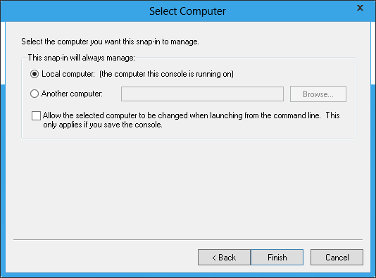
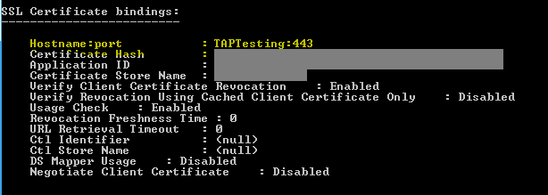

IIS 8.0 Server Name Indication (SNI): SSL Scalability
====================
by [Shaun Eagan](https://github.com/shauneagan)

### Compatibility

| Version | Notes |
| --- | --- |
| IIS 8.0 | Server Name Indication was introduced in IIS 8.0. |
| IIS 7.5 | Server Name Indication was not supported in IIS 7.5. |
| IIS 7.0 | Server Name Indication was not supported in IIS 7.0. |

## Problem

As more e-commerce sites come on line and more businesses are storing and sharing sensitive documents online, the ability to host and scale secure sites are increasingly more important. Prior to Windows Server 2012, there were a couple of challenges when it comes to hosting secure sites:

- **SSL Scalability**: In a multi-tenanted environment, such as a shared hosting, there is a limitation as to how many secure sites can be hosted on Windows Server, resulting in a low site-density.
- **IPv4 scarcity**: Because the network end-point can only be identified with IP:Port binding, where tenants request to use the standard SSL port, 443, hosting a secure site often means offering a dedicated IP address per tenant.

## Solution

On Windows Server 2012, IIS supports Server Name Indication (SNI), which is a TLS extension to include a virtual domain as a part of SSL negotiation. What this effectively means is that the virtual domain name, or a hostname, can now be used to identify the network end point. In addition, a highly scalable WebHosting store has been created to complement SNI. The result is that the secure site density is much higher on Windows Server 2012 and it is achieved with just one IP address.

It should be noted that in order for this feature to be used, your client browsers have to support SNI. Most modern browsers support SNI; however, Internet Explorer (of any version) on Windows XP does not support SNI.

## Step by Step Instructions

#### Prerequisites:

- IIS 8.0 is installed on Windows Server 2012. 

    - Both WebHosting certificate store and SNI are part of default IIS installation. There is no specific IIS feature that needs to be installed from Server Manager.
- Sample certificates.
- \windows\system32\drivers\etc\hosts has been modified to be used for sample site and certificate. For example, if CN name of the certificate is TAPTesting, then the hosts file must contain: 

    [!code-console[Main](iis-80-server-name-indication-sni-ssl-scalability/samples/sample1.cmd)]

#### Workarounds for known bugs:

There are corner cases in which the IIS Manager may remove unintended SSL binding when there are traditional SSL bindings (IP:Port) and SNI bindings (Hostname:Port) are configured on the same machine. To workaround this problem and/or to confirm the actual SSL bindings, use the command-line tool:

[!code-console[Main](iis-80-server-name-indication-sni-ssl-scalability/samples/sample2.cmd)]

### Import Certificates to the Web Hosting Store:

1. Open **MMC**.
2. Under **File**, select **Add/Remove Snap-in**:  
    
3. Select **Certificates**. Click on **Add**:  
    
4. Select **Computer account**:  
    
5. Select **Local computer** and click on **Finish**:  
    
6. Click on **OK**:  
    
7. Under the navigation pane, locate **Web Hosting** store:  
      
 The     **Web Hosting** store works like the     **Personal** store, so all of the existing tools to import and export certificates work the same way. The key difference between     **Web Hosting** store and     **Personal** store is that     **Web Hosting** store is designed to scale to higher numbers of certificates.
8. Import your sample certificates to the **Web Hosting** store.

### Create a Secure Web Site:

1. Open **IIS Manager**.
2. Select **Sites** in the left navigation window:  
    
3. Right-click **Sites** and select **Add Website**:  
    
4. Fill in the information, as you would create any site: 

    - **Site name**: Test
    - **Physical path**: c:\inetpub\wwwroot
    - **Type**: https
    - **Hostname**: TAPTesting 

        - This is new for Windows Server 8 in that host name can be specified for SSL.
        - In order to avoid certificate name mismatch error, ensure that the hostname specified here matches the CN name of the certificate.
        - The actual value of this configuration varies depending on the sample certificate that is being used.
    - **Use Server Name Indication**: Selected
    - **SSL certificate**: Chhose the name of your certificate; for example: TAPTesting. 

        - Note that the certificates are presented from both **Personal** and **Web Hosting** stores.

    
5. Verify that the site has been created:  
    
6. That's it. The secure site has been created using SNI. The management experience is very similar to the traditional SSL binding. The only differences are: 

    - Host name can be specified for SSL site.
    - Certificate is stored in Web Hosting store for scalability.

### Test a Secure Site:

Open a browser and navigate to [https://TAPTesting/](https://taptesting/). Note that as a part of prerequisite, your hosts file should have been modified to route this request to localhost:

Furthermore, to see the new SSL binding type, enter the following in an elevated command-line window:

[!code-console[Main](iis-80-server-name-indication-sni-ssl-scalability/samples/sample3.cmd)]

Note that the SSL binding is **hostname:port** with value **TAPTesting:443**.

### Scenarios

Try deploying the following scenarios:

- SNI is designed to scale for a multi-tenanted environment. Try configuring thousands of secure sites using SNI.
- Unlike previous versions of Windows Server, the certificates on Windows Server 2012 are loaded in memory on-demand. After configuring thousands of secure sites using SNI, send a GET request to one of the secure sites and observe the memory usage. It is negligible. On previous versions of Windows Server, if hundreds of secure sites are configured, sending just one GET request would cause the Windows Server to load ***all*** certificates, resulting in a high memory usage, and further limits the scalability.
- Configure Windows Server 2012 with both SNI and traditional secure sites. They are designed to co-exist.

## Summary

You have successfully explored Server Name Indication (SNI) feature in Windows Server 2012.
  
  
[Discuss in IIS Forums](https://forums.iis.net/1043.aspx)