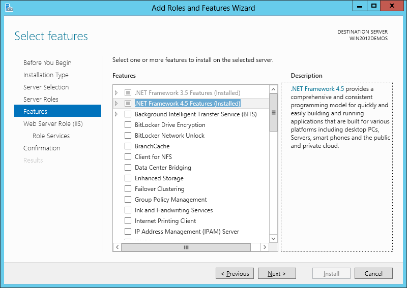

# Installing IIS 8 on Windows Server 2012

by [Robert McMurray](https://github.com/rmcmurray)

### Compatibility

| Version | Notes |
| --- | --- |
| IIS 8.0 | IIS 8.0 is only available in Windows Server 2012 and Windows 8. |
| IIS 7.5 |
| IIS 7.0 |

## Overview

Server Manager in Windows Server 2012 is new and accordingly, the user experience has changed as well.

This step-by-step instruction is not unique to installing IIS. It is meant to assist IIS customers with navigating through the new Server Manager quickly.

## Step by Step Instructions

#### Prerequisites:

- Windows Server 2012 has been installed.

#### Workarounds for known bugs:

- There are no known bugs for this feature at this time.

### Installing IIS 8 with the Default Settings

To install IIS 8, use the following steps:

1. Open **Server Manager**.
2. Under **Manage** menu, select **Add Roles and Features**:  
    
3. Select **Role-based or Feature-based Installation**:  
    
4. Select the appropriate server (local is selected by default), as shown below:  
    
5. Select **Web Server (IIS)**:  
    
6. No additional features are needed for IIS, so click **Next**:  
    
7. Click **Next**:  
    
8. Customize your installation of IIS, or accept the default settings that have already been selected for you, and then click **Next**:  
    
9. Click **Install**:  
    
10. When the IIS installation completes, the wizard reflects the installation status:  
    
11. Click **Close** to exit the wizard.

## Summary

IIS 8.0 has been installed successfully by using Server Manager in Windows Server 2012.
