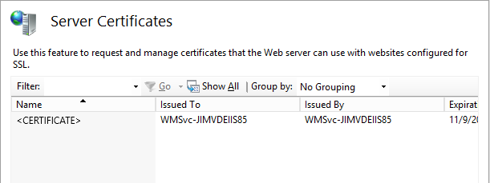

Certificate Rebind in IIS 8.5
====================
by [Jim van de Erve](https://twitter.com/jimvde)

> Automatically rebind a renewed certificate by using Certificate Rebind, new in IIS 8.5.

## Compatibility

| Version | Notes |
| --- | --- |
| IIS 8.5 and later | Certificate Rebind was introduced in IIS 8.5. |
| IIS 8.0 and earlier | Certificate Rebind was not supported prior to IIS 8.5. |

## Problem

When the certificate used for an IIS Web site expires and is renewed, the Web site must be rebound to the new certificate. This needs to occur even if your certificates are renewed automatically. Rebinding manually can make certificate management challenging, especially if you have a significant number of sites and certificates. If a certificate expires and the site is not rebound to the new certificate, clients connecting to the Web site will get a warning about the certificate expiration, and this might deter them from using the site until the issue is addressed.

## Solution

IIS 8.5 and later have a new feature that automates the rebinding of a renewed certificate. This feature, called Certificate Rebind, ensures that a certificate will automatically be rebound to a Web site after the certificate has been renewed. You enable this feature for all HTTPS Web sites on a server in the Server Certificates dialog box of the IIS Manager.

Certificate rebind leverages the notification functionality in a Windows 8 and Windows Server 2012 helper mechanism called Certificate Services Lifecycle Notifications. This mechanism creates a system event whenever a certificate-related action takes place, such as when a new certificate is installed, an existing certificate expires or is about to expire, or a certificate is renewed. For more information about the notification mechanism, see [Certificate Services Lifecycle Notifications](https://social.technet.microsoft.com/wiki/contents/articles/14250.certificate-services-lifecycle-notifications.aspx).

When you enable Certificate Rebind, IIS registers a task in the system's Task Scheduler, and the task is keyed to trigger upon a certificate-renewal event (event ID 1001). When such an event occurs (either when you manually renew the certificate, or when it renews through autoenrollment), the scheduled task executes the IIS command-line tool appcmd.exe. It gives appcmd the thumbprint of the expired certificate and the thumbprint of the new one. Using these two parameters, appcmd locates the Web sites that the old certificate is bound to, unbinds that certificate, and then binds the new certificate to them. If you set up your certificates to renew automatically through autoenrollment, and you enable Certificate Rebind, the whole process will be automated.

You can view the certificate rebinding task in the Task Scheduler in Windows 8 or Windows Server 2012. Open the Task Scheduler by running taskschd.msc or through Search. Under the Task Scheduler Library in the left pane, open Microsoft, then Windows, and then CertificateServicesClient. It is recommended that you do not change this task. Also, if you disable Certificate Rebind in IIS Manager, the CertificateServicesClient task in the Task Scheduler will be deleted.

In addition to configuring certificate rebinding in IIS, you can use the Certificate Services Lifecycle Notifications events to manage certificates by setting up custom triggers in the Task Scheduler.

## Step by Step Instructions

### Enable automatic rebinding of renewed certificates

1. On the taskbar, click **Server Manager**, click **Tools**, and then click **Internet Information Services (IIS) Manager**.
2. In the **Connections** pane, select the server. Certificate Rebind is enabled at the server level.
3. In the Home pane, in the **IIS** section, double-click **Server Certificates**. 
4. In the **Actions** pane, click **Enable Automatic Rebind of Renewed Certificate**. 

## Summary

The Certificate Rebind feature of IIS 8.5 and later enable you to rebind a certificate to a Web site automatically after the certificate has been renewed. Certificate rebinding leverages Certificate Services Lifecycle Notifications events. The Certificate Rebind task, CertificateServicesClient, is registered in the Windows Task Scheduler.