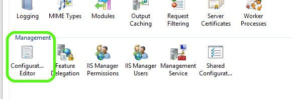
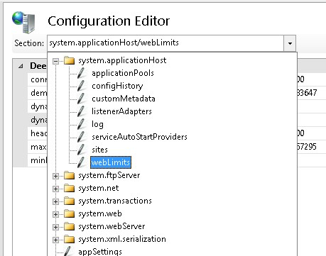
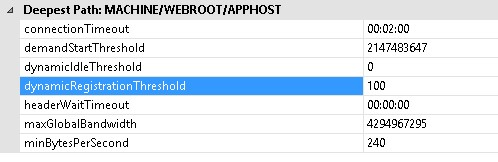

Dynamic Website Activation in IIS 8.5
====================
by [Gary Ericson](https://github.com/garyericson)

> In IIS 8.5, when there are a large number of configured sites (100 or greater, by default), the service will not activate any of the sites when the service is started.

### Compatibility

| Version | Notes |
| --- | --- |
| IIS 8.5 and later | Dynamic website activation was introduced in IIS 8.5. |
| IIS 8.0 and earlier | Dynamic website activation was not supported prior to IIS 8.5. |

### Contents

- [**Problem**](#TOC301258515)
- [**Solution**](#TOC301258516)
- [**Step by Step Instructions**](#TOC301258517)
- [**Summary**](#TOC301258518)

## Problem

When the Internet Information Services (IIS) on Windows Server 2012 service starts at system boot-up, it automatically activates all configured websites. This means that the first time any site is accessed, it will be available and respond quickly. However, for a system with a large number of sites configured, it not only takes a lot of time and resources to activate all those sites at once, but the sites can use a large amount of memory. If the majority of the sites are accessed infrequently, this can be an unneccesary waste of system resources.

Note that &quot;activation&quot;, in this context, refers to a process in which IIS registers a site with the HTTP protocol stack (HTTP.SYS), which is part of the Windows Server operating system. This activation is not to be confused with the action of creating a worker-process for a site.

## Solution

In IIS 8.5 and later, when there are a large number of configured sites (100 or greater, by default), the service will not activate any of the sites when the service is started. Instead, IIS will activate each site only when it receives the first request for the site. This reduces the amount of system resources required by IIS, especially if a large number of the sites are accessed infrequently. The first request to the site will take some time as the site is activated, but subsequent accesses will respond normally.

## Step by Step Instructions

### Configure Dynamic Website Activation

By default, IIS 8.5 and later use a threshold of 100 sites:

- If there are less than 100 sites configured, then IIS will activate all sites at start-up.
- If there are 100 or more sites configured, then IIS will activate each site as it is accessed the first time.

You can change this threshold value by using the Configuration Editor.

1. Open **IIS Manager**.
2. Select the server in the **Connections** pane, and then double-click **Configuration Editor**.  
    
3. Select the section **system.applicationHost/webLimits**.  
    
4. Set the value of **dynamicRegistrationThreshold** to the new threshold value (the default value is 100).  
    
5. Restart IIS.

## Summary

In this guide, you have modified the threshold value used by IIS to determine the threshold over which the dynamic site activation features is effective.