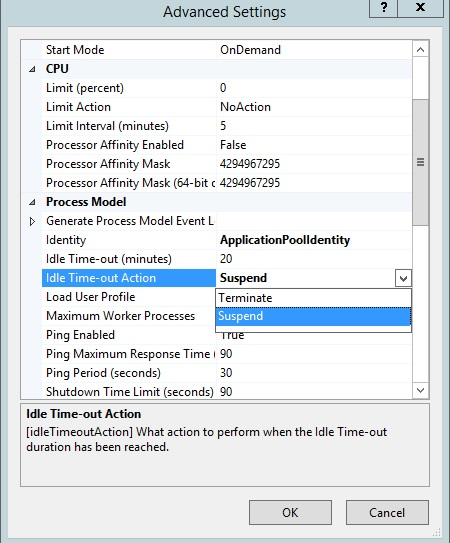
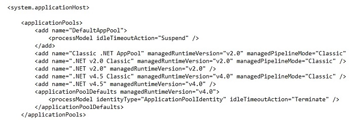

Idle Worker Process Page-Out in IIS 8.5
====================
by Gary Ericson

> In IIS 8.5, the administrator has the option of suspending an idle worker process rather than terminating it.

### Compatibility

| Version | Notes |
| --- | --- |
| IIS 8.5 and later | Idle Worker Process Page-Out was introduced in IIS 8.5. |
| IIS 8.0 and earlier | Idle Worker Process Page-Out was not supported prior to IIS 8.5. |

## Problem

Internet Information Services (IIS) on Windows Server 2012 provides the administrator with the option of timing out a worker process that is idle for a specified period of time. This is a good option for sites that are not accessed very often because it frees up system resources when the site is idle. The disadvantage is that the next time the site is accessed, the user will need to wait for the worker process to start again.

## Solution

In IIS 8.5 and later, the administrator has the option of suspending an idle worker process rather than terminating it. A suspended worker process remains alive but is paged-out to disk, reducing the system resources it consumes. When a user accesses the site again, the worker process wakes up from suspension and is quickly available. When an idle worker process is terminated, the worker process is shut down, and the startup period will be longer when the site is subsequently accessed. Terminating the process is the default behavior, and the same behavior that has been used in previous versions of IIS prior to IIS 8.5.

The idleTimeoutAction attribute can be configured either for a single application pool or as a default for all application pools.

## Step by Step Instructions

### Configure Idle Worker Process Page-Out for a Single Application Pool

1. Open **IIS Manager**.
2. Select **Applications Pools** in the **Connections** pane, select an application pool in the **Application Pool** pane, and then click **Advanced Settings...** in the **Actions** pane.
3. In the **Advanced Settings** dialog box, under **Process Model**, select **Suspend** for the value of **Idle Time-out Action** to suspend a worker process when the time-out value is reached, paging it out to disk. Select **Terminate** to shut down the worker process.  
    
4. Optionally set the **Idle Time-out** value from the default 20 minutes to a different time period.
5. Click **OK**.

### Configure Idle Worker Process Page-Out as a Default for Application Pools

1. Open **IIS Manager**.
2. Select **Applications Pools** in the **Connections** pane, and then click **Set Application Pool Defaults...** in the **Actions** pane.
3. In the **Application Pool Defaults** dialog box, under **Process Model**, select **Suspend** for the value of **Idle Time-out Action** to suspend a worker process when the time-out value is reached, paging it out to disk. Select **Terminate** to shut down the worker process.  
    
4. Optionally set the **Idle Time-out** value from the default 20 minutes to a different time period.
5. Click **OK**.

## View Resource Use in Suspension

You can view suspended worker processes in Task Manager and see that they use very little memory or CPU.

## Verify Idle Time-out Action Configuration in applicationHost.config

The idleTimeoutAction configuration can be entered in two places in the applicationHost.config file:

- For a single application pool, in the &lt;processModel&gt; child element of the &lt;add&gt; element, which sets the idleTimeoutAction attribute only for that pool. This is what is happening for DefaultAppPool in the screenshot of applicationHost.config file below, in which idleTimeoutAction is set to &quot;Suspend&quot;.
- For all application pools, in the &lt;processModel&gt; child element of the &lt;applicationPoolDefaults&gt; element, which makes a default setting for all the pools. If idleTimeoutAction is not set for a specific pool, e.g., the .NET v4.5 pool below, the default idleTimeoutAction value is used for that pool, in this case &quot;Terminate&quot;. If idleTimeoutAction is set for a pool, that setting overrides the default.

## Summary

In this guide, you have configured IIS to suspend or terminate worker processes that have been idle for a specified amount of time.