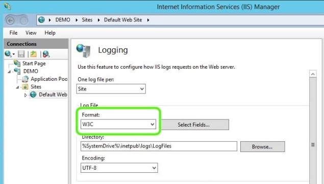

Logging to Event Tracing for Windows in IIS 8.5
====================
by [Gary Ericson](https://github.com/garyericson)

> In IIS 8.5, the administrator has the option of sending logging information to Event Tracing for Windows (ETW).

### Compatibility

| Version | Notes |
| --- | --- |
| IIS 8.5 and later | Logging to ETW was introduced in IIS 8.5. |
| IIS 8.0 and earlier | Logging to ETW was not supported prior to IIS 8.5. |

### Contents

- [**Problem**](#TOC301258515)
- [**Solution**](#TOC301258516)
- [**Step by Step Instructions**](#TOC301258517)
- [**Summary**](#TOC301258518)

## Problem

Internet Information Services (IIS) on Windows Server 2012 provides basic logging capabilities. However, because IIS takes some time to flush logs to disk, administrators do not have access to logging information in real-time. In addition, text-based log files can be difficult and time-consuming to process.

## Solution

In IIS 8.5, the administrator has the option of sending logging information to Event Tracing for Windows (ETW). This option gives the administrator the ability to use standard query tools, or create custom tools, for viewing real-time logging information in ETW. This provides a significant advantage over parsing text-based log files that are not updated in real time. For more information on ETW, see [Event Tracing](https://go.microsoft.com/fwlink/p/?LinkID=256040).

## Step by Step Instructions

### Configure ETW Logging

1. Open **IIS Manager**.
2. Select the server or site in the **Connections** pane, and then double-click **Logging**. If you configure logging for a site, then that configuration applies to the site regardless how you configure logging at the server level. If you configure logging for the server, then the configuration will be applied to all newly-created sites on the server and any sites for which you have not configured site-level logging.
3. In the **Format** field under **Log File**, make sure that **W3C** is selected.  
    
4. Under **Log Event Destination**, select **ETW event only**, or, if you want the log information sent to both ETW and the log file, select **Both log file and ETW event**.  
    
5. Use any of the publicly available tools to query ETW for events. For example, Message Analyzer can be used by configuring it to query the "Microsoft-Windows-IIS-Logging" provider. For more information about Message Analyzer, see the [MessageAnalyzer blog](http://blogs.technet.com/b/messageanalyzer/) on Microsoft TechNet.

## Summary

In this guide, you have configured IIS to log events to ETW or to both ETW and the log file. You can view ETW events using a number of publicly available tools.