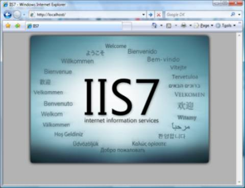
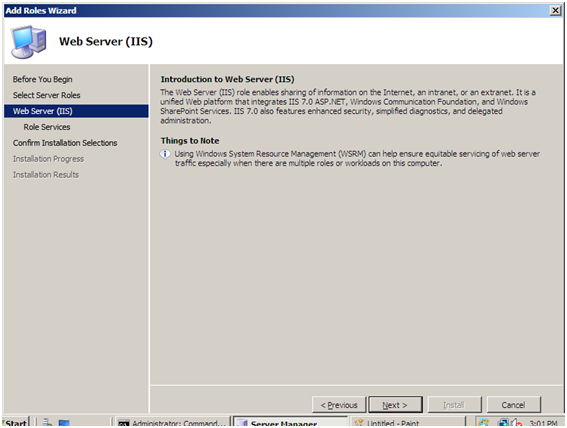
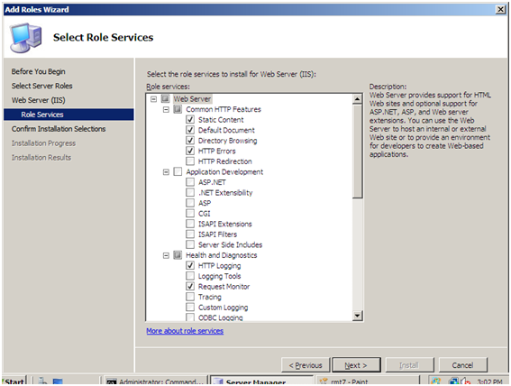
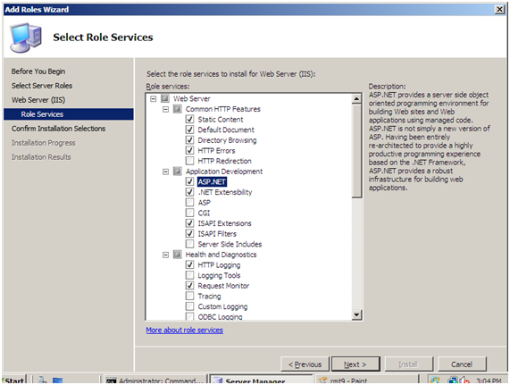
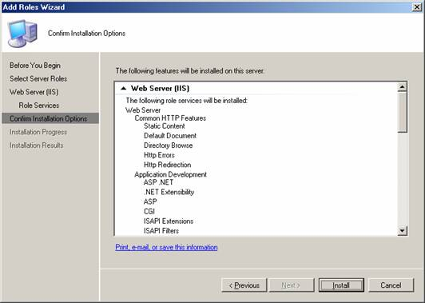
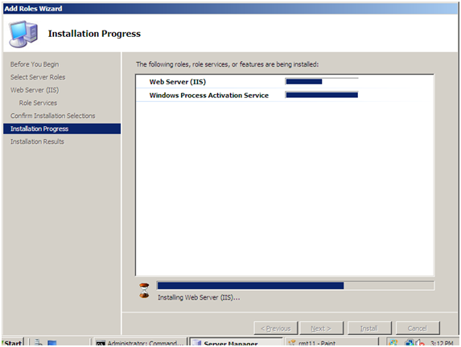

# Installing IIS 7 on Windows Server 2008 or Windows Server 2008 R2

You can use Microsoft® Web Platform Installer (Web PI) to easily install Internet Information Services (IIS) and applications that run on IIS. However, if you choose to install IIS manually, you can use this article for guidance. You can also refer to [Installing and Configuring IIS 7 and Above](../index.md).

IIS is Microsoft Web server role that is included with all versions of Microsoft's operating systems, and also powers [Windows Azure Web Sites](https://www.windowsazure.com/solutions/web/) to provide robust cloud-based PaaS (Platform as a Service). Version 7.0 of IIS is included with Windows Server® 2008 and Windows Vista®. IIS 7.5 is the Web server role in Windows Server® 2008 R2 and the Web server in Windows® 7. IIS 8.0 is the version that is part of Windows Server 2012, and Windows Server 2012 R2 includes IIS 8.5. Windows Server 2008 R2 and Windows Server 2008 operating systems have all the IIS features needed to support the hosting of Web content in production environments. Windows 7 and Windows Vista also include IIS features, but the available features depend on the operating system versions.

The Web server was redesigned in [IIS 7.0](../../web-hosting/frequently-asked-questions-faq/general-iis7-questions.yml) to enable you to customize a server by adding or removing modules to meet your specific needs. Modules are individual features that the server uses to process requests. For example, IIS 7.0 and IIS 7.5 use authentication modules to authenticate client credentials and use cache modules to manage cache activity. Both versions of IIS also provide: 

- A new management interface. The interface lets you quickly and easily change the settings for each Web site. It is also possible to edit the settings of a Web site in a text-based configuration file.
- The ability to share tasks with Web site owners. A hoster with multiple sites can delegate administrative control to developers or content owners.

## New in IIS 7.5

IIS 7.0 and IIS 7.5 are together known as IIS 7 or IIS 7 and above; however, IIS 7.5 and Windows Server 2008 R2 include several new features not found in IIS 7.0:

- Microsoft® ASP.NET runs on Windows Server 2008 R2 Server Core installations.
- Some of the extensions available to be added to the IIS 7.0 platform are integrated into the IIS 7.5 platform, including:

  - FTP publishing.
  - Web-based Distributed Authoring and Versioning (WebDAV) publishing.
  - Windows PowerShell™ snap-in for IIS.
  - IIS Administration Pack modules.
- IIS 7.5 includes configuration logging and tracing (IIS 7.0 does not include any built-in tracing mechanisms for configuration changes).
- IIS 7.5 includes the Best Practice Analyzer, an automated tool for helping to ensure compliance with security best practices.

## Before You Begin

Ensure that you have administrative user rights on the computer on which you plan to install IIS 7 or above. Note that by default, you do not have administrative user rights if you are logged on as a user other than as the built-in administrator, even if you were added to the local Administrators group on the computer (this is a new security feature in Windows Server 2008 called Local User Administrator).

Log on either to the built-in administrator account, or explicitly invoke applications as the built-in administrator by using the runas command-line tool.

> [!NOTE]
> You can run runas /user:administrator cmd.exe so that every application you run from that command line will be elevated, eliminating the need to use the runas syntax from that command line.

If you are logged on to an account other than the built-in local administrator account, you may see the following security alert dialog box.

  
*Figure 1: Windows® Security (User Account Control)*

## Install IIS 7.5 on Windows Server 2008 R2

IIS is one of the Windows Server® server roles. IIS can be installed through the graphical user interface (GUI) by using the new Server Manager interface after the Windows Server operating system is installed.

Server Manager provides a single dashboard to install or uninstall server roles and features. Server Manager also gives an overview of all currently installed roles and features. When IIS is chosen from the Server Manager, the basic components and services needed for IIS are automatically selected.

1. Click **Start** > **All Programs** > **Administrative Tools** > **Server Manager**.

      
    *Figure 2: Server Manager*
2. In the **Server Manager** window, scroll down to **Roles Summary**, and then click **Add Roles**. The **Add Roles Wizard** will start with a **Before You Begin** page. The wizard asks for verification of the following:

    - The administrator account has a strong password.
    - The network settings, such as IP addresses, are configured.
    - The latest security updates from Windows® Update are installed.
3. Select **Web Server (IIS)** on the **Select Server Roles** page. An introductory page will open with links for further information.

    > [!NOTE]
    > When you use the **Add Roles Wizard to install** IIS, you get the default installation, which has a minimum set of role services. If you need additional IIS role services, such as **Application Development** or **Health and Diagnostics**, make sure to select the check boxes associated with those features in the **Select Role Services** page of the wizard.

      
    *Figure 3: Select Server Roles*
4. Select the IIS services to be installed on the **Select Role Services** page. Add only the modules necessary. In this case, ASP.NET is selected, and a description of ASP.NET appears in the right pane. Once desired modules are added, click **Next**.

      
    *Figure 4: Select Role Services*
5. Add any required role services.

      
    *Figure 5: Wizard warning page*
6. IIS is now installed with a default configuration for hosting ASP.NET on Windows Server. Click **Close** to complete the process.

      
    *Figure 6: Installation Results page*
7. Confirm that the Web server works by using `http://localhost`.

      
    *Figure 7: Default Web site*

> [!NOTE]
> Install only the absolutely necessary IIS services to minimize the IIS installation footprint. This also minimizes the attack surface, which is one of the benefits of IIS 7 and above.

## Use a Script to Install IIS 7.5 on Windows Server 2008 R2

You can also use a script to install IIS 7.5. Note that if you use this script, you get the full IIS installation, which installs all available feature packages. If there are feature packages you do not need, you should edit the script to install only the packages you require. For more information, see [Installing IIS 7.5 on Windows Server 2008 R2](https://docs.microsoft.com/previous-versions/windows/it-pro/windows-server-2008-R2-and-2008/cc771209(v=ws.11)).

To install IIS 7.5 with a script, type the following at a command prompt:

[!code-console[Main](installing-iis-7-and-above-on-windows-server-2008-or-windows-server-2008-r2/samples/sample1.cmd)]

## Unattended Installation of IIS 7.0 on Windows Server 2008

Automating the installation of IIS by using unattended scripts is very useful if you need to deploy multiple Web servers and want to ensure that each of the Web servers is set up with identical components and services.

In the Windows Server 2008 and Windows Vista operating systems, Pkgmgr.exe is used for unattended scripts, letting you install or uninstall optional features from a command prompt or scripts. (Note: Pkgmgr.exe replaces Sysocmgr.exe which was used in Windows Server® 2003.) For instructions and an overview of Pkgmgr.exe, see [Installing IIS 7.0 and Above from the Command Line](installing-iis-from-the-command-line.md). See also [Unattended Setup to Install IIS 7.0 and Above](using-unattended-setup-to-install-iis.md). Note that to use Pkgmgr.exe, you must make sure you have administrative user rights on the computer.

## Install IIS 7.0 on Windows Server 2008

1. To start Server Manager, click **Start Menu** > **All Programs** > **Administrative Tools** > **Server Manager**. The Server Manager window opens.

      
    *Figure 8: Server Manager*
2. In the **Server Manager** window, select **Roles.** The Role Summary View is displayed.

      
    *Figure 9: Start Add Roles Wizard*
3. Click **Add Roles.** The Add Roles Wizard opens. Click **Next** to select roles to install.

      
    *Figure 10: Add Roles Wizard Introduction*
4. Select **Web Server (IIS)**.

      
    *Figure 11: Select Web Server (IIS) in Add Roles Wizard*
5. The Add Roles Wizard notifies you of any required dependencies; since IIS depends on the Windows Process Activation Service (WAS) feature, the following informational dialog box appears. Click **Add Required Role Services** to continue.

      
    *Figure 12: Add Dependencies*
6. The Web Server is now selected for install. The Select Server Roles dialog box opens. Click **Next** to continue.

      
    *Figure 13: Selected Web Server (IIS)*
7. The following dialog box and information appears. Click **Next** to continue.

      
    *Figure 14: Introduction to Web Server dialog box*
8. The Add Roles Wizard displays a list of all IIS 7.0 features available to install as shown below. Note that features comprising the default install are pre-selected.

      
    *Figure 15: Web Server Features Listed*
9. To install just the IIS 7.0 default features, click the **Install** button, and then proceed to Step 14. If you need to install additional features, proceed to step 10.
10. For this example, we install additional IIS features. Select the check box for ASP.NET. The Wizard warns if adding an IIS feature will also cause other features to be installed. 

      
    *Figure 16: Dependency Information*
11. Click **Add Required Role Services** to continue.
12. Continue selecting additional IIS Role Services features to install.

      
    *Figure 17: Add Features For Web Server*
13. When you have selected all the features you require, click **Next** to continue.
14. The Wizard provides a summary of what will be installed.

      
    *Figure 18: Summary of Features*
15. Click **Install** to continue. The Installation Progress dialog box opens.

      
    *Figure 19: Install Progress*
16. When the IIS 7.0 installation is complete, the following dialog box opens. Click **Close** to return to the Server Manager.

      
    *Figure 20: Installation Summary*
17. You can now perform a quick check to verify that IIS 7.0 is installed. Start the **Windows® Internet Explorer®** Web browser, and enter the address `http://localhost`. You should see the default IIS "Welcome" page.

## See also

- [Installing and Configuring WebDAV on IIS 7.0 and Above](../installing-publishing-technologies/installing-and-configuring-webdav-on-iis.md)
- [Available Web Server (IIS) Role Services in IIS 7.5](https://docs.microsoft.com/previous-versions/windows/it-pro/windows-server-2008-R2-and-2008/cc753473(v=ws.11))
- [Installing IIS 7.0 on Windows Server 2008](https://docs.microsoft.com/previous-versions/windows/it-pro/windows-server-2008-R2-and-2008/cc771209(v=ws.10))
- [Editing Configuration Files](../../get-started/planning-your-iis-architecture/editing-configuration-files.md)
- [Extending IIS Configuration](../../develop/extending-iis-configuration/extending-iis-configuration.md)
