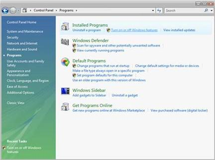
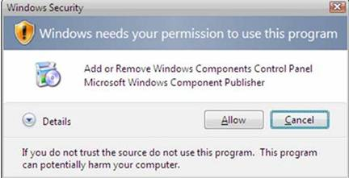
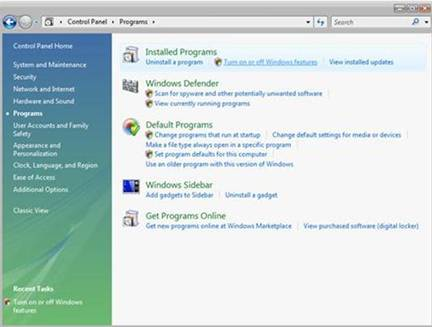
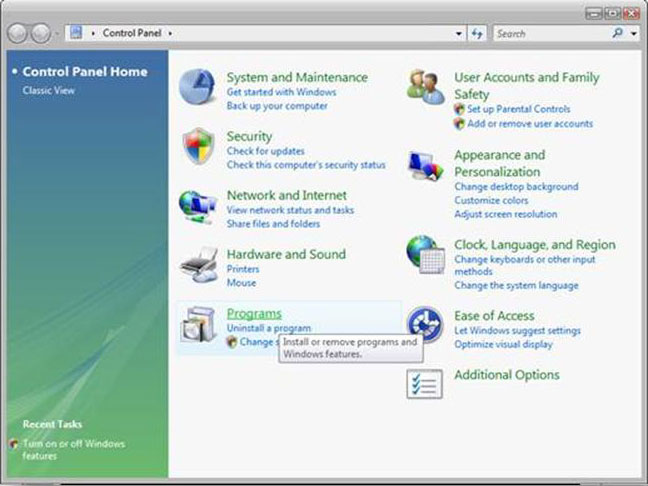

Installing IIS 7 on Windows Vista and Windows 7
====================
by IIS Team

## Introduction

Advances in cloud technologies have led many users to use [Windows Azure Web Sites](https://www.windowsazure.com/en-us/solutions/web/) to host both a production site and test site, as it makes it easy to test various configurations without impacting their own personal computers. If you still prefer to do this on your desktop, you can install IIS on it, as well as other applications and extensions easily using the Microsoft® Web Platform Installer (Web PI). To learn more about the Web PI, see [Learn about and install the Web PI](https://go.microsoft.com/fwlink/?LinkID=145510).

If you choose to install IIS 7.0 or above manually, you can use this article for guidance.

## Before You Begin

Ensure that you have installed one of the editions of Windows Vista or Windows 7 on which IIS 7 and above is supported before you proceed. Not all IIS features are supported on all editions of Windows Vista and Windows 7. Home Basic and Starter editions include only limited basic features of IIS. To see a list of which features are supported on the edition of Windows you are using, see one of the following:

- [Available Role Services in IIS 7.0](https://go.microsoft.com/fwlink/?LinkId=166549) (Windows Vista)
- [Available Web Server (IIS) Role Services in IIS 7.5](https://go.microsoft.com/fwlink/?LinkId=166491) (Windows 7)

Also be sure that you have administrative user rights on the computer. By default, you do not have administrative user rights if you are logged on as a user other than the built-in administrator, even if you were added to the local Administrators group on the computer (this is a new security feature in Windows Server® 2008 called Local User Administrator). Log on either to the built-in administrator account, or explicitly invoke applications as the built-in administrator by using the runas command-line tool.

Note that you can run runas /user:administrator cmd.exe so that every application you run from that command line will be elevated, eliminating the need to use the runas syntax from that command line.

If you are logged on to an account other than the built-in local administrator account, you may see the following security alert dialog box.

*Figure 1: Windows Security (User Account Control)*

## Install IIS 7 or Above

1. To open the **Windows Features** dialog box, click **Start**, and then click **Control Panel**.

    

    *Figure 2: Windows Vista Start menu*
2. In the **Control Panel**, click **Programs**.

    

    *Figure 3: Control Panel Home*
3. Click **Turn Windows features on or off**.

    

    *Figure 4: Control Panel install options*
4. You may receive the Windows Security warning. Click **Allow** to continue. The **Windows Features** dialog box is displayed.

    

    *Figure 5: Windows Security dialog box*
5. Expand **Internet Information Services**.Additional categories of IIS features are displayed. Select **Internet Information Services** to choose the default features for installation.

    

    *Figure 6: Windows Features dialog box - IIS*
6. Expand the additional categories displayed, and select any additional features you want to install, such as **Web Management Tools.** 

    

    *Figure 7: Windows Features dialog box - IIS feature selection*
7. If you are installing IIS for evaluation purposes, you may want to select additional features to install. Select the check boxes for all IIS features you want to install, and then click **OK** to start installation. 

    

    *Figure 8: Windows Features dialog box - Installation selection*
8. The progress indicator appears.

    

    *Figure 9: Progress indicator*
9. When the installation completes, the **Windows Features** dialog box closes, and the **Control Panel** is displayed.

    

    *Figure 10: Control Panel Home page*
10. IIS is now installed with a default configuration on Windows Vista or Windows 7. To confirm that the installation succeeded, type the following URL into your browser, [http://localhost](http://localhost/).

    

    *Figure 11: Default Web site*
11. Next, you can use Internet Information Services Manager to manage and configure IIS. To open IIS Manager, click **Start**, type *inetmgr* in the **Search Programs and Files** box, and then press ENTER.

    

    *Figure 12: Default Web Site Home page*

If you want to use ASP, Microsoft® ASP.NET, or PHP, install the modules needed to host these pages; this can be done during the installation of IIS or after the installation is complete.

## Use Unattended Setup to Install IIS 7.0 and above

IIS can also be installed unattended on Windows Vista. For detailed instructions and scripts, see [Using Unattended Setup to Install IIS 7.0 and Above](using-unattended-setup-to-install-iis.md).

## Links for More Information

[IIS 7 Installation and Deployment](https://technet.microsoft.com/en-us/library/ee692294(WS.10).aspx)

[How to install ASP.NET 1.1 with IIS7 and Abobe on Vista and Windows 2008](how-to-install-aspnet-11-with-iis-on-vista-and-windows-2008.md).

[Installing IIS 7 on Vista](https://channel9.msdn.com/posts/iisguy/Installing-IIS-7-on-Vista/).