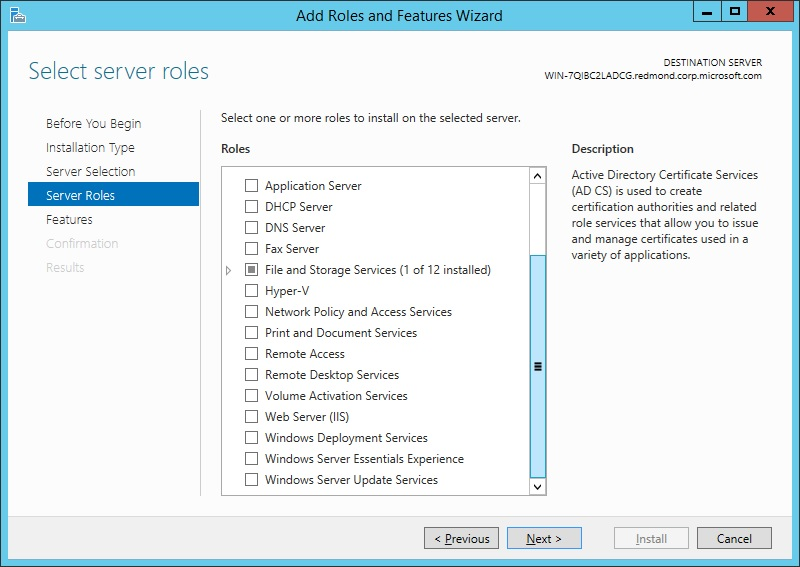
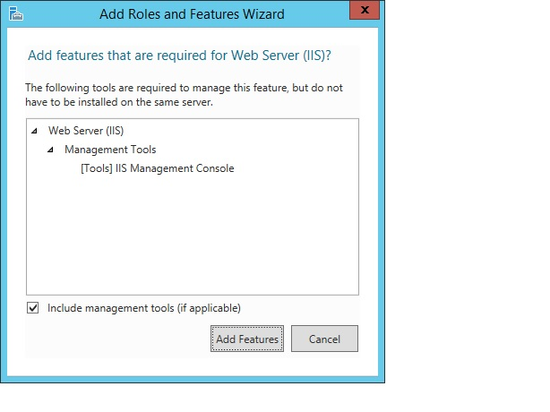
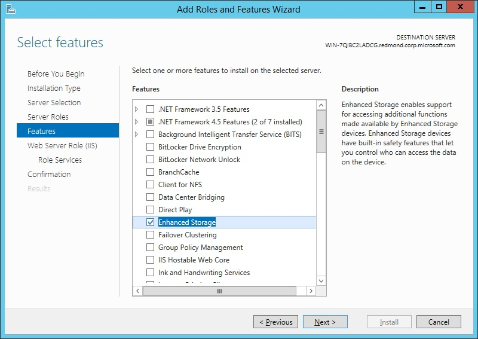
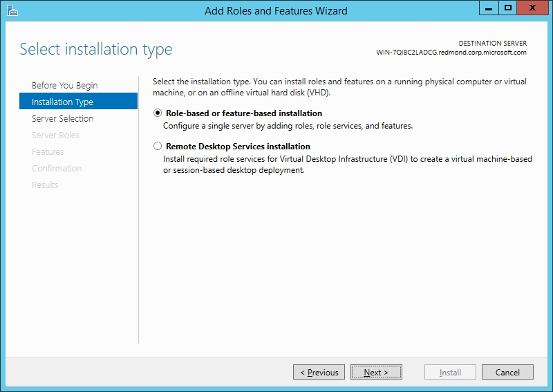
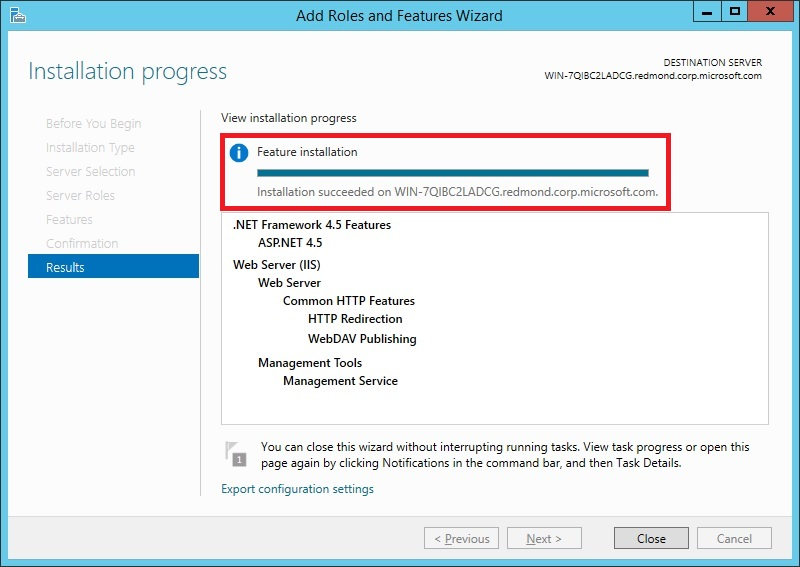
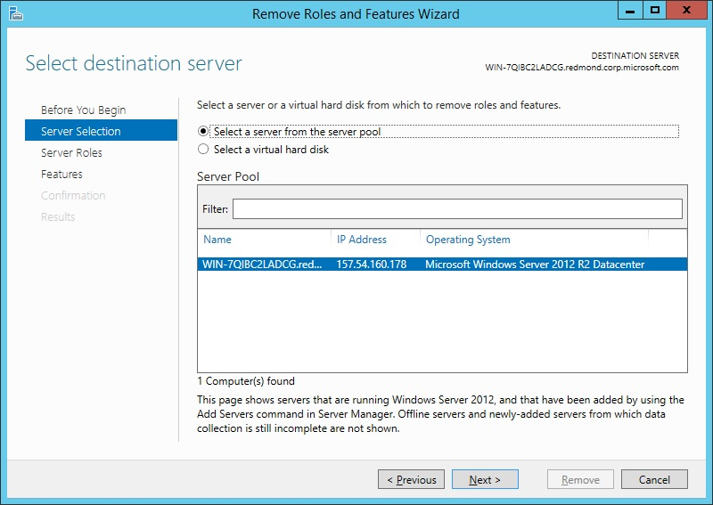
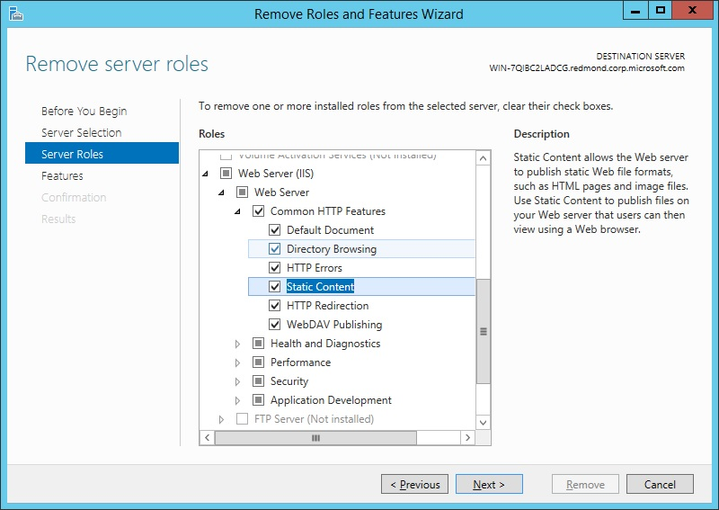
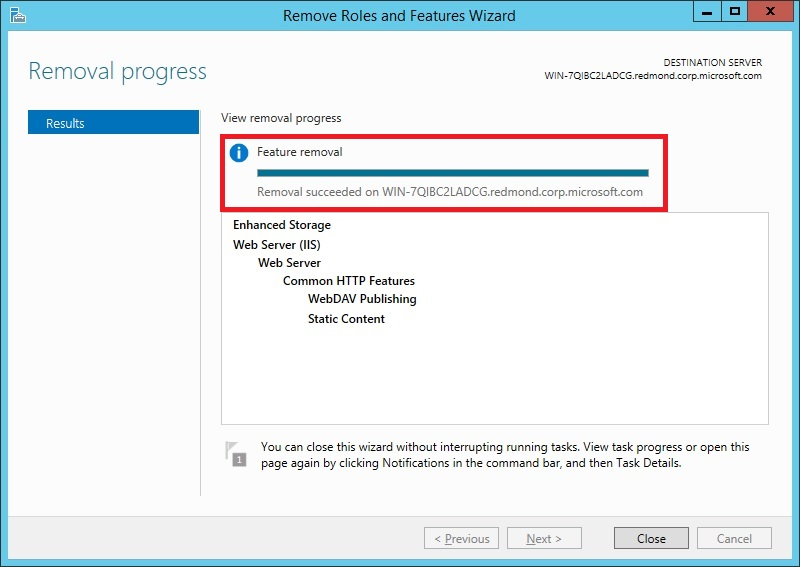

Installing IIS 8.5 on Windows Server 2012 R2
====================
by [IIS Team](https://twitter.com/inetsrv)

## Introduction

This document describes how to install Internet Information Services (IIS) 8.5 on Windows Server® 2012 R2. IIS is the Web server role in Windows Server 2012 R2. The Windows Server 2012 R2 operating system has all the IIS features needed to support the hosting of Web content in production environments. Windows 8 also includes IIS features, but feature availability depends on the operating system version.

Note: You can use the procedures in this document to install IIS 8.0 or IIS 8.5.

The Web server has a modular design that enables you to customize a server by adding or removing modules to meet your specific needs. The [**Install IIS 8.5 on Windows Server 2012 R2**](#InstallIIS85onWindowsServer2012R2) section describes how to install modules, and the [**Modules in IIS 8.5**](#ModulesinIIS85) section below describes the functionality that each module provides and which modules are installed by default.

## New in IIS 8.5

IIS 8.5 includes several new features not found in IIS 8.0 or lower:

- Enhanced logging. An administrator can enable the logging of additional custom fields from request or response headers, or from server variables.
- Logging to event tracing for Windows. An administrator can enable the sending of logging information to Event Tracing for Windows (ETW).
- Dynamic Website activation. If there are a large number of configured sites (100 or greater, by default), the service will not activate any of the sites when the service is started.
- Idle Worker Process Page-Out. An administrator can enable an idle worker process to be suspended rather than terminated.

For more information on these features, see [What's New in IIS 8.5](../../get-started/index.md).

For information on new features in IIS 8.0, see [What's New in IIS 8.0](../../get-started/whats-new-in-iis-8/index.md).

## Before You Begin

Ensure that you have administrative user rights on the computer on which you plan to install IIS 8.5. Note that by default, you do not have administrative user rights if you are logged on as a user other than as the built-in administrator, even if you were added to the local Administrators group on the computer.

Log on either to the built-in administrator account, or explicitly invoke applications as the built-in administrator by using the **runas** command-line tool.

Note: You can run **runas /user:administrator cmd.exe** so that every application you run from that command line will be elevated, eliminating the need to use the **runas** syntax from that command line.

If you are logged on to an account other than the built-in local administrator account, you may see the following security alert dialog box.

## Install IIS 8.5 on Windows Server 2012 R2

IIS is one of the server roles on Windows Server 2012 R2, named Web Server (IIS). You can use the following to install IIS:

- The Server Manager user interface in Windows Server 2012 R2
- A command-line installation using DISM (Deployment Image Servicing and Management)
- A command-line installation using PowerShell cmdlets

Note: IIS can also be installed on Windows 8 through the **Turn Windows features on or off** dialog box from the **Programs and Features** settings of the Control Panel.

### Install IIS 8.5 using the Server Manager

Server Manager provides a single dashboard to install or uninstall server roles, role services, and features. Server Manager also gives an overview of all currently installed roles and features.

When you install IIS 8.5 using the Windows Server 2012 R2 Server Manager, the steps you perform are different when you install IIS for the first time, as opposed to when you add roles, services, or features to an existing IIS installation. The two procedures are provided below. Different procedures are also used to add and remove roles, role services, and features. You cannot add and remove from the same UI

For more information on how to run the installation wizards in Server Manager, see [Install or Uninstall Roles, Role Services, or Features](https://technet.microsoft.com/en-us/library/hh831809.aspx).

#### Install IIS 8.5 for the first time in the Server Manager

When the Web Server (UI) role is chosen for the first time in the **Add Roles and Features Wizard** in Server Manager, the basic components and services needed for IIS are automatically selected. The following procedure will install Internet Information Services on a running physical server when IIS has not already been installed. To change an existing installation of IIS, perform the next procedure, Install additional role services for IIS. These two procedures involve different steps.

1. Open Server Manager by clicking the **Server Manager** icon on the desktop.
2. In the **Server Manager** window, with the **Dashboard** and **Quick Start** selected, click **Add roles and features**, or click the **Manage** menu, and then click **Add Roles and Features**. The Add Roles and Features Wizard will start with a **Before You Begin** page. The wizard asks for verification of the following: 

    - The administrator account has a strong password.
    - The network settings, such as IP addresses, are configured.
    - The most current security updates from Windows® Update are installed.
3. On the **Before You Begin** page, click **Next**.
4. On the **Installation Type** page, select **Role-based or feature-based installation** to configure a single server. Click **Next**. 

    
5. On the **Server Selection** page, select **Select a server from the server pool**, and then select a server; or select **Select a virtual hard disk server**, select a server to mount the VHD on, and then select a VHD file. Click **Next**. 

    Note: To connect to the virtual hard disk, the virtual machine must be turned off and disconnected. If you select a VHD file from a network share, that share must grant Read and Write permissions to the computer (local system) account of the server that you selected to mount the VHD (user-only account access is not sufficient).

    Note: Servers in a server pool will be available only if they have been added by the Add other servers to manage command in Server Manager.

    
6. On the **Server Roles** page, select **Web Server (IIS)**. 

    
7. In the **Add Roles and Features** wizard, click **Add Features** if you want to install the IIS Management Console. If you do not want to install the Management Console, uncheck **Include management tools (if applicable)**, and then click **Continue**. 

    
8. On the **Server Roles** page, click **Next**. 

    Note: The features required for the default role services of Management Tools and IIS Management Console will be preselected in the **Features** page.
9. On the **Features** page, select any features that you would like to install, and then click **Next**. Note that you do not need to select any features on this page to install IIS. IIS setup will select the features that are required. 

    
10. On the **Web Server Role (IIS)** page, click **Next**.
11. On the **Role Services** page, select any additional role services that you want to install. 

    Note: When you install IIS for the first time by selecting **Web Server (IIS)**, you will get at least the default installation that includes a minimum set of role services. You can see at this point that those default services are preselected on the Server Roles page. For a list of the server roles available, and which roles are installed by default, see [**Modules in IIS 8.5**](#ModulesinIIS85). You will have the chance to select more role services later in this procedure.

    Note: You can also deselect role services that were selected by default when you selected **Web Server**. However, at least one role service must be selected for Web Server to be selected and installed.

    
12. If you selected a role service that requires other role services or features to be installed, a page will be opened indicating the role services or features to be installed. Leave **Include management tools (if applicable)** selected to select the install management tools associated with the server role. You may not need the management tools on the destination server if you plan to manage the role remotely. Click **Add Features** to add the required role services or features.
13. After you have added the role services that you need on the **Role Services** page, click **Next**.
14. On the **Confirmation** page, verify the role services and features that are selected. Select **Restart the destination server automatically if required** to restart the destination server if the settings need to take immediate effect. To save the configuration information to an XML-based file that you can use for unattended installations with Windows PowerShell, select **Export configuration settings**, move to the appropriate path in the **Save As** dialog box, enter a file name, and then click **Save**. 

    When you are ready to start the installation process on the **Confirmation** page, click **Install**.

    
15. The **Installation Progress** page is displayed. You can close the wizard without interrupting running tasks. You can view task progress or open the page again by clicking **Notifications** in the notification area, and then clicking **Task Details**. 

    
16. On the **Results** page, verify that the installation succeeds, and then click **Close**. 

    
17. Confirm that the Web server works by opening a Web browser, and verifying that the following default Web page is displayed when you use the http://localhost address. 

    

#### Install additional IIS 8.5 role services in the Server Manager

After you have installed the Web Server role on a running physical server for the first time, you can run through the installation process again to install additional roles, role services, and features.

1. Open Server Manager by clicking the **Server Manager** icon on the desktop.
2. In the **Server Manager** window, with the **Dashboard** and **Quick Start** selected, click **Add roles and features**, or click the **Manage** menu, and then click **Add Roles and Features**. The Add Roles and Features wizard will start with a **Before You Begin** page. The wizard asks for verification of the following: 

    - The administrator account has a strong password.
    - The network settings, such as IP addresses, are configured.
    - The most current security updates from Windows® Update are installed.
3. On the **Before You Begin** page, click **Next**.
4. On the **Installation Type** page, select **Role-based or feature-based installation** to configure a single server. Click **Next**. 

    
5. On the **Server Selection** page, select **Select a server from the server pool**, and then select a server; or select **Select a virtual hard disk server**, select the server to mount the VHD on, and then select the VHD file. Click **Next**. 

    Note: To connect to the virtual hard disk, the virtual machine must be turned off and disconnected. If you select a VHD file from a network share, that share must grant Read and Write permissions to the computer (local system) account of the server that you selected to mount the VHD (user-only account access is not sufficient).

    Note: Servers in a server pool will be available only if they have been added by the **Add other servers to manage** command in the Server Manager.

    Note: On the **Server Roles** page, **Web Server (IIS)** will be selected when IIS 8.0 has already been installed. If **Web server (IIS)** is not selected, perform the procedure in [**Install IIS 8.5 for the first time in the Server Manager**](#InstallIIS85forthefirsttimeintheServerManager).

    
6. On the **Server Roles** page, open the **Web Server (IIS)** tree until you see a role service that you want to install. Select the role service. 

    Note: Those roles, services, and features that have already been installed will be identified by &quot;Installed&quot; in parentheses after the name, and the name will be grayed out. To remove a role, service, or feature, see [**Uninstall IIS 8.5 Using the Server Manager**](#UninstallIIS85UsingtheServerManager). Note, however, that you can expand the lower-level entries under a node even when the node is grayed out.

    Note: For a list of the server roles that are available, and which roles are installed by default, see [**Modules in IIS 8.5**](#ModulesinIIS85) below.

    
7. If the role service that you selected requires other role services or features to be installed, an **Add Features** page will be opened listing those required role services or features. Leave **Include management tools (if applicable)** selected to select the install management tools associated with the server role. You may not need the management tools on the destination server if you plan to manage the role remotely. Click **Add Features** to add the required role services or features to the installation. 

    
8. If you need any additional role services, repeat steps 6 and 7. 

    Note: Add only the modules that are necessary to minimize the IIS installation footprint and the attack surface.

    When you have selected all required role services, and their dependencies, on the **Server Roles** page, click **Next**.
9. On the **Features** page, select any features that you need to be installed. Any features required to be installed for role services that you selected in step 6 will already be selected. Click **Next**. 

    
10. On the **Confirmation** page, verify the role services and features that are selected. Select **Restart the destination server automatically if required** to restart the destination server if the settings need to take immediate effect. To save the configuration information to an XML-based file that you can use for unattended installations with Windows PowerShell, select **Export configuration settings**, move to the appropriate path in the **Save As** dialog box, enter a file name, and then click **Save**. 

    When you are ready to start the installation process on the **Confirmation** page, click **Install**.

    
11. The **Installation Progress** page is displayed. You can close the wizard without interrupting running tasks. You can view task progress or open the page again by clicking **Notifications** in the notification area, and then clicking **Task Details**. 

    
12. On the **Results** page, verify that the installation succeeds, and then click **Close**. 

    
13. Confirm that the Web server works by opening a Web browser, and verifying that the following default Web page when you use the http://localhost address. 

    

#### Uninstall IIS 8.5 using the Server Manager

In the Add Roles and Features wizard of Server Manager, you cannot delete existing features that have already been installed. To delete roles and features, use the Remove Roles and Features wizard of Server Manager. You can remove an individual role, role service, or feature by unchecking it in the wizard, or you can uninstall all of IIS by unchecking the **IIS Web Server** Role.

1. Open Server Manager by clicking the **Server Manager** icon on the desktop.
2. Click **Manage** at the top of the Server Manager, and then click **Remove Roles and Features**. 

    
3. On the **Before you begin** page, click **Next**.
4. On the **Server Selection** page, select the server from the server pool, and then click **Next**. 

    
5. On the **Remove Server Roles** page, clear the check box of any server role or role service that you would like to remove. 

    
6. If you uncheck a role service that has feature dependencies, the **Remove Features** dialog box will be displayed showing the dependencies. Click **Remove Features** to remove them. You can remove all of IIS by unchecking **Web Server (IIS)**. 

    
7. On the **Remove Server Roles** page, select any other role or role service that you want to remove, and then click **Next**.
8. On the **Features** page, uncheck any feature that you would like to remove. If you uncheck a feature that has feature dependencies, a dialog box will be displayed showing the dependencies. Click **Remove Features** to remove them. On the **Features** page, click **Next**. 

    
9. On the **Confirmation** page, verify that the roles, role services, and features to be removed are correct, and then click **Remove**. 

    Note: It is recommended that you do a restart if you are prompted to do so, unless you have other activities that you want to do before the restart takes place. A restart is especially important when you remove roles, role services, or features.

    
10. The **Removal Progress** page is displayed. You can close the wizard without interrupting running tasks. You can view task progress or open the page again by clicking **Notifications** in the notification area, and then clicking **Task Details**. 

    
11. On the **Results** page, click **Close**. 

    
12. Restart the destination server to finish removing features.

### Install IIS 8.5 from the Command Line

You can install IIS 8.5 from the command line using DISM or PowerShell. Note that DISM and PowerShell have different namespaces for installation parameters, so the parameter names used in their commands will be different. For more information, see [**Modules in IIS 8.5**](#ModulesinIIS85).

Note: Pkgmgr.exe has been deprecated. Use DISM instead for scripts installing IIS 8.5.

#### Install IIS 8.5 using DISM

Automating the installation of IIS by using unattended scripts is very useful if you need to deploy multiple Web servers and want to ensure that each of the Web servers is set up with identical components and services. In Windows Server 2012 R2, DISM is used for unattended scripts, letting you install or uninstall optional features from a command prompt or scripts. To use DISM, you must make sure you have administrative user rights on the computer. For more information about DISM, see [What is DISM?](https://technet.microsoft.com/en-us/library/dd744566(v=WS.10).aspx)

If you do not explicitly include in the DISM code a feature that the IIS installation has a dependency on, the installation will fail, and will not generate an error message. For a list of dependencies required, see [**Feature Dependencies**](#FeatureDependencies).

For a full list of the DISM parameters corresponding to IIS roles, services, and features, see [**Modules in IIS 8.5**](#ModulesinIIS85).

The following script will install all roles, role services, and features of IIS 8.5, getting the full IIS installation that includes all available feature packages. If there are roles, role services, or features that you do not need, you should edit the script to include only those that you require. The order of the commands in the DISM script does not matter. The entire script will be handed off to the engine and treated as one transaction. To install IIS 8.5 with a script, type the following on one line in an elevated command prompt.

[!code-console[Main](installing-iis-85-on-windows-server-2012-r2/samples/sample1.cmd)]

#### Install IIS 8.5 using PowerShell

You can use the following PowerShell cmdlets to install all of IIS 8.5:

[!code-powershell[Main](installing-iis-85-on-windows-server-2012-r2/samples/sample2.ps1)]

To install only specific features, list them in the PowerShell cmdlet, as in the following example:

[!code-powershell[Main](installing-iis-85-on-windows-server-2012-r2/samples/sample3.ps1)]

The following points apply to running the PowerShell cmdlets:

- The cmdlet requires elevation. You must be running a Windows PowerShell session as an administrator to run the cmdlet.
- The cmdlet does not install management tools for roles, role services, and features by default. You must add the IncludeManagementTools parameter to the cmdlet to do so.

For a full list of the PowerShell parameters corresponding to IIS 8.5 roles, services, and features, with more information, see [**Modules in IIS 8.5**](#ModulesinIIS85). The following lists all these parameters.

- Web-Server
- Web-WebServer
- Web-Security
- Web-Filtering
- Web-Cert-Auth
- Web-IP-Security
- Web-Url-Auth
- Web-Windows-Auth
- Web-Basic-Auth
- Web-Client-Auth
- Web-Digest-Auth
- Web-CertProvider
- Web-Common-Http
- Web-Http-Errors
- Web-Dir-Browsing
- Web-Static-Content
- Web-Default-Doc
- Web-Http-Redirect
- Web-DAV-Publishing
- Web-Performance
- Web-Stat-Compression
- Web-Dyn-Compression
- Web-Health
- Web-Http-Logging
- Web-ODBC-Logging
- Web-Log-Libraries
- Web-Custom-Logging
- Web-Request-Monitor
- Web-Http-Tracing
- Web-App-Dev
- Web-Net-Ext
- Web-Net-Ext45
- Web-ASP
- Web-Asp-Net
- Web-Asp-Net45
- Web-CGI
- Web-ISAPI-Ext
- Web-ISAPI-Filter
- Web-WebSockets
- Web-AppInit
- Web-Includes
- Web-Ftp-Server
- Web-Ftp-Service
- Web-Ftp-Ext
- Web-Mgmt-Tools
- Web-Mgmt-Console
- Web-Mgmt-Compat
- Web-Metabase
- Web-WMI
- Web-Lgcy-Mgmt-Console
- Web-Lgcy-Scripting
- Web-Scripting-Tools
- Web-Mgmt-Service

#### Uninstall IIS 8.5 using PowerShell

You can use the PowerShell cmdlet UnInstall-WindowsFeature to uninstall IIS 8.5. Run **get-help Install-WindowsFeature** at a PowerShell command line to see the syntax of the cmdlet. The following points apply to running the cmdlet:

- The cmdlet requires elevation. You must be running a Windows PowerShell session as an administrator to run the cmdlet.
- The cmdlet does not uninstall management tools for roles, role services, and features by default. You must add the IncludeManagementTools parameter to the cmdlet to do so.

## Modules in IIS 8.5

IIS modules are individual role services that the server uses to process requests. The following table shows which modules are available to be installed in the Web server, which are installed by default, which role the role service is included in, the parameter used in DISM or PowerShell to install them, and a brief description of the functionality that they provide.

Note: An asterisk (\*) in the table below denotes a role or role service that is installed by default when the Web Server (IIS) role is installed.

| Role | Role Service | DISM Parameter | PowerShell Parameter | Functionality |
| --- | --- | --- | --- | --- |
| Web Server Role |  | IIS-WebServerRole | Web-Server | Provides support for HTML Web sites and optional support for ASP.NET, ASP, and Web server extensions, enabling you to host an internal or external Web site or create Web-based applications. |
| Web Server\* |  | IIS-WebServer | Web-WebServer | Provides support for HTML Web sites and optional support for ASP.NET, ASP, and Web server extensions, enabling you to host an internal or external Web site or create Web-based applications. |
| Common HTTP Features\* |  | IIS-CommonHttpFeatures | Web-Common-Http | Supports basic HTTP functionality, such as delivering standard file formats and configuring custom server properties. |
|  | Default Document\* | IIS-DefaultDocument | Web-Default-Doc | Enables you to configure a default file for the Web server to return when users do not specify a file in a request URL. |
|  | Directory Browsing\* | IIS-DirectoryBrowsing | Web-Dir-Browsing | Enables users to see the contents of a directory on a Web server when they do not specify a file in a request URL and default documents are either disabled or not configured. |
|  | HTTP Errors\* | IIS-HttpErrors | Web-Http-Errors | Enables you to customize the error messages that are returned to the users' browsers when the Web server detects a fault condition, improving the user experience. |
|  | Static Content\* | IIS-StaticContent | Web-Static-Content | Enables the Web server to publish static Web file formats, such as HTML pages and image files that can be viewed using a Web browser. |
|  | HTTP Redirection | IIS-HttpRedirect | Web-Http-Redirect | Enables the Web server to redirect user requests that are sent to a specific destination. |
|  | WebDAV Publishing | IIS-WebDAV | Web-DAV-Publishing | Web Distributed Authoring and Versioning. Enables you to publish files to and from a Web server by using the HTTP protocol, working through most firewalls without modification. |
| Health and Diagnostics\* |  | IIS-HealthAndDiagnostics | Web-Health | Provides an infrastructure to monitor, manage, and troubleshoot the health of Web servers, sites, and applications. |
|  | HTTP Logging\* | IIS-HttpLogging | Web-Http-Logging | Provides logging of Web site activity for the server, in addition to the logging provided by the operating system. |
|  | Custom Logging | IIS-CustomLogging | Web-Custom-Logging | Enables you to create a custom logging module that performs logging of Web server activity in a format that differs from the logging normally performed by IIS. |
|  | Logging Tools | IIS-LoggingLibraries | Web-Log-Libraries | Provides an infrastructure to manage Web server logs and automate common logging tasks. |
|  | ODBC Logging | IIS-ODBCLogging | Web-ODBC-Logging | Provides an infrastructure that supports logging Web server activity to an ODBC-compliant database, enabling you to programmatically display and manipulate logging data on an HTML page. |
|  | Request Monitor | IIS-RequestMonitor | Web-Request-Monitor | Provides an infrastructure to monitor Web application health by capturing information about HTTP requests. |
|  | Tracing | IIS-HttpTracing | Web-Http-Tracing | Provides an infrastructure to diagnose and troubleshoot Web applications, including poor performance and authentication-related failures. |
| Performance\* |  | IIS-Performance | Web-Performance | Provides an infrastructure to enable more efficient use of bandwidth by performing compression of static and/or dynamic content. |
|  | Static Content Compression\* | IIS-HttpCompressionStatic | Web-Stat-Compression | Provides an infrastructure to configure HTTP compression of static content. |
|  | Dynamic Content Compression | IIS-HttpCompressionDynamic | Web-Dyn-Compression | Provides an infrastructure to configure HTTP compression of dynamic content. |
| Security\* |  | IIS-Security | Web-Security | Provides an infrastructure for securing the Web server from users and requests, using one of multiple authentication methods. |
|  | Request filtering\* | IIS-RequestFiltering | Web-Filtering | Enables screening of all incoming requests to the server, and filters the requests based upon rules set by the administrator. |
|  | Basic Authentication | IIS-BasicAuthentication | Web-Basic-Auth | An authentication method in which users are prompted to supply credentials that are transmitted unencrypted across the network. |
|  | Centralized SSL Certificate | IIS-CertProvider | Web-CertProvider | An authentication method that uses SSL server certificates that are managed centrally using a file share. |
|  | Client Certificate Mapping Authentication | IIS-ClientCertificateMappingAuthentication | Web-Client-Auth | An authentication method that uses client certificates to authenticate users, using Active Directory to offer one-to-one certificate mappings across multiple Web servers. |
|  | Digest Authentication | IIS-DigestAuthentication | Web-Digest-Auth | An authentication method that sends a password hash to a Windows domain controller to authenticate users, especially useful if users who must be authenticated will access the Web site from behind firewalls and proxy servers. |
|  | IIS Client Certificate Mapping Authentication | IIS-IISCertificateMappingAuthentication | Web-Cert-Auth | An authentication method that uses client certificates to authenticate users, using IIS to offer one-to-one or many-to-one certificate mapping. |
|  | IP and Domain Restrictions | IIS-IPSecurity | Web-IP-Security | An authentication method that enables you to enable or deny content based upon the originating IP address or the domain name of the request. |
|  | URL Authorization | IIS-URLAuthorization | Web-Url-Auth | An authentication method that enables you to create URL authorization rules that restrict access to Web content. |
|  | Windows Authentication | IIS-WindowsAuthentication | Web-Windows-Auth | An authentication method that enables administrators in a Windows domain to take advantage of the domain infrastructure for authenticating users, a low-cost authentication solution for internal Web sites. |
| Application Development |  | IIS-ApplicationDevelopment | Web-App-Dev | Provides an infrastructure for developing and hosting Web applications, useful for creating Web content and extending the functionality of IIS. |
|  | .NET Extensibility 3.5 | IIS-NetFxExtensibility | Web-Net-Ext | Enables managed code developers to change, add, and extend Web server functionality in the entire request pipeline, the configuration, and the UI. |
|  | .NET Extensibility 4.5 | IIS-NetFxExtensibility45 | Web-Net-Ext45 | Enables managed code developers to change, add, and extend Web server functionality in the entire request pipeline, the configuration, and the UI. |
|  | Application Initialization | IIS-ApplicationInit | Web-AppInit | Enables you to perform expensive Web application initialization tasks before serving Web pages. |
|  | ASP | IIS-ASP | Web-ASP | Provides a server-side scripting environment for building Web sites and Web applications, especially for existing applications. |
|  | ASP.NET 3.5 | IIS-ASPNET | Web-Asp-Net | Provides a server-side object-oriented programming environment for building Web sites and Web applications using managed code. |
|  | ASP.NET 4.5 | IIS-ASPNET45 | Web-Asp-Net45 | Provides a server-side object-oriented programming environment for building Web sites and Web applications using managed code. |
|  | CGI | IIS-CGI | Web-CGI | Defines how a Web server passes information to an external program. |
|  | ISAPI Extensions | IIS-ISAPIExtensions | Web-ISAPI-Ext | Internet Server Programming Interface Extensions. Provides support for dynamic Web content development. |
|  | ISAPI Filters | IIS-ISAPIFilter | Web-ISAPI-Filter | Internet Server Programming Interface Filters. Enables you to extend or change the functionality provided by IIS, reviewing every request made to the Web server and processing the appropriate requests. |
|  | Server Side Includes | IIS-ServerSideIncludes | Web-Includes | A scripting language used to dynamically generate HTML pages, using script that is run on the server before the page is delivered to the client. |
|  | WebSocket Protocol | IIS-WebSockets | Web-WebSockets | Provides communication channels for server applications created with IIS 8.x and ASP.NET 4.5. |
| FTP Server |  | IIS-FTPServer | Web-Ftp-Server | Enables the transfer of files between a client and a server, using either an FTP client or an FTP-enabled Web browser. |
|  | FTP Service | IIS-FTPSvc | Web-Ftp-Service | Enables FTP publishing on a Web server. |
|  | FTP Extensibility | IIS-FTPExtensibility | Web-Ftp-Ext | Enables support for FTP extensibility features such as customer providers, ASP.NET users, or IIS Manager users. |
| IIS Hostable Web Core (IIS 8.0, not IIS 8.5) |  | IIS-HostableWebCore | Web-WHC | Enables you to write custom code that will host core IIS functionality in your own application that serves HTTP requests and uses its own applicationHost.config and root Web.config configuration files. |
| Management Tools\* |  | IIS-WebServerManagementTools | Web-Mgmt-Tools | Provides an infrastructure for managing a Web server that runs IIS 7.0 or later. |
|  | IIS Management Console\* | IIS-ManagementConsole | Web-Mgmt-Console | Provides an infrastructure for managing an IIS 7.0 or later Web server, local or remote, using a user interface. |
|  | IIS 6 Management Compatibility | IIS-IIS6ManagementCompatibility | Web-Mgmt-Compat | Provides forward compatibility for applications and scripts that use the IIS 6 APIs, Admin Base Object (ABO) and Active Directory Service Interface (ADSI). |
|  | IIS 6 Metabase Compatibility | IIS-Metabase | Web-Metabase | Provides an infrastructure for querying and configuring the Metabase, so that you can run applications and scripts migrated from earlier versions of IIS that use Admin Base Object (ABO), and Active Directory Service Interface (ADSI). |
|  | IIS 6 Management Console | IIS-LegacySnapIn | Web-Lgcy-Mgmt-Console | Provides an infrastructure for administration of remote IIS 6.0 servers. |
|  | IIS 6 Scripting Tools | IIS-LegacyScripts | Web-Lgcy-Scripting | Enable you to continue to use scripts built to manage IIS 6 in IIS 7.0 or later, especially if your applications and scripts use ActiveX Data Objects (ADO) or Active Directory Service Interface (ADSI). |
|  | IIS 6 WMI Compatibility | IIS-WMICompatibility | Web-WMI | Provides Windows Management Instrumentation (WMI) scripting interfaces to programmatically manage and automate tasks for an IIS 8.0 or later Web server. |
|  | IIS Management Scripts and Tools | IIS-ManagementScriptingTools | Web-Scripting-Tools | Provides an infrastructure to programmatically manage an IIS 7.0 or later Web server by using commands in a command window or by running scripts. |
|  | Management Service | IIS-ManagementService | Web-Mgmt-Service | Enables the Web server to be managed remotely from another computer using IIS Manager. |

### Feature Dependencies

The following table shows which role services and features must be installed for the role service or features in the table row to be installed.

The **Add Roles and Features Wizard** and **Remove Roles and Features Wizard** of Server Manager take care of dependencies by prompting you to add dependencies when adding a role service or feature, or to remove dependencies when removing a role service or feature. However, when you install IIS using DISM, you need to include in the DISM code any dependency that a role service or feature being installed has, or the installation will fail, and you may not receive an indication why it failed.

When you remove a role service or feature, make sure that you do not remove a service or feature that another service or feature has a dependency on. There can be an intersection of dependencies, for example between ASP and ASP.NET. So if you were to remove ASP, and remove its feature dependencies, you could remove dependencies for ASP.NET, as well.

| Role | Role Service | Dependency |
| --- | --- | --- |
| Web Server Role |  | None |
| Web Server\* |  | None |
| Common HTTP Features\* |  | None |
|  | Default Document\* | None |
|  | Directory Browsing\* | None |
|  | HTTP Errors\* | None |
|  | Static Content\* | None |
|  | HTTP Redirection | None |
|  | WebDAV Publishing | Static Content |
| Health and Diagnostics\* |  | None |
|  | HTTP Logging\* | None |
|  | Custom Logging | None |
|  | Logging Tools | None |
|  | ODBC Logging | None |
|  | Request Monitor | None |
|  | Tracing | None |
| Performance\* |  | None |
|  | Static Content Compression\* | None |
|  | Dynamic Content Compression | None |
| Security\* |  | None |
|  | Request filtering\* | None |
|  | Basic Authentication | None |
|  | Centralized SSL Certificate | None |
|  | Client Certificate Mapping Authentication | None |
|  | Digest Authentication | None |
|  | IIS Client Certificate Mapping Authentication | None |
|  | IP and Domain Restrictions | None |
|  | URL Authorization | None |
|  | Windows Authentication | None |
| Application Development |  | None |
|  | .NET Extensibility 3.5 | - .NET Framework 3.5 (includes .NET 2.0 and 3.0) - ASP.NET 4.5 - .NET Framework 4.5 - Application Development - Request Filtering |
|  | .NET Extensibility 4.5 | - ASP.NET 4.5 - .NET Framework 4.5 - Application Development - Request Filtering |
|  | Application Initialization | None |
|  | ASP | - Web Server (IIS)-Web Server- Application Development- ISAPI Extensions - Request Filtering |
|  | ASP.NET 3.5 | - .NET Framework 3.5 (includes .NET 2.0 and 3.0) - ASP.NET 4.5 - .NET Framework 4.5 - ISAPI Extensions - ISAPI Filters - .NET Extensibility 3.5 - Request Filtering |
|  | ASP.NET 4.5 | - ASP.NET 4.5 - .NET Framework 4.5 - ISAPI Extensions - ISAPI Filters - .NET Extensibility 3.5 - Request Filtering |
|  | CGI | None |
|  | ISAPI Extensions | None |
|  | ISAPI Filters | None |
|  | Server Side Includes | None |
|  | WebSocket Protocol | None |
| FTP Server |  | None |
|  | FTP Service | None |
|  | FTP Extensibility | FP Service |
| IIS Hostable Web Core (IIS 8.0, not IIS 8.5) |  | None |
| Management Tools\* |  | - .NET Framework 4.5 - Graphic Management Tools and Infrastructure - Windows PowerShell 3.0 |
|  | IIS Management Console\* | - .NET Framework 4.5 - Graphic Management Tools and Infrastructure - Management Tools - Windows PowerShell 3.0 |
|  | IIS 6 Management Compatibility | None |
|  | IIS 6 Metabase Compatibility | None |
|  | IIS 6 Management Console | - .NET Framework 4.5 - Graphic Management Tools and Infrastructure - IIS 6 Metabase Compability - Windows PowerShell 3.0 |
|  | IIS 6 Scripting Tools | - IIS 6 Metabase Compatibility - IIS 6 WM Compatibility |
|  | IIS 6 WMI Compatibility | IIS 6 Metabase Compatibility |
|  | IIS Management Scripts and Tools | None |
|  | Management Service | - ASP.NET 4.5 - .NET Framework 4.5 - Management Tools |

## Links for Further Information

[Install or Uninstall Roles, Role Services, or Features](https://technet.microsoft.com/en-us/library/hh831809.aspx)

[IIS.NET Install](../index.md)

[What's New in IIS 8.5](../../get-started/index.md)

[What is DISM?](https://technet.microsoft.com/en-us/library/dd744566(v=WS.10).aspx)

[Editing Configuration Files](../../get-started/planning-your-iis-architecture/editing-configuration-files.md)

[Extending IIS Configuration](../../develop/extending-iis-configuration/extending-iis-configuration.md)