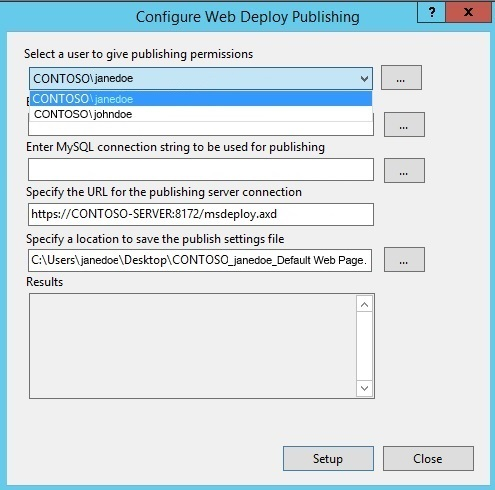

Installing and Configuring Web Deploy on IIS 8.0 or Later
====================
by [Jim van de Erve](https://twitter.com/jimvde)

## Summary

In this walkthrough, we will show steps for installing and configuring Web Deploy on IIS 8.0 or later for administrator or non-administrator deployments. This means the steps necessary to enable a client to use Web Deploy to publish Web site content to the server, even if the client does not have administrator credentials for the server.

Windows 8.0 and 8.1 do not come with the Web Management Service that is required for remote connections. For more information, see [Remote Publishing Cannot Be Set up on Windows 8.0 or 8.1](#00).

## Installing Web Deploy

You can install Web Deploy by using the Web Platform Installer (Web PI) or the Web Deploy MSI.

- Use the Web Platform Installer (Web PI) to install the Recommended Server Configuration for Web Hosting Providers, which includes Web Deploy
- Use Web PI to install Web Deploy separately (with or without its dependencies)
- Use the Web Deploy installer.

### Installing Web Deploy as Part of the Recommended Server Configuration for Web Hosting Providers

When the Web Platform Installer installs the Recommended Server Configuration for Web Hosting Providers, it configures the web server with the most common deployment for web hosting providers. This package makes sure that the IIS 8.0 or later prerequisites required for Web Deploy are installed. Dependencies such as SQL Server Management Objects and SQL Server are selected automatically for installation, and installed with the Web PI prerequisites, such as the Web Service Management Handler. The package includes some optional components, such as PHP and MySQL, that you can choose not to install with this bundle by clicking the **X** next to them.

The Recommended Server Configuration for Web Hosting Providers can be installed on Windows 2012 Server or later. For information about installing on earlier versions of Windows Server with IIS 7, see [Installing and Configuring Web Deploy on IIS 7](installing-and-configuring-web-deploy.md).

1. Download the [Web Platform Installer](https://www.microsoft.com/web/downloads/platform.aspx).
2. Open Web PI.
3. In Web PI, click in the search bar in the upper-right hand corner, enter &quot;Recommended&quot; in **Search**, and press **Enter**.
4. Select **Recommended Server Configuration for Web Hosting Providers**, and then click **Add**.
5. Click **Install**.
6. On the **Prerequisites** page, click **I accept**.
7. After the installation has completed, click **Finish**.

### Using the Web Platform Installer to install Web Deploy Separately

You can install Web Deploy separately with its dependencies, such as the Web Management Service (WMSvc). You can install the following versions of Web Deploy.

- **Web Deploy 3.5 without bundled SQL**: Installs Web Deploy alone.
- **Web Deploy 3.5**: Web Deploy plus support for SQL database publishing
- **Web Deploy 3.5 for hosting servers**: Web Deploy plus IIS/ASP.NET dependencies and support for SQL database publishing. This includes dependencies to install base IIS plus Management Service (required for non-admin publishing) and PowerShell 2.0 or later (used to do some basic non-admin publishing setup during install).

If you install Web Deploy directly in Web PI, rather than as part of the Recommended Server Configuration for Web Hosting Providers, the dependencies required for Web Deploy may not be installed.

Using Web PI, Web Deploy can be installed on Windows 2012 Server or later, or Windows 8.0 or later. For information about installing on earlier versions of Windows Server or Windows with IIS 7, see [Installing and Configuring Web Deploy on IIS 7](installing-and-configuring-web-deploy.md).

To install Web Deploy separately using Web PI:

1. Download the [Web Platform Installer](https://www.microsoft.com/web/downloads/platform.aspx).
2. Open WebPI on your desktop.
3. Click in the search bar in the upper-right hand corner, enter &quot;Web Deploy&quot;, and press **Enter**.  
    
4. Select the Web Deploy that you want, and then click **Add**.  
    
5. On the **Prerequisites** page, click **I accept**.
6. After the installation has completed, click **Finish**.

### Using the Web Deploy Installer to Install Web Deploy

You can install Web Deploy directly using the MSI installer. Using the MSI directly is generally not recommended for the novice user, as recommended or required dependent products may need to be installed separately. The following limitations may create issues when using the MSI instead of Web PI to install Web Deploy on servers:

- The MSI will not install SQL Shared Management Objects (SMO), which is required for the SQL Server database deployments. This component may be installed using Web PI to enable SQL Server database deployments.
- The MSI will not install the Web Management Service handler component if the Web Management Service is not installed. The handler component is necessary for non-administrator deployments. Windows component IIS, including Management Service, should be installed first to enable the handler component to install.
- When Web Deploy is installed directly using the Web Deploy MSI, the Web Management Service will not be configured for non-administrator deployments, unless PowerShell v2 or later is installed.

Using the Web Deploy Installer, Web Deploy can be installed on Windows 2012 Server or later, or Windows 8.0 or later.

To install Web Deploy from the .msi file:

1. Go to the [Web Deploy](https://www.iis.net/downloads/microsoft/web-deploy) download page.
2. On the Web Deploy download page, move to the **Download Web Deploy** section, and for the language you want, select **x86** or **x64**.
3. Run the Web Deploy .msi, and move through the installer wizard, selecting the features that you want in the Custom Setup page.

## Configuring a Site for Delegated Non-Administrator Deployment

After installing Web Deploy, all server-level configuration is complete for non-administrator publishing; however, additional configuration is required at a site level. This site configuration can be accomplished using PowerShell or IIS Manager, as described below.

### Remote Publishing Cannot Be Set up on Windows 8.0 or 8.1

You cannot set up remote publishing using Web Deploy for a site that is hosted in IIS on Windows 8.0 or 8.1. The reason is that the client SKUs for Windows do not come with the Web Management Service that is required for remote connections. As a result, on Windows 8.0 or 8.1, the IIS Manager Permissions icon and the Configure Web Deploy Publishing deployment option that are required to configure remote publishing are not available in the IIS Manager.

When you use the Add Roles and Features wizard to install the Management Service role on Windows Server 2012 or later, the Web Management Service is installed and enabled. The IIS Manager Permissions icon is available for a Web site in the Management area of the IIS Manager, and the Configure Web Deploy Publishing deployment option is available in the Deploy menu for a Web site in IIS Manager. With these features, the Web Management Service allows you to configure publishing to a Web server from a remote computer using Web Deploy.

### Using PowerShell to configure Web Deploy for a Non-Administrator

1. Create a new site or set permissions on an existing Web site for a new or existing non-administrator user using Web Deploy PowerShell scripts. For more information, see [PowerShell Scripts for Automating Web Deploy Setup](../../publish/using-web-deploy/powershell-scripts-for-automating-web-deploy-setup.md) and [Web Deploy PowerShell Cmdlets](../../publish/using-web-deploy/web-deploy-powershell-cmdlets.md).

### Using the IIS Manager to configure Web Deploy for a Non-Administrator

The following steps configure publishing on an existing site for an existing user using the IIS Manager UI.

1. Start IIS Manager (open **Server Manager**, click **Tools**, and then open **IIS Manager**.
2. Expand the **Sites** node and click a site.
3. In the **Management** area of the site's home pane, double-click **IIS Manager Permissions**. 
4. In the **Actions** pane, click **Allow User**. 
5. In the **Allow User…** dialog box, with **Windows** selected, click **Select**.
6. In the **Select User or Group** dialog box, in **Enter the object name to select**, enter the name of a non-administrator Windows user who will have publishing permissions to the site, with domain. Click **Check Names**, and then after the name has been verified, click **OK**.
7. In the **Allow User…** dialog box, click **OK**.
8. Verify that the name with domain is entered in the **IIS Manager Permissions** pane.
9. Right-click the site that you are configuring, point to **Deploy**, and then click **Configure Web Deploy Publishing...**. The following UI will appear:  

    Note: If the Deploy command is not shown in the menu for a site, close and then reopen IIS Manager.

    
10. Click the down arrow for **Select a user to give publishing permissions**, and select the user that you entered for IIS Manager Permissions.
11. Click **Setup**. 

    The following log lines will appear:

- Publish enabled for 'NonAdminUser'
- Granted 'NonAdminUser' full control on 'C:\inetpub\wwwroot\test'
- Successfully created settings file 'C:\Users\janedoe\Desktop\CONTOSO\_johndoe\_Default Web Site.PublishSettings'

The non-administrator Windows user (NonAdminUser) may now publish to the site.

### Install and Configure Web Deploy for Administrator deployments

#### Requirements:

Install Web Deploy using one of the procedures described above.

### Troubleshooting Common Issues:

- If you are upgrading an existing installation of Web Deploy, make sure to restart the handler and agent services by running the following commands at an administrative command prompt:
- net stop msdepsvc &amp; net start msdepsvc
- net stop wmsvc &amp; net start wmsvc
- Make sure your firewall allows connections to the service you are using. By default, the Web Deployment Agent Service (MsDepSvc) listens on port 80, and the Web Management Service (WmSvc, also called the "handler") listens on port 8172 by default.
- You must run MsDepSvc by using the built-in Administrator account, or from a domain account that has been added to the Administrators group. A local administrator which is not the built-in account will not work with MsDepSvc.
- Check to see if .NET 4.0 has not been registered with IIS: 

    **Symptoms**: .NET 4.0 is installed, but there are no .NET 4.0 application pools or handler mappings in IIS. You cannot browse to applications that use .NET 4.0 (for example, applications based on WebMatrix's site template applications) after you publish them.

    **Cause**: Your machine had .NET 4.0 installed on it before IIS was installed.

    **Solution**: Run the following command to register .NET 4.0 with IIS: %systemdrive%\Windows\Microsoft.NET\Framework64\v4.0.30319\aspnet\_regiis.exe -iru