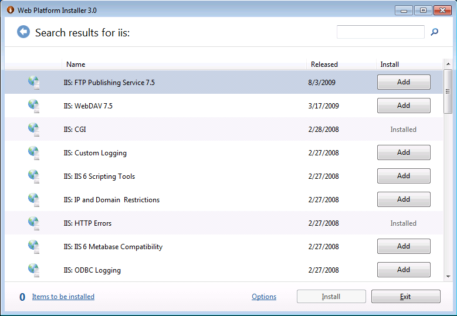
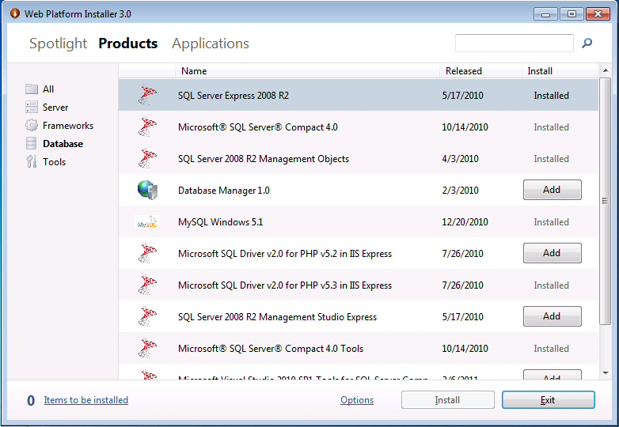

Using the Microsoft Web Platform Installer
====================
by [Chris Sfanos](https://github.com/chrissfanos)

## Introduction

The Microsoft® Web Platform Installer (Web PI) makes it easy for you to download, install, and keep up to date on the latest software components of the Microsoft® Web Platform for development and application hosting on the Windows® operating system. Web PI does the work of comparing the newest available components across the Microsoft Web Platform against what is already installed on your computer; you can see what is new and what you haven't yet installed. You can use Web PI to learn more about different components and install one or more components in a chained installation, with Web PI handling reboots and logging failures where applicable. The currently available software components include Microsoft WebMatrix, Internet Information Services (IIS), the latest versions of PHP 5.2 and PHP 5.3, Microsoft® SQL Server® 2008 R2 Express, the Microsoft®.NET Framework, and Microsoft® Visual Web Developer 2010 Express Edition with Service Pack 1.

Web PI also provides an interface to the [Windows Web App Gallery](https://www.microsoft.com/web/gallery/), a community-driven hub of the most popular open-source and community Web applications that run on Windows. Accessible from anywhere through the [Microsoft Web Platform site](https://www.microsoft.com/web/), the Windows Web App Gallery provides a streamlined way for users to explore, discover, and install Microsoft® ASP.NET, PHP, and other types of Web applications for the Windows operating system, providing Web developers with access to millions of Web users worldwide. The Windows Web App Gallery lets developers submit their own applications for inclusion; once accepted, a Web application can appear in Web PI for anyone to download.

System requirements for Web PI include an Internet connection and one of the following supported operating systems:

- Windows Server® 2008 R2 or Windows Server® 2008
- Windows Server® 2003 Service Pack 2 (SP2)
- Windows Vista® Service Pack 2 (SP2)
- Windows® XP Service Pack 3 (SP3)
- Windows® 7

## Web PI for Hosters

Web PI can help in the following scenarios:

- Building reference machines used for the creation of images for dedicated or virtual dedicated offerings.
- Building the Web Server reference machine for a shared hosting environment.
- Updating existing machines with the latest components.
- Deploying an internal development or testing environment.
- Referring customers to use Web PI to setup their own dedicated machines or local environments for development and testing before deploying to hosted environments.

## Web PI for Web Hosting Customers

Web PI can help in the following scenarios:

- Deploying a development environment with the entire Web Platform stack of components. Includes the latest Web, database, and development tools and technologies.
- Updating the development environment with the latest components.

## Install the Web Platform

Web PI automates the discovery and installation of the Microsoft Web Platform, which includes the Web Server, Frameworks and Runtimes, Database, and Tools sections. In version 3.0, the Microsoft Web Platform also installs the latest 5.2 and 5.3 versions of PHP.

Download [Web PI](https://www.microsoft.com/web/Downloads/platform.aspx). WebPI starts up on the "Spotlight" tab, where we highlight products and applications that we think will be the most interesting for our users

###### Figure 1: "WebPI Spotlight" tab

WebPI seperates the components you can install into two main categories: Products and Applications. In the Products tab, you will find all the components you need to build and maintain your web sites. The Applications tab is home to our wide collection of open-source applications that you can use as a great starting place for developing your sites

The "Products" tab shows the four main components: Server, Frameworks, Database and Tools.

###### Figure 2: "Products" tab

### Server

The Internet Information Services (IIS) Web server ships in the Windows client and server operating systems, providing a secure, easy-to-manage Web platform for reliably hosting rich Web applications and Web services.

As of the IIS 7.0 release (which shipped in Windows Server 2008), IIS began using its new extensible architecture to release free Web extensions, such as the Web Deployment Tool and Database Manager. Microsoft fully supports these extensions for the lifetime of the operating system and also has plans of localizing the extensions for international customers.

WebPI currently installs the latest IIS release (version 7.5, which shipped with Windows Server 2008 R2).

Also included in WebPI is IIS Express 7.5, the lightweight self-contained version optimized for developers. IIS Express makes it easy to use the most current version of IIS to develop and test websites. It has all the core capabilities of IIS 7.5 as well as additional features designed to ease website development including:

- It doesn't run as a service or require administrator user rights to perform most tasks
- IIS Express works well with ASP.NET and PHP applications
- Multiple users of IIS Express can work independently on the same computer

Web PI simplifies the discovery and installation of Web server components by:

- **Automatically configuring the IIS Web server components that ship in Windows.** On Windows 7 and Windows Vista, the Web server components are "Optional Windows Components." Optional Windows components are part of the Windows installation but are not activated until the user explicitly goes through the process of activating the IIS Windows feature. Likewise, with Windows Server® 2003 and Windows Server 2008, a systems administrator uses Server Manager to install the Web Server role (which installs IIS). With Web PI, setting up the Windows components involves selecting a single product entry
- **Automatically "discovering" IIS Extensions that ship on the Web.**  
 The IIS team ships extensions that expand the management and runtime capabilities of the IIS Web server and applications hosted on IIS. Users can select from the IIS Web extensions that appear alongside the IIS components that ship in Windows. This integration makes it easy to find and install the Web extensions that the IIS product team delivers on a quarterly basis.

To see all the IIS components available for installation, just search for **IIS** or to install the recommended set, search for and install the **IIS 7 Recommended Configuration**

###### Figure 3: Searching for IIS components in WebPI

You can learn more about the IIS extension by double-clicking the extension name. For example, on the details page for an IIS component, you can learn more about what the extension does before installing it, and there are links to even more detailed descriptions.

###### Figure 4: More information on the IIS: FTP Publishing Service 7.5

### Frameworks

The Frameworks section provides developers with programming frameworks for application development.

###### 

###### Figure 5: Frameworks

Web Pl 3.0 currently installs the latest community PHP 5.2.and 5.3 from the community PHP download page. Web PI installs PHP along with the following optional PHP components:

- [MySQL Extension](http://us3.php.net/mysql)
- [MySQL Improved Extension](http://us3.php.net/mysqli)
- [SQL Server Improved Extension](http://us3.php.net/mysqli)
- [Image Processing and GD](http://us3.php.net/gd)
- [Gettext extension](http://us3.php.net/gettext)
- [Client URL Library](http://us3.php.net/curl)
- [Exchangeable Image Information](http://us3.php.net/exif)
- [XML-RPC](http://us3.php.net/xmlrpc)
- [OpenSSL](http://us3.php.net/openssl)

Web PI also installs ASP.NET MVC 3.0. ASP.NET is a powerful framework for building dynamic Web applications. As a programming framework, ASP.NET is adaptable to a wide variety of projects and development styles. ASP.NET is part of the .NET Framework, and when coding ASP.NET applications developers have access to the entire .NET Framework. The Model View Controller (MVC) extension enables users to build MVC applications by using the ASP.NET framework.

### 

### Database

The Database section includes the SQL Server tools for application development and management.

SQL Server 2008 R2 is a complete database engine providing ease of use and manageability for running high-performance Web applications. You can select SQL Server 2008 Express SP1 for a flexible runtime environment for database programming.

SQL Server 2008 R2 Management Studio Express gives developers tools to more easily manage databases in development, staging, or production environments—you can use this option if the SQL Server Express runtime itself is already installed to simplify the management of databases.

###### Figure 6: Database

The SQL Server 2008 R2 Management Objects gets pulled in as a dependency for some extensions and/or applications. (Typically, a user will not install this option.)

Web PI includes the Microsoft® SQL Server® 2008 Driver v 2.0 for PHP, which enables reliable, scalable integration with SQL Server for PHP applications deployed on the Windows platform. The extension allows the reading and writing of data from within PHP scripts and provides a procedural interface for accessing data in all editions of SQL Server 2008 (including Express). The extension also supports the use of PHP streams to read and write large objects. Information, including the source code, is available on [CodePlex](http://www.codeplex.com/SQL2K5PHP).

### Tools

The Tools section provides developer tools to build Web applications for the Microsoft Web Platform.

Visual Web Developer Express is a free Microsoft® Visual Studio® Web development environment for building and testing next-generation, standards-based Web applications and services. With full support for Web standards, JavaScript, and ASP.NET, Visual Web Developer Express enables developers to quickly build out new applications.

The Microsoft® Silverlight™ 4 Tools for Visual Studio provide a development environment for Microsoft® Silverlight™ programmers. The Silverlight Tools are free add-ons to the free download version of Visual Web Developer Express or the full version of Microsoft® Visual Studio® 2010 SP1.

###### Figure 7: Tools

## Install Applications from the Microsoft Web Application Gallery

The Web Platform Installer 3.0 simplifies discovery and deployment of ASP.NET and PHP applications in the [Windows Web App Gallery](https://www.microsoft.com/web/gallery/).

To learn more about the Web Application Gallery, see [Introducing the Windows Web Application Gallery](../../develop/windows-web-application-gallery/introducing-the-windows-web-application-gallery.md).

When an application is added to the Windows Web Application Gallery, the application integrates into an Atom feed which Web PI consumes; every time a user opens the Web Applications tab, the user sees the latest applications in the Web Application Gallery.

###### Figure 8: Web Applications

By default, you see the full list of applications in the Windows Web Application Gallery. You can also browse by category to discover applications. These applications are free of charge (although the application provider can offer premium paid support) and follow the [Windows Web Application Gallery Principles](../../develop/windows-web-application-gallery/windows-web-application-gallery-principles.md) for running well on Windows.

When you select an application, Web PI automatically installs the prerequisite Windows components and other components (such as PHP) to run the application. The list of required Web Platform dependencies for WordPress is displayed for you before installation. In this example, Wordpress is being installed on a Windows 7 machine. By default, WebPI will bring along Microsoft WebMatrix, a free, solid and reliable platform for customizing popular web applications

The prerequisite information comes from the application developer. As part of the application submission process, the application provider gives Microsoft information such as a prerequisite environment and a URL to the Microsoft Web Deployment–enabled package. Web PI uses that information to make sure that the environment is set up properly to run the application on Windows, using the application package that is publicly available for download on the application community site.

For more developer information on Web Application Gallery, see the [Windows Web App Gallery Developer site](https://www.microsoft.com/web/gallery/developer.aspx).

## Best Practices for Using Web PI

Follow these best practices to prevent errors or installation issues when using the Web PI.

**Close all programs and restart your computer.**  
The Web PI functions by running the setup for the selected applications one after the other, as in a chain. These setup programs are run "silently," meaning they run without displaying a user interface. In some cases, setup programs will block an installation if certain applications are running. For this reason, all applications should be closed or stopped. A simple way to do this is to restart your computer. If an application is configured to start when Windows starts, you will need to close it manually.

Sometimes the Web PI encounters a problem due to a pending restart. Certain operations require a restart (for example, if system dynamic-link libraries (DLLs) are replaced by a system update or hotfix installation). Setup programs can, and do, block the installation when a restart is pending.

**Keep Windows up to date.**  
Make sure your operating system and the any applications or components that are already installed have been updated. Software that is out of date may cause issues for which the Web PI has not been tested.

**Uninstall pre-release applications and components.**  
Beta versions can create difficulty for installers because they use many of the same resources as the released version. For this reason, many setup programs block the installation of an application if a pre-released version is detected on the computer.

**Avoid using the computer when installing Web PI.**  
Modifying the state of the machine while an installation is in progress can cause the installation to fail. For example, when a setup program starts it determines whether there is enough hard disk space available to install the application. Running applications or performing other tasks during the installation may cause the hard disk to have less space available and cause the installation to fail.

## Troubleshooting and Finding Help

If you have an issue using the Web Platform Installer, visit the [Web Platform Installer forum](https://forums.iis.net/1155.aspx) for free, best-effort support by the product team, or review [Troubleshoot Microsoft Web Platform Installer Issues](../../troubleshoot/web-platform-installer-issues/troubleshooting-problems-with-microsoft-web-platform-installer.md).

Note that because Web PI brings together community applications, Microsoft Web Platform components, and PHP, issues may occur at:

- Web PI level—usually based on proxies, since Web PI depends on accessing public URLs.
- Application package level—usually based on Web Deployment integration for application packaging.
- Application functionality—questions about how applications work are redirected by Microsoft to the community forums for that application.

You can also refer to [Windows Web Application Gallery: Known Issues](../../develop/windows-web-application-gallery/windows-web-application-gallery-known-issues.md).

> [!NOTE]
> *This article updates:*[Web Platform Installer 2.0 Walkthrough](../../web-hosting/configuring-servers-in-the-windows-web-platform/microsoft-web-platform-installer-20.md)*by the IIS Team, published on September 28, 2009.*

## Links for Further Information

[Web Platform Installer Resources](web-platform-installer-resources.md).

[Videocast: Simplified Application Deployment on the Microsoft Web Platform](../../publish/deploying-application-packages/videocast-simplified-application-deployment-on-the-microsoft-web-platform.md).

[Real World IIS: Staying Current with the Latest Microsoft Web Platform with Web Platform Installer (videocast)](https://blogs.iis.net/mailant/archive/2009/05/02/real-world-iis-staying-current-with-the-latest-microsoft-web-platform-with-web-platform-installer-videocast.aspx).

[Microsoft Web Platform](https://www.microsoft.com/web/platform/).

[Windows Web Application Gallery Principles](../../develop/windows-web-application-gallery/windows-web-application-gallery-principles.md).

[Web Platform Installer](https://technet.microsoft.com/en-us/library/ee506569(WS.10).aspx).

[Microsoft.Web.PlatformInstaller Namespace](https://msdn.microsoft.com/en-us/library/microsoft.web.platforminstaller.aspx).
  
  
[Discuss in IIS Forums](https://forums.iis.net/1155.aspx)