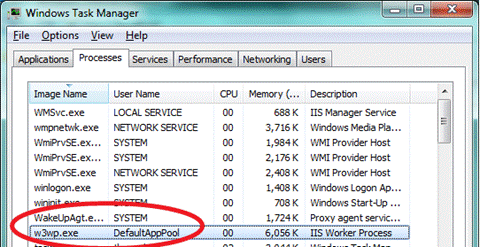

# Ensure Security Isolation for Web Sites

by Tali Smith

## Introduction

The recommendation for isolating Web sites in a shared hosting environment is consistent with all general security isolation recommendations for Internet Information Services 7 (IIS 7) and above. In particular, it is recommended to:

- Use one application pool per Web site.
- Use a dedicated user account as an identity for the application pool.
- Configure anonymous user identity to use the application pool identity.
- Ensure that FastCGI impersonation is enabled in the Php.ini file.

An architectural view of application pools appears in the figure that follows.

*Figure 1: Application pools*

## Create Application Pools

You can create application pools from the UI or the command line.

1. From the **IIS Manager**, navigate to the **Connections** pane.
2. Choose the **Application Pools** option, and then choose **Add Application Pool** to open the Add Application Pool dialog box.
3. Enter a unique name for the application pool.
4. Choose the version, if any, of the Microsoft® .NET Framework for the application pool to use, and then choose your pipeline mode.

Once a pool is created, you can change its settings whenever necessary.

1. From the **Connections** pane, choose **Application Pools**.
2. In the **Work** pane, choose the application pool you would like to configure.
3. From the **Actions** pane, choose **Basic Settings**. Note that with the exception of the dialog box title, the Basic Settings dialog box and the Add Application Pool dialog boxes look identical.

You can also use the command line. Use:

[!code-console[Main](ensure-security-isolation-for-web-sites/samples/sample1.cmd)]

Note that string is the name of the application pool.

The Edit Application Pool dialog box lets you configure how IIS 7 and above handles worker process recycling for the application pool.

*Figure 2: Edit Application Pool*

## Application Pool Identities

Application Pool Identities is a new security features that lets you run application pools under a unique account without having to create and manage domain or local accounts. The name of the application pool account corresponds to the name of the application pool. The figure that follows shows an IIS worker process (w3wp.exe) running as the DefaultAppPool identity.

*Figure 3: Application Pool Identity Accounts*

## Application Pool Identity Accounts

Worker processes in IIS 6, and in IIS 7 and above, run as NETWORKSERVICE by default. NETWORKSERVICE is a built-in Windows® identity. NETWORKSERVICE does not require a password and has only user privileges (it is relatively low privileged). Running as a low-privileged account is a good security practice because this prevents malicious users from using software bugs to take over the system.

Over time, however, more and more Windows system services have been run as NETWORKSERVICE, and these services can tamper with other services running under the same identity. Because IIS worker processes run third-party code by default (PHP, classic ASP, and Microsoft® ASP.NET), it became necessary to isolate IIS worker processes from other Windows system services and to run IIS worker processes under unique identities. The Windows operating system provides a feature called [virtual accounts](https://technet.microsoft.com/library/dd548356(WS.10).aspx) that lets IIS create unique identities for each of its application pools.

Whenever a new application pool is created, the IIS management process creates a security identifier (SID) representing the name of the application pool itself. For example, if you create an application pool with the name "MyNewAppPool," a SID with the name "MyNewAppPool" is created in the Windows Security system. Resources can be secured using this identity. Note that the identity is not a real user account, however; it will not show up as a user in the Windows User Management Console.

Try selecting a file in Windows Explorer® and adding the "DefaultAppPool" identity to its Access Control List (ACL):

1. Start **Windows Explorer**.
2. Select a *file* or *directory*.
3. Right-click on the *file name*, and then click **Properties**.
4. Click the **Security** tab.
5. Click **Edit**, and then click **Add**.
6. Click **Locations**, and select *your computer*.
7. In the **Enter the object names to select** text box, type **iis apppool\defaultapppool**
8. Click **Check Names**, and then click **OK**.

The file or directory you selected now also allows the DefaultAppPool identity access.

*Figure 4: Select Users or Groups*

You can also use the command line with the Icacls.exe tool. The following gives full access to the DefaultAppPool identity:

[!code-console[Main](ensure-security-isolation-for-web-sites/samples/sample2.cmd)]

On the Windows® 7 and Windows Server® 2008 R2 operating systems, the default is to run Application Pools as this security identifier (as the Application Pool Identity). A new identity type with the name "AppPoolIdentity" is available. If the "AppPoolIdentity" identity type is selected (this is the default on Windows 7 and Windows Server 2008 R2), IIS will run worker processes as the Application Pool identity. With every other identity type, the security identifier is only injected into the access token of the process. If the identifier is injected, content can still be ACLed for the AppPool identity, but the owner of the token is probably not unique. See the section [Isolate Application Pools](#Isolate_Application_Pools) that follows.

### Accessing the Network

Using the NETWORKSERVICE account in a domain environment has a great benefit. Worker process running as NETWORKSERVICE can access the network as the machine account. Machine accounts are generated when a machine is joined to a domain:

[!code-xml[Main](ensure-security-isolation-for-web-sites/samples/sample3.xml)]

For example:

[!code-console[Main](ensure-security-isolation-for-web-sites/samples/sample4.cmd)]

Network resources such as file shares or Microsoft® SQL Server® databases can be ACLed to allow access for this machine account. Application Pool identities also use the machine account to access network resources. No changes are required.

### Compatibility Issues with Application Pool Identities

A challenge with Application Pool Identities is that guidance documents explicitly recommend to ACL resources for NETWORKSERVICE (the default identity of the DefaultAppPool in IIS 6.0 and 7.0). Users must change their scripts to ACL for "IIS AppPool\DefaultAppPool" when running on IIS 7.5 and above.

IIS does not load the Windows user profile, but certain applications (such as Microsoft® SQL Server® 2008 Express) might use it anyway (for example, to store temporary data). The user profile must be created to store temporary data in the profile directory or in the registry hive. The user profile for the NETWORKSERVICE account was created by the system and was always available. A user profile is not created by the system, however, when switching to unique Application Pool identities. Only the standard application pools (DefaultAppPool and Classic .NET AppPool) have user profiles on disk. No user profile is created if the administrator creates a new application pool.

Note that IIS application pools can be configured to load the user profile however by setting the "LoadUserProfile" setting to "true".

## Isolate Application Pools

Separating applications into multiple application pools not only can improve performance but also improves server and site reliability. However, in previous versions of IIS, it has sometimes been difficult to isolate Web application pools from each other. If several application pools are configured to run with the same identity, then code running inside one application pool could use file system objects (FSOs) to access resources belonging to another.

In IIS 7, each application pool has a configuration file that is generated when the application pool is started. These files are stored by default in the `%systemdrive%\inetpub\temp\AppPools` folder.

Each application pool also has a Security Identifier (SID) that is added to the relevant w3wp.exe process. The application pool's configuration file is access control listed (ACLed) to only allow access to that SID.

You can use the Icacls.exe tool to identify the SID applied to any given application pool's configuration file with:

[!code-console[Main](ensure-security-isolation-for-web-sites/samples/sample5.cmd)]

A user can use the application pool SID to ACL their contents and secure their Web site. This is useful for Web hosters who need to accept content from various external sources.

1. Configure each Web site (or Web application) to run in its own Web application pool.
2. Configure anonymous authentication to use the application pool identity, rather than the Industry Usability Reporting (IUSR) account by editing the Anonymous Authentication properties.
3. Remove NTFS permissions for the IUSRS group and the IUSR account from the Web site's files and folders.
4. Use the Icacls.exe tool to give the application pool's SID "read" (and optionally "execute" and "write") access to the Web site's files and folders. You can use IIS APPPOOL\ApplicationPoolName as the user to grant read permissions.

After configuring the NTFS permissions, only the SID that has been injected into a particular w3wp.exe process will be able to read the contents of the Web site. All code running in other w3wp.exe processes (even if running with the same identity) will not be able to access this Web site's content.

> [!NOTE]
> *This article is based on material from [Application Pool Identities](application-pool-identities.md) written by the IIS Team and published on May 27, 2009.*

## Links for Further Information

- [New in IIS 7 - App Pool Isolation](http://www.adopenstatic.com/cs/blogs/ken/archive/2008/01/29/15759.aspx)
- [Create an Application Pool (IIS 7)](https://technet.microsoft.com/library/cc731784.aspx)
- [Managing Application Pools in IIS 7](https://technet.microsoft.com/library/cc753449(WS.10).aspx)
