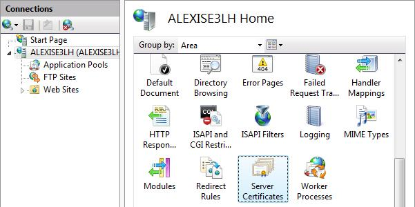

# How to Set Up SSL on IIS 7

by [Saad Ladki](https://twitter.com/saadladki)

## Introduction

The steps for configuring Secure Sockets Layer (SSL) for a site are the same in IIS 7 and above and IIS 6.0, and include the following:

- Get an appropriate certificate.
- Create an HTTPS binding on a site.
- Test by making a request to the site.
- Optionally configure SSL options, that is, by making SSL a requirement.

This document provides some basic information on SSL, then shows how to enable SSL in the following ways:

- Using IIS Manager.
- Using the AppCmd.exe command line tool.
- Programmatically through Microsoft.Web.Administration.
- Using WMI scripts.

This article contains the following sections:

- [SSL Configuration](#SSL)
- [Using AppCmd](#AppCmd)
- [Using WMI](#WMI)
- [Using IIS Manager](#IISManager)
- [Summary](#Summary)

<a id="SSL"></a>

## SSL Configuration

Whether you are running your web site on your own server, or [in the cloud](https://www.windowsazure.com/documentation/services/web-sites/), using SSL to secure your site is probably extremely important to you, as many websites are turning to it to protect user's privacy. If you need to configure SSL on your server, it's important to realize that the implementation of SSL changed from IIS 6.0 to IIS 7 and above. In IIS 6.0 on Windows Server 2003, all SSL configuration was stored in the IIS metabase, and encryption/decryption occurred in User mode (requiring a lot of kernel/user mode transitions). In IIS 7 and above, HTTP.sys handles SSL encryption/decryption in kernel mode, resulting in up to 20% better performance for secure connections in IIS 7 and above than that experienced in IIS 6.0.

Using SSL in kernel mode requires storing SSL binding information in two places. First, the binding is stored in %*windir*%\System32\inetsrv\config\applicationHost.config for your site. When the site starts, IIS sends the binding to HTTP.sys, and HTTP.sys starts listening for requests on the specified IP:Port (this works for all bindings). Second, the SSL configuration associated with the binding is stored in the HTTP.sys configuration. Use the **netsh** command at a command prompt to view SSL binding configuration stored in HTTP.sys as in the following example:

[!code-console[Main](how-to-set-up-ssl-on-iis/samples/sample1.cmd)]

When a client connects and initiates an SSL negotiation, HTTP.sys looks in its SSL configuration for the IP:Port pair to which the client connected. The HTTP.sys SSL configuration must include a certificate hash and the name of the certificate store before the SSL negotiation will succeed.

**Troubleshooting Tip:** If you're having trouble with an SSL binding, verify that the binding is configured in ApplicationHost.config, and that the HTTP.sys store contains a valid certificate hash and store name for the binding.

### Choosing a Certificate

When choosing a certificate, consider the following: Do you want end users to be able to verify your server's identity with your certificate? If yes, then either create a certificate request and send that request to a known certificate authority (CA) such as VeriSign or GeoTrust, or obtain a certificate from an online CA in your intranet domain. There are three things that a browser usually verifies in a server certificate:

1. That the current date and time is within the "Valid from" and "Valid to" date range on the certificate.
2. That the certificate's "Common Name" (CN) matches the host header in the request. For example, if the client is making a request to `https://www.contoso.com/`, then the CN must be `www.contoso.com`.
3. That the issuer of the certificate is a known and trusted CA.

If one or more of these checks fails, the browser prompts the user with warnings. If you have an Internet site or an intranet site where your end users are not people you know personally, then you should always ensure that these three parameters are valid.

Self-signed certificates are certificates created on your computer. They're useful in environments where it's not important for an end user to trust your server, such as a test environment.

<a id="AppCmd"></a>

## Using AppCmd

You can request or create a certificate by using AppCmd.exe. You also can use AppCmd.exe to create an SSL binding.

### Configure SSL Settings

You can use AppCmd.exe to configure a site to accept only server HTTPS connections by modifying the **sslFlags** attribute in the Access section. For example, you can configure this setting for the "Default Web Site" in the ApplicationHost.config file (for example, commitPath:APPHOST) by using the following command:

[!code-console[Main](how-to-set-up-ssl-on-iis/samples/sample2.cmd)]

If successful, the following message is displayed:

[!code-console[Main](how-to-set-up-ssl-on-iis/samples/sample3.cmd)]

> [!NOTE]
> To require 128-bit SSL, change the sslFlags value to **Ssl128**.

The following example demonstrates how to view the &lt;access/&gt; section settings for the Default Web Site. The **sslFlags** attribute has been set successfully.

[!code-console[Main](how-to-set-up-ssl-on-iis/samples/sample4.cmd)]

Executing the command results in the following entry in the ApplicationHost.config file:

[!code-xml[Main](how-to-set-up-ssl-on-iis/samples/sample5.xml)]

<a id="WMI"></a>

## Using WMI

You cannot request or create a certificate by using the WebAdministration WMI namespace.

### Create an SSL Binding

The following script demonstrates how to create a new SSL binding and how to add the appropriate configuration for both HTTP.sys and IIS:

[!code-console[Main](how-to-set-up-ssl-on-iis/samples/sample6.cmd)]

[!code-vb[Main](how-to-set-up-ssl-on-iis/samples/sample7.vb)]

[!code-vb[Main](how-to-set-up-ssl-on-iis/samples/sample8.vb)]

> [!NOTE]
> The certificate hash and store must reference a real, functional certificate on your server. If the certificate hash and/or store name are bogus, an error is returned.

### Configure SSL Settings

The following script demonstrates how to set SSL settings by using the IIS WMI provider. You can find this value in the IIS\_Schema.xml file.

```
CONST SSL = 8  
Set oIIS = GetObject("winmgmts:root\WebAdministration")  
Set oSection = oIIS.Get(\_  
 "AccessSection.Path='MACHINE/WEBROOT/APPHOST',Location='Default Web Site'")  
oSection.SslFlags = oSection.SslFlags OR SSL  
oSection.Put\_ <a id="IISManager"></a>
```

<a id="IISManager"></a>

## IIS Manager

### Obtain a Certificate

Select the server node in the treeview and double-click the **Server Certificates** feature in the listview:  
[](how-to-set-up-ssl-on-iis/_static/image1.jpg)

Click **Create Self-Signed Certificate...** in the **Actions** pane.  
[](how-to-set-up-ssl-on-iis/_static/image3.jpg)

Enter a friendly name for the new certificate and click **OK**.

Now you have a self-signed certificate. The certificate is marked for "Server Authentication" use; that is, it uses as a server-side certificate for HTTP SSL encryption and for authenticating the identity of the server.

### Create an SSL Binding

Select a site in the tree view and click **Bindings...** in the **Actions** pane. This brings up the bindings editor that lets you create, edit, and delete bindings for your Web site. Click **Add...** to add your new SSL binding to the site.

[](how-to-set-up-ssl-on-iis/_static/image6.jpg)

The default settings for a new binding are set to HTTP on port 80. Select **https** in the **Type** drop-down list. Select the self-signed certificate you created in the previous section from the **SSL Certificate** drop-down list and then click **OK**.

[](how-to-set-up-ssl-on-iis/_static/image9.jpg)

Now you have a new SSL binding on your site and all that remains is to verify that it works.  
[](how-to-set-up-ssl-on-iis/_static/image12.jpg)

### Verify the SSL Binding

In the Actions pane, under Browse Web Site, click the link associated with the binding you just created.  
[](how-to-set-up-ssl-on-iis/_static/image14.jpg)

Internet Explorer (IE) 7 and above will display an error page because the self-signed certificate was issued by your computer, not by a trusted Certificate Authority (CA). IE 7 and above will trust the certificate if you add it to the list of Trusted Root Certification Authorities in the certificates store it on the local computer, or in Group Policy for the domain.
Click **Continue to this website (not recommended)**.  
[](how-to-set-up-ssl-on-iis/_static/image16.jpg)

### Configure SSL Settings

Configure SSL settings if you want your site to require SSL, or to interact in a specific way with client certificates. Click the site node in the tree view to go back to the site's home page. Double-click the **SSL Settings** feature in the middle pane.

[](how-to-set-up-ssl-on-iis/_static/image19.jpg)

<a id="Summary"></a>

## Summary

In this walkthrough, we successfully used the command-line tool AppCmd.exe, the scripting provider WMI, and IIS Manager to set up SSL on IIS.
