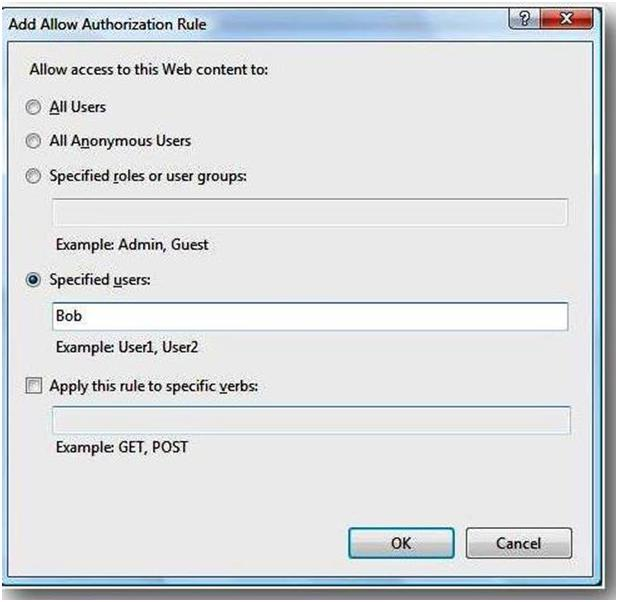

Understanding IIS 7.0 URL Authorization
====================
by [Saad Ladki](https://twitter.com/saadladki)

## Introduction

Authorization was difficult in previous versions of IIS. Because IIS only worked with Windows identities, you had to go to the file system and set Access Control Lists on files and directories. This was tedious because the ACL UI is complex and authorization rules do not copy very well from machine to machine.

IIS 7.0 and above uses URL Authorization. It allows you to put authorization rules on the actual URL instead of the underlying file system resource. Additionally, the IIS URL Authorization configuration is stored in web.config files-- you can distribute authorization rules with the application content. The following walkthrough introduces you to the IIS URL Authorization feature in Windows Server® 2008 Beta 3 and Windows Vista Service Pack 1.

## Prerequisites

This walkthrough requires installing the following IIS above features on top of the default install:

- "ASP.NET" under "Internet Information Services" – "World Wide Web Services" – "Application Development Features"
- "URL Authorization" under "Internet Information Services" –" World Wide Web Services" – "Security"

## Scenario

Let's simulate a scenario where you have a secure directory that only Alice, Bob and the Administrators group can access. Within this directory we have a file called bobsSecret.aspx that only Bob is supposed to access.

### Scenario Setup

For this scenario we need three users: Alice, Bob and Fred. We also need a new group called BobAndFriends in which Alice and Bob are members. Create the three accounts and the group via the Windows User Manager or by starting an elevated command prompt and enter the following commands

[!code-console[Main](understanding-iis-url-authorization/samples/sample1.cmd)]

1. Open Explorer and go into the `%systemdrive%\inetpub\wwwroot` directory.
2. Create a directory called "secure".
3. Change into the "secure" directory and create a new file called "default.aspx". You can do this with notepad or any other text editor.
4. Paste the following code into the default.aspx page: 

[!code-html[Main](understanding-iis-url-authorization/samples/sample2.html)]
5. Create another file called bobsSecret.aspx and paste the following code into it: 

[!code-html[Main](understanding-iis-url-authorization/samples/sample3.html)]
6. Now see if the two web pages work by requesting [http://localhost/secure/](http://localhost/secure/) and [http://localhost/secure/bobsSecret.aspx](http://localhost/secure/bobsSecret.aspx).

### Configuring Authentication

Authentication answers the question "who" wants to have access. Authorization answers "if" the authenticated "who" actually gets access. So, before experimenting around with URL authorization, we must enable authentication because without knowing "who" wants to have access, we cannot answer the "if".

1. Start INETMGR by typing INETMGR in the "Start Search" menu.
2. Open the machine node in the left tree view, then open the "Default Web Site" node and select the "secure" directory.
3. Double click "Authentication."
4. Disable "Anonymous Authentication" and enable "Basic Authentication."
5. Now request [http://localhost/secure](http://localhost/secure) and [http://localhost/secure/bobsSecret.aspx](http://localhost/secure/bobsSecret.aspx) again. You will get prompted for credentials. Enter "Alice" as username and her password. You will be authenticated as "Alice".

    **Note: If you use Internet Explorer, you may to hit Ctrl+F5 so that Internet Explorer refreshes the cached version of the ASP.NET page.**

### Configuring URL Authorization

Now secure the two pages so that only Alice and Bob have access:

1. Double click the "secure" web directory again and select "Authorization Rules".
2. Remove the "Allow All Users" rule.
3. Click "Add Allow Rule…" and select the "Specified roles or user groups:" radio button and add "BobAndFriends" and click the "OK" button.  

    
4. Close all Internet Explorer windows because Internet Explorer caches the credentials that you entered in the previous step.
5. Open Internet Explorer and try to access the page using Fred's credentials. You do not get access.
6. Now try Bob's credentials or Alice's credentials. You get access.

### Configuring URL Authorization for a single web page

Now we still have the problem left that Alice can still access BobsSecret.aspx. Here is how you fix it:

1. Double click the "Secure" web directory again and select "Content View" at the bottom of the page.
2. You will see a list of files in the secure folder namely "default.aspx" and "bobsSecret.aspx".
3. Right click on bobsSecret.aspx and select "Feature View"  

    
4. Now you are making only changes for the bobsSecret.aspx page as indicated in the statusbar.
5. Select "Authorization Rules" again. You see the inherited settings, i.e. the BobsAndFriends group is allowed to access bobsSecret.aspx.
6. Remove the "BobsAndFriends" rule.
7. Now click "Add Allow Rule…"
8. Click the "Specified users:" radio button, enter "Bob" and click "OK".  

    
9. Close all Internet Explorer windows and request [http://localhost/secure/bobsSecret.aspx](http://localhost/secure/bobsSecret.aspx)
10. Only by entering Bob's credentials will you get access.

### URL Authorization Advanced Topics

The next paragraphs show some advanced URL Authorization topics.

### Configuration

You do not have to use the User Interface to specify URL Authorization settings. You can specify URL Authorization rules directly in your web.config file. The IIS &lt;authorization&gt; configuration section is delegated by default--you can distribute authorization rules together with web content. Below, see how the `%systemdrive%\inetpub\wwwroot\secure\web.config` file looks after following this walkthrough:

[!code-xml[Main](understanding-iis-url-authorization/samples/sample4.xml)]

## Differences Between ASP.NET URL Authorization and IIS URL Authorization

There are small but important differences between ASP.NET UrlAuthorization and IIS URL Authorization. Both modules can be installed via the IIS Setup. IIS URL Authorization installs when you install the "URL Authorization" feature in the IIS Setup User Interface:  

ASP.NET Url Authorization is installed when you install ASP.NET on top of IIS. If you are an ASP.NET expert, you recall that ASP.NET UrlAuthorization is implemented in the System.Web.Security.UrlAuthorizationModule module. The corresponding configuration section is system.web/authorization. Here is the configuration entry.

[!code-xml[Main](understanding-iis-url-authorization/samples/sample5.xml)]

The IIS URL Authorization module is implemented in the global module urlauthz.dll.

[!code-xml[Main](understanding-iis-url-authorization/samples/sample6.xml)]

It is important to keep in mind that the managedHandler precondition is on the ASP.NET UrlAuthorization module. The precondition tells you that the URL authorization module is invoked only when the code that handles the request is mapped to managed code, typically an .aspx or .asmx page. IIS URL Authorization, on the other hand, applies to all content. You can remove the managedHandler precondition from the ASP.NET Url Authorization module. It is there to prevent a performance penality you have to pay when every request (such as a request to .html or .jpg pages) would have to go through managed code.

### Rules Evaluation

There are also differences in the order in which IIS and the two URL authorization modules evaluate authorization rules. ASP.NET URL Authorization is developer-focused and developers have full control over which rules they set. IIS URL Authorization keeps the Administrator in mind and tries to make sure that developers cannot override the rules an Administrator sets.

**An example:** 

Suppose the administrator wants to ensure that all users of a particular site must be authenticated. To do this is, set the following configuration on the site root:

[!code-xml[Main](understanding-iis-url-authorization/samples/sample7.xml)]

This configuration denies access to anonymous users (\* = anonymous users, ? = authenticated users). With the lockElements="clear", you ensure that no one on a lower level can clear the inheritance of this setting. Your setting would be inherited to all applications and virtual directories of this site. It comes to a lock violation when you try to use the &lt;clear/&gt; statement at a lower level.

For more information on configuration locking, see [https://msdn.microsoft.com/en-us/library/ms178693.aspx](https://msdn.microsoft.com/en-us/library/ms178693.aspx).

You can also lock the clear element in ASP.NET Url Authorization. The problem is that ASP.NET URL Authorization evaluates authorization rules from the bottom up, i.e. it first evaluates rules in the current web.config file before it evaluates parent rules. As soon as a match is found, access is granted or denied. In the above example, you can still grant access to anonymous users by specifying &lt;add users="\*"/&gt; as an authorization rule in the secure web.config file. Because it gets evaluated first, anonymous users would be granted access.

The IIS URL Authorization module evaluates deny rules first. Because you deny access to anonymous users, you cannot simply override that rule. The other big difference is that parent rules are evaluated first. This means that if you deny access for Fred at a higher level, you can't allow access to Fred on a lower level.

### Differences table

| Difference | ASP.NET URL Authorization Behavior | IIS URL Authorization Behavior |
| --- | --- | --- |
| **Rule evaluation** | Order: a) Lower level first going up to the parent b) Order of appearance in rule collection | Order: a) Deny rules get evaluated first starting at the parent b) Allow rules starting at the parent. c) Order of appearance in rule collection |
| **IIS****User Interface** | No IIS User Interface | "Authorization Rules" User Interface |
| **Configuration section** | system.web/authorization | system.webServer/security/authorization |
| **Module** | System.Web.Security.UrlAuthorization | `%windir%\system32\inetsrv\urlauthz.dll` |
| **Content** | Applies only to content that is mapped to a managed handler (can be turned off via managedHandler precondition) | Applies to all content |

## Using Domain Accounts and Groups

You must specify domain accounts and groups using the following:

[!code-xml[Main](understanding-iis-url-authorization/samples/sample8.xml)]

This example uses the machinename, assuming our accounts were created on machine iis7test:

[!code-xml[Main](understanding-iis-url-authorization/samples/sample9.xml)]

## Using Non-Windows Identities

URL Authorization is not only for Windows identities. It works well for non-Windows, too. Use it together with ASP.NET Membership and Roles and for custom identities, in case you write your own authentication module.

## Summary

URL Authorization is a powerful new way to specify authorization rules for web applications. Now you can specify rules in XML without using Windows Access Control Lists any longer.