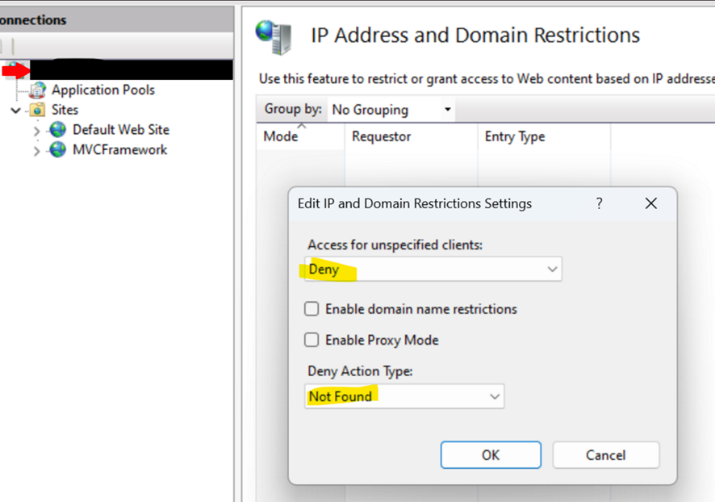

# Using Dynamic IP Restrictions

by [Nazim Lala](https://github.com/naziml)

## Introduction

The Dynamic IP Restrictions (DIPR) module for IIS 7.0 and above provides protection against denial of service and brute force attacks on web servers and web sites. To provide this protection, the module temporarily blocks IP addresses of HTTP clients that make an unusually high number of concurrent requests or that make a large number of requests over small period of time.

## When to use Dynamic IP Restrictions?

When you need to allow/deny access to a website (or allow all but log conditions met) based on the number of concurrent requests originating from an IP address or based on the number of requests from the IP over a period of time. 

## Features

The Dynamic IP Restrictions module includes these key features:

- **Blocking of IP addresses based on number of concurrent requests** - If an HTTP client exceeds the number of concurrent requests allowed, that client's IP address gets temporarily blocked.
- **Blocking of IP address based on number of requests over a period of time** - If an HTTP client exceeds the number of requests made over a specified time interval, that client's IP address gets temporarily blocked.
- **Allow list of IP addresses that will not be blocked -** You can add a list of the IP addresses of clients you want to exclude from being blocked by the module regardless of other configuration.
- **Various deny actions** - You can specify which response to return to an HTTP client for which the IP address is blocked. The module can return status codes 403 and 404 or just terminate the HTTP connection and not return any response.
- **Support for web servers behind a proxy** - If your web server is behind a proxy, you can configure the module to use the client IP address from an X-Forwarded-For header.
- **IPv6** - the module provides full support for IPv6 addresses.

## Installing the DIPR module

You can try the following methods to install the Dynamic IP Restrictions:

From the Select Role Services screen, navigate to Web Server (IIS) > Web Server > Security. Check the IP and Domain Restrictions check box and click Next to continue.
  
### Prerequisites

You must have one of the following operating systems.

- Windows Server 2008
- Windows Vista SP1
- Windows Server 2008 R2
- Windows 7

### Uninstall the Beta version of the DIPR module

If you are using the **first** **Beta** release of the DIPR module, you must uninstall it before you install the Release Candidate, or an error will occur and the installation will fail. Make sure you back up your configuration before uninstalling the Beta version.  
  
If you are using the **Beta 2** release of the DIPR module you can upgrade directly to the final release. Your configuration settings will be preserved. 

## Accessing and Configuring Dynamic IP Restrictions

Note: When configuring IP Restrictions, you need to consider both IIS level as well as site level configuration, as site level will override IIS level (this is a common IIS behavior and not specific to IP Restrictions feature). 

The Dynamic IP Restrictions can be configured by using either IIS Manager, IIS configuration APIs or by using command line tool **appcmd**.

To access Dynamic IP Restriction settings in IIS Manager follow these steps:

1. Open IIS Manager
2. In the left-hand side tree view select server node if you want to configure server-wide settings, or select a site node to configure site-specific settings.
3. In the Features View click "Dynamic IP Restrictions"  
    

### Example 1: Blocking of IP address based on number of concurrent requests using appcmd

When using this option, the server will allow any client's IP address to make only a configurable number of concurrent requests. Any additional requests that exceed the specified limit will be denied.

A simple way to test this feature is to set the maximum number of concurrent requests to 2 by executing appcmd command:

[!code-console[Main](using-dynamic-ip-restrictions/samples/sample1.cmd)]

> [!IMPORTANT]
> When configuring number of concurrent requests for a real web application, thoroughly test the limit that you pick to ensure that valid HTTP clients do not get blocked. This is especially important for Rich Internet Applications that have AJAX enabled web pages and serve media content.

### Example 2: Blocking of IP addresses based on number of requests over time using appcmd

When using this option the server will deny requests from any HTTP client's IP address that makes more than configurable number of requests over a period of time. The IP address will remain blocked until the number of requests within a time period drops below the configured limit.

To test this feature set the "Maximum number of requests" to 5 and "Time period" to 5000 by executing appcmd command:

[!code-console[Main](using-dynamic-ip-restrictions/samples/sample3.cmd)]

Open web browser, request http://localhost/welcome.png and then hit F5 to continuously refresh the page. This will generate more than 5 requests over 5 seconds so as a result you will see server responding with 403 - Forbidden status code.

If you wait for another 5 seconds when all the previous requests have executed and then make a request, the request will succeed.

> [!IMPORTANT]
> When configuring number of allowed requests over time for a real web application, thoroughly test the limits that you pick to ensure that valid HTTP clients do not get blocked. This is especially important for Rich Internet Applications that have AJAX enabled web pages and serve media content.

### Example 3: Blocking of IP address based on number of concurrent requests using UI

On my IIS level, I have below configuration:

From “Edit Feature Settings”:

From “Edit Dynamic Restriction Settings…”:

On my site level I have below configuration: 

This means that up to 2 simultaneous requests will be allowed to the site (due to number 2 set above), and a status code of 403 will be received for any other concurrent request (due to “Forbidden” action configured above) as can be seen in browser developer tools (I clicked “disable cache” to make it clear and avoid browser side caching):

Note: You might be wondering why do you see 3 allowed requests and not just two; that's because the first two requests were concurrently opened and once finished it happened that the third request reached the application, meaning the third request was the only one (hence only 1 concurrent requests) when it happened.
 
The “Allow” action configured above means that any IP address is okay to send requests and that the rules configured specify on which conditions these allowed IPs will be denied access.
 
As you noticed, site level config of “Allow” overridden IIS’s level “Deny”, and site's level config of “Forbidden” overridden IIS's level config of “Not Found”, and hence 403 status code was sent instead of 404.
 
If I however change site's level “Allow” to “Deny” then all IPs will be denied access regardless of whether they made 2 concurrent requests or otherwise:

### Example 4: Blocking of IP address based on number of concurrent requests & number of requests over time, using UI

Now let's change the configuration from Example 3 a bit on site level. IIS level is same as before in Example 3:

While site level configuration is now: 

Now when making request from browser:

Each colored line (example highlighted) represents the lifetime of one request. The rule specifies two conditions as you can see. This means that any condition that gets met first then the denial will be applied. The rule will allow only up to two requests within 200 msec, and any further requests within this timeframe will be denied. As can be seen, the third request was triggered almost 20 msec after the first one, meaning now we have more than two requests within the 200 msec frame and hence the third one will be denied, and so will be the 4th and 5th and 6th.  

## Logging

You will see the below in IIS logs (for Example 2 above):
 
2024-07-22 14:17:48 ::1 GET / - 8090 - ::1 Mozilla/5.0+(Windows+NT+10.0;+Win64;+x64)+AppleWebKit/537.36+(KHTML,+like+Gecko)+Chrome/126.0.0.0+Safari/537.36+Edg/126.0.0.0 - 200 0 0 1
 
2024-07-22 14:17:48 ::1 GET /Content/css v=7n95mJcoE9tVcdjbEUwG1-urp8oL9Yf2bFpa2lb4Nq41 8090 - ::1 Mozilla/5.0+(Windows+NT+10.0;+Win64;+x64)+AppleWebKit/537.36+(KHTML,+like+Gecko)+Chrome/126.0.0.0+Safari/537.36+Edg/126.0.0.0 http://localhost:8090/ 200 0 0 3
 
2024-07-22 14:17:48 ::1 GET /bundles/modernizr v=inCVuEFe6J4Q07A0AcRsbJic_UE5MwpRMNGcOtk94TE1 8090 - ::1 Mozilla/5.0+(Windows+NT+10.0;+Win64;+x64)+AppleWebKit/537.36+(KHTML,+like+Gecko)+Chrome/126.0.0.0+Safari/537.36+Edg/126.0.0.0 http://localhost:8090/ 403 502 0 5
 
2024-07-22 14:17:48 ::1 GET /bundles/jquery v=JVBM4Dk7eZ-fjWvmxvoCeVR5MAt_3YXn4K7MRdHsuR81 8090 - ::1 Mozilla/5.0+(Windows+NT+10.0;+Win64;+x64)+AppleWebKit/537.36+(KHTML,+like+Gecko)+Chrome/126.0.0.0+Safari/537.36+Edg/126.0.0.0 http://localhost:8090/ 403 502 0 7
 
2024-07-22 14:17:48 ::1 GET /bundles/bootstrap v=X8gnNIYDSsAzCxLBuTaZy64JJqo9mzWM5GPsE4TJLNI1 8090 - ::1 Mozilla/5.0+(Windows+NT+10.0;+Win64;+x64)+AppleWebKit/537.36+(KHTML,+like+Gecko)+Chrome/126.0.0.0+Safari/537.36+Edg/126.0.0.0 http://localhost:8090/ 403 502 0 7
 
2024-07-22 14:17:48 ::1 GET /favicon.ico - 8090 - ::1 Mozilla/5.0+(Windows+NT+10.0;+Win64;+x64)+AppleWebKit/537.36+(KHTML,+like+Gecko)+Chrome/126.0.0.0+Safari/537.36+Edg/126.0.0.0 http://localhost:8090/ 403 502 0 0
 
2024-07-22 14:17:48 ::1 GET /Content/bootstrap.min.css.map - 8090 - ::1 Mozilla/5.0+(Windows+NT+10.0;+Win64;+x64)+AppleWebKit/537.36+(KHTML,+like+Gecko)+Chrome/126.0.0.0+Safari/537.36+Edg/126.0.0.0 - 403 502 0 0
 
Http status code for denied requests in this example will be 403 and sub status code will be 502. This way you can tell the difference between normal Forbidden status code set by the application code and between the Forbidden set by the IIS IP Restrictions feature.
List of (status codes) set by IP Restriction feature are discussed below.

### Deny Actions

The module can be configured to perform the following actions when denying requests for IP addresses:

•	Forbidden: 403
•	Unauthorized: 401
•	Not Found: 404
•	Abort: the TCP connection will simply be reset and http will not be established. This is also nice in case main page is denied and you don't want the end user to see the sub status code 502 (to not know this was because of IP Restriction feature). User will instead see the below: 

And here's the possible (substatus codes) by IP Restriction feature:
501, 502.
Substatus code will either be 501 or 502 depending on which one of the two conditions got met and hence client was denied access: 
501 -> Dynamic IP Restriction: too many concurrent requests were made from the same client IP.  
502 -> Dynamic IP Restriction: the maximum number of requests from the same client IP within a specified time limit was reached.
 
Above codes are documented here: [HTTP status code overview - Internet Information Services | Microsoft Learn](https://learn.microsoft.com/troubleshoot/developer/webapps/iis/health-diagnostic-performance/http-status-code)

## Enable Logging Only Mode: 

Now in case of “Enable Logging Only Mode” there will be no clients denied by this feature, meaning status code will be the expected result (normally 200 but it also depends on your application) and clients will receive the expected normal response, however, substatus code indicating that one of the two conditions was met will be logged in IIS logs. Below is an example:
 
2024-07-28 06:57:35 ::1 GET / - 8090 - ::1 Mozilla/5.0+(Windows+NT+10.0;+Win64;+x64)+AppleWebKit/537.36+(KHTML,+like+Gecko)+Chrome/126.0.0.0+Safari/537.36+Edg/126.0.0.0 - 200 0 0 3
2024-07-28 06:57:35 ::1 GET /bundles/modernizr v=inCVuEFe6J4Q07A0AcRsbJic_UE5MwpRMNGcOtk94TE1 8090 - ::1 Mozilla/5.0+(Windows+NT+10.0;+Win64;+x64)+AppleWebKit/537.36+(KHTML,+like+Gecko)+Chrome/126.0.0.0+Safari/537.36+Edg/126.0.0.0 http://localhost:8090/ 200 501 0 3
 
2024-07-28 06:57:35 ::1 GET /bundles/bootstrap v=X8gnNIYDSsAzCxLBuTaZy64JJqo9mzWM5GPsE4TJLNI1 8090 - ::1 Mozilla/5.0+(Windows+NT+10.0;+Win64;+x64)+AppleWebKit/537.36+(KHTML,+like+Gecko)+Chrome/126.0.0.0+Safari/537.36+Edg/126.0.0.0 http://localhost:8090/ 200 502 0 8
 
2024-07-28 06:57:35 ::1 GET /Content/css v=7n95mJcoE9tVcdjbEUwG1-urp8oL9Yf2bFpa2lb4Nq41 8090 - ::1 Mozilla/5.0+(Windows+NT+10.0;+Win64;+x64)+AppleWebKit/537.36+(KHTML,+like+Gecko)+Chrome/126.0.0.0+Safari/537.36+Edg/126.0.0.0 http://localhost:8090/ 200 0 0 9
 
2024-07-28 06:57:35 ::1 GET /bundles/jquery v=JVBM4Dk7eZ-fjWvmxvoCeVR5MAt_3YXn4K7MRdHsuR81 8090 - ::1 Mozilla/5.0+(Windows+NT+10.0;+Win64;+x64)+AppleWebKit/537.36+(KHTML,+like+Gecko)+Chrome/126.0.0.0+Safari/537.36+Edg/126.0.0.0 http://localhost:8090/ 200 501 0 8
2024-07-28 06:57:35 ::1 GET /Content/bootstrap.min.css.map - 8090 - ::1 Mozilla/5.0+(Windows+NT+10.0;+Win64;+x64)+AppleWebKit/537.36+(KHTML,+like+Gecko)+Chrome/126.0.0.0+Safari/537.36+Edg/126.0.0.0 - 200 502 0 19
 
2024-07-28 06:57:35 ::1 GET /Content/bootstrap.min.css.map - 8090 - ::1 Mozilla/5.0+(Windows+NT+10.0;+Win64;+x64)+AppleWebKit/537.36+(KHTML,+like+Gecko)+Chrome/126.0.0.0+Safari/537.36+Edg/126.0.0.0 - 200 502 0 37
 
2024-07-28 06:57:35 ::1 GET /bundles/bootstrap.min.js.map - 8090 - ::1 Mozilla/5.0+(Windows+NT+10.0;+Win64;+x64)+AppleWebKit/537.36+(KHTML,+like+Gecko)+Chrome/126.0.0.0+Safari/537.36+Edg/126.0.0.0 - 404 502 2 0
  
And the client will get this on its side: 

### Support for web servers behind proxy

If your web servers are behind a firewall or proxy machine, then the client IP for all requests might show up as the IP of the proxy or firewall server. This would hamper the ability for Dynamic IP Restriction module to be useful. Most of such servers however add an X-Forwarded-For header in the HTTP request that contains the original client's IP address. Selecting the "Proxy" mode checkbox in the main Dynamic IP Restrictions configuration page will check for client IP address in this header first.
